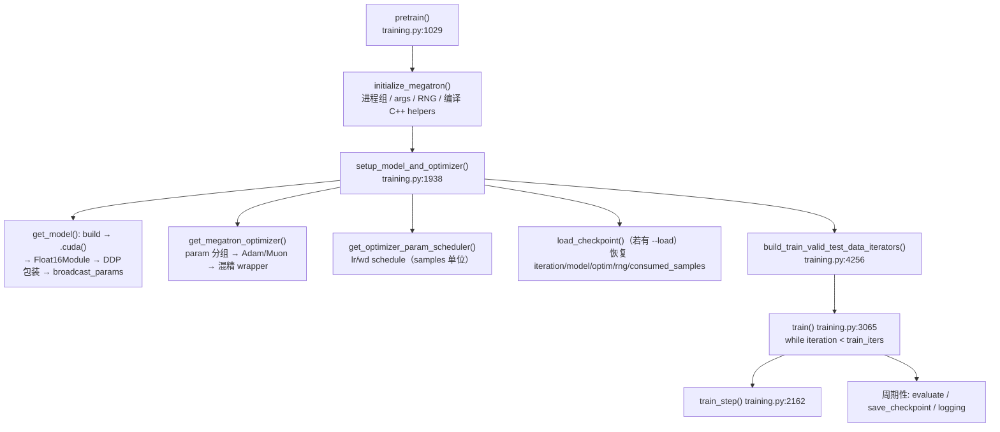

# 01 · 训练主循环

> 读这一篇之前，最好先读 [00 · 训练全景：从数据到权重更新](./00_overview.md)——那里用纯概念讲清了一个 step 的完整流水线、loss 与 mask 的组织、pretrain / SFT / RL 的共享底座；本篇是那套概念流程在 Megatron-LM（commit `e03878b5f`）里的**实现对照**：把 `pretrain()` 到一次 `train_step()` 之间发生的每一件事拆开来看——setup、batch 体系、forward/backward 调度、loss 的计算与汇聚、梯度从产生到进入 optimizer 的路径、权重更新与 scheduler——并把每一步对应到具体的 `path:line`。此外还需要知道 autograd 的基本语义（可以参考 [03 · autograd：引擎、自定义 Function、hooks、checkpoint](../torch/03_autograd.md)）和「DP 各 rank 吃不同数据、梯度要规约」这一点并行直觉，正文用到并行细节时会就地给出最小定义，想深入的话可以去看 [大规模训练的并行策略总览](../parallel/README.md)。
>
> 后面几篇（optimizer、checkpoint、dataloader、buffer、recompute、显存模型）其实都是本篇某一节的展开，读完这一篇再进入它们会顺畅很多。本篇涉及的实现主要在 [[megatron-lm:megatron/training/training.py]] 和 [[megatron-lm:megatron/core/pipeline_parallel/schedules.py]] 两个文件里，后面的引用大多来自这两处。

---

## 1. 从 pretrain() 到 train_step()

[00](./00_overview.md) §1 的概念流水线——取 batch、forward、loss、backward、optimizer step——在 Megatron 里对应一条具体的函数调用链。先看从进程启动到进入训练循环的这一段：



上面这张图给出的是从进程启动到进入训练循环的整体路径，而本篇真正关心的是其中 `train_step` 这一个函数内部发生的事。先把它的一次调用从头到尾列出来看看整体形状（下面是一段同构伪代码，变量名对齐 [[megatron-lm:megatron/training/training.py#L2162-L2358]]）：

```python
def train_step(forward_step_func, data_iterator, model, optimizer, opt_param_scheduler, config):
    while rerun_state_machine.should_run_forward_backward(data_iterator):   # 2178 失败重算外壳
        for model_chunk in model:
            model_chunk.zero_grad_buffer()        # 2181 grad buffer 清零（不释放）
        optimizer.zero_grad()                     # 2184
        losses_reduced = forward_backward_func(   # 2227 一次调用跑完所有 micro-batch
            forward_step_func, data_iterator, model,
            num_microbatches=get_num_microbatches(),   # 2231
            forward_only=False, ...)              #   ← grad accumulation 循环在 schedule 内部
    # ---- optimizer 侧 ----
    update_successful, grad_norm, num_zeros = optimizer.step()   # 2286-2287
    update_successful = logical_and_across_model_parallel_group(update_successful)  # 2303
    if update_successful:                          # 2316
        opt_param_scheduler.step(increment=num_microbatches * mbs * dp_size)  # 单位是 samples!
    else:
        skipped_iter = 1                           # 2321 found_inf → 本步作废
    if mpu.is_pipeline_last_stage(ignore_virtual=True):   # 2327 只有 last stage 有 loss
        # 新格式: sum over micro-batches → all_reduce(DP+CP) → loss_sum/num_tokens
        return loss_reduced, skipped_iter, grad_norm, num_zeros
```

接下来逐节把这套流程展开：§2 讲 setup 阶段模型、optimizer 和 scheduler 是怎么就位的；§3 讲 batch 体系里 micro/global/num_microbatches 三个量的关系；§4 讲 forward/backward 的三种调度方式；§5 讲 loss 的计算与跨组汇聚；§6 讲梯度从产生到进入 optimizer 手里的完整路径；§7 讲 optimizer step 与权重更新；§8 回头梳理一个 iteration 里显存中哪些是常驻的、哪些是随 micro-batch 流动的；§9 讲 eval、save、logging 的节奏。

## 2. setup：模型、optimizer 与 scheduler

`setup_model_and_optimizer`（[[megatron-lm:megatron/training/training.py#L1938-L2112]]）内部的执行顺序值得记住，因为它决定了显存里什么时候会多出什么东西：

1. **`get_model`（[[megatron-lm:megatron/training/training.py#L1622]]）**：先按 PP/VPP 把本 rank 负责的 model chunk 建出来（`build_model`，VPP 场景下每个 virtual stage 对应一个 chunk，1662-1679），接着 `.cuda()`（1732-1733），fp16/bf16 时再包一层 `Float16Module`（1736-1738，把参数转成半精度，同时给 optimizer 留出 fp32 副本的语义），最后是**DDP 包装**（1751-1758）。这一步会发生两件影响深远的事：把同 dtype 的参数拼进**连续 grad buffer**，让 `param.main_grad` 成为这个 buffer 的一个视图（这是 [`05`](./05_grad_param_buffer.md) 的主题）；同时 `bucket_size` 会取默认值 `max(40M elem, 1M × dp_size)`（1772-1775，其中 dp_size 按 DP×CP 口径计算），如果 `overlap_grad_reduce=False` 则退化成单个 bucket（1777-1778）。setup 的最后，如果开了 `--data-parallel-random-init`，还会做一次 `broadcast_params`（1820-1822）：各 DP rank 若各自独立初始化了参数，这一步会从 DP 组的 rank 0 广播参数，保证所有副本一致。
2. **`get_megatron_optimizer`（[[megatron-lm:megatron/core/optimizer/__init__.py#L975]]）**：按 param group 建好 inner optimizer（Adam、Muon 等），再按精度与分片策略在外面包一层壳。fp16 精度下必须配一个 `grad_scaler`，bf16 下通常不需要；如果 `use_distributed_optimizer=True`，用的是 `DistributedOptimizer`（也就是 ZeRO-1，optimizer state 按 DP 分片存放），否则用 `Float16OptimizerWithFloat16Params`（每个 rank 都保留全量 fp32 master 权重）（[[megatron-lm:megatron/core/optimizer/__init__.py#L639-L682]]）。这部分的完整机制留给 [`02`](./02_optimizer.md) 展开。
3. **`get_optimizer_param_scheduler`（[[megatron-lm:megatron/training/training.py#L1827]]）**：这里有个容易忽略的细节——**所有 step 都换算成 samples 单位**（`lr_decay_steps = lr_decay_iters * global_batch_size`，1835）。之所以这么做，是因为训练中途可能会改变 batch size（见 §3.3），只有用 samples 计数才能与具体的 batch 大小无关。
4. **`load_checkpoint`（2045-2053）**：恢复 `iteration`、model、optimizer、scheduler、`rng_state`、`consumed_train_samples`。这一整套恢复语义留给 [`03`](./03_checkpoint.md) 详细讲。

## 3. batch 体系：micro、global 与 num_microbatches

### 3.1 三个量的关系

先把这三个量的定义说清楚：

| 量 | 定义 | 配置 |
|---|---|---|
| `micro_batch_size`（$b$） | **单个 rank 一次 forward** 吃的样本数 | `--micro-batch-size`（必填） |
| `global_batch_size`（$\mathrm{GBS}$） | **一个 optimizer step** 用到的总样本数（全 DP 组合计） | `--global-batch-size`，缺省 = $b \times \mathrm{DP}$（[[megatron-lm:megatron/training/arguments.py#L700-L702]]） |
| `num_microbatches`（$m$） | 每个 rank 在一个 step 内串行跑的 micro-batch 数 | **推导量**：$m = \mathrm{GBS} / (b \times \mathrm{DP})$ |

这三者之间的整除关系在 [[megatron-lm:megatron/core/num_microbatches_calculator.py#L381-L391]] 会被强制校验，不整除会直接触发 assert。grad accumulation 说的就是这么一件事：同一个 optimizer step 里串行跑 $m$ 个 micro-batch，梯度在 `main_grad` 里逐步累加，最后统一规约再更新一次。这本质上是用时间换显存——activation 只需要占一个 micro-batch 的量，却能支撑任意大的 $\mathrm{GBS}$。

需要留意的是，$b$ 和 $m$ 在这里扮演的角色完全不同：$b$ 决定的是**单卡 activation 显存**（§8 会展开），$m$ 决定的是**单步时长以及通信和计算的配比**，而 $\mathrm{GBS}$ 是**算法侧**的量，直接影响收敛。所以调显存应该先动 $b$ 和 recompute（[`06`](./06_activation_recompute_offload.md)），调收敛才去动 $\mathrm{GBS}$；完整的演算见 [`07`](./07_memory_model.md)。

### 3.2 grad accumulation 循环在哪里

这个循环并不在 `train_step` 里，而是藏在 schedule 函数内部。`train_step` 只会对 `forward_backward_func` 调用一次（[[megatron-lm:megatron/training/training.py#L2227]]），把 `num_microbatches` 作为参数传进去；循环具体长什么样，取决于当前用的 PP 调度（见 §4）。以不带 PP 的 `forward_backward_no_pipelining`（[[megatron-lm:megatron/core/pipeline_parallel/schedules.py#L634-L818]]）为例：

```python
# schedules.py:741-788
with no_sync_func():                       # 前 m-1 个 micro-batch：只本地累加 main_grad，不发 DP 通信
    for i in range(num_microbatches - 1):
        output = forward_step(...)
        backward_step(...); del output_tensor   # 758-765 及时断开 autograd 图
output = forward_step(...)                 # 最后一个 micro-batch 在 no_sync 之外：
backward_step(...)                         # ← backward 中 bucket 填满即触发梯度规约（overlap 进计算）
config.finalize_model_grads_func(...)      # 790-798 收尾通信（§6.3）
```

「最后一个 micro-batch 特意放在 `no_sync` 之外执行」这个安排（766-767 的注释里有说明）正是梯度通信能够 overlap 的关键：只有最后这一个 micro-batch 需要触发 bucket 的 reduce-scatter，前面的每一个都只是纯累加，不产生通信。

### 3.3 训练中途变更 batch size

在这个版本里，`--rampup-batch-size` 已经**静默失效**了——只会打一条 warning（[[megatron-lm:megatron/core/num_microbatches_calculator.py#L100-L104]]），真正的替代方案是 `--step-batch-size-schedule "THRESHOLD:BS ..."`：按 `consumed_samples` 查表来切换 $\mathrm{GBS}$。训练循环在每个 iter 开头都会做一次探测（[[megatron-lm:megatron/training/training.py#L3433]]），并且规定 `num_microbatches` **只许涨不许跌**（3443-3446 处有 assert），真正切换之前还会自动先存一个 checkpoint（3447-3456）。这也解释了 §2 第 3 步里为什么 lr scheduler 要用 samples 而不是 iteration 计数：iteration 的含义会随 batch size 变化，samples 不会。

### 3.4 consumed_samples 与 resume

每一步结束时，`consumed_train_samples += dp_size * mbs * num_microbatches`（[[megatron-lm:megatron/training/training.py#L3610-L3616]]）。这个量的语义是**全局样本数**，会被存进 checkpoint；resume 的时候，sampler 就是从这个偏移量继续往后顺序取数据的，具体机制见 [`04`](./04_dataloader.md) 讲 resume 的那一节。

## 4. forward/backward 调度：三种 schedule

`get_forward_backward_func`（[[megatron-lm:megatron/core/pipeline_parallel/schedules.py#L48,L147-153]]）会根据并行配置选出对应的调度函数：

| 条件 | 调度 | 特征 |
|---|---|---|
| PP = 1 | `forward_backward_no_pipelining`（634） | 单 chunk，循环见 §3.2 |
| PP > 1 | `forward_backward_pipelining_without_interleaving`（2089）= **1F1B** | warmup/steady/cooldown |
| PP > 1 且有 VPP | `forward_backward_pipelining_with_interleaving`（946） | 多 model chunk 交错，bubble 更小 |

PP 调度的 bubble 分析、interleaved、DualPipe 这些内容，[Pipeline Parallelism (PP)](../parallel/03_pp/README.md) 已经有详细分析，这里不重复，只把 **1F1B 当成一条「loss/grad 的传送带」**，讲清楚它在 `train_step` 里扮演的角色（下面同样是一段同构伪代码，对齐 [[megatron-lm:megatron/core/pipeline_parallel/schedules.py#L2089-L2459]]）：

```python
num_warmup = min(pp_size - pp_rank - 1, num_microbatches)   # 2227-2228：本 stage 尾部越多 warmup 越少
# ---- warmup：只 forward，把 (input, output) 入栈 ----
for i in range(num_warmup):                                  # 2284
    input  = recv_forward()                                  # 从上一 stage 收 activation
    output, num_tokens = forward_step(input)                 #   内含 get_batch/set_input_tensor/loss
    send_forward(output)                                     # 发给下一 stage
    stack.push(input, output); deallocate_output_tensor(output)   # 2318 伪释放 output
# ---- steady 1F1B：1 fwd + 1 bwd 交替 ----
for i in range(num_microbatches - num_warmup):               # 2329
    output, _ = forward_step(recv'd input)
    output_grad = send_forward_recv_backward(output)         # 2366 一手发 output 一手收下游 grad
    stack.push(...); deallocate_output_tensor(output)
    input, output = stack.pop(0)                             # 2377-2378 FIFO：backward 最老的 micro-batch
    input_grad = backward_step(input, output, output_grad)   # 2386
    input = send_backward_recv_forward(input_grad)           # 2396 顺便收下一个 fwd 输入
# ---- cooldown：只 backward，排空栈 ----
for i in range(num_warmup):                                  # 2402
    recv_backward(); backward_step(stack.pop(0)); send_backward()
finalize_model_grads_func(...)                               # 2443
```

这里有两个和显存直接相关的细节，值得展开说一说。

第一个是**in-flight micro-batch 的数量**：warmup 结束的时候，栈里已经积了 `num_warmup` 对 `(input, output)` 在等着做 backward；进入 steady 段之后每一步都是「先 push 一个再 pop 一个」，所以 push 完那一瞬间的峰值是 `num_warmup + 1` 对。对首 stage 而言 `num_warmup = pp_size - 1`，因此峰值恰好是 **pp_size 份**activation。这正是「PP 首 stage 要存 p 份 activation」这个结论的来源，关于 PP 显存不均的完整分析见 [03 · 显存、通信 overlap 与并行协同](../parallel/03_pp/03_overlap_and_memory.md)，对应的总公式在 [`07`](./07_memory_model.md) §3.4。

第二个是 **`deallocate_output_tensor`（[[megatron-lm:megatron/core/pipeline_parallel/schedules.py#L157-L187]]）**：它做的事情是把 output tensor 的 `.data` 换成一个 size-1 的张量，实现「伪释放」，只保留 `.grad_fn` 用来维持计算图的连接。正因为如此，backward 必须走 `custom_backward`（190-219，绕开 PyTorch 对 output/grad 形状的检查）。这也是「是否拷贝、是否可微」这类 bug 高发的地方——伪释放之后，这个 tensor 的数值内容已经不存在了，只剩下 autograd 需要的元数据。

### forward_step / backward_step 内部

`forward_step`（[[megatron-lm:megatron/core/pipeline_parallel/schedules.py#L359]]）对每个 micro-batch 做的事情依次是：`set_input_tensor`（把上一 stage 传来的 activation 注入进来，462-463）→ 进入 autocast 上下文（465-469）→ 调用 `forward_step_func(data_iterator, model)`（471，这是用户侧定义的函数，GPT 版本在 [[megatron-lm:pretrain_gpt.py#L183]]，里面会调 `get_batch` 取数据，具体见 [`04`](./04_dataloader.md)）→ 最后 `forward_step_calc_loss`（476，见 §5）。

`backward_step`（[[megatron-lm:megatron/core/pipeline_parallel/schedules.py#L494]]）依次做：`input_tensor.retain_grad()`（514-516，因为跨 stage 需要把 grad 回传出去）→ **只在 last stage、且是 fp16 时把 loss 乘上 loss scale**（通过 `config.grad_scale_func`，524-525）→ 调用 `torch.autograd.backward` 或者 `custom_backward`（533-536）→ 返回 `input_tensor.grad` 供 `send_backward` 使用。

## 5. loss：计算、缩放与跨组汇聚

### 5.1 loss 的定义

先把定义式写清楚。GPT pretrain 用的是 per-token 交叉熵：对一个 micro-batch，`labels`/`logits` 的 shape 分别是 `[b, s]`/`[b, s, V]`，`loss_mask` 用来标记哪些 token 计入 loss（eod、pad 这类位置会被置为 0；labels 为什么错一位、attention mask 与 loss mask 的分工、pretrain/SFT 的 mask 组织，概念部分见 [`00`](./00_overview.md) §2，这里只讲 loss 算出来之后怎么处理与汇聚）：

```
losses   = CE(logits, labels)              # [b, s]，逐 token
loss_sum = Σ (losses * loss_mask)          # 标量：本 micro-batch 的 token loss 总和
num_tokens = Σ loss_mask                   # 标量：本 micro-batch 的有效 token 数
全局 loss = Σ_all loss_sum / Σ_all num_tokens      # 按 token 加权的全局平均
```

[[megatron-lm:pretrain_gpt.py#L121-L180]] 里的 `loss_func` 返回的正是 `(loss_sum, num_tokens, {'lm loss': cat([loss_sum, num_tokens])})` 这样一个三元组——分子和分母是分开传递的，不在本地就直接相除。

### 5.2 两种格式与两处缩放

`forward_step_calc_loss`（[[megatron-lm:megatron/core/pipeline_parallel/schedules.py#L251]]）对 loss 的处理分新旧两种格式，两者容易混淆，这里对照说清楚：

| | 新格式（三元组，推荐） | legacy（二元组） |
|---|---|---|
| forward 处 | `loss /= clamp(num_tokens,1); loss /= num_microbatches`（295-299）；若开了 `calculate_per_token_loss` 则**不除 num_tokens**，推迟到梯度侧处理 | `loss *= cp_size; loss /= num_microbatches`（304-305） |
| 全局平均 | 分子分母分别跨 micro-batch 求和，再 `all_reduce(DP+CP)`，最后相除（[[megatron-lm:megatron/training/training.py#L2331-L2341]]） | 用户自己在 loss_func 里调 `average_losses_across_data_parallel_group`（[[megatron-lm:megatron/training/utils/common_utils.py#L237]]，**不含 CP**） |
| CP 处理 | 天然正确（token 计数是全局规约出来的） | 需要乘 `cp_size` 补偿：本地只算了 1/cp 的 token，而梯度会在 DP×CP 组里求和 |
| 平均语义 | 按 token 加权 | 对 micro-batch 等权平均 |

其中**per-token loss 的归一化推迟**（`calculate_per_token_loss=True`，这是新格式才有的行为）值得单独说一说：forward 阶段完全不做除法，梯度先按「未除以 token 数」的 loss 一路累加，最后在 `finalize_model_grads` 里对整个 grad buffer 统一乘上 `1/全局token数`（[[megatron-lm:megatron/core/distributed/finalize_model_grads.py#L546-L562]]；这里的 num_tokens 是从 last PP stage broadcast 出来再经过 DP+CP all-reduce 得到的）。这样做的好处是，所有 micro-batch、所有 DP rank 的梯度都严格按全局 token 数等权，不会因为各个 micro-batch 里 token 数不齐而产生偏差。

### 5.3 辅助 loss 的 autograd 注入

MoE 的 aux loss、MTP、DSA 这些辅助 loss 并不会直接加进主 loss 里，而是用一个叫 `AutoScaler` 的技巧去注册 loss scale（[[megatron-lm:megatron/core/pipeline_parallel/schedules.py#L317-L354]]：例如 `MoEAuxLossAutoScaler.set_loss_scale(loss_scale * cp_size / num_microbatches)`），backward 时由 AutoScaler 的 `backward` 钩子触发注入。aux loss 的定义式和完整机制留给 [01 · Router 与 Dispatch 前的 Preprocess](../parallel/05_ep/01_router_and_preprocess.md) 展开。

## 6. 梯度路径：从 backward 到 optimizer

### 6.1 产生：wgrad 直接写入连续 buffer

每个参数的梯度并不会停留在 `param.grad` 上：backward hook 会把 `param.grad` 累加进 `param.main_grad`（也就是连续 grad buffer 的一个视图，[[megatron-lm:megatron/core/distributed/distributed_data_parallel.py#L466-L470]]）之后，再把 `param.grad` 置为 None；如果开了 `gradient_accumulation_fusion`，TE 的 kernel 会直接把 wgrad 累加进 `main_grad`，中间连一次中转都省掉了（详见 [01 · ColumnParallelLinear / RowParallelLinear 与核心 autograd](../parallel/02_tp_sp/01_linear_layers.md) §4.2）。跨 micro-batch 的累加也是发生在 `main_grad` 上的。buffer 的完整组织方式留给 [`05`](./05_grad_param_buffer.md)。

### 6.2 规约：bucket 填满即发，与 backward 重叠

backward 是从后往前算的，越靠后的层对应的 bucket 会越先填满——一旦 `register_grad_ready` 计数到齐，就会立即发出一次**异步的 reduce-scatter（DistOpt 下）或 all-reduce（DDP 下）**（触发点在 [[megatron-lm:megatron/core/distributed/param_and_grad_buffer.py#L800]]，通信本体在 `:556-722`），这样通信就能和更前面几层的 backward 计算重叠起来。完整的时序和图示见 [01 · Megatron DDP：连续 buffer 与通信 overlap](../parallel/01_dp/01_ddp_and_overlap.md)。

### 6.3 收尾：finalize_model_grads

所有 micro-batch 跑完之后，还需要统一做一次收尾（[[megatron-lm:megatron/core/distributed/finalize_model_grads.py#L445-L562]]），依次是四件事：

1. `finish_grad_sync()`：等所有 bucket 的规约 handle 都完成（497-498）；
2. **embedding weight tying 的 grad 同步**：word embedding 和 position embedding 分别在 PP 的首、尾 stage 各持一份，需要跨 `embd_group` 做一次 all-reduce（528-529）；
3. **非 TP 切分参数的 TP 组 all-reduce**：比如 SP 下 LayerNorm 这类在各 TP rank 上是复制而非切分的参数，它们的梯度需要在 TP 组内 all-reduce（519）；
4. per-token loss 的全局 token 归一化（546-562，对应 §5.2 提到的那个推迟操作）。

值得一提的是，这一版里老的 `reduce_model_grads`/`gather_model_params` 这两个接口已经不存在了：grad 的通信完全由「backward 过程中按 bucket 自动触发 + `finalize_model_grads` 收尾」来承担；param 的 all-gather 则由 optimizer step 或者下一次 forward 的 pre-hook 来承担（见 §7）。

## 7. optimizer step 与权重更新

`optimizer.step()`（[[megatron-lm:megatron/training/training.py#L2286]]）内部的编排大致是这样（这里是 `MixedPrecisionOptimizer.step` 的简化版，[[megatron-lm:megatron/core/optimizer/optimizer.py#L621-L651]]；完整版留给 [`02`](./02_optimizer.md)）：

```python
prepare_grads():        # model main_grad → fp32 main grad；fp16 时 unscale + found_inf 检查 + scaler.update
if found_inf: return (False, None, None)      # 本步作废 → skipped_iter
clip_grad_norm(1.0):    # 全局 L2 norm（跨 MP 组规约、去重 shared/TP-duplicate）→ 系数<1 才缩
step_with_ready_grads():
    inner_optimizer.step()            # fp32 master 上跑 Adam/Muon
    copy_main_params_to_model_params()  # 更新后 fp32 → bf16 写回（DistOpt：写回 param buffer 本 shard）
    start_param_sync()                # DistOpt 非 overlap：all-gather 参数；overlap：推迟到下个 forward
```

紧接着，`train_step` 会把 `update_successful` 在 MP 组内取一次逻辑 AND（只要有任意一个 rank found_inf，全局就整步跳过，[[megatron-lm:megatron/training/training.py#L2303]]）：成功的话才推进 scheduler（2316-2318，注意 **increment 的单位是 samples**），失败则记 `skipped_iter=1`（2321）。loss 的汇聚只发生在 PP 的 last stage（2327-2347，见 §5.2）。

## 8. 显存的常驻与流动部分

这里给一张全章最重要的简化图景（完整公式留给 [`07`](./07_memory_model.md)）：

```
常驻（跨 iteration 存活，只清零不释放）：
├── param_data    参数本体。bf16 → 2P；DistOpt 下是 param buffer 的视图（AG 目标）
├── grad_data     连续 grad buffer。fp32 累加 → 4P（grad_reduce_in_fp32）
└── optimizer     fp32 master + m/v。DDP 全量 12P；DistOpt(ZeRO-1) 12P/DP

流动（随每个 micro-batch 生灭，峰值 = in-flight micro-batch 数 × 单 micro-batch 量）：
├── activation    每层 forward 存给 backward 的张量 ≈ mbs·s·h·(系数)·L_in_flight
├── logits/CE     last stage 的 [b, s, V] 大图（_vocab 大时很可观）
└── 临时          autograd 的 param.grad 中转、通信 workspace、cuda graph 池等
```

一个 step 的**峰值显存**大致等于常驻部分，加上 steady 段里 in-flight 的 activation 峰值。省显存的各种手段——recompute（用重算替代存储）、CPU offload（把数据挪去内存）、ZeRO 分片（削减常驻部分）、调小 $b$——分别作用在上面这张图的不同项上，[`06`](./06_activation_recompute_offload.md) 和 [`07`](./07_memory_model.md) 会逐项把它们展开讲清楚。

另外要注意，iteration 开头的 `zero_grad_buffer()` 只是把 `grad_data` 清零（调 `zero_()`，不释放显存，[[megatron-lm:megatron/core/distributed/param_and_grad_buffer.py#L1471-L1477]]）；而 `optimizer.zero_grad()` 做的是把各个 param 的 `.grad` 置为 None，顺带释放掉上一步 fp32 main grad 占用的存储（[[megatron-lm:megatron/core/optimizer/optimizer.py#L738-L752]]）。buffer 跨 iteration 的完整生命周期见 [`05`](./05_grad_param_buffer.md) 讲生命周期的那一节。

## 9. eval、save、logging 的节奏

- **eval**：每当 `iteration % eval_interval == 0`，就会触发一次 `evaluate()`（[[megatron-lm:megatron/training/training.py#L3826]]）：进入 `model.eval()` 和 `torch.no_grad()`，用 `forward_only=True` 的调度跑一遍，用的是独立的 `eval_micro_batch_size`/`eval_global_batch_size`；loss 按（分子，分母）的形式累积，最后统一相除（3989-3991）。valid 集是**一次性顺序流**（不同的 eval 时间点看到的是不同的样本，具体见 [`04`](./04_dataloader.md)）。
- **save**：`checkpoint_and_decide_exit`（[[megatron-lm:megatron/training/training.py#L2953]]）决定何时保存，优先级依次是：SIGTERM → 常规的 `save_interval` → non-persistent save → `exit_duration_in_mins` 到期 → `exit_interval`/相位切换。async save 如何与训练并行进行，机制见 [`03`](./03_checkpoint.md)。
- **logging**：`training_log`（[[megatron-lm:megatron/training/training.py#L2361]]）每隔 `log_interval` 步就会输出一次 loss、lr、grad_norm、loss_scale、params_norm、吞吐（tokens/s、TFLOP/s）等信息；第一次 log 时还会调用 `report_theoretical_memory`（2698）打印理论显存，这正是 [`07`](./07_memory_model.md) 那套公式的来源。

## 10. 易错点速查

1. grad accumulation 循环藏在 schedule 内部，`train_step` 只调用一次 `forward_backward_func`（[[megatron-lm:megatron/training/training.py#L2227]]）。
2. lr scheduler 的 increment 单位是 **samples**，不是 iteration（[[megatron-lm:megatron/training/training.py#L2317]]）。
3. legacy loss 格式在 CP 下要乘 `cp_size`，且 DP 平均不含 CP；新格式按 token 加权且天然处理好了 CP——两条路径的平均语义并不相同（§5.2）。
4. fp16 的 loss scale 只在 **last stage** 的 backward 入口处乘（[[megatron-lm:megatron/core/pipeline_parallel/schedules.py#L524-L525]]）；found_inf 会导致整步作废，但 scale 已经降下去了。
5. `deallocate_pipeline_outputs` 之后，output tensor 只剩下 autograd 元数据，数值已经被伪释放——backward 必须走 `custom_backward`。
6. 非 last PP stage 的 `train_step` 返回的是空 loss dict（[[megatron-lm:megatron/training/training.py#L2358]]）；grad_norm 则会经过 `reduce_max_stat_across_model_parallel_group`，所以每个 stage 都能拿到。
7. num_microbatches 只许涨不许跌，切换之前会自动先存一次 checkpoint（[[megatron-lm:megatron/training/training.py#L3443-L3456]]）。
8. `--rampup-batch-size` 已经静默失效，要用的是 `--step-batch-size-schedule`。

---

讲完一个 iteration 的完整生命周期，下一个自然的问题是：optimizer 具体是怎么工作的，Adam、Muon、MuonClip 这些算法各自在算什么，混合精度、DistOpt step、CPU offload 这些 infra 细节又是怎么支撑起来的？这些留给下一篇：[02 · Optimizer](./02_optimizer.md)。
