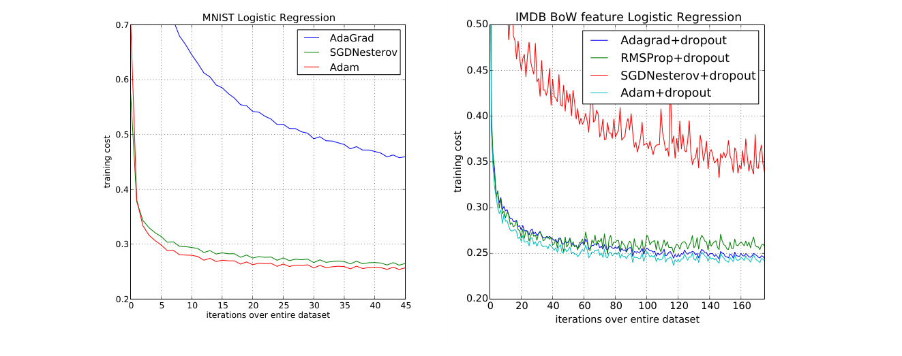
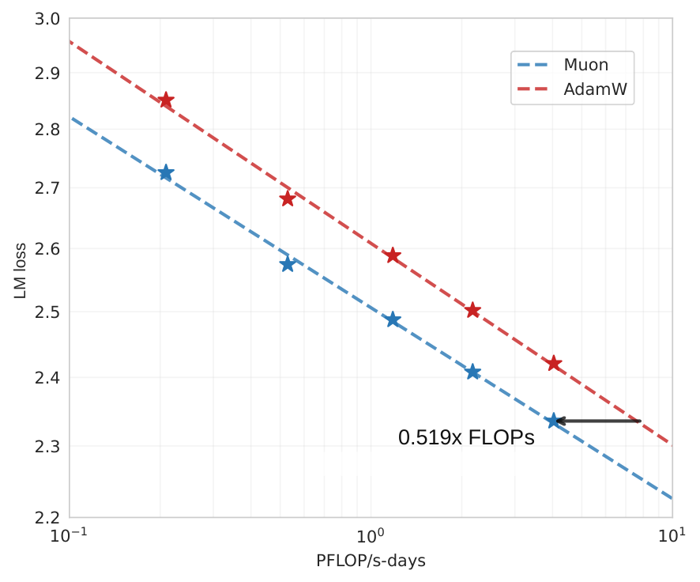
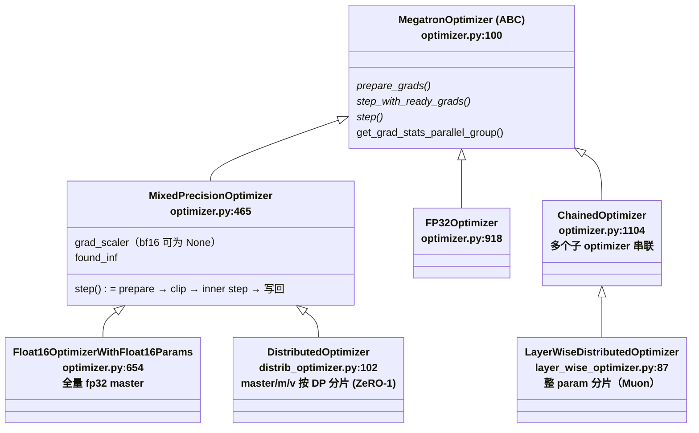
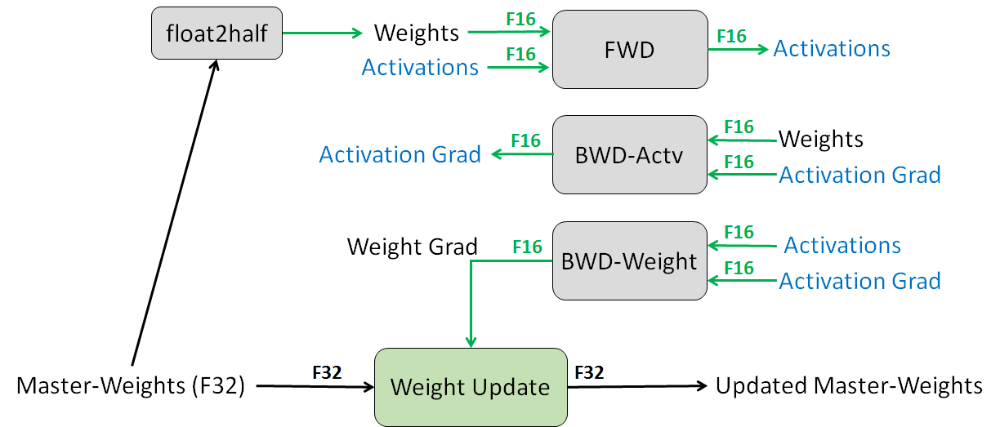
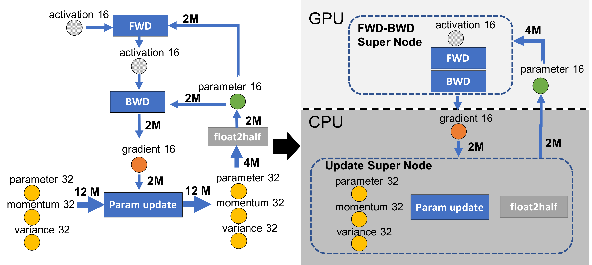

# 02 · Optimizer：算法与 infra

> 上一篇讲完了一个 iteration 里梯度是怎么从 backward 一路流到 optimizer 手里的（[`01`](./01_training_loop.md) §7），这一篇接着往下讲：optimizer 拿到梯度之后到底在算什么，以及 Megatron 把这套算法编排成一整个 step 时又要处理哪些工程问题。读这一篇之前，最好已经清楚 autograd 的基本语义（参见 [03 · autograd：引擎、自定义 Function、hooks、checkpoint](../torch/03_autograd.md)），知道 `optimizer.step()` 在整个 iteration 里的位置（[`01`](./01_training_loop.md) §7），也知道梯度是落在连续 buffer 的 `main_grad` 上的——具体的 buffer 结构会在用到时给出最小够用的定义，完整机制留给 [`05`](./05_grad_param_buffer.md)。ZeRO 显存账本的推导在 [02 · ZeRO 显存账本与 Megatron DistributedOptimizer](../parallel/01_dp/02_zero_and_distributed_optimizer.md) 已经完整推导过，本篇只引用结论，不重复推导。
>
> optimizer 这个主题天然分两面。Part I 讲算法：从 SGD+momentum 的最小定义出发，到 Adam / AdamW 的定义式与超参，再到近两年大模型训练实际在用的 **Muon**（Newton-Schulz 正交化动量）与 **MuonClip**（Kimi K2 的 QK logit 裁剪），最后落在 LR schedule 上。Part II 讲 infra：同一个算法在 Megatron 里是怎么被编排成「一整个 step」的——类层次、fp32 master weights、loss scaling、grad clipping、`DistributedOptimizer` 的分片更新加 all-gather 回路、Muon 的分布式实现、optimizer 的 CPU offload。两面最终在 `MixedPrecisionOptimizer.step()`（[[megatron-lm:megatron/core/optimizer/optimizer.py#L621-L651]]）汇合：算法决定「更新量怎么算」，infra 决定「梯度以什么精度、在哪张卡、按什么顺序流到更新式里」。

代码：[[megatron-lm:megatron/core/optimizer/]]（`optimizer.py` / `distrib_optimizer.py` / `clip_grads.py` / `grad_scaler.py` / `emerging_optimizers.py` / `layer_wise_optimizer.py` / `cpu_offloading/`）、[[megatron-lm:megatron/core/optimizer_param_scheduler.py]]、[[megatron-lm:megatron/core/optimizer/optimizer_config.py]]。

---

# Part I · 算法

## 1. SGD 与 momentum：最小定义

先把符号定下来：参数记作 $\theta$（shape 任意，逐元素理解），第 $t$ 步的梯度是 $g_t = \nabla_\theta f_t(\theta_{t-1})$，学习率是 $\eta$。

**SGD** 的更新式很简单：$\theta_t = \theta_{t-1} - \eta\, g_t$。

**momentum** 在工程上写成 EMA（指数滑动平均）的形式，用 `lerp`（linear interpolation，$\mathrm{lerp}(a, b, w) = a + w(b - a)$）来表示最不容易出错：

$$
m_t = \mathrm{lerp}(m_{t-1}, g_t, 1-\mu) = \mu\, m_{t-1} + (1-\mu)\, g_t
$$

非 Nesterov 版本直接拿 $m_t$ 当更新方向。**Nesterov** 版本则把「当前梯度」与「buffer」再插值一次得到有效梯度 $\tilde{g}_t$，相当于向前多看了半步：

$$
\begin{aligned}
\tilde{g}_t &= \mathrm{lerp}(g_t, m_t, \mu) = (1-\mu)\, g_t + \mu\, m_t \\
\theta_t &= \theta_{t-1} - \eta\, \tilde{g}_t
\end{aligned}
$$

之所以特意用 `lerp_` / `lerp` 这个写法，不是为了炫技或凑 notation——Muon 的实现（外部包 `OrthogonalizedOptimizer.step`，见 §14）就是字面意义上的 `momentum_buffer.lerp_(grad, 1-momentum)` 加上 `grad.lerp(momentum_buffer, momentum)`。记住上面这两个式子，因为后面会看到，Muon 做的事情本质上就是把这里算出来的更新方向，再过一道 Newton-Schulz 正交化。

## 2. Adam：逐参数自适应学习率

**Adam**（Kingma & Ba 2015, [arXiv:1412.6980](https://arxiv.org/abs/1412.6980)，Algorithm 1）在 momentum（一阶矩 EMA）之外，还额外维护了梯度**二阶原始矩**（逐元素平方）的 EMA，用它给每个参数单独缩放步长。下面所有量的 shape 都与 $\theta$ 相同，运算逐元素进行：

$$
\begin{aligned}
m_t &\leftarrow \beta_1 m_{t-1} + (1-\beta_1)\, g_t \\
v_t &\leftarrow \beta_2 v_{t-1} + (1-\beta_2)\, g_t^2 \\
\hat{m}_t &\leftarrow m_t / (1-\beta_1^t) \\
\hat{v}_t &\leftarrow v_t / (1-\beta_2^t) \\
\theta_t &\leftarrow \theta_{t-1} - \alpha\, \hat{m}_t \big/ \big(\sqrt{\hat{v}_t} + \varepsilon\big)
\end{aligned}
$$

默认超参（论文 Algorithm 1 caption）是 $\alpha=10^{-3},\ \beta_1=0.9,\ \beta_2=0.999,\ \varepsilon=10^{-8}$。这里有几个值得注意的要点。

首先，$v_t$ 是**「原始矩」而不是「方差」**：它不减均值，因为梯度均值本身接近 0，所以二阶原始矩近似上就是梯度幅度的平方包络。其次，bias correction 纠的是 EMA 从零初始化带来的偏差（前期估计偏向 0，除以 $1-\beta^t$ 纠偏），只在训练前期起作用：$t$ 变大之后 $\beta^t \to 0$，$\hat{m}$ 也就趋近于 $m$；如果去掉这一步修正，等效于前几百步的 lr 偏小。

还有一个容易写错的细节：**$\varepsilon$ 是加在根号外面**，即 $\sqrt{\hat{v}} + \varepsilon$ 而不是 $\sqrt{\hat{v} + \varepsilon}$——这是论文的写法，也是常见的默写错误。两种写法的差别在于「自适应失效区」落在哪里：如果 $\varepsilon$ 进了根号，只有 $\hat{v} \lesssim \varepsilon^2$（约 $10^{-16}$）时才会失效；而 $\varepsilon$ 在根号外时，$\hat{v} \lesssim \varepsilon$（约 $10^{-8}$）分母就已经由 $\varepsilon$ 主导，退化成接近 SGD 的定步长区间——也就是说失效区来得更早，也更能压住小梯度带来的噪声。

最后一点在后面会用到：Adam 的 update 项 $\hat{m} / (\sqrt{\hat{v}} + \varepsilon)$，每个分量的量级大致在 1 附近（梯度信噪比高时会趋近 $\pm 1$），所以 update 的 RMS 天然落在 $O(0.2\sim0.4)$ 这个区间——这个经验数字是 §5.4 讲 Moonlight 的 RMS 对齐时要用到的。


> 图：MNIST logistic regression 与 IMDB BoW 分类上，Adam 与 AdaGrad、SGD+Nesterov、RMSProp 等的训练收敛对比——Adam 在早期迭代下降最快，是它成为默认优化器的原始证据（Kingma & Ba 2015, Fig 1；[arXiv:1412.6980](https://arxiv.org/abs/1412.6980)）。

## 3. AdamW：L2 正则 ≠ decoupled weight decay

**weight decay** 的动机很直接：不让权重无限制地长大。它有两种实现方式：一种是 **L2 正则**，把 $\lambda\theta$ 加进梯度里再喂给 optimizer，即 $g'_t = g_t + \lambda\theta_{t-1}$；另一种是 **decoupled weight decay**，权重衰减不进梯度，而是在更新式里单独减去一项（AdamW，论文 Algorithm 2）：

$$
\theta_t \leftarrow \theta_{t-1} - \eta_t \left( \alpha\, \hat{m}_t \big/ \big(\sqrt{\hat{v}_t} + \varepsilon\big) + \lambda\, \theta_{t-1} \right)
$$

对 SGD 来说，这两种写法只差一个常数因子——L2 的 $\lambda\theta$ 被统一乘了 $\eta$，相当于 $\lambda' = \lambda / \alpha$（Loshchilov & Hutter 2017 Prop 1）。但**对 Adam 而言二者并不等价**（Prop 2）：L2 路线下，$\lambda\theta$ 会进入 $m$/$v$ 的 EMA 里，更新时又被 preconditioner $1 / (\sqrt{\hat{v}} + \varepsilon)$ 逐参数缩放——结果是历来梯度就大的参数，它的 weight decay 反而被压小了；而 decoupled 路线下，$\lambda\theta$ 是以统一的强度直接作用在权重上的，不受这层缩放影响。原论文的说法是：L2 让「loss 的梯度和正则项的梯度一起被自适应」，decoupled 则「只让 loss 的梯度被自适应」（Loshchilov & Hutter 2017, [arXiv:1711.05101](https://arxiv.org/abs/1711.05101) §2；需要说明的是，原文的泛化实验做在 CIFAR-10/ImageNet32x32 图像分类上，并非 LLM 场景，但 decoupled 写法如今已经是 LLM 训练的默认选择）。

在 Megatron 里，`OptimizerConfig.decoupled_weight_decay` **默认就是 True**（[[megatron-lm:megatron/core/optimizer/optimizer_config.py#L250-L253]]），也就是说 Megatron 里说的 "Adam" 默认指的就是 AdamW；选用 torch 原生实现时，也是按这个 flag 在 `torch.optim.AdamW` 与 `torch.optim.Adam` 之间做选择（[[megatron-lm:megatron/core/optimizer/__init__.py#L558]]）。

## 4. 其他变体速览

除了 Adam/AdamW，LLM 训练里还出现过（或者 Megatron 里可以直接选用）一些其他 optimizer，这里各用一两句话带过，不展开：

| 变体 | 核心想法 | 出处 / Megatron 状态 |
|---|---|---|
| **Adafactor** | 把 Adam 的 $v$（$O(mn)$）分解为行/列两个 EMA 向量（$O(m+n)$），再外积还原；省 optimizer 显存的早期方案 | Shazeer & Stern 2018, [arXiv:1804.04235](https://arxiv.org/abs/1804.04235) |
| **Lion** | sign-based update：用 $\mathrm{sign}(\beta_1 m + (1-\beta_1) g)$ 更新，只存一份 momentum buffer（省掉 $v$）；由程序搜索自动发现 | Chen et al. 2023, [arXiv:2302.06675](https://arxiv.org/abs/2302.06675)；Megatron `--optimizer lion`（[[megatron-lm:megatron/training/arguments.py#L2577]]），`lion_beta1/2` 默认 0.95/0.98（[[megatron-lm:megatron/core/optimizer/optimizer_config.py#L293-L298]]） |
| **Shampoo** | full-matrix preconditioner：更新 $(GG^{\top})^{-1/4} G (G^{\top}G)^{-1/4}$；**关掉 accumulation 的瞬时 Shampoo 更新恰是 $UV^{\top}$**——这就是 Muon 的理论前史 | Gupta et al. 2018, [arXiv:1802.09568](https://arxiv.org/abs/1802.09568) |
| **SOAP** | 在 Shampoo 维护的特征基里跑 Adam：rotate 到特征基 → 逐坐标二阶矩归一 → rotate 回来 | Vyas et al. 2024, [arXiv:2409.11321](https://arxiv.org/abs/2409.11321)；Megatron `--optimizer soap` 经外部包 registry 注册（[[megatron-lm:megatron/core/optimizer/emerging_optimizers.py#L456-L465]]） |

这几个变体其实是在回应同一个问题：Adam 的逐元素缩放太「对角」，只看每个参数自己的历史，忽略了参数之间的相关性；而 Shampoo 这类 full-matrix 方法虽然考虑了相关性，计算代价却又太高。Muon 正好坐在这个谱系中间一个比较讨巧的位置，下一节展开讲它。

## 5. Muon：momentum 的 Newton-Schulz 正交化

### 5.1 定义式

**Muon**（MomentUm Orthogonalized by Newton-Schulz，Keller Jordan 2024，[博客](https://kellerjordan.github.io/posts/muon/) + [KellerJordan/Muon](https://github.com/KellerJordan/Muon)）相对 §1 只改了一件事：对 hidden 层的 2D 权重矩阵 $W \in \mathbb{R}^{m \times n}$，算出来的 momentum 更新方向 $m_t$（shape 同 $W$）不直接拿去更新权重，而是先做一次正交化：

$$
\begin{aligned}
m_t &\leftarrow \mathrm{lerp}(m_{t-1}, g_t, 1-\mu) \\
O_t &\leftarrow \mathrm{NewtonSchulz5}(\tilde{g}_t,\ \mathrm{steps}=5) \\
W_t &\leftarrow W_{t-1} - \eta\, O_t
\end{aligned}
$$

其中 $m_t$ 与 nesterov 有效梯度 $\tilde{g}_t$ 的写法同 §1（$\mu = 0.95$，默认开 nesterov）。`NewtonSchulz5(G)` 做的事情是：把 $G$ 替换成离它最近（Frobenius 范数意义下）的半正交矩阵。如果对 $G$ 做 SVD 得到 $G = USV^{\top}$，那么结果就是 $UV^{\top}$——所有奇异值都被压成了 1，换句话说是保留奇异向量、扔掉奇异值的幅度。

### 5.2 Newton-Schulz 迭代：数学与近似本质

直接对每个权重矩阵做 SVD 代价太高，所以 Muon 改用 **Newton-Schulz 迭代**去逼近上面说的正交化结果。输入是 $G \in \mathbb{R}^{m \times n}$（fp32）：

$$
\begin{aligned}
X &\leftarrow G / (\|G\|_F + \varepsilon) \\
\text{if } m > n: &\quad X \leftarrow X^{\top} \\
\text{repeat 5 steps:} &\quad A \leftarrow XX^{\top} \\
&\quad B \leftarrow bA + cA^2 \\
&\quad X \leftarrow aX + BX
\end{aligned}
$$

第一步归一化让 $\sigma_{\max}(X) \le 1$（谱范数不超过 Frobenius 范数）；$m > n$ 时先转置成宽矩阵，让 Gram 矩阵 $A$ 更小（shape $[m, m]$，$m \le n$）。原版系数 $(a, b, c) = (3.4445, -4.7750, 2.0315)$。为什么这样迭代能实现正交化：设 $X = USV^{\top}$，那么 $XX^{\top} = US^2U^{\top}$，$A$ 与 $A^2$ 都落在 $U$ 张成的空间里，于是每一步迭代其实等价于对每个奇异值 $\sigma$ 施加同一个奇次 quintic 多项式 $\phi(\sigma) = a\sigma + b\sigma^3 + c\sigma^5$；跑完 5 步之后得到的就是 $U\phi^5(S)V^{\top}$。系数 $(a, b, c)$ 的选取原则是让 $\phi$ 在 0 点附近的斜率尽量大，从而把 $(0, 1]$ 区间内的奇异值快速推向 1。但这里有意思的一点是：Muon 并不追求精确收敛，而是故意容许 $\varepsilon \approx 0.3$ 量级的残余误差——5 步之后，奇异值只是落在 1 附近的一个噪声区间里（博客的说法是 $S'_{ii} \sim \mathrm{Uniform}(0.5, 1.5)$ 量级），并不会真正收敛到精确的 $UV^{\top}$。实践证明这种「噪声版半正交」并不损害效果，反而省下了本可以多迭代几步才能达到的精度。也正因为这种近似不需要太高精度，NS 迭代在工程上可以稳定跑在 **bf16** 下（Megatron 默认 `muon_fp32_matmul_prec="medium"`，[[megatron-lm:megatron/core/optimizer/optimizer_config.py#L272]]），额外开销在典型 LM 训练里不到 1% FLOPs。

> Megatron 默认系数不是原版那组：`--muon-coefficient-type` 默认 `quintic`（modded-nanogpt 优化的 5 组系数 cycle 使用，原版单组在包里叫 `simple`），`--muon-num-ns-steps` 默认 5（[[megatron-lm:megatron/training/arguments.py#L2339-L2345]]，[[megatron-lm:megatron/core/optimizer/optimizer_config.py#L275-L280]]）。NS 迭代本体在**外部包 NVIDIA-NeMo/emerging-optimizers**（本仓库无源码，细节以 upstream 为准），Megatron 侧只传参数（§14）。

### 5.3 直觉：spectral norm 下的 steepest descent

那么，「把奇异值压平」为什么会是一个对的更新方向？Bernstein（[arXiv:2409.20325](https://arxiv.org/abs/2409.20325)，Prop 5 及博客 *Deriving Muon*）给出了一个推导思路：把「这一步权重可以走多远」用某种算子范数约束住，再去解「在该范数球内让 loss 一阶下降最多」这个约束优化问题（也就是 steepest descent）。

如果取 **spectral norm**（最大奇异值）作为约束，解出来的最速下降方向正好就是动量矩阵的 $-UV^{\top}$（它的对偶范数是 nuclear norm，即奇异值之和）；不做累积的 Shampoo 给出的解也是同一个方向。如果换成 **RMS→RMS 算子范数**（衡量输入 activation 的 RMS 映射到输出 RMS 的放大倍数）作为约束，方向则变成 $-\sqrt{\mathrm{fan\_out}/\mathrm{fan\_in}}\,UV^{\top}$——多出来的这个形状因子让同一个 lr 可以跨着不同宽度的模型迁移，这也是社区里那句「μP and Muon are two sides of the same coin」的由来。

拿这个结果去对比 Adam 会更清楚 Muon 在做什么：Adam 的 update 各分量幅度被 $\sqrt{\hat{v}}$ 逐元素归一，但矩阵本身的奇异值谱其实是偏斜的——少数方向步子迈得大，其余方向迈得小。Muon 则把整个谱压平，让更新在所有奇异方向上均匀发力，也就是让更新矩阵满秩。这个差别在 §6 讲 MuonClip 时还会回来，成为 attention logit 爆炸的一个诱因。

### 5.4 Moonlight：让 Muon 可用于大规模训练的三项改进

原版 Muon 是在 nanoGPT 速度赛这种小规模场景下验证的。**Moonlight**（Liu et al. 2025, [arXiv:2502.16982](https://arxiv.org/abs/2502.16982)，月之暗面）把它推到了 16B-A3B MoE、5.7T tokens 的规模，为此补齐了三块工程细节。

第一块是 **weight decay**（Eq. 3）。团队观察到训练中权重与层输出的 RMS 会持续增长，超出 bf16 的高精度表示范围，于是引入了 AdamW 式的 decoupled wd：$W_t = W_{t-1} - \eta_t (O_t + \lambda W_{t-1})$。

第二块是 **RMS 对齐**（Eq. 4）。Muon 的 $O_t$ 是半正交矩阵，它的理论 RMS 由 Lemma 1 给出：对一个 shape 为 $[A, B]$ 的满秩矩阵，Muon update 的 RMS 等于 $\sqrt{1 / \max(A, B)}$，会随矩阵形状变化；而 AdamW 的 update RMS 经验上落在 $0.2\sim0.4$ 这个区间。如果把 Muon 的 update 乘上 $0.2\sqrt{\max(A, B)}$，让它对齐到 AdamW 的 RMS 水平，好处是原来在 AdamW 上调好的 lr 和 wd 可以直接迁移过来使用：

$$
W_t = W_{t-1} - \eta_t\, (0.2\sqrt{\max(A, B)}\, O_t + \lambda W_{t-1})
$$

这里需要留意，系数是 $0.2\sqrt{\max(A, B)}$，而不是 $0.2\sqrt{\mathrm{fan\_in}}$。

第三块是 **ZeRO-1 式分布式 Muon**（§2.3）：optimizer state 按 DP 分片存放，先在 DP 组内 gather 出完整梯度，然后直接在 GPU 上以 bf16 跑 NS 迭代（而不是放到 CPU 上算），只保留本 rank 分到的那部分更新，通信量是 Distributed AdamW 的 $(1, 1.25]$ 倍。

这三块补齐之后，效果体现在约 2 倍的 compute efficiency 上：在 compute-optimal 配置下，Muon 只需要约 52% 的 training FLOPs 就能达到 AdamW 同等的 loss（论文这里说的是 computational efficiency，不是 sample efficiency）。


> 图：compute-optimal 下 Muon 与 AdamW 的 scaling law 对比——达到同等 val loss，Muon 只需约 0.519× 的 training FLOPs（Liu et al. 2025（Moonlight）, Fig 1a；[arXiv:2502.16982](https://arxiv.org/abs/2502.16982)）。

### 5.5 适用范围：哪些参数不使用 Muon

Muon 只适用于 hidden 层的 2D 权重矩阵，其余参数一律留给 AdamW 处理——这是原版博客 README 里明确给出的建议。具体来说有三类例外：**embedding 与 lm head**（输入/输出层）都走 AdamW，因为 embedding 有 modular norm 的理论依据，output head 则纯粹是经验做法（这也和 Megatron 的 `decoupled_lr` 机制兼容，见 §17）；**norm gain、bias 等一切非 2D 参数**天然不适用 Muon，因为 NS 迭代是作用在矩阵上的；此外 **QKV 需要拆开处理**——`linear_qkv.weight` 是 $[q+k+v, h]$ 的拼接矩阵，应当拆成 Q/K/V 三块分别做 NS 再拼回去（Megatron 的 `muon_split_qkv` 默认 True，[[megatron-lm:megatron/core/optimizer/optimizer_config.py#L263]]，实现细节见 §14）。

## 6. MuonClip：Kimi K2 的 QK logit 裁剪

Kimi K2 团队在用 Muon 预训练时遇到了一个棘手的问题：attention logit 爆炸，$QK^{\top}$ 的最大 logit 会随着训练持续长大，最终把训练打飞。K2 技术报告（[arXiv:2507.20534](https://arxiv.org/abs/2507.20534) §2.1 + Appendix D/E）给出的解释，正好是 §5.3 那个结论的反面：Muon 的更新是满秩的（所有奇异值等幅），而 Adam 的更新谱是偏斜的、有效秩更低。当权重与更新的奇异向量对持续对齐时，奇异值会不断叠加增长，而 $W_q W_k^{\top}$ 又把 spectral norm 做了一次「平方」放大——所以在 Muon 下，logit 爆炸比在 AdamW 下更容易发生。

针对这个问题，**MuonClip** 采用了 per-head 的 QK 裁剪方案。先定义 head $h$ 在本 step 里见过的最大 logit：

$$
\begin{aligned}
S_{\max}^h &= \frac{1}{\sqrt{d}} \max_{X \in \mathrm{batch}} \max_{i, j}\, Q_i^h \cdot K_j^{h\top} \\
\gamma_h &= \min\left(1,\ \tau / S_{\max}^h\right)
\end{aligned}
$$

其中 $d$ 是 head dim，阈值 $\tau = 100$（K2 默认）。每个 Muon step 之后，对超过阈值的 head，把 $W_q$、$W_k$ 都乘上 $\sqrt{\gamma_h}$（两者相乘之后，$QK^{\top}$ 整体就缩小了 $\gamma_h$ 倍；在 MLA 下具体落在 $W_{qc}\sqrt{\gamma}$、$W_{kc}\sqrt{\gamma}$、$W_{qr}\gamma$ 三处，shared rotary 的 k 不动）。这个操作只改权重，不影响当前 step 已经算完的前反向。

从效果上看，MuonClip 有两个值得记住的性质：一是 K2 用它预训练的整个 15.5T tokens 过程中没有出现过一次 loss spike；二是它有自我失效的特性——前约 70k 步里有 12.7% 的 head 触发过裁剪，此后所有 head 的 $S_{\max}$ 都降到了阈值 $\tau$ 以下，裁剪就自动不再触发；即便把 $\tau$ 设得很激进（$\tau=30$），也不会损害最终的 loss。

在 Megatron 里，这套机制对应的是 `clip_qk`（[[megatron-lm:megatron/core/optimizer/qk_clip.py#L8-L44]]）：每层的 `current_max_attn_logits` 先在 DP+CP 组内做一次 MAX all-reduce（30-34），再逐层调用 `self_attention.clip_qk()`；调用点在 `train_step` 里 `optimizer.step()` 之后（[[megatron-lm:megatron/training/training.py#L2289-L2293]]，注释里直接写着 "Part of MuonClip Optimizer step"），由 `--qk-clip` 开启。这里有一处需要标注是否同步：逐层的 all-reduce 是一个显性的同步点；而裁剪本身只是原地改 weight，不进入 autograd 图。

## 7. LR schedule：warmup、cosine 与 WSD

讲完了算法本身，最后落在 LR schedule 上。`OptimizerParamScheduler`（[[megatron-lm:megatron/core/optimizer_param_scheduler.py#L100]]）同时管着 lr 和 weight decay 两条曲线。`get_lr`（218-282）的曲线形状是这样的：

```
warmup 段（num_steps ≤ lr_warmup_steps）:  lr = init_lr + (max_lr − init_lr)·t/T_warmup   # 线性
之后按 lr_decay_style:
  constant              lr = max_lr
  inverse-square-root   lr = max_lr·√T_warmup/√t        # 244-248
  linear                coeff = 1 − decay_ratio
  cosine                coeff = 0.5·(cos(π·decay_ratio) + 1)
  WSD                   stable 段 coeff = 1；最后 wsd_decay_steps 内按
                        linear/cosine/exponential/minus_sqrt 衰减          # 262-276
lr = min_lr + coeff·(max_lr − min_lr)                   # 地板 min_lr
```

其中 $\mathrm{decay\_ratio} = (t - T_{\mathrm{warmup}}) / (T_{\mathrm{decay}} - T_{\mathrm{warmup}})$。**WSD**（warmup-stable-decay）的价值：stable 段不按 cosine 预定终点，decay 段可以随时启动、从 stable 段 anneal 出一个可用的模型，适合训练长度不确定或要多次取中间 ckpt 的场景。

**工程要点（呼应 [`01`](./01_training_loop.md) §2 第 3 步 / §3.3）**：所有 step 计数都是 samples 单位——`lr_decay_steps = lr_decay_iters × global_batch_size`（[[megatron-lm:megatron/training/training.py#L1835]]），每步 `scheduler.step(increment=num_microbatches × mbs × dp_size)`（[[megatron-lm:megatron/training/training.py#L2316-L2318]]；[[megatron-lm:megatron/core/optimizer_param_scheduler.py#L284-L300]]）。因为支持训练中途变 batch size，用 samples 计数才能让 schedule 与 batch 大小无关。weight decay 曲线同理（`get_wd`，`wd_incr_style` linear/cosine），且 per-group 乘上 `wd_mult`（300）。

---

# Part II · infra：Megatron 实现

## 8. 类层次与 `get_megatron_optimizer` 的分发



每个 `MegatronOptimizer` 持有一个 **inner optimizer**（torch `Adam`/`AdamW`/`SGD` 或 `TensorParallelMuon`），wrapper 负责精度与分片；`MegatronOptimizer.step()` 是模板方法，`prepare_grads` / `step_with_ready_grads` 两个抽象钩子（[[megatron-lm:megatron/core/optimizer/optimizer.py#L201-L209]]）由子类填。

分发逻辑在 `get_megatron_optimizer`（[[megatron-lm:megatron/core/optimizer/__init__.py#L975]]）：

| 条件 | 产物 | 代码 |
|---|---|---|
| `config.optimizer ∉ {adam, sgd}`（muon/lion/soap…） | 走 emerging optimizer 路径（§14） | [[megatron-lm:megatron/core/optimizer/__init__.py#L1014-L1020]] |
| fp16 / bf16 / `use_distributed_optimizer` | 混精 wrapper；`use_distributed_optimizer` → `DistributedOptimizer`，否则 → `Float16OptimizerWithFloat16Params` | [[megatron-lm:megatron/core/optimizer/__init__.py#L639-L682]] |
| 纯 fp32 | `FP32Optimizer`（无 scaler，`get_loss_scale` 恒 1） | [[megatron-lm:megatron/core/optimizer/__init__.py#L683-L686]]，[[megatron-lm:megatron/core/optimizer/optimizer.py#L935-L947]] |
| MoE（dense/expert 不同 DP 组）、Muon+Adam 混用、overlap 拆分 | 多个 optimizer → `ChainedOptimizer` | [[megatron-lm:megatron/core/optimizer/__init__.py#L1197]]、`969-972`（§13） |

这里同时决定 grad scaler（fp16 时使用 `DynamicGradScaler`，显式给了 `loss_scale` 时使用 `ConstantGradScaler`，bf16 且未给 `loss_scale` 时为 `None`，[[megatron-lm:megatron/core/optimizer/__init__.py#L647-L663]]，见 §10）和 grad 统计的规约组（DistOpt 使用 `intra_dist_opt_group`，否则使用 MP group，[[megatron-lm:megatron/core/optimizer/__init__.py#L679-L686]]，见 §11）。

## 9. 混合精度三原则与 fp32 master

### 9.1 混合精度三原则

混合精度训练的经典论文（Micikevicius et al. 2018, [arXiv:1710.03740](https://arxiv.org/abs/1710.03740) §3）立下三条：

1. **fp32 master copy of weights**：optimizer 在 fp32 主权重上更新，每 iteration 复制一份 fp16 做前/反向。动机：update 幅度常小于 fp16 的最小精度（weight/update 比值 ≥2¹¹ 时 fp16 加法直接舍入归零），不存 master 权重会「学不动」。
2. **loss scaling**：loss 乘标量 `S`，链式法则让全部梯度同比放大到 fp16 可表示区间；weight grad 在更新前 unscale。原文正式方案是 **constant scale**（8–32K），dynamic scaling 的权威出处是 PyTorch AMP 的 `GradScaler`。
3. **arithmetic precision**：dot-product / 大 reduction（softmax、norm 统计）fp16 输入、**fp32 累加**；point-wise op 则没有限制。

**bf16 免掉第 2 条**：bf16 与 fp32 同为 8-bit exponent（格式 `(1,8,7)` vs fp32 `(1,8,23)`），动态范围相同，「不需要复杂的 loss scaling 方法」（Kalamkar et al. 2019, [arXiv:1905.12322](https://arxiv.org/abs/1905.12322) §2-3）。代价是 mantissa 只有 7 bit——所以 fp32 master（第 1 条）仍然必须。


> 图：mixed precision 的单次训练迭代——fp32 master weights 复制为 fp16 做前向/反向，梯度回传后在 fp32 master 上更新；这与下文 Megatron 的 `_copy_main_params_to_model_params` / `_copy_model_grads_to_main_grads` 一一对应（Micikevicius et al. 2018, Fig 1；[arXiv:1710.03740](https://arxiv.org/abs/1710.03740)）。

### 9.2 Megatron 的 master 创建、grad 搬运与参数写回

以非分片的 `Float16OptimizerWithFloat16Params`（[[megatron-lm:megatron/core/optimizer/optimizer.py#L654]]）为例。构造时把参数分三组（685-687）：`float16_groups`（原 bf16/fp16 param）、`fp32_from_float16_groups`（fp32 master 副本）、`fp32_from_fp32_groups`（原生 fp32 param）。关键代码与**是否拷贝**标注：

| 环节 | 代码 | 是否拷贝 / in-place |
|---|---|---|
| master 创建：`main_param = param.detach().clone().float()`，复制 TP/`shared` 属性，**原地替换** inner optimizer 的 param，回挂 `param.main_param` | [[megatron-lm:megatron/core/optimizer/optimizer.py#L702-L711]] | 一次性真拷贝（新显存）；不可微（`detach`，本来也不需要） |
| grad 搬运：`main_param.grad = model_param.main_grad.float()` | [[megatron-lm:megatron/core/optimizer/optimizer.py#L782-L800]]（787） | **`main_grad` 已是 fp32 时 `.float()` 是 identity——零拷贝 alias**；bf16 grad buffer 才真正分配 fp32 副本。原生 fp32 组直接 alias（800）。拷完 `model_param.grad = None`（795） |
| 参数写回：`_copy_main_params_to_model_params` | [[megatron-lm:megatron/core/optimizer/optimizer.py#L802-L807]] | 真拷贝，逐 tensor `copy_`（bf16 无 multi-tensor kernel，`_dummy_overflow_buf=None`，79-94）；fp32→bf16 隐式 cast |
| loss 放大：`scale_loss` | [[megatron-lm:megatron/core/optimizer/optimizer.py#L274-L276]] | 返回新 tensor，不 in-place |
| unscale | [[megatron-lm:megatron/core/optimizer/optimizer.py#L535-L537]] | in-place（`torch._amp_foreach_non_finite_check_and_unscale_`） |

两个容易看漏的设计：

- **grad 的 scaling 不在搬运时做**：loss 在 backward 前已被 `scale_loss` 放大（fp16 时），unscale 统一在下一步 `prepare_grads` 里做（§10）。
- **checkpoint 存的是 master**：`state_dict` 里 master 权重单独以 `fp32_from_fp16_params` key 保存（[[megatron-lm:megatron/core/optimizer/optimizer.py#L817-L826]]），load 时逐 param `copy_` 回 master（911-915）；外部改动 model param 后可用 `reload_model_params` 刷新 master（520-522）。

## 10. Loss scaling 与 found_inf 跳步

### 10.1 两种 scaler 与选择逻辑

- **`DynamicGradScaler`**（[[megatron-lm:megatron/core/optimizer/grad_scaler.py#L61-L165]]）：`update(found_inf)` 的规则（131-153）——found_inf 时 `_growth_tracker=0`、`_hysteresis_tracker-=1`，**连续 `hysteresis`（默认 2）次 inf 才** `scale = max(scale×backoff, min_scale)`；连续 `growth_interval` 次干净则 `scale ×= growth_factor`，并重置两个 tracker。Megatron 硬编码 `growth_factor=2.0 / backoff=0.5`，`initial_loss_scale=2³²`、`hysteresis=2`、`loss_scale_window=1000`（[[megatron-lm:megatron/core/optimizer/__init__.py#L656-L663]]，[[megatron-lm:megatron/core/optimizer/optimizer_config.py#L221-L231]]）。**单次 inf 不降 scale**——这是对瞬时 spike 的宽容设计。
- **`ConstantGradScaler`**（[[megatron-lm:megatron/core/optimizer/grad_scaler.py#L43-L58]]）：`update` 是 no-op，scale 永不调整。
- **选择逻辑**（[[megatron-lm:megatron/core/optimizer/__init__.py#L647-L663]]）：显式给了 `--loss-scale` 时使用 ConstantGradScaler；fp16 且未给时使用 DynamicGradScaler；bf16 且未给时为 `None`。fp16 必须有 scaler（断言 [[megatron-lm:megatron/core/optimizer/optimizer.py#L493-L494]]）。

### 10.2 scale 挂载点与 found_inf 的整步作废

- **scale 挂载点**：`config.grad_scale_func = optimizer.scale_loss`（[[megatron-lm:megatron/training/training.py#L3227]]），在 `backward_step` 入口、且只在 PP last stage（该处 `output_tensor_grad[0] is None`）把 loss 乘上 scale（[[megatron-lm:megatron/core/pipeline_parallel/schedules.py#L524-L525]]）——只有 last stage 直接对 loss 调 backward，其余 stage 的梯度经 p2p 传来，天然带着 scale。
- **unscale + NaN 检查**：`prepare_grads`（[[megatron-lm:megatron/core/optimizer/optimizer.py#L551-L585]]）先 `_copy_model_grads_to_main_grads()`，有 scaler 才调 `_unscale_main_grads_and_check_for_nan`（524-549：`torch._amp_foreach_non_finite_check_and_unscale_` 统一 unscale + 置 `found_inf`，再 `all_reduce(MAX, grad_stats_parallel_group)`），然后 `grad_scaler.update(found_inf_flag)`（581）。
- **found_inf 导致整步作废**：`step()` 里 `found_inf_flag` 为真直接 `return (False, None, None)`（[[megatron-lm:megatron/core/optimizer/optimizer.py#L624-L626]]），跳过 clip 和 inner step；`train_step` 侧跨 MP 组取 AND（任一 rank inf 全局跳步，[[megatron-lm:megatron/training/training.py#L2303]]），lr scheduler 不推进，记 `skipped_iter=1`（2320-2321）——但 scale 已经降了，这是预期行为。

> **注意（bf16 的情况）**：bf16 无 scaler 时 `prepare_grads` 直接返回 False（[[megatron-lm:megatron/core/optimizer/optimizer.py#L585]]）——连 NaN/inf 检查都整个跳过（`_unscale_main_grads_and_check_for_nan` 只在有 scaler 时调用，568）。裸 bf16 训练里 NaN 不会触发跳步，只会静默污染权重；要这层保护需显式给 `--loss-scale`（走 ConstantGradScaler，仍会检查 inf）。

## 11. Grad clipping：全局 L2 norm、规约域与去重

### 11.1 定义式

把所有「计入」参数的梯度**拼成一个向量**算全局 L2 norm，超过阈值就对全部梯度乘同一个系数等比缩：

$$
\begin{aligned}
\mathrm{total\_norm} &= \sqrt{\sum\nolimits_p \|g_p\|^2} \\
\mathrm{clip\_coeff} &= \mathrm{max\_norm} / (\mathrm{total\_norm} + 10^{-6}) \\
\text{if } \mathrm{clip\_coeff} < 1: &\quad g_p \leftarrow \mathrm{clip\_coeff}\, g_p
\end{aligned}
$$

Megatron 实现：`get_grad_norm_fp32`（[[megatron-lm:megatron/core/optimizer/clip_grads.py#L55-L144]]）用 multi-tensor kernel 先逐 rank 求 $\sum \|g\|^2$，再 `all_reduce(SUM, grad_stats_parallel_group)`（136-138）后开根（140-142）；`clip_grad_by_total_norm_fp32`（147-196）按上式缩（183-196）。**clip 作用在 fp32 main grad 上**——有硬断言 `param.grad.type() == 'torch.cuda.FloatTensor'`（178）。`config.clip_grad` 默认 1.0；`clip_grad ≤ 0` 时整个跳过（[[megatron-lm:megatron/core/optimizer/optimizer.py#L634-L635]]）。

### 11.2 两种规约域

`total_norm` 要在哪个进程组上规约，取决于 optimizer 形态（`get_grad_stats_parallel_group`，[[megatron-lm:megatron/core/optimizer/optimizer.py#L181-L199]]）——这也是最容易写错的地方：

| optimizer | 规约组 | 为什么 |
|---|---|---|
| 非 DistOpt（DDP） | **MP group**（TP×PP，[[megatron-lm:megatron/core/optimizer/__init__.py#L682]]） | DP 上梯度已 all-reduce 完全一致，只需把 MP 各分片的局部平方和合并 |
| `DistributedOptimizer` | **`intra_dist_opt_group`**（整个 DistOpt instance，[[megatron-lm:megatron/core/optimizer/distrib_optimizer.py#L771-L777]]，[[megatron-lm:megatron/core/optimizer/__init__.py#L679]]） | 每 rank 只持有 1/DP 的 grad shard，不跨 DP 规约会**少算 dp_size 倍** |

### 11.3 去重：哪些 grad 不计入 norm

`get_main_grads_for_grad_norm`（[[megatron-lm:megatron/core/optimizer/optimizer.py#L140-L179]]）的过滤规则：

- `grad is not None`；
- **`param_is_not_shared`**：跨 PP stage 共享的 tied embedding 只计一次（其梯度同步由 `finalize_model_grads` 的 embd group all-reduce 单独做，见 [`01`](./01_training_loop.md) §6.3）；
- **`param_is_not_tensor_parallel_duplicate`**：TP 复制的参数（如 LayerNorm gain）只在 tp_rank 0 计入。

### 11.4 ChainedOptimizer：全局 norm 算一次、分别 clip

`ChainedOptimizer.step`（[[megatron-lm:megatron/core/optimizer/optimizer.py#L1450-L1492]]）：任一子 optimizer found_inf 则全跳（1453-1455）；**grad_norm 全局合并算一次**（1457，跨子 optimizer 收集 grads 后一次 all-reduce）；随后逐子 optimizer 用**同一个 total_norm** 分别 clip（1461-1480）；`grad_norm > grad_norm_skip_threshold` 则 skip 整步（1482-1486）。含义：**Muon 组和 Adam 组共享同一个全局 norm**——两组梯度被同一系数缩放，语义上它们就是「同一个向量」的两段。

## 12. DistributedOptimizer 的 step 全流程

ZeRO 的显存账本与「为什么通信量和 DDP 一样」在 [02 · ZeRO 显存账本与 Megatron DistributedOptimizer](../parallel/01_dp/02_zero_and_distributed_optimizer.md) 已推导，不重复。这里把一个 step 的编排对应到具体代码。

### 12.1 分片布局

分片布局是先于 step 存在的事实：

- 每个 bucket 的连续 `grad_data` 按 DP world size 等分，每 rank「拥有」连续一段；**切分不尊重参数边界**——一个 param 可以被切到两个 rank 上（[[megatron-lm:megatron/core/optimizer/distrib_optimizer.py#L140-L145]]；与 FSDP 的 per-param flatten 不同）。
- 每个 param 有四组 range：`gbuf_world` / `gbuf_world_in_bucket` / `gbuf_local` / `param`（param 内的 shard 区间，147-151）。
- 建组（`_build_model_and_main_param_groups`，324-480）：`shard_model_param = model_param.detach().view(-1)[param_range]`（389-391，bf16 参数的本地 shard view）；**`shard_main_param = shard_model_param.clone().float()`（422）——fp32 master 只有 shard 大小，这是 ZeRO-1 省显存的来源**；`model_param.main_param` 挂 shard（434）；inner optimizer 的 `param_groups` 被替换成 shard（462-472）。
- 例外：precision-aware 路径下 master 由 TE FusedAdam 自己持有，`shard_main_param=None`（429-431），grad 走 `decoupled_grad`（§16）。

### 12.2 step 编排

下面的同构伪代码精简自 `distrib_optimizer.py:2661-2795, 3012-3044`：

```
# 前置：DDP 已把各 bucket 的 grad_data reduce-scatter 完，本 rank 持有自己 1/DP 段的 fp32 grad；
#       finalize_model_grads 已等所有 bucket 规约收尾（finalize_model_grads.py:497-498）
# ① shard grad 提取（_copy_model_grads_to_main_grads, 2661-2705）
for p in 本 rank 拥有（片段）的 param:                 # param_range = gbuf_range ∩ param
    shard_grad = p.main_grad.view(-1)[param_range]    # 只取本 shard          [2687-2688]
    p.main_param.grad = shard_grad.float()            # fp32 buffer 时零拷贝 alias [2696]
# ② unscale / found_inf：只收集本地 shard grads；found_inf 在 intra_dist_opt_group 上 MAX 规约
#    [2534-2550, 771-777]（fp16 才有；bf16 无 scaler 跳过，§10.2）
# ③ clip：全局 norm（同组规约，§11.2）作用在 fp32 shard grad 上
# ④ inner.step()：每 rank 只在自己的 shard 上跑 Adam——m/v/master 都只有 shard 大小
# ⑤ 写回 param buffer（_copy_main_params_to_model_params, 2707-2795）
for p: bucket.param_data.view(-1)[world_range].copy_(p.main_param)   # fp32→bf16 隐式 cast [2776-2791]
# ⑥ param all-gather（step_with_ready_grads, 3012-3044）
if not overlap_param_gather:
    start_param_sync_for_bucket_group_subset()        # 同步 AG：all_gather_into_tensor 写满 param_data
                                                      # [3040; param_and_grad_buffer.py:462-482]
else:
    pass   # 首个 AG 推迟到下一次 zero_grad()/forward pre-hook；finish_param_sync wait 当前
           # bucket 后链式 dispatch 下一 bucket [注释 3032-3035; param_and_grad_buffer.py:494-529]
```

对应通信主线：`overlap_param_gather=True` 时 ⑥ 不发通信，param AG 藏进**下一个 iteration 的 forward**（forward 用到某 bucket 参数前由 pre-hook `finish_param_sync` 驱动）；这正是全章主线「一切皆可 overlap」在 optimizer 侧的体现（[`01`](./01_training_loop.md) §7）。

另外注意 DistOpt 的 `state_dict`（779-839）只存非 param 状态（grad_scaler、param_groups meta、step）；master 与 m/v 走 `save_parameter_state` / sharded param state 系列——换 DP 拓扑 resume 的 resharding 见 [`03`](./03_checkpoint.md)。

## 13. ChainedOptimizer：多 optimizer 的来源

`get_megatron_optimizer` 返回的常常不是一个 optimizer 而是 `ChainedOptimizer`（[[megatron-lm:megatron/core/optimizer/optimizer.py#L1104]]），三种典型来源：

1. **MoE 模型必然出现**：dense params 与 expert params 走不同 DP 组（expert 用 `expert_data_parallel_group`），各建一个 optimizer，最后 `ChainedOptimizer(optimizers)` 合并（[[megatron-lm:megatron/core/optimizer/__init__.py#L1197]]；单个时直接返回，1107-1110）。
2. **Muon + Adam 混用**：Muon 组（2D hidden）与 Adam 组（embedding/norm/bias）各建 optimizer，`ChainedOptimizer(results)`（[[megatron-lm:megatron/core/optimizer/__init__.py#L972]]）；layer-wise 模式下是 `ChainedOptimizer([layer_wise_optimizer] + dist_opt_results)`（969）。
3. **`overlap_param_gather_with_optimizer_step`**：把第一个 model chunk 单独拆一个 optimizer，让它的 param AG 与其余 chunk 的 inner step overlap（[[megatron-lm:megatron/core/optimizer/__init__.py#L1024-L1030]]）。

step 语义见 §11.4（全局 norm + 分别 clip + 任一 found_inf 全跳）；`state_dict`/`load_state_dict` 多 optimizer 时用 list 或 `chained_{i}.` 前缀（[[megatron-lm:megatron/core/optimizer/optimizer.py#L1220-L1272]]）。

## 14. Muon 在 Megatron 里的实现

### 14.1 代码位置：`muon.py` 是 shim

[[megatron-lm:megatron/core/optimizer/muon.py]] 全文件 28 行，是 backward-compatible shim（`get_megatron_muon_optimizer` 委托给 `get_megatron_optimizer`）。真身是 [[megatron-lm:megatron/core/optimizer/emerging_optimizers.py#L160-L291]] 的 **`TensorParallelMuon`**，继承外部包 `emerging_optimizers`（NVIDIA-NeMo/emerging-optimizers）的 `OrthogonalizedOptimizer`（import 在 [[megatron-lm:megatron/core/optimizer/emerging_optimizers.py#L24-L41]]）。**NS 迭代与 momentum 更新逻辑的本体都在外部包**——本仓库无源码，下文涉外部包处均以 upstream 为准。

外部包 `OrthogonalizedOptimizer.step` 的单 param 逻辑（upstream 源码事实）：

```
momentum_buffer.lerp_(grad, 1 − momentum)          # EMA momentum（§1 的写法）
g = grad.lerp(momentum_buffer, momentum) if nesterov else momentum_buffer
先施加 decoupled weight decay，再：
g = orthogonalize(p, g)                             # NS + scale（Megatron 侧实现，见下）
p.add_(g, alpha=−lr)
```

### 14.2 param 路由：2D hidden 用 Muon，其余用 Adam

registry entry 的 `default_param_overrides`（[[megatron-lm:megatron/core/optimizer/emerging_optimizers.py#L427-L439]]）把命中 `_is_nonlinear_or_embedding`（128-130）的参数改派 `{'optimizer': 'adam'}`。判定**靠属性不靠名字**：

```
_is_nonlinear_or_embedding(p) = p.is_embedding_or_output_parameter  或  len(p.shape) != 2
```

即 2D 且非 embedding/output 的参数交给 Muon；embedding / lm head / norm / bias 以及一切非 2D 参数交给 Adam（`muon_scalar_optimizer` 可选 lion，[[megatron-lm:megatron/core/optimizer/optimizer_config.py#L288-L290]]）。分组后按 `(optimizer_name, is_expert_parallel)` 各建 optimizer（[[megatron-lm:megatron/core/optimizer/__init__.py#L805-L810]]），Muon 组走 `_create_emerging_optimizer`，Adam 组走标准路径，最后 `ChainedOptimizer` 合并（§13）。注意 `_get_param_groups` 会跨 rank `all_gather_object` 对齐 param group 结构（[[megatron-lm:megatron/core/optimizer/__init__.py#L360-L369]]）——dist ckpt 要求所有 rank group 一致，PP 上无参数的 rank 也拿到完整（空）group 列表。

### 14.3 DP 维分片：layer-wise 方案与 flag 的静默改写

- **非 layer-wise 时**：bf16 下 Muon 被 `Float16OptimizerWithFloat16Params` 包裹（[[megatron-lm:megatron/core/optimizer/__init__.py#L880-L883]]）——**全量 fp32 master + 全量 momentum buffer，无 ZeRO 分片**（显存代价见 §18）；fp16 直接报错（769-770）。
- **`--optimizer muon --use-distributed-optimizer` 被静默改写**为 `use_layer_wise_distributed_optimizer=True` 且 `use_distributed_optimizer=False`（[[megatron-lm:megatron/training/arguments.py#L1568-L1570]]）；`dist_muon` 已 deprecated（1560-1566）；optimizer choices：`adam/sgd/muon/dist_muon/lion/soap/adaptive_muon`（2577）。
- **`LayerWiseDistributedOptimizer`**（[[megatron-lm:megatron/core/optimizer/layer_wise_optimizer.py#L87]]，继承 `ChainedOptimizer`）：与 DistOpt 的本质区别是**按整 param 分片、param 不跨 shard**（NS 需要完整矩阵）——shard-aligned layout 用 LPT bin-packing 把 param 装进 dp_size 个 shard（`_compute_per_buffer_param_layout`，116-289）。路由规则 `is_managed_by_layer_wise_optimizer`（35-50）与 §14.2 同构。两条路径：
  - **新 layout 路径**（`use_layer_wise_param_layout`）：DDP 被强制 `use_distributed_optimizer=True`（[[megatron-lm:megatron/training/training.py#L1526-L1531]]，注意这个 flag 与上一条被改写的 `args.use_distributed_optimizer` **不在同一层**），grad 走 reduce-scatter 到 shard-aligned buffer，param 同步复用 DistOpt 的 buffer AG（`step_with_ready_grads`，739-765）；非 Muon param（embedding/bias/norm）分给一个标准 DistOpt（[[megatron-lm:megatron/core/optimizer/__init__.py#L894-L929]]，buffer 过滤 847-858）。
  - **legacy ping-pong 路径**：grad all-reduce、param 用 variable-size `allgather_params`（629-681）。

### 14.4 TP 维：NS 在哪份 shard 上计算

TP 把 2D 矩阵切到多卡，NS 需要（近似）完整矩阵语义，Megatron 给三种模式（`TensorParallelMuon.__init__` 的 `scaled_orthogonalize_fn` / `orthogonalize`，`emerging_optimizers.py:185-209, 233-291`；NS 本体是外部包的 `newton_schulz_tp`）：

| tp_mode | 做法 | 通信 |
|---|---|---|
| `blockwise`（**默认**） | `partition_dim=None`，走非 TP fallback——**每 rank 对自己的 TP shard 独立 NS** | 零通信（近似最粗，实践常用） |
| `duplicated` | 先 all-gather 拼出完整矩阵 → 单机 NS → `chunk` 取回自己的 shard | 每 param 一次 AG |
| `distributed` | shard 留本地，NS 内部对 `A = X@X.mT` 做 TP 组 all-reduce | NS 每步一次 AR |

（实现细节：`blockwise` 在 206 行被映射成 `"duplicated"` 调用，但 `partition_dim=None` 时直接走本地路径；`partition_dim == -1` 视为未分片，255-256。expert param 用 `pg_collection.expt_tp`，246-251。）

**split_qkv**：打标在 [[megatron-lm:megatron/core/optimizer/__init__.py#L786-L791]]（`linear_qkv.weight` 且 shape 可整除时打上 `is_qkv=True` 与 `qkv_split_shapes` 标记），`orthogonalize` 里按 shapes 拆成 Q/K/V 分别 NS 再拼回（[[megatron-lm:megatron/core/optimizer/emerging_optimizers.py#L258-L288]]；shapes 从 model config 算，133-145）。**MLA 尚未支持**（785 行 TODO）。

### 14.5 注意：默认值三处不一致

同一个超参在三个地方各有一个默认值，**生效的是 `OptimizerConfig`**（`_muon_config_to_kwargs` 经 `_kwargs_from_config` 优先取 config，`emerging_optimizers.py:399-404, 378-396`）：

| 超参 | CLI 默认 | `OptimizerConfig`（生效） | `TensorParallelMuon` 签名 |
|---|---|---|---|
| momentum | 0.9（[[megatron-lm:megatron/training/arguments.py#L2324]]） | **0.95**（[[megatron-lm:megatron/core/optimizer/optimizer_config.py#L260]]） | 0.95（[[megatron-lm:megatron/core/optimizer/emerging_optimizers.py#L167]]） |
| nesterov | — | **False**（266） | True（168） |
| tp_mode | blockwise（2346） | **blockwise**（282） | duplicated（180） |

注意 CLI `--muon-momentum` 默认 0.9 会**覆盖** config 的 0.95（args 到 config 的填充逻辑）——如果希望使用原版 Muon 的 0.95 加 nesterov，需要显式传参。

### 14.6 scale：NS 输出之后的缩放系数

NS 输出后乘 `get_muon_scale_factor(fan_out, fan_in, mode)`（[[megatron-lm:megatron/core/optimizer/emerging_optimizers.py#L208-L209]]）：`spectral`（**默认**）= `max(m,n)**0.5`（即 Moonlight/K2 风格的 $\sqrt{\max(A, B)}$ 对齐，lr 可从 AdamW 迁移，§5.4）；`shape_scaling` = `max(1, m/n)**0.5`（原版 Muon）；`unit_rms_norm` = `(m/n)**0.5`。`extra_scale_factor`（默认 1.0，[[megatron-lm:megatron/core/optimizer/optimizer_config.py#L285-L286]]）是额外自由乘子——外部包 docstring 注明设 0.2 可匹配 AdamW 的 update RMS。

## 15. Optimizer CPU offload

### 15.1 HybridDeviceOptimizer：per-param 粒度的 GPU/CPU 分工

[[megatron-lm:megatron/core/optimizer/cpu_offloading/hybrid_optimizer.py]] 的 **`HybridDeviceOptimizer`**（14-472）把 optimizer update 的一部分挪到 CPU：

- **分组**：按 `offload_fraction` 的 numel 阈值把 param 切成 CPU/GPU 两组（`_get_sub_optimizer_param_groups`，251-300）；offload 的 param 建 pinned CPU copy（274）；`param_update_in_fp32=True` 时再建 fp32 master copy（277-279，对应 DistOpt 的 `shard_fp32_from_float16` 角色）。
- **step 流水**（150-179）：先把 HDO 的 param_groups（lr/wd）同步给子 optimizer；然后在独立 `_d2h_stream` 上把 grad 异步拷到 pinned CPU buffer（`_set_sub_optimizer_grads`，83-115）。这里的关键设计是**每 param 一个独立 CPU optimizer**，各自等自己的 D2H event 再 step，从而实现细粒度 overlap（`build_cpu_optimizer_list`，226-249）。GPU adam 先跑；CPU optimizer 逐个 `event.synchronize()` 后 step（170-174）；H2D 拷贝用 `register_step_post_hook` 在 `_h2d_stream` 上完成（117-148）。
- **启用**：`config.optimizer_cpu_offload` 时在 `_get_megatron_optimizer_based_on_param_groups` 创建（[[megatron-lm:megatron/core/optimizer/__init__.py#L503-L543]]），要求 `decoupled_weight_decay`（510-511）；与 DistOpt 组合时 DistOpt 用它重建 param_groups（[[megatron-lm:megatron/core/optimizer/distrib_optimizer.py#L753-L756]]）。推荐 flags（[[megatron-lm:megatron/core/optimizer/cpu_offloading/README.md]]）：
  `--optimizer-cpu-offload --optimizer-offload-fraction 1.0 --use-precision-aware-optimizer`，建议加 `--overlap-cpu-optimizer-d2h-h2d`。

与 **ZeRO-Offload**（Ren et al. 2021, [arXiv:2101.06840](https://arxiv.org/abs/2101.06840)）的关系可以用一句话概括：ZeRO-Offload 把全部 fp32 model states（master + m/v）与 fp16 梯度放在 CPU、参数更新全部在 CPU 上计算（GPU 只做 fwd/bwd）；Megatron HDO 相当于它的「部分 offload + 双 stream 细粒度 overlap」版本，并且可以与 ZeRO-1 分片正交组合。


> 图：ZeRO-Offload 的数据流划分——GPU 负责 fp16 的前向/反向，CPU 负责 fp32 的 optimizer update；Megatron `HybridDeviceOptimizer` 把其中「CPU 更新」的部分做成可按 `offload_fraction` 调节、双 stream overlap 的形态（Ren et al. 2021, Fig 2；[arXiv:2101.06840](https://arxiv.org/abs/2101.06840)）。

### 15.2 另一条独立路径：`offload_to_cpu` / `restore_from_cpu`

`MegatronOptimizer.offload_to_cpu/restore_from_cpu`（[[megatron-lm:megatron/core/optimizer/optimizer.py#L372-L408]]）把整个 optimizer（param + state）在 GPU 与 CPU 之间往返搬运，服务于 **RL 的 train/inference 切换**场景（inference 阶段把 optimizer state 挪出 GPU，给 vLLM 之类的推理引擎让出显存）。这与 HDO 的「训练期内 overlap」是完全不同的场景，注意区分。

## 16. 其他机制简提

- **precision-aware optimizer**（`use_precision_aware_optimizer`，[[megatron-lm:megatron/core/optimizer/optimizer_config.py#L187-L190]]）：master weights 由 TE FusedAdam 自己持有（DistOpt 侧 `shard_main_param=None`，[[megatron-lm:megatron/core/optimizer/distrib_optimizer.py#L429-L431]]），grad 走 `param.decoupled_grad` 而非 `.grad`（2689-2697）——因为 PyTorch 要求 param 与 grad 同 dtype，而这里故意不同（bf16 param + fp32 grad）；`main_grads_dtype/main_params_dtype/exp_avg_dtype/exp_avg_sq_dtype` 可进一步降精度（197-207）。
- **`optimizer_cuda_graph.py`**：`OptimizerCudaGraphWrapper`（14-68）把 `optimizer.step` 在第 `cuda_graph_warmup_steps` 次迭代 capture 成 CUDA graph，之后 `replay()`（47-50），配合 Adam 的 `capturable=True`——服务 full-iteration CUDA graph（[`08`](./08_other_components.md)）。
- **`param_layout.py`**：optimizer 与 DDP buffer 之间的 layout 契约——`BufferKey`（45-66，按 `param_dtype/grad_dtype/is_expert_parallel/is_managed_by_layer_wise_optimizer` 分 buffer）、param 起点 64 元素对齐（24-26）、bucket 尾 pad 到 `lcm(dp_size, 128)`（或再乘 2¹⁶ 对齐 NCCL busbw，29-42）。DistOpt（字节级）与 LayerWise（shard-aligned）各自算 layout，DDP 建 buffer 时直接消费。细节在 [`05`](./05_grad_param_buffer.md)。

## 17. `OptimizerConfig` 关键字段

[[megatron-lm:megatron/core/optimizer/optimizer_config.py]] 是 optimizer 体系的单一配置来源（CLI args 最终都会写入它）。下面按类别摘录关键字段：

| 类别 | 字段（默认值） | 说明 |
|---|---|---|
| General | `lr / min_lr / decoupled_lr / weight_decay(0.01)` | `decoupled_lr` 给 input/output 层单独 lr（146-166） |
| Precision | `fp16 / bf16 / params_dtype(fp32)` | （174-185） |
| Loss scaling | `loss_scale(None) / initial_loss_scale(2³²) / min_loss_scale(1.0) / loss_scale_window(1000) / hysteresis(2)` | §10（216-231） |
| Adam | `adam_beta1(0.9) / adam_beta2(0.999) / adam_eps(1e-8) / decoupled_weight_decay(True)` | 默认即 AdamW（237-253） |
| Muon | `muon_momentum(0.95) / muon_split_qkv(True) / muon_nesterov(False) / muon_scale_mode("spectral") / muon_fp32_matmul_prec("medium") / muon_coefficient_type("quintic") / muon_num_ns_steps(5) / muon_tp_mode("blockwise") / muon_extra_scale_factor(1.0) / muon_scalar_optimizer("adam")` | §14（260-290） |
| Distributed | `use_distributed_optimizer / use_layer_wise_distributed_optimizer / overlap_param_gather / overlap_param_gather_with_optimizer_step` | §12-14（321-338） |
| CPU offload | `optimizer_cpu_offload / optimizer_offload_fraction / overlap_cpu_optimizer_d2h_h2d / pin_cpu_grads / pin_cpu_params` | §15（344-366） |
| Misc | `clip_grad(1.0) / grad_norm_skip_threshold(inf) / log_num_zeros_in_grad / optimizer_cuda_graph` | §11/§16（371-393） |

per-param override（如 embedding 用 decoupled_lr、Muon 路由）走 `ParamKey/ParamPredicate` 匹配机制（12-135）。

## 18. 显存开销演算

计量单位沿用 [02 · ZeRO 显存账本与 Megatron DistributedOptimizer](../parallel/01_dp/02_zero_and_distributed_optimizer.md)：`xP` = x 字节/param × P。Megatron 的理论估算把「param + grad + optimizer state」折成**每参数字节数**（[[megatron-lm:megatron/training/theoretical_memory_usage.py#L265-L268]]）：

```
非 DistOpt (DDP):  18 B/param  = 2(bf16 param) + 4(fp32 grad) + 4+4+4(fp32 master + m + v)
DistOpt (ZeRO-1):  6 + 12/DP   = 2 + 4 + 12/DP（optimizer 三件套按 DP 分片）
```

用全章贯穿配置（README §3：P=7.5e9，TP=2，PP=2，DP=64）演算 optimizer 这一项：

- 每 rank 参数：`P/(TP·PP) ≈ 7.5e9/4 ≈ 1.9e9`；embedding 落在 first stage，最重 shard 约 `2.0e9`（逐段精算见 [`07`](./07_memory_model.md) §6），下面按 2.0e9 算。
- **非 DistOpt**：optimizer state 全量复制，`12 × 2.0e9 ≈ 24.0 GB`——比 bf16 param（4.0 GB）+ fp32 grad（8.0 GB）加起来还大一倍，这是必须开 DistOpt 的量化理由。
- **DistOpt**：`12 × 2.0e9 / 64 ≈ 0.38 GB`，几乎抹平。
- **Muon（非 layer-wise）**：state 由 master 与 momentum 两部分组成（没有二阶矩），本应是 `8 B/param`；但它走 `Float16OptimizerWithFloat16Params`（§14.3），使用全量 fp32 master 且不做分片。hidden 层的 2D 参数占 P 的大头，因此每 rank 约 `8 × 2.0e9 ≈ 16 GB`，比 DistOpt 的 Adam 贵 40 余倍。这就是 layer-wise Muon（整 param 分片）存在的理由。

完整显存公式（activation、buffer、各并行维的切分方式）汇总在 [`07`](./07_memory_model.md)。

## 19. 易错点清单

1. **grad norm 规约域两种**：非 DistOpt 过 MP group，DistOpt 必须过整个 DistOpt instance（含 DP）——混用会少算 dp_size 倍或重复计（§11.2）。
2. **shared embedding 与 TP-duplicate param 不计入 norm**（靠 `param.shared` / `tensor_model_parallel` 属性过滤）；tied embedding 的梯度同步在 `finalize_model_grads`，不在 optimizer（§11.3）。
3. **master 全量 vs 分片**：`Float16OptimizerWithFloat16Params` 全量（显存不省）；DistOpt 只有 shard；**非 layer-wise Muon 走前者**（全量 master + momentum）。且 DistOpt 的 shard 不尊重参数边界，LayerWise/Muon 要求整 param 在一个 shard（§12.1、§14.3）。
4. **bf16 grad 到 fp32 main grad 的「copy」可能是零拷贝 alias**（fp32 buffer 时 `.float()` 是 identity）；unscale 不在拷贝时做，在 `_amp_foreach_non_finite_check_and_unscale_` 里统一做（§9.2、§10.2）。
5. **found_inf 跳步粒度**：整步作废（clip/inner step 全跳、scheduler 不走、记 skipped_iter），但 scale 已降；`hysteresis=2` 意味着单次 inf 不降 scale（§10）。
6. **bf16 无 scaler 时连 NaN 检查都跳过**——`prepare_grads` 直接返回 False，NaN 静默污染权重（§10.2）。
7. **clip 作用在 fp32 main grad 上**（硬断言）；ChainedOptimizer 用全局合并的 total_norm 分别 clip——Muon 组与 Adam 组共享同一 norm（§11）。
8. **Muon 只接 2D 矩阵**：embedding/lm head 靠 `is_embedding_or_output_parameter` **属性**排除（不是看名字）；QKV 默认拆开各自 NS；MLA 未支持（§14.2、§14.4）。
9. **Muon 默认值三处不一致**（momentum / nesterov / tp_mode），生效的是 `OptimizerConfig`；CLI `--muon-momentum` 默认 0.9 会覆盖 config 的 0.95（§14.5）。
10. **`--optimizer muon --use-distributed-optimizer` 被静默改写**为 layer-wise；而 layer-wise+layout 路径又把 `ddp_config.use_distributed_optimizer` 强制回 True——两个同名 flag 不在同一层（§14.3）。
11. **NS 的数学近似**：quintic 系数故意不收敛到精确 $UV^{\top}$（奇异值带 $\varepsilon \approx 0.3$ 噪声），且迭代跑在 bf16——Muon 的更新方向本身就是近似的（§5.2）。
12. **`overlap_param_gather` 时 `optimizer.step` 不做 param AG**：首个 AG 推迟到下一次 `zero_grad`/forward pre-hook，`finish_param_sync` 里链式 dispatch 下一 bucket（§12.2）。

---

到这里，梯度从进入 optimizer 到变成权重更新的完整过程就讲完了。接下来的问题是：这些更新后的权重、optimizer state 和训练进度，要怎么安全可靠地写到盘上，出故障或换一副并行拓扑时又怎么恢复回来——这是下一篇 [03 · Checkpoint](./03_checkpoint.md) 的内容。
