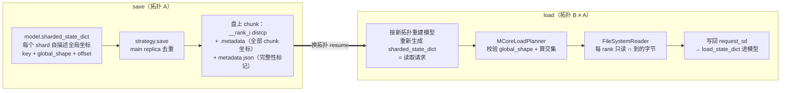
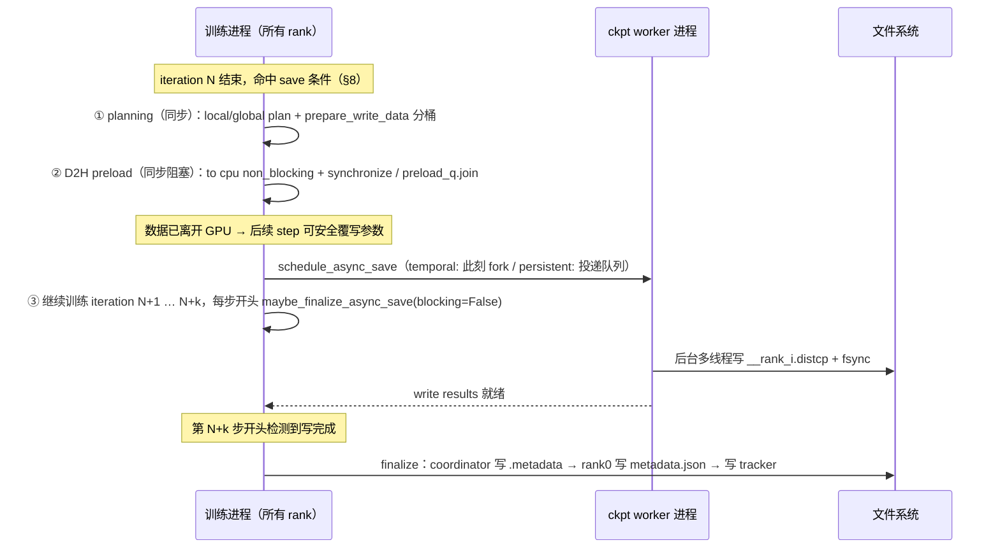

# 03 · Checkpoint：格式、async save 与换拓扑 resume

> [`01`](./01_training_loop.md) 已经讲过 setup 顺序与 save 节奏（§2、§9），本篇展开其中的 checkpoint 机制：§1 说明一份 checkpoint 需要恢复哪些状态；§2 总览两种格式的能力差异；§3 介绍 legacy 逐-rank 格式的布局，以及「改并行度必须离线转换」的强制点；§4 介绍 `torch_dist`（dist_checkpointing）的核心抽象与 resharding，即换并行拓扑 resume 的机制；§5 讲 async save 如何与训练并行（同步点在 D2H 而不在写盘）；§6 讲 RNG 与训练进度的恢复；§7 讲 fully parallel save/load；§8 讲 save 的触发节奏；§9 用 7B 配置演算一次 ckpt 的大小。万卡级「多久该存一次、失效有多频繁」的可靠性分析见 [05 · 大规模稳定性](../hpc/05_reliability_at_scale.md)，本篇只讲机制，不再重复。
>
> 前置知识：了解 DP/TP/PP rank 的划分直觉（[大规模训练的并行策略总览](../parallel/README.md)）；知道 DistributedOptimizer 把 fp32 master 与 Adam m/v 按 DP 分片（[02 · ZeRO 显存账本与 Megatron DistributedOptimizer](../parallel/01_dp/02_zero_and_distributed_optimizer.md)，step 编排见 [`02`](./02_optimizer.md)）。

代码（[[megatron-lm:]]，commit `e03878b5f`）：[[megatron-lm:megatron/training/checkpointing.py]]（下文简称 `checkpointing.py`）、[[megatron-lm:megatron/core/dist_checkpointing/]]（`mapping.py` / `serialization.py` / `validation.py` / `core.py` / `exchange_utils.py` / `state_dict_utils.py` / `optimizer.py` / `strategies/`）、[[megatron-lm:megatron/core/optimizer/distrib_optimizer.py]]（简称 `distrib_optimizer.py`）、[[megatron-lm:megatron/training/training.py]]（简称 `training.py`）。

---

## 1. checkpoint 需要恢复的状态

Resume 的目标：**让训练像没中断过一样继续**。对照 [`01`](./01_training_loop.md) 的一个 iteration，需要恢复的不只是模型权重。`generate_state_dict`（[[megatron-lm:megatron/training/checkpointing.py#L993-L1068]]）把下列内容组装进一个 state dict：

| state_dict key | 内容 | 组装位置 | 不恢复的后果 |
|---|---|---|---|
| `iteration` | 当前 step 数 | `:1010-1011` | lr schedule、save/eval 节奏、数据进度全部错位 |
| `model`（VPP 时 `model0/model1…`） | bf16 模型权重（逐 PP/VPP chunk 一个 key） | `:1013-1029` | 白训 |
| `optimizer` | fp32 master + Adam m/v + param_groups；DistOpt 下按 DP 分片 | `:1032-1054` | m/v 清零、master 丢失，收敛行为突变 |
| `opt_param_scheduler` | lr/wd schedule 状态（已消耗 samples 计数） | `:1056-1058` | lr 曲线跳变 |
| `rng_state` | random / numpy / torch / torch.cuda + cuda_rng_tracker states 五元组（§6） | `:1064-1066` | dropout 等随机序列不连续（数据顺序仍正确） |
| `args` | **整个命令行 Namespace** | `:1008` | 无法做一致性校验（§3.5），ckpt 不自描述 |
| `rerun_state_machine` | 失败重算状态机（[`08`](./08_other_components.md)） | `:1060-1062` | 换拓扑时本就丢弃，影响小 |
| `checkpoint_version` | 格式版本，当前恒为 `3.0` | `:1009` | 决定 load 侧走哪些兼容分支（§3.4） |

两个容易忽略的点：

- **`args` 整个存进去**是 legacy 一致性校验（`check_checkpoint_args`，§3.5）和「ckpt 自描述」的基础；`consumed_train_samples` 也在其中（见 §6.3）。
- **`--no-save-optim` 连 scheduler 都不存**：`opt_param_scheduler` 的写入在 `if not args.no_save_optim` 块内（`:1032` 与 `:1056-1058`），省掉的不只是 m/v。调用方还会额外塞入 `num_floating_point_operations_so_far`（`:634`）。

`checkpoint_version` 的简史值得知道，因为 load 侧的兼容分支都挂在它上面：`< 2.0` 的 ckpt 要过 `fix_query_key_value_ordering` 修正 QKV 排列（`:1132-1160`）；`< 3.0` 时 TP 的旧名叫 `model_parallel_size`，arg 校验走旧名（`:171-173`）；`>= 3.0` 才引入 TP/PP 一致性强制校验（§3.5）。当前 save 恒写 `3.0`（`:1009`）。

## 2. 两种格式总览

`--ckpt-format ∈ {torch, torch_dist, torch_dcp, fsdp_dtensor}`，**默认 `torch_dist`**（[[megatron-lm:megatron/training/config/training_config.py#L466]]）。`torch` 即 legacy 逐-rank 格式；`torch_dcp`/`fsdp_dtensor` 是 PyTorch DCP 原生通路，本篇不展开。派生量 `args.use_dist_ckpt = (ckpt_format != "torch")`（[[megatron-lm:megatron/training/utils/common_utils.py#L507-L508]]）；旧的 `--use-dist-ckpt` / `--dist-ckpt-format` 已废弃、只打印警告（[[megatron-lm:megatron/training/arguments.py#L1611-L1616]]）。

| | legacy（`torch`） | `torch_dist`（默认） |
|---|---|---|
| 文件布局 | 每 (tp,pp[,ep]) shard 一个 `mp_rank_*/model_optim_rng.pt`（+ DistOpt 的 `distrib_optim.pt`） | 每 rank 若干 `__{rank}_{i}.distcp` + rank0 的 `common.pt` + `.metadata` + `metadata.json` |
| 序列化 | `torch.save` 整个 state dict（同步阻塞） | 每个 shard 自描述全局坐标，走 PyTorch DCP 写盘 |
| 谁写盘 | 仅 `dp_rank==0 or expert_dp_rank==0` 的并集（每 shard 恰一个 rank，§3.2） | **每个 rank 都写**自己的 shard；副本按 main replica 去重（§7） |
| 换拓扑 resume | **禁止**：load 时 assert TP/PP 不变（§3.5），必须离线转换 | 模型权重不受限；optimizer 视 sharding_type；rng 丢弃（§4.4） |
| async save | 不支持，直接 raise（[[megatron-lm:megatron/training/checkpointing.py#L599-L600]]） | 支持（§5） |
| 单点 I/O 压力 | 高：写盘 rank 单进程序列化整个 shard（§9 数字） | 低：写盘天然摊到所有 rank |

## 3. legacy 格式（`--ckpt-format=torch`）

### 3.1 目录结构

`get_checkpoint_name`（[[megatron-lm:megatron/training/checkpointing.py#L197-L236]]）按 (tp,pp[,ep]) 坐标拼路径。以 7B 配置（TP=2, PP=2，无 EP）为例：

```
<--save 目录>/
├── latest_checkpointed_iteration.txt      # tracker：一行，iteration 或 "release"（:312-316）
└── iter_0001000/                          # iter_%07d（:206）；release 时为 release/
    ├── mp_rank_00_000/                    # tp_rank=0, pp_rank=0；PP=1 时无 _ppp 段（:226-231）
    │   ├── model_optim_rng.pt             # 本 (tp,pp) shard 的权重+rng+args+非分片 optim 状态
    │   └── distrib_optim.pt               # 仅 DistOpt：fp32 master+m/v（:256-258）
    ├── mp_rank_00_001/                    # tp=0, pp=1
    ├── mp_rank_01_000/
    └── mp_rank_01_001/
```

EP > 1 时目录名再追加 `_{ep_rank:03d}`（`:233-234`）。每个目录一个 `model_optim_rng.pt`，这就是「逐 rank 格式」名字的由来。

### 3.2 写盘 rank 的选择

写盘 rank 的选择条件是 `dp_rank==0 or expert_dp_rank==0`（`:611-614`）。取**并集**而非只取前者，原因写在注释里（`:607-610`）：每个 (tp_rank, ep_rank) shard 必须恰好被一个 rank 写；当 dense 与 expert 的并行布局不一致时（如 TP > EP×ETP），单靠 `dp_rank==0` 覆盖不了所有 expert shard，单靠 `expert_dp_rank==0` 覆盖不了 dense shard，并集保证每组坐标恰有一个写者。注意非写盘 rank 连 `generate_state_dict` 都不执行（`:611-614` 条件包住 `:622`），省一份 CPU 内存。

**DistOpt 的特例**：optimizer 的 param state 不进 `model_optim_rng.pt`，而是 gather 后由 **DP rank 0** 单独写同目录的 `distrib_optim.pt`（`:577-587`；[[megatron-lm:megatron/core/optimizer/distrib_optimizer.py#L1355-L1364]]，`if self.data_parallel_group.rank() == 0: torch.save(...)`）。这带来一个结构性弱点：`distrib_optim.pt` 是「第二个 checkpoint」，load 时要手动再读一次 tracker 拼路径（`:1930-1945`），与主文件存在不一致的可能（见 §10）。

### 3.3 tracker 文件

`latest_checkpointed_iteration.txt` 记录最新可加载的 iteration（`get_checkpoint_tracker_filename`，`:312-316`）。sync save 时由 rank 0 在写盘 barrier 之后立即更新（`:796-804, 846-847`）；async save 时推迟到 finalize（§5.4）。load 侧 `read_metadata`（`:326-368`）会跨 rank `all_reduce(MAX)` 对齐各 rank 读到的 iteration——不一致时**只打 WARNING 并取最大**（`:349-362`）。

### 3.4 load：按自己的 (tp,pp,ep) 坐标拼文件名

每 rank 用**自己的**坐标调 `get_checkpoint_name` 拼出文件名，`torch.load(..., map_location='cpu')` 读入（`:1373-1385`）——**是否拷贝**：是，整份反序列化到 CPU 内存再搬上卡。rank0 单独加载时（如 `load_args_from_checkpoint`）不知道 PP/EP 命名形态，用 `find_checkpoint_rank_0` 逐个试探四种命名（`:261-309`）。`checkpoint_version < 2.0` 的老 ckpt 还要过 `fix_query_key_value_ordering` 修 QKV 排列（`:1132-1160`）。

### 3.5 arg 一致性校验

load 成功后（非 `--finetune`）调 `check_checkpoint_args`（`:137-176`，调用点 `:1880-1882`）：固定比对 `num_layers/hidden_size/num_attention_heads` 等；**version ≥ 3.0 且非 dist ckpt 时，强制 `tensor_model_parallel_size` 与 `pipeline_model_parallel_size` 一致**（`:174-176`）——assert 会直接失败。这就是「legacy 改 TP/PP 必须离线转换」的代码出处：转换只能在训练进程之外做（[[megatron-lm:tools/checkpoint/convert.py]] 的 loader/saver 插件体系，读入全量张量后按新拓扑重新切分写出）。注意区分 `--ckpt-convert-format` / `--ckpt-convert-save`（[[megatron-lm:megatron/training/config/training_config.py#L479-L483]]）：那只是「启动加载后立刻换一种**格式**重存」（[[megatron-lm:megatron/training/training.py#L2092-L2101]]），换的是 torch 与 torch_dist 两种格式，**不是**并行度。`torch_dist` 无 TP/PP 校验（条件里 `not args.use_dist_ckpt`），换拓扑走 §4.4 的 resharding。

### 3.6 `save_checkpoint` 全流程伪代码

同构伪代码（变量名与控制流对齐 [[megatron-lm:megatron/training/checkpointing.py#L495-L878]]），把 §3-§5 的分叉点一次摆出来：

```python
def save_checkpoint(iteration, model, optimizer, opt_param_scheduler, ...):   # :495
    if args.async_save and not is_empty_async_queue():
        warn("上一次还没写完")                          # :518-519 只警告，不阻塞
    rng_state   = get_rng_state(...)                    # :560 五元组（§6.1）
    rerun_state = get_rerun_state_machine().state_dict(...)   # :562-566
    name = get_checkpoint_name(save_dir, iteration, ...)      # :570-571（§3.1）

    if ckpt_type == LEGACY and use_distributed_optimizer:     # :577-587
        optimizer.save_parameter_state(".../distrib_optim.pt")  # 仅 DP rank0 写（§3.2）

    if ckpt_type != LEGACY or dp_rank == 0 or expert_dp_rank == 0:   # :611-614
        state_dict = generate_state_dict(...)             # :622-632（§1 全景；legacy 非写盘 rank 跳过）
        if ckpt_type == LEGACY:
            torch.save(state_dict, name)                  # :771-774 同步阻塞，整 shard 序列化
        else:                                             # torch_dist
            strategy = cached or TorchDistSaveShardedStrategy()       # :639-674
            strategy = FullyParallelSaveStrategyWrapper(strategy, dp_group)  # :665-671 默认开（§7）
            async_req = dist_checkpointing.save(state_dict, name, strategy,
                                                async_sharded_save=args.async_save)  # :677-683
    if not args.async_save:
        barrier()                                         # :776-781 等所有写盘 rank 完成
    if rank == 0:                                         # tracker 的两种写时机（§5.3）
        if args.async_save: async_req.add_finalize_fn(iter_finalize_fn)   # :843-845 推迟
        else:               iter_finalize_fn()            # :846-847 立即写 tracker
    if args.async_save:
        schedule_async_save(async_req)                    # :871-872 入队（D2H 已在返回前完成，§5.1）
    barrier()                                             # :876-878 只同步「调度完成」，不等写盘
```

## 4. `torch_dist` / dist_checkpointing

### 4.1 核心抽象：每个 shard 自描述全局坐标

`torch_dist` 的一切能力来自一个数据结构：`ShardedTensor`（[[megatron-lm:megatron/core/dist_checkpointing/mapping.py#L51-L319]]），它是本地 tensor 到全局 tensor 的映射。关键字段（`:81-91`）：

| 字段 | 语义 |
|---|---|
| `key` | 全局张量唯一标识（如 `model.decoder.layers.3.mlp.linear_fc1.weight`） |
| `local_shape` / `global_shape` | 本片形状 / 全局形状 |
| `global_offset` | 本片在全局张量中的偏移（元素数） |
| `axis_fragmentations` | 全局张量每个轴被切成几份 |
| `replica_id` | 本片与其他 rank 上副本的关系；**全 0 才是 main replica**（`is_main_replica`，`:322-339`），保存与完整性校验只认 main replica |

构造器 `from_rank_offsets((axis, axis_rank_offset, axis_fragm), ...)`（`:189-245`）用「第几个 rank 分片」反推 global shape/offset：该轴全局被切 `axis_fragm` 份、本片是第 `axis_rank_offset` 份 ⇒ `global_shape[axis] = fragm × local`、`global_offset[axis] = rank_offset × local`（`:228-231`）。**存盘时不再依赖「哪个 rank」，只依赖坐标**。一个具体例子（TP=2 的 embedding `weight [V, h]` 沿 axis 0 切，tp_rank=1 持有 `[V/2, h]`）：

```python
ShardedTensor.from_rank_offsets(
    key='model.embedding.word_embeddings.weight',
    data=local_weight,                       # [V/2, h]，本 rank 的半片
    (0, tp_rank, tp_size),                   # axis 0 切 2 份，我是第 1 份
    replica_id=(0, 0, dp_rank),              # TP 各 rank 数据不同 → 不算副本；DP 上是副本
)
# 推出：global_shape=(V, h)，global_offset=(V/2, 0)，axis_fragmentations=(2, 1)
# is_main_replica：仅 dp_rank==0 的那一份是全 0 → 全 DP 只有一份落盘
```

配套的三个抽象（`mapping.py`）：

- **`ShardedObject`（`:359-430`）**：任意 Python 对象的分片版（如 rng_state、optimizer 的 param_groups）。注释明确「**不可能改变 global sharding**」（`:366-368`）——这是换拓扑时 rng 被丢弃的结构性原因（§4.4）。
- **`ShardedTensorFactory`（`:437-480`）**：`build_fn` 保存前把一个 tensor 展开成子 state dict、`merge_fn` 加载后合并回来，让 optimizer state 复用与模型参数相同的变换（如 FP8 量化/反量化）。save 流程入口先 `apply_factories`（[[megatron-lm:megatron/core/dist_checkpointing/state_dict_utils.py#L40]]），load 末尾 `apply_factory_merges`（[[megatron-lm:megatron/core/dist_checkpointing/serialization.py#L161]]）。
- **`LocalNonpersistentObject`（`:342-356`）**：**save 时丢弃、load 时用本地现值**——non-persistent buffer 的机制（save 侧 `extract_nonpersistent` 丢弃，[[megatron-lm:megatron/core/dist_checkpointing/state_dict_utils.py#L41]]；load 侧 unwrap 回本地值，`:91-92`）。DistOpt 的 `param_groups['params']`（一串 param id 列表）就包成它（[[megatron-lm:megatron/core/dist_checkpointing/optimizer.py#L147-L149]]）。

### 4.2 sharded_state_dict 的生成

`generate_state_dict` 在 `torch_dist` 下调用的是 `model[i].sharded_state_dict(...)` 而非普通 `state_dict`（[[megatron-lm:megatron/training/checkpointing.py#L1018-L1025]]）。生成过程分三路递归：

1. **递归默认实现** `MegatronModule.sharded_state_dict`（[[megatron-lm:megatron/core/transformer/module.py#L58-L103]]）：先 `_save_to_state_dict(keep_vars=True)` 拿本模块参数，经 `make_sharded_tensors_for_checkpoint` 包装，再对子模块递归 `sharded_state_dict_default`。
2. **TP 偏移**：`make_tp_sharded_tensor_for_checkpoint`（[[megatron-lm:megatron/core/utils.py#L910-L976]]）给 TP 切分的参数追加 `(tp_axis, tp_rank, tp_size)` 分片声明（`:949`），`replica_id=(0, 0, dp_rank)`（`:965-966`，TP 各 rank 数据不同、不算副本）；非 TP 切分参数走 `make_sharded_tensor_for_checkpoint`（`:979-1029`），`replica_id=(0, tp_rank, dp_rank)`（`:1018-1019`，TP/DP 上都是副本）。两种情况下 DP 副本都靠 `replica_id` 去重。
3. **PP 层号偏移**：`TransformerBlock.sharded_state_dict`（[[megatron-lm:megatron/core/transformer/transformer_block.py#L708-L797]]）把本 stage 的层号折算成**全局层号**，以 `sharded_pp_offset=[(0, global_layer_offset, num_layers)]` 形式 prepend 到每个 ShardedTensor（`:774-776`）——于是 PP 各 stage 的「第 0 层」在盘上对齐为同一个全局张量的不同 slice。

optimizer 侧：`DistributedOptimizer.sharded_state_dict`（[[megatron-lm:megatron/core/optimizer/distrib_optimizer.py#L1404-L1524]]）按 `metadata['distrib_optim_sharding_type']` 分流——默认 `dp_reshardable`（bucket 内每个非连续段一个 ShardedTensor，`:1772-1805`）或 `fully_reshardable`（save 时 gather 到 DP rank0、还原成「每个模型参数对应同形状 optimizer state」的 canonical 形态，`:1634`；docstring `:1421-1426`）。sharding_type 由 `_build_sharded_state_dict_metadata` 写入 content metadata（[[megatron-lm:megatron/training/checkpointing.py#L417-L458]]，`--dist-ckpt-optim-fully-reshardable` 控制，[[megatron-lm:megatron/training/config/training_config.py#L572-L578]]）。

### 4.3 目录内容与写入时序

```
iter_0001000/
├── common.pt            # rank0 写：args / iteration / opt_param_scheduler / content_metadata（非 sharded 部分）
├── __0_0.distcp         # 全局 rank0 的数据文件（DCP 命名 __{rank}_{i}.distcp，strategies/filesystem_async.py:494-496）
├── __1_0.distcp
│   ...                  # 每 rank 至少一个；DP 副本已被 main-replica 去重，不重复落盘
├── .metadata            # DCP 全局 metadata：所有 chunk 的 (key, offsets, sizes)，coordinator 在 finalize 时写
├── metadata.json        # Megatron 格式标记 CheckpointingConfig{sharded_backend:"torch_dist", ...}，最后写 = 完整性标记
└── integrity.json       # 可选：--verify-integrity 的 SHA-256 manifest（仅 torch_dist，training_config.py:596,618-620）
```

**时序性质（重要）**：`metadata.json` 是 `save` 流程的**最后一步**，async save 时被挂成 finalize fn、只在 ckpt 完整后才写（`serialization.py:401-407, 421-424`；内容定义在 `core.py:12, 21-35, 76-93`）；`.metadata` 由 coordinator 在 finalize 收集各 rank write results 后写（[[megatron-lm:megatron/core/dist_checkpointing/strategies/state_dict_saver.py#L238-L245]]）。因此 `verify_checkpoint` 只需检查 `metadata.json` 存在即可拒绝半成品 ckpt（[[megatron-lm:megatron/core/dist_checkpointing/validation.py#L204-L219]]），load 侧的格式嗅探也靠它（`_get_checkpoint_format`：有 `metadata.json` 则为 `torch_dist`，有 `mp_rank_0*` 则为 legacy，有 `.metadata` 则为 `torch_dcp`，[[megatron-lm:megatron/training/checkpointing.py#L1264-L1287]]）。反过来，`save` 开头对非空目录**只 warning 不拒绝**（[[megatron-lm:megatron/core/dist_checkpointing/serialization.py#L371-L382]]）。

### 4.4 resharding：换并行拓扑 resume 的机制

机制可以用一句话概括：**save 时每个 shard 自描述全局坐标；load 时按新拓扑重新生成 sharded_state_dict 作为「读取请求」，planner 计算「存储 chunk ∩ 请求切片」逐片读**。

```
全局张量 W（如 embedding.weight）：global_shape = [V, h]，沿 axis 0 切，设 V = 16

save（拓扑 A：TP=2）                     盘上 chunk（.metadata 记录坐标）
 rank0 持有 W[0:8,  :]  ──┐             chunk_A0 = W[0:8,  :]  ← __0_0.distcp
 rank1 持有 W[8:16, :]  ──┘    ==>      chunk_A1 = W[8:16, :]  ← __1_0.distcp

load（拓扑 B：TP=4；模型按新拓扑重建后重新生成 sharded_state_dict 作为请求）
 请求 B0 = W[0:4,  :]  ──►  ∩ chunk_A0 = W[0:4,  :]  → 只读 A0 文件的前半段字节
 请求 B1 = W[4:8,  :]  ──►  ∩ chunk_A0 = W[4:8,  :]  → 只读 A0 文件的后半段字节
 请求 B2 = W[8:12, :]  ──►  ∩ chunk_A1 = W[8:12, :]
 请求 B3 = W[12:16, :] ──►  ∩ chunk_A1 = W[12:16, :]
```

整个 save、换拓扑、load 的完整数据流：



对应的代码位置：

- **请求生成**：`load_checkpoint` 在 `torch_dist` 分支用**当前（新）拓扑**重新调 `generate_state_dict(args, model, gen_sd_optim, ..., gen_sd_rng_state, ...)`（[[megatron-lm:megatron/training/checkpointing.py#L1787-L1791]]）——此时每个本地 ShardedTensor 声明的是「需要全局张量 key 的哪一片」。optimizer/rng 是否参与请求由 `--no-load-optim`/`--no-load-rng`/`--finetune` 与 ckpt 内容共同决定（`:1693-1743`）。
- **交集读取**：`MCoreLoadPlanner.create_local_plan` 先校验全局 shape 一致（`_validate_global_shapes`，[[megatron-lm:megatron/core/dist_checkpointing/strategies/torch.py#L501,L543-L550]]），`TorchDistLoadShardedStrategy.load`（`:858-920`）把请求翻译成 PyT DCP 对象交给 `checkpoint.load`，由 DCP 算交集、每 rank 只读自己需要的字节。
- **完整性校验**：`determine_global_metadata` 用 `all_gather_object` 收齐各 rank 请求（[[megatron-lm:megatron/core/dist_checkpointing/validation.py#L484-L498]]），`_compute_shards_access` 检查**每个 chunk 恰好被（某个 main replica）访问一次**（`:454-461`）——默认开（`--ckpt-load-validate-sharding-integrity`，[[megatron-lm:megatron/training/config/training_config.py#L546-L549]]）。

**能力边界**（换拓扑时什么能恢复、什么会丢）：

| 状态 | 变 DP | 变 TP/PP |
|---|---|---|
| 模型权重 | ✓ | ✓（天然可 reshard） |
| optimizer（默认 `dp_reshardable`） | ✓ | ✗ → `RuntimeError`（[[megatron-lm:megatron/training/checkpointing.py#L1728-L1735]]） |
| optimizer（`fully_reshardable` / `fsdp_dtensor`） | ✓ | ✓（名单见 [[megatron-lm:megatron/core/optimizer/distrib_optimizer.py#L116-L120]]） |
| rng（`ShardedObject`，不可 reshard） | ✓（按 dp_rank 取下标） | ✗ 直接忽略，只打 WARNING（`:1694-1704`） |
| rerun state | world size / TP / PP / DP 任一变化即忽略（`:1759-1778`） | 同左 |

一个容易踩到的坑：`:1733-1735` 的报错信息建议「save 时用 `--ckpt-fully-parallel-save`」——这是**过时的提示**（历史上该 flag 会把 optimizer 存成 `fully_sharded_model_space` 格式，兼容映射还留在 `:1723-1727`）；当前版本要让 optimizer 支持变 TP/PP，正确开关是 `--dist-ckpt-optim-fully-reshardable`（[[megatron-lm:megatron/training/config/training_config.py#L572-L578]]），代价是 save 时要 gather 到 DP rank0（速度更慢、占用更多内存，[[megatron-lm:megatron/core/optimizer/distrib_optimizer.py#L1421-L1426]]）。

### 4.5 伪代码：save / load 双视角

与源码同构的精简伪代码（save 侧精简自 [[megatron-lm:megatron/core/dist_checkpointing/serialization.py#L300-L425]] 与 [[megatron-lm:megatron/training/checkpointing.py#L622-L683]]；load 侧精简自 [[megatron-lm:megatron/core/dist_checkpointing/serialization.py#L54-L166]] 与 [[megatron-lm:megatron/training/checkpointing.py#L1787-L1791]]）：

```python
# ---- 保存（拓扑 A，全部 rank 都执行）----
sharded_sd = generate_state_dict(args, model, optimizer, scheduler, rng_state, ...)
#   每个叶子是 ShardedTensor.from_rank_offsets(key, local_data,
#       (axis, my_rank_offset, axis_fragm), ..., replica_id=(0, tp_rank?, dp_rank))
save(sharded_sd, ckpt_dir, strategy, async_sharded_save=args.async_save):
    apply_factories()                       # ShardedTensorFactory 展开（FP8 等）
    extract_nonpersistent()                 # LocalNonpersistentObject 丢弃
    common.pt  ← rank0: {args, iteration, opt_param_scheduler, content_metadata}
    validate: all_gather 各 rank 声明 → 每 chunk 恰被一个 main replica 覆盖
    strategy.save():                        # TorchDistSaveShardedStrategy
        ShardedTensor → PyT DCP 对象（keep_only_main_replica=True 去重）
        → WriteItem(chunk=offsets+sizes) → 写 __{rank}_{i}.distcp
        → finalize 时 coordinator 写 .metadata
    metadata.json ← 最后写（async 时挂为 finalize fn）  # 完整性标记

# ---- 加载（拓扑 B ≠ A 也成立）----
request_sd = generate_state_dict(args, model_built_with_topology_B, ...)  # 关键：按新拓扑重新生成！
load(request_sd, ckpt_dir):
    sd ← 读 common.pt                       # args / iteration 等非 sharded 部分
    verify_checkpoint: metadata.json 必须存在
    validate: 每 chunk 恰好被访问一次（默认开）
    MCoreLoadPlanner: 校验 global_shape 一致；对每片请求算 ∩(存储 chunk) → ReadItem 列表
    FileSystemReader: 只读本 rank 需要的字节 → 写回 request_sd 的 data
    merge common + nonpersistent（LocalNonpersistentObject 用本地值）→ load_state_dict 进模型
# 边界：optimizer 非 fully_reshardable 时变 TP/PP 直接 raise；rng 是 ShardedObject，拓扑变 → 忽略
```

## 5. async save：与训练并行的三段式流水

### 5.1 三段式流水与同步点的位置

async save 把一次保存拆成三段（[[megatron-lm:megatron/core/dist_checkpointing/strategies/state_dict_saver.py#L41-L168]] docstring）：① **planning（同步）**：local/global plan + `prepare_write_data` 把 tensor 分桶（`:159`）；② **D2H preload（同步）**；③ **后台写盘 + finalize（异步）**。关键是②和③的分界——`FileSystemWriterAsync.get_save_function_and_args` 返回 `(write_fn, preload_fn, args)` 三元组（[[megatron-lm:megatron/core/dist_checkpointing/strategies/filesystem_async.py#L206-L224]]），`preload_fn = preload_tensors` 做 `tensor.to("cpu", non_blocking=True)` + `torch.cuda.synchronize()`（`:227-249`）。

两条 caller 路径都保证 **schedule 返回时数据已离开 GPU**（是否拷贝：D2H 是一次真实拷贝进 host 内存；是否 sync：D2H 完成前训练进程阻塞，write 不阻塞）：

- **temporal caller**（每次 save 临时 fork）：训练进程内**先同步做完 D2H，再 `fork` 写盘子进程**（[[megatron-lm:megatron/core/dist_checkpointing/strategies/async_utils.py#L263-L282]]，`:273` 的 `torch.cuda.synchronize()` 后才 `:279-282` fork）。
- **persistent caller**（常驻 worker，`--use-persistent-ckpt-worker`）：preload 在 worker 进程做，但训练进程 `preload_q.join()` 等 D2H 完成才返回（`:416-429`）。

写盘侧是每 bucket 一个线程的多线程写 + fsync（[[megatron-lm:megatron/core/dist_checkpointing/strategies/filesystem_async.py#L251-L357]] 起）。所以训练被 stall 的只有 planning + D2H（秒级、与 ckpt 分片大小成正比），真正耗时的写盘完全藏进后续 iteration。

### 5.2 时序图



### 5.3 finalize 链与排队规则

- **tracker / metadata.json 都挂成 finalize fn 推迟写**：`iter_finalize_fn`（写 `latest_checkpointed_iteration.txt` + `save_retain_interval` 删旧 ckpt，[[megatron-lm:megatron/training/checkpointing.py#L796-L841]]）在 async 时 `add_finalize_fn`（`:843-845`），sync 时立即执行（`:846-847`）；`metadata.json` 同理（§4.3）。**推论**：async save 刚 schedule 就崩溃，tracker 仍指向旧 iteration、新目录没有 `metadata.json`——半成品被自动拒载，这是特性不是 bug。
- **排队与 finalize 顺序**：[[megatron-lm:megatron/training/async_utils.py]] 持 singleton `AsyncCallsQueue`（`:43-55`），`schedule_async_save` 入队（`:109-115`；入队时 freeze request、清空 finalize_fns 留在训练侧、全局 `call_idx`，[[megatron-lm:megatron/core/dist_checkpointing/strategies/async_utils.py#L644-L666]]）。finalize 按 FIFO popleft、逐个跑 finalize_fns，并用 `all_reduce(MAX)` 校验各 rank finalize 同一 `call_idx`（`:668-703`）。
- **训练循环的节奏**：每步开头 `maybe_finalize_async_save(blocking=False)`（[[megatron-lm:megatron/training/training.py#L3415-L3417]]，包在 FT 的 section 里）；退出前 `blocking=True, terminate=True`（`training.py:1471, 3794`）。下一次 save 开始时若上一次还没 finalize，**只打 WARNING 不阻塞**（[[megatron-lm:megatron/training/checkpointing.py#L518-L519]]）。

### 5.4 flag 的注意事项

- **`--async-save` 不配 `--use-persistent-ckpt-worker` 会被静默关掉**（warn + `args.async_save=False`，[[megatron-lm:megatron/training/arguments.py#L1628-L1634]]）。
- 未开 async 时 `async_strategy` 强制为 `mcore`（[[megatron-lm:megatron/training/config/training_config.py#L605-L606]]；[[megatron-lm:megatron/training/arguments.py#L1636-L1637]]）；`mcore` 后端本身已标记 deprecated（[[megatron-lm:megatron/core/dist_checkpointing/strategies/torch.py#L672-L679]]），默认 `nvrx` 需要装 nvidia-resiliency-ext，缺包直接报错（[[megatron-lm:megatron/core/dist_checkpointing/strategies/torch.py#L1041-L1092]]）。

## 6. RNG 与训练进度的恢复

### 6.1 收集：五元组与跨 DP all_gather

`get_rng_state`（[[megatron-lm:megatron/training/checkpointing.py#L371-L407]]）收集五元组：`random` / `numpy` / `torch` / `torch.cuda` 的 state + `tensor_parallel.get_cuda_rng_tracker().get_states()`（`:374-379`）。前四项是 PyTorch 生态的标准 RNG；第五项是 Megatron 私有的一层。为什么需要它：一套全局 RNG 表达不了「在哪一维相同、哪一维不同」——默认 RNG 在**同一 TP 组内相同**（非 TP 区域的 dropout 要对相同的数据副本产生相同 mask）、跨 TP 组不同；而 TP 切分区域的 dropout 恰好相反，要**每个 TP rank 不同**（各 rank 持有不同的 heads/列片）、跨 DP 相同（[[megatron-lm:megatron/core/tensor_parallel/random.py#L449-L458]] docstring 把三套状态的语义写得很清楚）。所以 Megatron 在全局 RNG 之外维护一个按 name 分桶的 `CudaRNGStatesTracker`（本质是 `{name: state}` 字典，[[megatron-lm:megatron/core/tensor_parallel/random.py#L216,L258-L270]]；机制详解见 [`06`](./06_activation_recompute_offload.md)）。少了它，resume 后 TP 域内的随机性就对不上了。`--data-parallel-random-init` 时跨 DP 组 `all_gather_object` 收齐所有 DP rank 的 rng（`:382-391`）——此时各 DP rank 随机序列本就不同，必须逐 rank 恢复。

`torch_dist` 下这份 list 被包成 `ShardedObject('rng_state', data, global_shape=(pp_size, tp_size), offset=(pp_rank, tp_rank), replica_id=dp_rank)`（`:393-399`）：(pp,tp) 网格上每格一份、DP 副本去重。它是 **ShardedObject 不是 ShardedTensor**，而 ShardedObject 声明了「不可能改变 global sharding」（[[megatron-lm:megatron/core/dist_checkpointing/mapping.py#L366-L368]]）——TP/PP 一变，offset 网格对不上，只能丢弃。

### 6.2 恢复：按 dp_rank 取下标

恢复侧（`:1975-2026`）：从 state_dict 取出 rng list 后，按 `dp_rank` 取下标（`--data-parallel-random-init` 时 `:1994`，否则统一取 `[0]`，`:1996`）；再逐项 `setstate`；`rng_tracker_states` 经 `convert_cuda_rng_state` 做 cudagraphable 互转（`:2004-2007`；[[megatron-lm:megatron/core/tensor_parallel/random.py#L169]]）后 `set_states`（`:2020`）。**是否可缺失**：`rng_tracker_states` 为空时故意 `raise KeyError` 走「无法加载」退出路径（`:2001-2003, 2021-2026`），提示加 `--no-load-rng`。`--no-save-rng` 则 save 时根本不写（`:1065-1066`）。

### 6.3 进度：`consumed_train_samples` 与 `--finetune` 语义

- **主路径**：`consumed_train_samples` 存在 ckpt 的 `args` 里，load 时回填 `args.consumed_train_samples` 并 `update_num_microbatches`（`:1883-1887`）；训练每步累加（[[megatron-lm:megatron/training/training.py#L3616]]，见 [`01`](./01_training_loop.md) §3.4）。sampler 从这个偏移继续顺序取数（[`04`](./04_dataloader.md)）。
- **兼容路径**：老 ckpt 只有 iteration 没有 consumed 时，`build_train_valid_test_data_loaders` 按 `iteration × global_batch_size` 回填（[[megatron-lm:megatron/training/training.py#L4178-L4183]]，要求非 `--train-samples` 模式）。
- **`--finetune` 等价于 `--no-load-optim` + `--no-load-rng` + `iteration=0` + 跳过 arg 校验**（`:1865-1866, 1880, 1919, 1975`）。此时若 fp16/bf16，optimizer 的 fp32 master 用模型权重重新初始化（`optimizer.reload_model_params()`，`:1959-1964`）；`--load-main-params-from-ckpt` 必须与 `--no-load-optim` 同用（[[megatron-lm:megatron/training/arguments.py#L1625-L1626]]）。

## 7. fully parallel save/load：副本去重与负载均衡

DP 域内模型权重是逐副本重复的，若每个 DP rank 都写自己的副本，I/O 量放大 DP 倍。去重机制分两层：

- **main replica 去重**：`TorchDistSaveShardedStrategy` 默认 `keep_only_main_replica=True`（[[megatron-lm:megatron/core/dist_checkpointing/strategies/torch.py#L599]]），翻译给 PyT DCP 前按 `replica_id` 只保留全 0 的 main replica（`:360-373`）。
- **`FullyParallelSaveStrategyWrapper`（默认开）**：在此之上把「谁当 main replica」在 DP 组内**均匀重指派**——只交换 metadata（`all_gather_object`），用确定性贪心算法 `distribute_shards_to_ranks`（[[megatron-lm:megatron/core/dist_checkpointing/exchange_utils.py#L117]]）把各 shard 的写盘任务摊到 DP 组内不同 rank，然后直接改写 `replica_id`（指派到的 rank 置 0、其余置 1，[[megatron-lm:megatron/core/dist_checkpointing/strategies/fully_parallel.py#L449-L464]]）。是否通信：只有 metadata 通信，**零数据通信**（docstring `:46-59`）。默认开启，`--no-ckpt-fully-parallel-save` 关闭（[[megatron-lm:megatron/training/config/training_config.py#L491-L494]]），分组可用 `--ckpt-fully-parallel-save-process-group {dp, ep_dp}`（`:531-535`）。
- **load 侧默认关**：`FullyParallelLoadStrategyWrapper`（[[megatron-lm:megatron/core/dist_checkpointing/strategies/fully_parallel.py#L142]] 起）让每 rank 只读自己分到的 shard 再 broadcast/gather 交换数据，需显式 `--ckpt-fully-parallel-load`（默认关，[[megatron-lm:megatron/training/config/training_config.py#L521-L529]]；交换算法默认 broadcast）。

## 8. save 的触发点与节奏

训练循环每个 iteration 末尾调 `checkpoint_and_decide_exit`（[[megatron-lm:megatron/training/training.py#L2953-L3062]]），按优先级依次判断：

1. **SIGTERM**：`--exit-signal-handler` 下收到信号则先存一个 ckpt 再退出（`:2969-2985`）——这是抢占式集群上保留训练现场的手段；
2. **常规 save**：`iteration % save_interval == 0`（`:2987-2998`）；
3. **non-persistent save**：`non_persistent_save_interval`（`:3000-3015`）。「non-persistent」指这类 ckpt 不进入常规保留序列、新的存上即删旧的：`global` 型写到独立目录（`--non-persistent-global-ckpt-dir` 或 `<save>/` 下的固定子目录），保存前先清理旧份（[[megatron-lm:megatron/training/checkpointing.py#L534-L545]]）；`local` 型每 rank 写本地 SSD/ramdisk，走 nvidia-resiliency-ext 的 local checkpoint manager（`:546-548, 744-769`）——牺牲全局可读性换写盘延迟，配合 in-process restart 使用（[`08`](./08_other_components.md)）；
4. **`--exit-duration-in-mins` 到期**：跨 rank `all_reduce(MAX)` 对齐后补存再退（`:3017-3038`）；
5. **`--exit-interval` / 相位切换**（`phase_transition_iterations`）：补存再退（`:3040-3060`）。

实际保存走 `save_checkpoint_and_time`（[[megatron-lm:megatron/training/training.py#L2773-L2826]]）：先停 `interval-time` 计时（ckpt 不计入训练吞吐），然后 `free_overlap_buffers()` + `torch.cuda.empty_cache()`（`:2804-2807`）——注释明说动机是**给 async worker 的 D2H 拷贝腾显存**（`:2801-2803`）。另有 `--exit-on-missing-checkpoint`（load 侧无 tracker 时 barrier 后 `sys.exit`，[[megatron-lm:megatron/training/checkpointing.py#L1345-L1349]]）与 `--ckpt-step`（覆盖加载的 iteration，`:1318-1319`）两个常用配套 flag。

## 9. 数字演算：7B 配置一次 save 的体积与写盘分布

沿用全章配置（[README](./README.md) §3）：P = 7.5e9，bf16 权重 + fp32 master + Adam m/v，DistOpt，TP=2 / PP=2 / DP=64（256 卡）。

**全量 ckpt 大小**（逻辑上只算一份）：

```
模型权重 bf16          7.5e9 × 2 B  = 15.0 GB
fp32 master            7.5e9 × 4 B  = 30.0 GB
Adam m + v             7.5e9 × 8 B  = 60.0 GB
─────────────────────────────────────────────
合计                                 ≈ 105 GB
+ rng 五元组（KB 级 × (pp,tp) 网格）、args、scheduler 状态：可忽略
```

**`torch_dist`（默认 + fully parallel save）**：每 rank 写「自己的 optimizer 分片 + 摊派到的模型主副本」：

```
optimizer：每 (tp,pp) 域 P/4 ≈ 1.9e9 参数 × 12 B ≈ 22.5 GB，按 DP=64 分片
          → 每 rank 22.5 / 64 ≈ 352 MB
模型：    每 (tp,pp) shard 15 / 4 = 3.75 GB，DP=64 副本去重后摊派
          → 每 rank 3.75 / 64 ≈ 59 MB
──────────────────────────────────────────────
每 rank 写盘 ≈ 410 MB；256 rank 并行写 ≈ 105 GB 聚合
文件数 ≈ 每 rank ≥1 个 .distcp + common.pt + .metadata + metadata.json
```

**legacy**：TP×PP = 4 个 shard，共 4 × `model_optim_rng.pt` + 4 × `distrib_optim.pt` = **8 个文件**；写盘集中在 `dp_rank==0` 的 4 个 rank 上，**单 rank 单进程要序列化 3.75 + 22.5 ≈ 26.3 GB**（`torch.save` 同步阻塞，CPU 内存还要再扛一份）。对比 `torch_dist` 的每 rank 410 MB：**单点 I/O 量差 64 倍**——这就是大 DP 下 legacy 存一次 ckpt 训练要完全停住十几秒（更大模型外推到分钟级）、而 dist ckpt + async 只需秒级以下 stall 的结构性原因。

**stall 时间的量级估算**（取典型值：单流写并行文件系统 ~2 GB/s、D2H 走 PCIe ~25 GB/s、聚合写带宽 ~100 GB/s，仅作数量级参考）：

```
legacy sync：   26.3 GB / (2 GB/s) ≈ 13 s 训练完全停住（每 save_interval 一次）
torch_dist sync：105 GB / (100 GB/s) ≈ 1 s 级别（planning + 写盘都在关键路径上）
torch_dist async：训练侧只付 planning + D2H ≈ 410 MB / (25 GB/s) ≈ 16 ms/rank；
                写盘 ~1 s 藏进后续 iteration，对吞吐近似零成本
```

这也是为什么 `--save-interval` 可以随 ckpt 变大而放宽：async save 把保存开销从训练停顿时间变成了 host 内存占用与少量带宽。

**async save 的 host 内存开销**：D2H preload 会把本 rank 的写盘数据（上例 ≈ 410 MB/rank）拷进 host 内存（可选 `--async-ckpt-use-cpu-shm` 走共享内存，[[megatron-lm:megatron/training/config/training_config.py#L515-L519]]），write 期间常驻，finalize 后释放。256 卡、每机 8 卡，即每机 ≈ 3.3 GB host 占用，通常可忽略，但配合 optimizer CPU offload 时需要计入内存总开销。

**保存频率**：ckpt 越大，越应该开 async 并拉长保存间隔；「失效频率 vs 重训损失」的定量模型（MTBF、checkpoint 开销占比）见 [05 · 大规模稳定性](../hpc/05_reliability_at_scale.md)。

## 10. 易错点速查

1. **tracker 写时机不对称**：sync save 立即写 `latest_checkpointed_iteration.txt`；async save 挂成 finalize fn，要等后台写盘完成、且训练循环下一次 `maybe_finalize_async_save` 才落盘（`checkpointing.py:796-804, 843-847`；[[megatron-lm:megatron/training/training.py#L3415-L3417]]）。`.metadata`/`metadata.json` 同理（[[megatron-lm:megatron/core/dist_checkpointing/serialization.py#L401-L407]]）。
2. **半成品 ckpt 的识别**靠 `metadata.json` 最后写 + `verify_checkpoint`（[[megatron-lm:megatron/core/dist_checkpointing/validation.py#L204-L219]]）；但 `save` 开头对非空目录只 warning 不拒绝（[[megatron-lm:megatron/core/dist_checkpointing/serialization.py#L371-L382]]）。
3. **async 的同步点在 D2H 不在 write**：schedule 返回前 GPU 到 CPU 的拷贝已完成（temporal：fork 前同步 D2H，[[megatron-lm:megatron/core/dist_checkpointing/strategies/async_utils.py#L263-L282]]；persistent：`preload_q.join()`，`:416-429`），之后训练可安全覆写参数；但 save 开头允许前一次 write 未 finalize 就开始下一次（只 WARNING，[[megatron-lm:megatron/training/checkpointing.py#L518-L519]]）。
4. **`--async-save` 会被静默降级**：不开 `--use-persistent-ckpt-worker` 直接 `args.async_save=False`（[[megatron-lm:megatron/training/arguments.py#L1628-L1634]]）；不开 async 时 `async_strategy` 强制 `mcore`（[[megatron-lm:megatron/training/config/training_config.py#L605-L606]]）。
5. **legacy 改 TP/PP 必须离线转换**：version ≥ 3.0 的 legacy ckpt resume 时 assert TP/PP 一致（[[megatron-lm:megatron/training/checkpointing.py#L174-L176]]），dist ckpt 无此校验。
6. **dist ckpt 改拓扑的隐性代价**：rng 直接丢弃（dropout 序列不再连续，`:1694-1704`）；rerun state 丢弃（`:1759-1778`）；DistOpt 默认 `dp_reshardable` 只允许变 DP，变 TP/PP 直接 raise（`:1728-1735`），且报错文案提示的 `--ckpt-fully-parallel-save` 已过时，正确开关是 `--dist-ckpt-optim-fully-reshardable`。
7. **`--no-save-optim` 连 scheduler 都不存**（`:1032-1058`）；`--finetune` 等价于 no-load-optim + no-load-rng + iteration=0 + 跳 arg 校验（`:1865-1866, 1880, 1919, 1975`）。
8. **`rng_tracker_states` 为空会 `sys.exit()`**（`:2001-2003, 2021-2026`），按提示加 `--no-load-rng`；tracker states 还可能是 graphable Generator 而非 tensor，靠 `convert_cuda_rng_state` 互转（`:2004-2007`）。
9. **`read_metadata` 用 `all_reduce(MAX)` 对齐各 rank 读到的 iteration**（`:349-362`）——rank 间 tracker 不一致时默默取最大，只打 WARNING。
10. **legacy 的 `distrib_optim.pt` 是「第二个 ckpt」**：与 `model_optim_rng.pt` 分文件、分开写（仅 DP rank0，[[megatron-lm:megatron/core/optimizer/distrib_optimizer.py#L1355-L1364]]），load 时手动重读一次 tracker 拼路径（[[megatron-lm:megatron/training/checkpointing.py#L1930-L1945]]）——两者存在不一致的可能。
11. **`common.pt` 的一致性只警告不报错**：`_validate_common_state_dict` 用 rank0 版本广播对比，不一致只 log warning（[[megatron-lm:megatron/core/dist_checkpointing/validation.py#L335]] 起）。
12. **`replica_id` 的正确性是「应用的责任」**（[[megatron-lm:megatron/core/dist_checkpointing/mapping.py#L322-L339]] docstring）：只有 main replica（全 0）会被保存/计入完整性校验；`FullyParallelSaveStrategyWrapper` 会直接改写 `replica_id` 做负载均衡（[[megatron-lm:megatron/core/dist_checkpointing/strategies/fully_parallel.py#L449-L464]]）。自己手写 sharded_state_dict 时标错 replica，默认开启的「每 chunk 恰好被访问一次」校验能兜住；若校验被关掉，就是静默丢 shard 或重复写。

---

## 参考

- [PyTorch Distributed Checkpoint API 文档](https://docs.pytorch.org/docs/stable/distributed.checkpoint.html)——SPMD save/load、load-time resharding、`async_save` 与 planner 接口（`torch_dist` 的底层）。
- [PyTorch DCP tutorial](https://docs.pytorch.org/tutorials/recipes/distributed_checkpoint_recipe.html)——不同 world size 加载的官方示例。
- [Megatron-Core dist_checkpointing 文档](https://docs.nvidia.com/megatron-core/developer-guide/latest/api-guide/core/dist_checkpointing.html)——`torch_dist` 格式、跨 TP/PP/DP resharding、`dp_reshardable`/`fully_reshardable`、异步保存的官方说明。
- Megatron `checkpointing.py`、[[megatron-lm:megatron/core/dist_checkpointing/]]（commit `e03878b5f`）。

下一篇：[04 · 数据链路：从 .bin/.idx 到 get_batch](./04_dataloader.md) —— `.bin`/`.idx` mmap 格式、GPTDataset 的三张 index 表、多数据集 blend、sampler 如何按 `consumed_train_samples` resume、batch 如何跨 TP/CP 分发。
