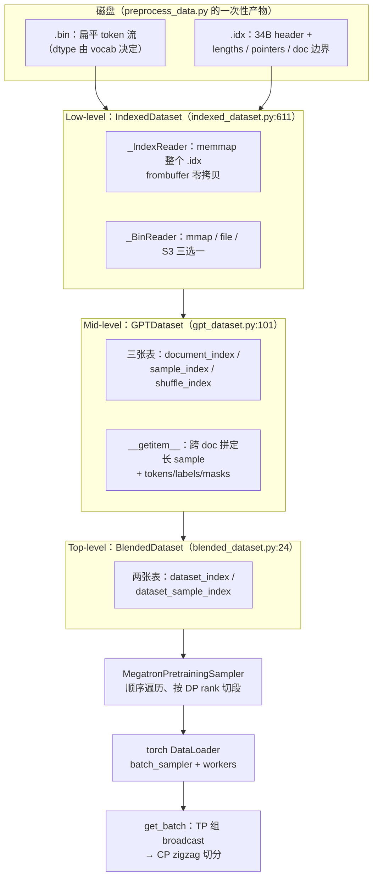

# 04 · 数据链路：从 .bin/.idx 到 get_batch

> [`01`](./01_training_loop.md) §3 讲过 batch 体系（`mbs` / `GBS` / `num_microbatches`），本篇把数据链路从磁盘讲到 GPU：`.bin`/`.idx` 二进制格式的布局、`GPTDataset` 如何把 document 流切成定长 sample（三张 index 表）、多数据集如何 blend、sampler 与 DataLoader 如何把样本分到各 DP rank 并支持 resume、`get_batch` 如何跨 TP/CP 把 batch 发到每张卡。全部内容对齐 Megatron-LM（commit `e03878b5f`）。
>
> 前置知识：了解 tokenization 是什么（文本转成 token id 序列，预处理产物落盘）；知道 `train_step` 里 `get_batch` 的位置（`forward_step` 每个 micro-batch 调用一次，见 [`01`](./01_training_loop.md) §4）；对 DP/TP/PP/CP 各切什么有直觉即可，深入内容见 [大规模训练的并行策略总览](../parallel/README.md)。

代码：[[megatron-lm:megatron/core/datasets/]]（`indexed_dataset.py` / `gpt_dataset.py` / `blended_dataset.py` / `blended_megatron_dataset_builder.py` / `helpers.cpp`）、[[megatron-lm:megatron/training/datasets/data_samplers.py]]、`pretrain_gpt.py`、[[megatron-lm:megatron/core/utils.py]]。

---

## 1. 三层抽象总览

[[megatron-lm:megatron/core/datasets/readme.md#L33-L74]] 官方把数据栈划成三层，本篇 §2/§3/§4 各讲一层：

| 层 | 类 | 职责 | 位置 |
|---|---|---|---|
| Low-level | `IndexedDataset` | `.bin`/`.idx` 的 mmap 读接口，「第 i 条 sequence 的 token 数组」 | [[megatron-lm:megatron/core/datasets/indexed_dataset.py#L611]] |
| Mid-level | `MegatronDataset`（抽象基类，[[megatron-lm:megatron/core/datasets/megatron_dataset.py#L23]]）→ `GPTDataset` | 把 document 流切成定长 sample：三张 index 表 + `__getitem__` 拼样本 | [[megatron-lm:megatron/core/datasets/gpt_dataset.py#L101]] |
| Top-level | `BlendedDataset` | 多数据集按权重混合（仅 blend 时存在） | [[megatron-lm:megatron/core/datasets/blended_dataset.py#L24]] |

构建入口是 `BlendedMegatronDatasetBuilder`（[[megatron-lm:megatron/core/datasets/blended_megatron_dataset_builder.py#L29]]），调用点在 [[megatron-lm:pretrain_gpt.py#L358-L360]]：



先记住两条贯穿全篇的性质：

- **一次性成本 vs 每步成本**：三张表、blend 表都是训练启动时构建一次的（分钟级，只有 global rank 0 真正算，其余 rank 读 cache，§3.4）；每步的成本只有 `__getitem__` 的几次 mmap 切片 + DataLoader worker 的 H2D 拷贝。
- **是否 sync**：build 过程含多次 `torch.distributed.barrier()`（[[megatron-lm:megatron/core/datasets/blended_megatron_dataset_builder.py#L398,L451,L542]]）——**所有 rank 都必须调用 builder，否则程序 hang**（[[megatron-lm:megatron/core/datasets/readme.md#L55]] 的原话）。注意「调用 build」不等于「真的建数据」：真正持有 dataset 对象的只有 TP rank 0 且 PP first/last stage（或 MTP rank）的 rank（`is_dataset_built_on_rank`，[[megatron-lm:pretrain_gpt.py#L254-L264]]），其余 rank 的 `build_generic_dataset` 返回 `None`，但 barrier 一个都不能少。

把链路上各环节的「拷贝 / sync / 成本类型」汇总一表，后文逐项展开：

| 环节 | 何时发生 | 是否拷贝 | 是否 sync | 成本类型 |
|---|---|---|---|---|
| `.idx`/`.bin` memmap | 启动 + worker 重建 | 零拷贝（`frombuffer` 视图） | 否 | 一次性，惰性调页 |
| 三张表 / blend 表构建 | 启动（仅 rank0） | — | **barrier** | 一次性，分钟级 |
| cache `.npy` 读取 | 启动（其余 rank） | mmap 视图 | barrier 后 | 一次性 |
| `__getitem__` 拼 sample | 每步 × worker | numpy 拼接（拷） | 否 | 每步，CPU |
| H2D（pin_memory + non_blocking） | 每 micro-batch，TP rank0 | 异步拷 | 否 | 每步 |
| TP 组 broadcast | 每 micro-batch | — | **同步 collective** | 每步 |
| CP zigzag `index_select` | 每 micro-batch（CP>1） | 拷贝（新 tensor） | 否 | 每步，GPU |

## 2. `.bin`/`.idx`：磁盘上的 token 存储

预处理脚本 [[megatron-lm:tools/preprocess_data.py]] 把语料 tokenize 成两个文件：`<prefix>.bin`（所有 document 的 token id 首尾相接的扁平数组）和 `<prefix>.idx`（索引）。`IndexedDataset` 只管「按序号取出一条 sequence」，不知道任何 batch/epoch 概念。

### 2.1 `.idx` 二进制布局

写入方是 `_IndexWriter`（[[megatron-lm:megatron/core/datasets/indexed_dataset.py#L122]]），布局如下（`S` = sequence 数，`D` = document 数）：

```
偏移      字段                          大小                写出位置
0         magic = "MMIDIDX\x00\x00"     9 B                 :147
9         version = 1（<Q，"vestigial"） 8 B                  :149
17        dtype code（<B）              1 B                  :151
18        sequence_count S（<Q）        8 B                  :194
26        document_count D（<Q）        8 B                  :198
─── header 共 34 B（reader 侧注释明确算出，:260-262）───
34        sequence_lengths              int32 × S            :201   每条 sequence 的 token 数
34+4S     sequence_pointers             int64 × S            :204   每条 sequence 在 .bin 里的**字节**偏移
34+12S    document_indices              int64 × D            :207   每个 document 的结束 sequence 下标
（可选）   sequence_modes                int8  × S            :211   多模态才有
```

- `sequence_pointers` 由长度 × dtype size 做前缀和得到（`:213-230`），所以「第 i 条 sequence」= `.bin` 里 `[pointer[i], pointer[i]+length[i]×dtype_size)` 的一段字节——**读取一条样本只需要一次切片，无需任何解析**。
- dtype code 枚举在 `DType`（`:50-60`）：uint8=1、int8=2、int16=3、int32=4、int64=5、float64=6、float32=7、uint16=8。GPT 按 vocab 选：vocab_size > 65536 时选 code 4（int32），否则 code 8（uint16）（[[megatron-lm:megatron/core/datasets/gpt_dataset.py#L89-L93]]）。全章示例的 V=128256，所以 `.bin` 里每个 token 占 4 字节。
- `document_indices` 是**结束下标**序列（如 `[3, 7, 8, …]` 表示 doc0 = sequence 0..2），所以 document 数 = `len(document_indices) - 1`（`:333`）。

### 2.2 读路径：memmap 与零拷贝

`_IndexReader.__init__`（`:246-334`）校验 magic/version 后，**把整个 `.idx` memmap**（`numpy.memmap(idx_path, mode="r")`，`:280-281`），四段主体用 `numpy.frombuffer` 切成 numpy 数组（`:285-327`）——**是视图不是拷贝**，物理页由 OS page cache 按需调入，同机所有 DataLoader worker 共享。`_IndexReader.__getitem__` 带 `@lru_cache(maxsize=8)`（`:350-351`），返回 `(pointer, length, mode)`。

`.bin` 有三种 reader，在 `IndexedDataset.initialize`（`:723-734`）按配置三选一（mmap 与 object storage 互斥，`:724` assert）：

| reader | 触发 | 读法 | 缓存 |
|---|---|---|---|
| `_MMapBinReader`（`:389-428`） | **默认**（`mmap=True`） | memmap 整个 `.bin`，`read` = `numpy.frombuffer(buffer, dtype, count, offset)`（`:419`），零拷贝 | OS page cache |
| `_FileBinReader`（`:431-497`） | `--no-mmap-bin-files` | 每次 `open + seek + readinto`，失败指数退避重试 3 次（10s/20s/40s，`:439-445`） | 无，大并发下明显慢 |
| `_S3BinReader` / `_MultiStorageClientBinReader`（`:500-608`） | `s3://` / MSC 路径 | 按 `bin_chunk_nbytes` 块维护单块内存 cache，miss 时发 HTTP Range 请求拉整块（`:559-579`） | 单块内存 cache |

### 2.3 `get(idx, offset, length)`：GPTDataset 依赖的子区间原语

普通 `index[idx]` 取整条 sequence（`:816-821`）；连续 slice 合并成一次 read 再 `numpy.split`（`:822-838`，非连续 slice 直接 raise）。关键是 `get(idx, offset=…, length=…)`（`:843-869`）：`pointer += offset × dtype_size`（`:865`）后只读 token 子区间——§3.5 跨 document 拼 sample 时，首段/末段都靠它截取。

### 2.4 pickle 与 DataLoader worker

`IndexedDataset.__getstate__` 只存路径与 flag 元组（`:736-750`），`__setstate__` 重新 `initialize`（`:752-775`）——**memmap 不跨进程传递**，DataLoader worker fork/spawn 后各自重建自己的 memmap（页缓存仍共享），不共享 fd 状态。

### 2.5 预处理侧补充

`IndexedDatasetBuilder`（`:937`：`add_item` 写一条 sequence、`:979-997` `add_document` 推进 document 边界、`:1029-1037` `finalize` 落盘）本身**不插 eod**；eod token 由 [[megatron-lm:tools/preprocess_data.py#L103-L104]] 在 `--append-eod`（`:216-217`）下追加到每个 document 末尾。于是 **document 边界有两份表达**：`.idx` 里的 `document_indices`（结构化）+ token 流里的 eod token（内嵌）——§3.5 会看到 `reset_position_ids` 等 flag 全靠扫 eod token，而不是查 `document_indices`。

## 3. GPTDataset：三张 index 表与定长采样

### 3.1 `num_samples` 不是一个 epoch 的样本数

训练集大小在 `get_train_valid_test_num_samples`（[[megatron-lm:megatron/training/training.py#L4119]]）确定：

```
train_samples = train_iters × global_batch_size        # training.py:4128（有 --train-samples 则直接用，:4125-4126）
eval_samples  = (train_iters//eval_interval + 1) × eval_iters × GBS   # :4129-4141，覆盖全程所有 eval 点
test_samples  = eval_iters × GBS                        # :4142（eval 两侧均可用独立的 eval_global_batch_size）
```

`num_samples` 是**整个训练要消耗的 sample 总数**，与语料大小无关；`GPTDataset` 再反推需要把语料重复几遍（`num_epochs`，`:617-637`：`while num_tokens < num_samples × seq_length + 1: num_epochs += 1`）。「epoch」只是构建 index 的内部单位，训练中途没有任何 epoch 边界事件。valid 集要按「全部 eval 点 × 每点消耗」预建，因为 valid iterator 是单次顺序流（§5.4）。

### 3.2 三张表的 shape 与语义

docstring 自带定义（[[megatron-lm:megatron/core/datasets/gpt_dataset.py#L384-L397]]），这里补全 dtype 与 shape：

| 表 | shape / dtype | 语义 |
|---|---|---|
| `document_index` | 1-D int32，长 `num_epochs × num_documents` | document id 的排列：把语料重复 `num_epochs` 遍后整体 shuffle（尾 epoch 可能单独 shuffle，§3.3） |
| `sample_index` | 2-D，`[num_samples+1, 2]`，int32/int64 | 第 i 行 = 第 i 条 sample 的起点 `(document_index 下标 j, doc 内 token offset)`；**第 i 条 sample 由第 i 行与第 i+1 行夹出** |
| `shuffle_index` | 1-D，uint32（≥ 2³²−2 即 `uint32.max − 1` 时 int64，`:691-693`），长 `num_samples` | sample 下标的随机置换；**训练乱序性全部在这里** |

注意 `sample_index` 的下标是「`document_index` 里的位置」而不是「document id」——取数据时要先 `document_index[j]` 查出真正的 doc id（`:334,339`）。三张表的关系是：`shuffle_index` 负责选 sample，`sample_index` 把 sample 定位到扁平 document 流中的区间，`document_index` 再把区间翻译成真实的 document。

### 3.3 构建流程

`_build_document_sample_shuffle_indices`（`:381-607`）的同构伪代码（变量名对齐源码）：

```python
# ===== 仅 global rank 0 执行（:442-445）；其余 rank barrier 后 mmap 读 cache =====
num_tokens_per_epoch = sum(sequence_lengths[indices])        # :609-615  本 split 的 token 总数
num_epochs = 1
while num_epochs * num_tokens_per_epoch < num_samples * S + 1:   # :626-637  反推重复遍数
    num_epochs += 1
# 尾 epoch 产出的 sample 数 < 0.80 × 每 epoch 平均产出 → separate_final_epoch=True（:476-480）
numpy_random_state = numpy.random.RandomState(config.random_seed)  # :496  seed 即 --seed（pretrain_gpt.py:281）

document_index = _build_document_index(indices, num_epochs, rng, separate_final_epoch)  # :640-671
    # mgrid 铺出 epoch×doc 网格 → reshape 成 1-D → shuffle；
    # separate 时前 E-1 个 epoch 与尾 epoch 分别 shuffle 再 concat（:669-671）

sample_index = helpers.build_sample_idx(sequence_lengths, document_index,   # :524-532 → helpers.cpp:144-249
                                        S, num_epochs, num_tokens_per_epoch,
                                        drop_last_partial_sequence, add_extra_token)
shuffle_index = _build_shuffle_index(num_samples_sans_final, total, rng)    # :674-703 两段各自 shuffle
numpy.save(...); 其余 rank: numpy.load(..., mmap_mode='r')                  # :544-551 / :579-599
```

C++ 的 `build_sample_idx`（[[megatron-lm:megatron/core/datasets/helpers.cpp#L144-L249]]）做的是「**扁平 token 流的定长切分**」：`num_samples = (num_epochs × tokens_per_epoch − add_extra_token) / seq_length`（drop 尾段时整除，`:172-178`）；主循环（`:192-230`）顺序扫 `document_index`，每条 sample 要吃满 `seq_length + add_extra_token` 个 token，**当前 document 不够就跨到下一个 document 继续拼**（`:213-224`）——epoch 边界天然被跨 document 拼接抹平，因为 `document_index` 本身就是多 epoch 重复拼接的。int32/int64 按 `sample_idx_max` 分派（[[megatron-lm:megatron/core/datasets/helpers.py#L44-L65]]）。构建前还有个 mmap 预热启发式：`len(document_index)×2 > len(sequence_lengths)`（访问密度高）时先 `.copy()` 把 mmap 数组拉进内存（`:513-523`）。

`separate_final_epoch` 的动机：尾 epoch 的数据在前 `E-1` 个 epoch 里已经出现过多遍，若与前段全局 shuffle 混合，训练末尾会集中看到「高重复度」样本；单独成段、分别 shuffle，让它只在末尾出现一次。train/test 恒丢弃末尾不足一条的 partial sequence；valid 由 `drop_last_partial_validation_sequence`（默认 True，`:42-43`）控制（`:506-509`）。

### 3.4 一次性成本与 cache

- **cache key**：`unique_description_hash = md5(json{class, dataset_path, num_samples, index_split, random_seed, sequence_length, split, split_matrix, tokenizer, …})`（[[megatron-lm:megatron/core/datasets/megatron_dataset.py#L57-L71]] + `_key_config_attributes:155-164`）。**改 seed / seq_length / split / tokenizer 任一即 cache miss、全量重建**。
- **cache 位置**：优先 `config.path_to_cache`（`--data-cache-path`，[[megatron-lm:pretrain_gpt.py#L289]]）；否则默认 `<dataset_prefix>/cache/<ClassName>_indices`（`:411-415`）——换机器/共享 FS 时 description 不匹配会**静默重建**。
- **命中判定**：`description.txt` + 三个 `.npy` 都在（`:424-438`）；`--dataloader-fast-cache-load`（[[megatron-lm:pretrain_gpt.py#L299]]）下跳过文件检查直接信任 cache（`:426`）。
- **编排**：只有 global rank 0 构建并存盘（`:442-455`），其余 rank 在 builder 的 barrier 之后 `numpy.load(mmap_mode='r')` 读 cache（`:579-599`；barrier 编排在 [[megatron-lm:megatron/core/datasets/blended_megatron_dataset_builder.py#L398,L451,L542]]）。命中后三张表也是 **mmap 视图**，不占常驻内存。
- `--dataloader-defer-npy-index-mmap`：构造时只记路径返回 `None`（`:402-409`），首次 `__getitem__` 才 mmap（`:309-319`），`__len__` 改用纯公式（`:202-222`，与 [[megatron-lm:megatron/core/datasets/helpers.cpp#L172-L178]] 同构）。

### 3.5 `__getitem__`：从 idx 到 tokens/labels/masks

这一节构造的五个字段（tokens/labels/attention_mask/loss_mask/position_ids）各自「管什么」——labels 为什么错一位、attention mask 与 loss mask 的正交职责——概念部分见 [`00`](./00_overview.md) §2；这里讲的是它们在 `GPTDataset` 里的具体构造。

[[megatron-lm:megatron/core/datasets/gpt_dataset.py#L225-L296]]，同构伪代码：

```python
def __getitem__(idx):                                        # gpt_dataset.py:225
    idx = shuffle_index[idx]                                 # :322  唯一的乱序来源
    (d_beg, off_beg), (d_end, off_end) = sample_index[idx], sample_index[idx+1]   # :325-326
    if d_beg == d_end:                                       # 单 document：一次子区间读
        parts = [dataset.get(doc_id[d_beg], off_beg, off_end - off_beg + extra)]  # :332-345
    else:                                                    # 跨 document：首段带 offset、
        parts = [dataset.get(doc_id[i], ...) for i in d_beg..d_end]               # :347-362 末段带 end_offset、中间整篇
    text = concat(parts); pad_to(S + extra)                  # :367-374 不足 S+1 用 pad 补齐
    tokens, labels = text[:-1], text[1:]                     # :241-243（extra=1 时）
    attention_mask = tril(ones(S, S))                        # :740-742  下三角，最后转 bool（:776-778）
    loss_mask     = ones(S);  loss_mask[text == eod] = 0     # :747-749（仅 --eod-mask-loss）
    position_ids  = arange(S)                                # :752
    for i in eod_positions:                                  # :757-774（仅开 reset 时逐 eod 扫）
        attention_mask[0, i+1:, :i+1] = 0                    #   :770  --reset-attention-mask
        position_ids[i+1:] -= i + 1 - prev                   #   :772-774  --reset-position-ids
    loss_mask[labels == pad] = 0; tokens[pad] = labels[pad] = 0   # :272-276
    return {tokens, labels, attention_mask, loss_mask, position_ids}
```

几个要点：

- **多取一个 token**：`add_extra_token_to_sequence` 默认 True（`:45-48`），每条 sample 实际抽 `S+1` 个 token，`tokens = text[:-1]`、`labels = text[1:]` 错一位后各自保持长度 S——这就是 `build_sample_idx` 里到处是 `±1` 修正的原因。关掉它 labels 退化为 `roll(text, -1)` 且末位补 pad（`:246-247`）。
- **mask 可缓存**：三个 reset flag 全 False 时 mask/position 与样本内容无关，每个 dataset 对象只算一次（`:131-137,261-265`）；取出时 `loss_mask.clone()`（`:268`）因为下一步要原地改 pad 位置。**是否拷贝**：这里 clone 是有意的防御拷贝。
- **pad 的三步处理**：`loss_mask[labels==pad]=0`（不计 loss）；然后 `tokens/labels` 中 pad 改写为 0（防 embedding 越界）；最后 `idx is None`（batch padding 占位）时 loss_mask 全 0（`:278-280`）。pad token id 与 eos/eod 冲突时回落到 `_PAD_TOKEN_ID = -1`（[[megatron-lm:megatron/core/datasets/megatron_dataset.py#L20,L74-114]]）。
- **eod 的双重身份**（呼应 §2.5）：不开 reset flag 时，跨 document 拼接的 sample 对模型就是一条无边界长流；`reset_position_ids`/`reset_attention_mask`/`eod_mask_loss` 全都靠在 sample 内**扫 eod token** 实现，与 `document_indices` 无关。
- `create_attention_mask=False`（`--no-create-attention-mask-in-dataloader`）时 attention_mask 为 None，交给 attention kernel 自己生成 causal mask（`:739-744`）。

## 4. 多数据集 blend

### 4.1 `--data-path` 三种格式与 split 矩阵

`--data-path`（[[megatron-lm:megatron/training/arguments.py#L2879-L2886]]）接受三种格式，解析在 `get_blend_from_list`（[[megatron-lm:megatron/core/datasets/utils.py#L49-L92]]，偶数长度先尝试两两 `(weight, prefix)` 配对，weight 转不成 float 就全体视为 prefix）：

1. 单 prefix：一个数据集；
2. `weight1 prefix1 weight2 prefix2 ...`：显式权重；
3. 纯 prefix 列表：权重从各数据集长度推断。

也可用 `--data-args-path`（从文件读）或 `--per-split-data-args-path`（train/valid/test 各一份 JSON）。`--split "99,1,0"` 经 `parse_and_normalize_split` 归一化（[[megatron-lm:megatron/core/datasets/blended_megatron_dataset_config.py#L155-L172]]），再由 `convert_split_vector_to_split_matrix` 转成**不重叠的 bookend 区间**（`:175-215`，docstring 自带例子）：

```
[0.99, 0.01, 0.0]  →  [(0, 0.99), (0.99, 1.0), None]
```

两个容易踩到的坑：

- **split 是连续切段，不是随机抽样**：每个 split 取 `numpy.arange(round(beg×N), round(end×N))`（[[megatron-lm:megatron/core/datasets/blended_megatron_dataset_builder.py#L470-L472]]），即语料**前 99% 训练、尾 1% 验证**。GPT 按 sequence 切（[[megatron-lm:megatron/core/datasets/gpt_dataset.py#L147-L160]] 注释：BERT 才按 document 切）。语料若按主题排序，valid 集分布会和 train 严重偏移。
- **只给 `--data-path` 不给 `--split`，会使用 legacy 默认值 `969,30,1`**（[[megatron-lm:megatron/training/arguments.py#L666-L670]]，只 warning 不报错）——不是直觉上的 99/1/0，valid 集占了 3%。

`blend` / `blend_per_split` / 都没有（此时 `mock=True` 且 split 强制 `"1,1,1"`，[[megatron-lm:megatron/core/datasets/blended_megatron_dataset_config.py#L138-L149]]）三种形态的分支在 `_build_blended_dataset_splits`（[[megatron-lm:megatron/core/datasets/blended_megatron_dataset_builder.py#L136]]）；多 prefix 用 `ThreadPoolExecutor` 并行构建（`:357`，`--num-dataset-builder-threads`）。

### 4.2 带权重时的超建（surplus）

带权重 blend 时，每个 mid-level 子数据集的构建量不是 `weight × size`，而是（`_get_size_per_split_per_dataset`，[[megatron-lm:megatron/core/datasets/blended_megatron_dataset_builder.py#L553-L581]]）：

```
size_per_dataset = ceil(ceil(target_size × weight) × (1 + surplus))    # surplus 默认 0.005（config :72）
```

这是 buffer：top-level 的贪心混合（§4.3）在有限长度内对目标配比有舍入误差，某个子数据集可能被抽得略多于 `weight × size`。0.5% 的富余通常够；真超了会在运行时 raise 并提示调大 `--mid-level-dataset-surplus`（[[megatron-lm:megatron/core/datasets/blended_dataset.py#L187-L198]]）。

### 4.3 `BlendedDataset`：两张表与贪心 max-error 混合

`BlendedDataset`（[[megatron-lm:megatron/core/datasets/blended_dataset.py#L24]]）把 N 个 `MegatronDataset` 合成一个逻辑数据集，核心是两表（docstring `:110-119`，分配 `:169-170`）：

| 表 | dtype | 语义 |
|---|---|---|
| `dataset_index` | int16（故数据集数 < 32767，`:49`） | 第 i 条 sample 问哪个子数据集 |
| `dataset_sample_index` | int64 | 该子数据集内的第几条 |

构建走 C++：`size` 给定时用 `build_blending_indices`（[[megatron-lm:megatron/core/datasets/helpers.cpp#L77-L142]]）——**贪心 max-error**：逐条 sample 计算每个数据集的 `weight×i − current_count` 误差，把这条分给误差最大的数据集（`:107-121`），使实际配比全程紧贴目标权重；`size=None` 时用 `build_exhaustive_blending_indices`（[[megatron-lm:megatron/core/datasets/helpers.cpp#L22-L75]]），恰好按整数权重各取那么多条。同样有 hash 化 cache（[[megatron-lm:megatron/core/datasets/blended_dataset.py#L72-L84,L130-149]]）与 rank0 构建/barrier 编排。

`__getitem__` 返回 `{"dataset_id": …, **子数据集的 sample dict}`（[[megatron-lm:megatron/core/datasets/blended_dataset.py#L106-L108]]）——`dataset_id` 会混进 batch dict，靠 §6.4 的固定 key 列表过滤掉。builder 收尾断言 `num_samples <= len(dataset)`（[[megatron-lm:megatron/core/datasets/blended_megatron_dataset_builder.py#L127-L132]]）。

## 5. sampler 与 DataLoader：分 rank 与 resume

### 5.1 `MegatronPretrainingSampler`：顺序遍历

`build_pretraining_data_loader`（[[megatron-lm:megatron/training/datasets/data_samplers.py#L19-L113]]）按 `--dataloader-type` 选 sampler：`single`（默认）对应 `MegatronPretrainingSampler`（`:59-64`）；`cyclic` 对应 `MegatronPretrainingRandomSampler`（`:66-74`）；`external` 原样透传（`:33-36`）。`MegatronPretrainingSampler`（`:115-182`）的同构伪代码：

```python
def __iter__(self):                                   # data_samplers.py:169-182
    batch = []
    for idx in range(consumed_samples, total_samples):  # **顺序**遍历，从 resume 偏移开始
        batch.append(idx)
        if len(batch) == micro_batch_size * data_parallel_size:   # 攒满一个「全局块」
            yield batch[dp_rank*mbs : (dp_rank+1)*mbs]  # 本 rank 取连续的 mbs 个（:157-167）
            batch = []
    # drop_last=True：末尾不足一块直接丢弃（:179-182）
```

**它不做任何 shuffle**——乱序性已经在 §3.3 一次性写进 `shuffle_index`（由 `--seed` 决定）。sampler 只负责两件事：从 `consumed_samples` 继续（resume），把每个 `mbs × dp_size` 的全局块按 DP rank 切成连续段。各 DP rank 拿到的是**不同的连续段**，合起来正好一个 global batch。

### 5.2 cyclic：`MegatronPretrainingRandomSampler`

`cyclic` 模式（`:314-393`）用于数据集小于「想跑的样本数」、需要多 epoch 循环的场景：

- `epoch = consumed_samples // active_total_samples`，余数定位 epoch 内进度（`:357-360`）；
- **shuffle 种子 = epoch 序号**：`torch.Generator().manual_seed(self.epoch)` 后 `randperm`（`:373-384`）——每个 epoch 一个确定性的新排列，与 `--seed` 无关（这是它能无限循环的原因：`single` 模式扫完就停，`cyclic` 每层 epoch 重新排列再扫）；
- `data_sharding`（默认开，`--no-data-sharding` 关）：先把数据集分成 `dp_size` 个 bucket，每个 rank 只在自己 bucket 内 shuffle（`:366-376`）；关掉则全量 `randperm` 后按 rank 跨步取（`:378-384`）。

iterator 层：`single` 包一层 `RerunDataIterator(iter(dataloader))`，`cyclic` 再套一层无限重绕的 `cyclic_iter`（[[megatron-lm:megatron/training/training.py#L4103-L4116,L4273-4275]]）。`RerunDataIterator` 给 iterator 加 micro-batch 级回放能力，用于 rerun/重算确定性校验。

两种 sampler 的分工对比：

| | `MegatronPretrainingSampler`（single，默认） | `MegatronPretrainingRandomSampler`（cyclic） |
|---|---|---|
| 遍历方式 | 顺序 `range(consumed, total)` | 每 epoch 一次 `randperm` |
| 乱序来源 | dataset 的 `shuffle_index`（`--seed`） | sampler 自身（种子 = epoch 序号） |
| 扫完即停？ | 是（`consumed == total` 时无法再建，§5.4 的断言坑） | 否，无限循环 |
| 适用 | 语料 ≥ 训练量的大语料 pretrain | 小数据集多 epoch |

### 5.3 DataLoader 实例化

`torch.utils.data.DataLoader`（[[megatron-lm:megatron/training/datasets/data_samplers.py#L105-L113]]）的几个参数值得注意：

- **`batch_sampler=` 而非 `sampler=`**：一次 yield 一个 micro-batch 的下标列表（即 §5.1 的连续段），无自定义 collate_fn，走 torch `default_collate` 把 sample dict 堆成 batch dict；
- `num_workers=args.num_workers`（默认 2，[[megatron-lm:megatron/training/arguments.py#L2943]]）、`pin_memory=True`（配合 §6.1 的 `non_blocking=True` H2D）、`persistent_workers=True`；
- `worker_init_fn` 里**防御性关闭 `/dev/nvidia*` fd** 并注册 exit signal handler（`:78-99`）——worker 继承自父进程的 CUDA fd 会挂住 GPU 显存，延迟退出时释放不掉。

### 5.4 resume：`consumed_train_samples` 链路

`consumed_train_samples` 是**全局样本数**语义（不是 per-rank）：训练中每步 `+= dp_size × mbs × num_microbatches`（[[megatron-lm:megatron/training/training.py#L3610-L3616]]），存进 checkpoint。resume 链路：

1. checkpoint 恢复 `args.iteration` / `args.consumed_train_samples`；**老 checkpoint 没有 consumed 字段时按 `iteration × global_batch_size` 回填**（[[megatron-lm:megatron/training/training.py#L4178-L4183]]，valid 同理 `:4184-4192`）——动态 batch size 下这个回填是错的，所以该兼容路径要求 `train_samples is None`；
2. train loader 以 consumed 构造 sampler（[[megatron-lm:megatron/training/training.py#L4224]]），sampler 从该偏移继续顺序扫；valid 用 `consumed_valid_samples`（`:4234`，每次 eval 后推进），test 恒 0（`:4237`）；
3. 构造断言 `consumed_samples < total_samples`（[[megatron-lm:megatron/training/datasets/data_samplers.py#L143-L145]]）——**跑完恰好相等时重建 loader 会直接 assert 失败**，这是长时间训练收尾阶段的经典问题。

valid 流是**全程一次性消耗**：valid 集按「全部 eval 点 × eval_iters × GBS」预建（§3.1），每次 eval 顺序往后走——所以默认配置下不同 eval 点看到的是**不同的** valid 样本，不是同一子集重测。要固定评测集用 `--full-validation`（独立 sampler，[[megatron-lm:megatron/training/datasets/data_samplers.py#L43-L47,L229]]）。

## 6. get_batch：跨 TP/CP 把 batch 发到每张卡

[[megatron-lm:pretrain_gpt.py#L76-L114]]。每个 micro-batch、每个 PP stage 都会调它（[`01`](./01_training_loop.md) §4 的 `forward_step` 内部）。

### 6.1 只有 TP rank 0 读取数据

```python
def get_batch(data_iterator):                              # pretrain_gpt.py:76
    if not is_first_or_last_pipeline_stage(...) and not mtp_on_this_rank and not is_sft:
        return [None for _ in BATCH_KEYS]                  # :91-92  中间 PP stage 不碰数据
    batch = {}
    if tp_rank == 0:                                       # :95-98  只有 TP rank 0 读 dataloader
        batch = next(data_iterator)
        for key in BATCH_KEYS:                             # 存在且非 None 的 key 上卡
            batch[key] = batch[key].cuda(non_blocking=True) if ... else None
    batch = get_batch_on_this_tp_rank(batch, ...)          # :100  TP 组内 broadcast
    batch = get_batch_on_this_cp_rank(batch, ...)          # :106  CP zigzag 切分
    return [batch[key] for key in BATCH_KEYS]              # :114  固定 key 列表（顺带过滤 dataset_id）
```

TP 组内所有 rank 需要**相同的** batch（SP 下输入沿 sequence 切，但切的是同一份数据），所以只让 TP rank 0 进 DataLoader，其余 rank 等 broadcast——同组 N-1 个 rank 不重复占 dataloader 带宽。`.cuda(non_blocking=True)` 配合 `pin_memory=True`（§5.3）是异步 H2D 拷贝。

### 6.2 TP 组内 broadcast：按 PP stage 精简载荷

`get_batch_on_this_tp_rank`（[[megatron-lm:megatron/core/utils.py#L1979]]）从 TP src rank 向组内 broadcast（**每 micro-batch 一次的同步 collective**）。载荷按 PP stage 裁剪（`:2069-2103`）：

| PP 位置 | 广播的 key | 置 None 的 key |
|---|---|---|
| PP=1 或 MTP rank | tokens / labels / loss_mask / position_ids（+mask） | — |
| first stage | tokens / position_ids（+attention_mask） | labels / loss_mask（`:2085-2086`） |
| last stage | labels / loss_mask | tokens / position_ids（`:2099-2100`） |

依据：first stage 的 embedding 只需要 tokens/position_ids；last stage 的 loss 只需要 labels/loss_mask（输入 activation 来自上一 stage 的 P2P）。SFT/hybrid-CP 的 `cu_seqlens` 是变长的，用「先广播 numel 再广播本体」的两步协议（`:2048-2061`）。

### 6.3 CP zigzag 切分

CP>1 时 `get_batch_on_this_cp_rank`（[[megatron-lm:megatron/core/utils.py#L2369-L2417]]）按 batch 内容分派：有 `cu_seqlens` 且非 hybrid 时（SFT）走 TE `thd_get_partitioned_indices`，按 token 下标 `index_select`（`:2256-2305`）；pretrain 走 `get_pretrain_batch_on_this_cp_rank`（`:2308-2366`）的 **zigzag 切分**：

```python
# utils.py:2348-2364（同构）：对 batch 里每个序列维张量
seq_dim = 2 if key == 'attention_mask' else 1       # :2352  mask 的序列维是 dim 2，特例！
val = val.view(..., 2 * cp_size, S // (2 * cp_size), ...)   # :2353-2358  序列维切成 2·cp 块
index = [cp_rank, 2 * cp_size - cp_rank - 1]                # :2359-2361  取首尾配对的两块
val = val.index_select(seq_dim, index).view(..., -1, ...)   # :2362-2363  拼回 [b, S/cp]
```

即 CP=2 时 4 块按 `(0,3)→rank0、(1,2)→rank1` 分配。**负载均衡直觉**：causal attention 下第 i 块的计算量随位置线性增长（后面的 token 要 attend 更长的前缀），只取连续一段会让尾部 rank 算得多得多；首尾配对后每个 rank 拿到「一轻一重」两块，总量拉平（docstring `:2311-2321` 自带这个例子）。ring attention 的通信机制本身见 [01 · Ring Attention](../parallel/04_cp/01_ring_attention.md)。**是否拷贝**：`index_select` 产出新 tensor（GPU 上的一次 Gather 拷贝），CP=1 时整段跳过、原样返回。自定义 key 进 batch 时容易漏切——只有非 `METADATA_KEYS` 且非 None 的张量会被切（`:2340-2351`）。

### 6.4 `BATCH_KEYS` 过滤

返回值按固定 `BATCH_KEYS`（[[megatron-lm:pretrain_gpt.py#L79]]：tokens/labels/loss_mask/position_ids/attention_mask/cu_seqlens 等 10 个）顺序排列成列表——顺带过滤掉 `BlendedDataset` 注入的 `dataset_id` 等多余 key（注释 `:108-113`），下游 `forward_step` 按位置解包。

## 7. FIM、SFT 与 mid-training 换配比

pretrain 与 SFT 在 mask 组织上的概念对比（为什么 SFT 只学 response、packing 后两张 mask 各自长什么样）见 [`00`](./00_overview.md) §2.3-2.4；本节讲数据侧实现。

- **FIM**（fill-in-the-middle）：`GPTFIMDataset(GPTDataset)`（[[megatron-lm:megatron/training/datasets/fim_dataset.py#L38]]），只重写 `_query_document_sample_shuffle_indices`（`:104`），在取到 sample 后做 PSM/SPM 重排；用独立的 `np.random.RandomState(config.random_seed)`（`:67`）。三张表与定长采样完全复用 GPTDataset。
- **SFT**：`SFTDataset(MegatronDataset)`（[[megatron-lm:megatron/training/datasets/sft_dataset.py#L51]]）：低层是 jsonl；`__getitem__` 把多轮对话 pack 成 THD 格式，`tokens = pack[:-1]` / `labels = pack[1:]`，prompt 段 labels 置 `IGNORE_INDEX = -100` 屏蔽 loss（`:14,171`），额外输出 `cu_seqlens`（int32，`:178`）/`max_seqlen`——这正是 §6.2 变长广播协议与 §6.3 THD 切分的来源。`__len__` 直接返回 `num_samples`，下标取模复用（`:73-74,96`）。
- **mid-training 换配比**不是 dataloader 的能力：`--phase-transition-iterations`（[[megatron-lm:megatron/training/arguments.py#L2887-L2889]]）到达相位点时**存 checkpoint 并退出进程**（[[megatron-lm:megatron/training/training.py#L3042-L3058]]），由外层 launcher 用新的 data blend 重启；每个相位的 num_samples/consumed 单独核算（[[megatron-lm:megatron/training/training.py#L4144-L4152,L4194-4199]]）。另外注意 [[megatron-lm:megatron/core/datasets/data_schedule.py]] 名字有迷惑性——它是 hybrid CP 的负载均衡 wrapper，与换配比无关。

## 8. 数字演算（7B 配置）

沿用全章配置（[`README`](./README.md) §3）：`GBS=1024, s=4096, mbs=2, DP=64, num_microbatches=8`，假设 `train_iters=20000`，语料 300B tokens，平均 document 2048 tokens（即 `D ≈ 146.5M` documents），V=128256（因此 token 按 int32 存，§2.1）。

**① num_samples 与 epoch 反推**（§3.1/§3.3）：

```
num_samples  = 20000 × 1024 = 20.48M samples
消耗 tokens  = 20.48M × 4096 ≈ 83.9B tokens
num_epochs   = ceil((83.9e9 + 1) / 300e9) = 1        → 整个训练只过语料的 ~28%，一个 epoch 都不到
反向：想过 1 个 epoch 需要 300e9 / (1024×4096) ≈ 71500 iters
```

**② 三张表的内存**（§3.2；`sample_index` 因 `sample_idx_max = 146.5M < int32.max` 走 int32 分派）：

| 表 | 估算 | 大小 |
|---|---|---|
| `document_index` | int32 × (1 × 146.5M) | ≈ 586 MB |
| `sample_index` | int32 × (20.48M+1) × 2 | ≈ 164 MB |
| `shuffle_index` | uint32 × 20.48M | ≈ 82 MB |
| 合计 | — | **≈ 830 MB** |

这是 rank0 构建时的内存峰值（一次性成本，分钟级：C++ 顺序扫 146.5M 个 document 条目）；cache 命中后所有 rank 以 mmap 读 `.npy`，物理页按需调入。磁盘侧：`.bin` = 300e9 × 4B ≈ 1.2 TB，`.idx` ≈ 146.5M × (4+8+8) B ≈ 2.9 GB（doc≈sequence 估算）。

**③ 每步每 rank 取多少**：

```
每 rank 每 micro-batch：mbs × s = 2 × 4096 = 8192 tokens
每 rank 每 step：       2 × 8 个 micro-batch = 16 samples = 64K tokens
全局每 step：           GBS × s = 1024 × 4096 ≈ 4.19M tokens   → 20000 步 ≈ 83.9B，对上 ①
```

每次 `__getitem__` 的 I/O 只是几次 mmap 切片（命中 page cache 则零系统调用）；每 micro-batch 的网络开销是 TP 组内一轮 broadcast（tokens/labels 各 `[2, 4096]` int64 = 64 KB 量级）——数据链路稳态成本极低，贵的是启动时的 index 构建。

## 9. 易错点清单

1. **`num_samples` 不是一个 epoch**：train 集大小 = `train_iters × GBS`（[[megatron-lm:megatron/training/training.py#L4128]]），`num_epochs` 反推出来通常 ≫ 1，`document_index` 把整个语料重复 E 遍再切（[[megatron-lm:megatron/core/datasets/gpt_dataset.py#L626-L637]]）。
2. **sampler 不 shuffle**：`MegatronPretrainingSampler` 纯顺序遍历（[[megatron-lm:megatron/training/datasets/data_samplers.py#L169-L182]]）；乱序性一次性写入 `shuffle_index`（seed = `--seed`，[[megatron-lm:megatron/core/datasets/gpt_dataset.py#L496]]）。cyclic 模式的 shuffle 种子是 **epoch 序号**而非 `--seed`（[[megatron-lm:megatron/training/datasets/data_samplers.py#L373-L384]]）。
3. **`consumed_samples` 是全局语义**：每步 `+= dp_size × mbs × num_microbatches`（[[megatron-lm:megatron/training/training.py#L3610-L3616]]）；断言 `consumed < total`（[[megatron-lm:megatron/training/datasets/data_samplers.py#L143-L145]]）意味着**跑完恰好相等时重建 loader 会直接失败**；老 checkpoint 按 `iteration × GBS` 回填在动态 batch size 下是错的（[[megatron-lm:megatron/training/training.py#L4178-L4183]]）。
4. **valid 是一次性顺序流**：不同 eval 点看到不同 valid 样本（§5.4）；要固定评测集用 `--full-validation`。
5. **每条 sample 多取一个 token**（`add_extra_token_to_sequence` 默认 True）：实际抽 S+1 个，`tokens=text[:-1]`/`labels=text[1:]`；这解释了 `build_sample_idx` 里所有 `±1` 修正。
6. **eod 的双重身份**：document 边界既在 `document_indices` 里也内嵌为 eod token（[[megatron-lm:tools/preprocess_data.py#L103-L104]]）；三个 reset flag 全靠扫 eod token（[[megatron-lm:megatron/core/datasets/gpt_dataset.py#L757-L774]]）。不开这些 flag，跨 document 拼接的 sample 对模型就是无边界长流。
7. **cache 脆弱性**：key 是 seed/seq_length/split/tokenizer 等的 md5（[[megatron-lm:megatron/core/datasets/megatron_dataset.py#L57-L71]]），改任一全量重建；默认 cache 藏在 `<prefix>/cache/` 下（[[megatron-lm:megatron/core/datasets/gpt_dataset.py#L411-L415]]），换机器/共享 FS 时 description 不匹配会**静默重建**（分钟级卡顿）。建议生产上用 `--data-cache-path` 集中管理，cache 已建好时用 `--dataloader-fast-cache-load`。
8. **blend 的 surplus 陷阱**：子数据集按 `weight × size × 1.005` 超建（[[megatron-lm:megatron/core/datasets/blended_megatron_dataset_builder.py#L553-L581]]），top-level 抽超了运行时 raise，提示调大 `--mid-level-dataset-surplus`（[[megatron-lm:megatron/core/datasets/blended_dataset.py#L187-L198]]）。
9. **split 是连续切段**：train = 语料前 99%（[[megatron-lm:megatron/core/datasets/blended_megatron_dataset_builder.py#L470-L472]]）；不给 `--split` 会使用 legacy 默认 `969,30,1`（[[megatron-lm:megatron/training/arguments.py#L666-L670]]）。
10. **build 的分布式纪律**：数据只在 TP rank 0 且 first/last PP stage 真正构建（[[megatron-lm:pretrain_gpt.py#L254-L264]]），但**所有 rank 都必须调 builder**（barrier 编排，[[megatron-lm:megatron/core/datasets/readme.md#L55]]）——少一个 rank 调用就 hang。
11. **CP zigzag 的两个前提**：收益依赖「causal 计算量随位置线性增长」；`attention_mask` 的序列维是 dim 2 的特例（[[megatron-lm:megatron/core/utils.py#L2352]]），自定义 key 进 batch 时容易漏切。
12. **mmap 与 worker**：`IndexedDataset` pickle 只存路径，每个 DataLoader worker 自行重建 memmap（[[megatron-lm:megatron/core/datasets/indexed_dataset.py#L736-L775]]）；`--no-mmap-bin-files` 退化为 open/seek/read + 重试（`:431-497`），大并发下明显变慢；`worker_init_fn` 关闭 `/dev/nvidia*` fd 防 worker 挂住 GPU 显存（[[megatron-lm:megatron/training/datasets/data_samplers.py#L78-L99]]）。

---

下一篇：[05 · grad/param buffer：连续 buffer 的数据结构与读写回路](./05_grad_param_buffer.md) —— Megatron 的 grad/weight 连续 buffer：分组、倒序排布、bucket、`main_grad`、param buffer 的 RS/AG 回路。
