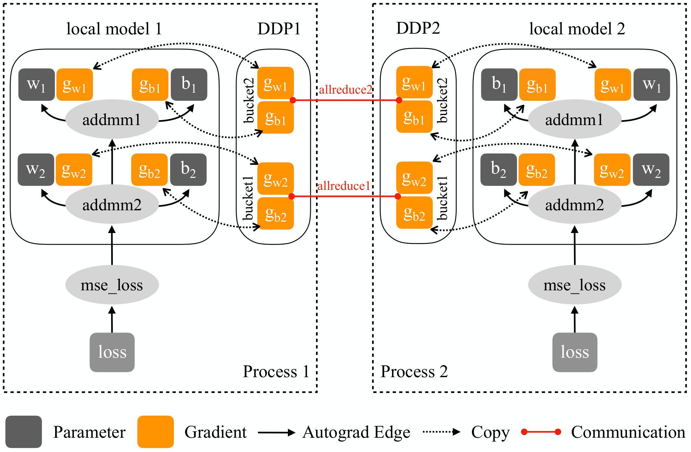

# 05 · grad/param buffer：连续 buffer 的数据结构与读写回路

前面 [01 · Megatron DDP：连续 buffer 与通信 overlap](../parallel/01_dp/01_ddp_and_overlap.md) 已经从时序角度讲过这套机制：bucket 填满就发出异步规约，并藏进 backward 的计算里。本篇换一个角度，讲它的数据结构与布局——`_ParamAndGradBuffer` 如何分组、参数在 buffer 里按什么顺序排列、padding 怎么计算、`main_grad` 与 `param.data` 如何挂成视图、一个 iteration 里这块 buffer 被谁读谁写，以及它的显存开销。时序图与 overlap 推导本篇不重复，只做交叉引用。

阅读本篇需要的前置知识：

- [`01`](./01_training_loop.md) §6 的梯度路径：`main_grad` 累加、bucket 规约、`finalize_model_grads` 收尾；
- [01 · Megatron DDP：连续 buffer 与通信 overlap](../parallel/01_dp/01_ddp_and_overlap.md) 中 bucket 与 overlap 的时序；
- autograd hook 与 `AccumulateGrad` 节点的语义（[03 · autograd：引擎、自定义 Function、hooks、checkpoint](../torch/03_autograd.md)）；
- ZeRO-1 把 optimizer state 切到 `1/DP` 的事实（[02 · ZeRO 显存账本与 Megatron DistributedOptimizer](../parallel/01_dp/02_zero_and_distributed_optimizer.md)）。

代码：[[megatron-lm:megatron/core/distributed/param_and_grad_buffer.py]] / `distributed_data_parallel.py` / `finalize_model_grads.py` / `distributed_data_parallel_config.py`，[[megatron-lm:megatron/core/optimizer/param_layout.py]] / `distrib_optimizer.py`（commit `e03878b5f`）。

---

## 1. 连续 buffer 的动机

朴素 DDP 让每个参数的梯度保存在 `param.grad` 上，算完一个参数的梯度就规约一个。这种做法有两个问题：

1. **通信粒度太碎**。几千个参数意味着几千个小 all-reduce kernel，每个都要付出 NCCL 的启动开销，而且小消息跑不满带宽，处于 latency-bound 状态。
2. **显存碎片化且无法复用**。`.grad` 是 autograd 按需分配的独立张量，生命周期跟着 autograd 图走，既不能跨 micro-batch 原地累加（grad accumulation 需要一块稳定的累加目标），也没法预先切成通信友好的大块。

Megatron 的做法是把「存储」和「通信单位」都从 autograd 手中收回，由框架自己管理（`_ParamAndGradBuffer`，[[megatron-lm:megatron/core/distributed/fsdp/src/megatron_fsdp/param_and_grad_buffer.py#L940]]）：

- 把同 dtype 分组的所有梯度预分配成一块连续的一维 buffer（`grad_data`），每个参数的累加目标 `param.main_grad` 是这块 buffer 上的一个 view，而不是独立分配；
- distributed optimizer 下再配一块同样布局的 `param_data`，把 `param.data` 也 remap 成它的视图，作为参数 all-gather 的接收 buffer；
- buffer 切成若干 bucket 作为通信单位，backward 过程中桶满就发出异步规约（时序见 [01 · Megatron DDP：连续 buffer 与通信 overlap](../parallel/01_dp/01_ddp_and_overlap.md) §2-3，本篇不重复）。



> 图：PyTorch 官方 DDP 的模块构成——参数分到若干 bucket，梯度就绪后由 autograd hook 通知 `Reducer`，bucket 填满触发一次规约。Megatron 的 `_ParamAndGradBuffer` 是同一思想在「连续 buffer + fp32 `main_grad` + RS/AG 双回路」方向上的加强版本；overlap 时序的官方图已在 [01 · Megatron DDP：连续 buffer 与通信 overlap](../parallel/01_dp/01_ddp_and_overlap.md) §2 引用。（Li et al. 2020, Fig 4；[arXiv:2006.15704](https://arxiv.org/abs/2006.15704)）

由此带来三个初看反直觉、实则正确的性质，后面各节逐一展开：第一，`param.grad` 退化为 autograd 的临时中转，hook 里 `add_` 进 `main_grad` 之后立即置 None；第二，buffer 跨 iteration 常驻，每个 iteration 开头只做 `zero_()` 而不释放；第三，ZeRO-1（dist-opt）并不节省这块 buffer 的显存，它省的是 optimizer state（§8 给出具体数字）。

## 2. Buffer、Bucket 与 BucketGroup

整套机制由三个类加上 DDP 侧的四张列表组成：

| 层 | 类 / 字段 | 职责 | 代码 |
|---|---|---|---|
| Buffer | `_ParamAndGradBuffer` | 一个 `BufferKey` 分组一条连续 1-D 存储：`grad_data`（必有）+ `param_data`（仅 dist-opt）；负责分配、参数挂载（`main_grad`/`param.data` 视图）、`zero_()`/offload | [[megatron-lm:megatron/core/distributed/fsdp/src/megatron_fsdp/param_and_grad_buffer.py#L940]]，分配 `:1063-1127`，挂载 `:1168-1266` |
| Bucket | `_ParamAndGradBucket` | buffer 内一段连续区间（`grad_data`/`param_data` 各一个切片视图），**通信的基本单位**；记录 `params`、`offset`、`numel_unpadded`、`gradient_scaling_factor`、bucket 内偏移 `param_to_index` | [[megatron-lm:megatron/core/distributed/fsdp/src/megatron_fsdp/param_and_grad_buffer.py#L72-L139]]（字段 `:104-121`，切片视图 `:1435-1453`） |
| BucketGroup | `_ParamAndGradBucketGroup` | 把若干 bucket 捆在一起聚合通信（`_coalescing_manager`）；持有 grad-ready 计数（golden counts）、async 通信 handle、`next_param_gather_bucket_group` / `previous_grad_reduce_bucket_group` 两条链 | [[megatron-lm:megatron/core/distributed/fsdp/src/megatron_fsdp/param_and_grad_buffer.py#L159-L266]] |
| DDP 侧 | `self.buffers` / `self.expert_parallel_buffers` / `self.bucket_groups` / `self.expert_parallel_bucket_groups` | 每个 model chunk（PP/VPP stage）一个 DDP 实例，实例内按 expert / 非 expert 分成两列 buffer，再各自 `partition_buckets` 成 bucket group | [[megatron-lm:megatron/core/distributed/distributed_data_parallel.py#L207-L281]] |

几个容易混淆的从属关系：

- **bucket group 通常只含一个 bucket**。`partition_buckets` 的默认分支（无 fp8 参数时）就是每桶一组（[[megatron-lm:megatron/core/distributed/fsdp/src/megatron_fsdp/param_and_grad_buffer.py#L1583-L1597]]）；「一个 group 合并多个 bucket 通信」只服务两种场景：fp8 混合精度时把小的非 fp8 bucket 并进最后一个 fp8 bucket group（`:1598-1647`，原因见 §4.1），以及 `disable_bucketing` 时的 `force_single_bucket_group`（`:1566-1581`）。所以 [01 · Megatron DDP：连续 buffer 与通信 overlap](../parallel/01_dp/01_ddp_and_overlap.md) §3 所说的 `_coalescing_manager` 聚合，在日常配置下多数时候聚合的只是一个 bucket。
- `params_with_grad` 挂在 DDP 上（[[megatron-lm:megatron/core/distributed/distributed_data_parallel.py#L112,L120]]），不在 bucket 上——它服务于 `zero_grad_buffer` 里 `grad_added_to_main_grad` 标志的重置（§6.6）。
- VPP（interleaved）时每个 virtual stage 一个 model chunk，因此每个 rank 持有多套独立的 buffer；非首 chunk、非首 PP stage 的 buffer 会退化为单桶（§4.3）。

用全章统一的 7B 配置（P=7.5e9，TP=2，PP=2，DP=64，bf16 + `grad_reduce_in_fp32`，dense 无 expert）把上面的结构实例化一遍：每个 rank 持有 1 个 model chunk（PP=2 无 VPP），全部参数同为 bf16，因此只有一个 `BufferKey`（`param_dtype=bf16, grad_dtype=fp32, is_expert_parallel=False`），对应一条 buffer；buffer 内 `1.875e9 / 64e6 ≈ 29` 个 bucket（§8 给出演算），默认每桶一组，即约 29 个 bucket group（其中 tying 的 shared embedding 被强制独占一桶，见 §4.2）。MoE 模型则至少有两条 buffer（expert 与非 expert），各自成列、各自切桶。

## 3. BufferKey 分组

DDP 构造时先收集所有 `requires_grad` 参数并初始化 `param.grad_added_to_main_grad = False`（[[megatron-lm:megatron/core/distributed/distributed_data_parallel.py#L110-L124]]），再用 `group_params_for_buffers`（[[megatron-lm:megatron/core/distributed/fsdp/src/megatron_fsdp/param_and_grad_buffer.py#L825-L886]]）按 `BufferKey` 分组：每个不同的 key 对应一条物理上独立的 buffer。

```python
BufferKey(param_dtype, grad_dtype, is_expert_parallel, is_managed_by_layer_wise_optimizer)
# param_layout.py:45-66（frozen dataclass）
```

四个维度的取值规则（[[megatron-lm:megatron/core/distributed/fsdp/src/megatron_fsdp/param_and_grad_buffer.py#L856-L863]]）：

| 维度 | 规则 | 出处 |
|---|---|---|
| `param_dtype` | FP8/NVFP4 参数记 `torch.uint8`（存储 dtype），否则 `param.dtype` | `:856-858` |
| `grad_dtype` | `torch.float if grad_reduce_in_fp32 else param.dtype` —— 这就是 `main_grad` 的 dtype 来源 | `:859` |
| `is_expert_parallel` | `not getattr(param, 'allreduce', True)` | `:860` |
| `is_managed_by_layer_wise_optimizer` | layer-wise optimizer 管理的参数单独成 buffer（shard 对齐布局） | `:861-863` |

两点值得记住：

- **expert 与非 expert 是物理上分开的 buffer，走不同的 DP 组**：非 expert 用 `intra_dp_cp_group`（注意这是 DP×CP 联合组），expert 用 `intra_expt_dp_group`（[[megatron-lm:megatron/core/distributed/distributed_data_parallel.py#L210-L216]]）。MoE 的 EP 把 expert 切到 EP 组内，剩下的「数据并行副本」维度是 EDP，与普通参数的 DP 域不同，所以必须分开规约。
- scaling factor 也跟着分组走（[[megatron-lm:megatron/core/distributed/distributed_data_parallel.py#L169-L204]]）：`average_in_collective=False`（默认）时两组都预乘 `1/dp_cp_size` 再求和；`average_in_collective=True` 时非 expert 不预乘、collective 使用 `ReduceOp.AVG`，expert 则预乘 `edp_size/dp_cp_size` 再在 EDP 组里做 AVG——两种路径最终都收敛到 `1/dp` 的语义（`:177-196` 的注释把这层换算写得很清楚）。`calculate_per_token_loss=True` 时两组 scaling 都是 1.0 且禁止使用 AVG（`:170-175`），归一化推迟到 `finalize_model_grads`（§7）。

把 DDP 构造的完整顺序串起来（同构伪代码，精简自 [[megatron-lm:megatron/core/distributed/distributed_data_parallel.py#L110-L281]]）：

```python
params = [p for _, p in module.named_parameters() if p.requires_grad]   # :110-124
buffer_groups = group_params_for_buffers(params, ddp_config.grad_reduce_in_fp32)  # :127
# dist-opt 而调用方没给 layout → auto-compute（推荐由 DistributedOptimizer
# .compute_full_param_layout 预算后传入，DDP 会校验两者一致，:129-166）
for key, (params, param_indices) in buffer_groups.items():              # :210
    dp_group = intra_expt_dp_group if key.is_expert_parallel else intra_dp_cp_group  # :210-216
    buffer = _ParamAndGradBuffer(ddp_config, key.param_dtype, key.grad_dtype,
                                 params, dp_group, bucket_size, scaling_factor, ...)
    (expert_parallel_buffers if key.is_expert_parallel else buffers).append(buffer)  # :254-257
bucket_groups = partition_buckets(buffers, ...)                         # :268-281
# 再挂两条链：next_param_gather（:295-306，§4.1）/ previous_grad_reduce（:308-323，§9.1）
# 最后注册 backward hook（:345-373，§6.1）与 forward pre-hook（:384-394，§6.5）
```

layout 的「预算—校验」分工值得注意：dist-opt 下 layout 由 optimizer 侧（`DistributedOptimizer._compute_per_buffer_param_layout`，§4.2）决定，因为 padding 规则服务于 shard 等分；DDP 只是消费 layout，但如果外部已经传入 `full_param_layout`，DDP 会逐 key 校验分组与 layout 一致（[[megatron-lm:megatron/core/distributed/distributed_data_parallel.py#L151-L166]]）。这保证了「buffer 里的偏移」与「optimizer 眼里的 shard」是同一张图。

## 4. 布局：倒序、对齐与切桶

### 4.1 倒序排布

这是整套 buffer 最核心的设计：**参数一律按模型定义序的倒序（也就是 backprop 产生梯度的顺序）排进 buffer**。

- 非 dist-opt 的默认 layout：`_compute_default_per_buffer_param_layout` 里 `for param in params[::-1]`，docstring 明确写着 "Parameters are iterated in reverse order (backprop order)"（[[megatron-lm:megatron/core/distributed/fsdp/src/megatron_fsdp/param_and_grad_buffer.py#L889-L937]]，倒序循环在 `:915`）。
- dist-opt layout（`DistributedOptimizer._compute_per_buffer_param_layout`）同样是 `for param in params[::-1]`，docstring 写着 "Iterates params in reverse order (backprop order)"（[[megatron-lm:megatron/core/optimizer/distrib_optimizer.py#L483-L564]]，docstring 在 `:492-493`，循环在 `:529`）。
- 挂载视图、建 bucket 时也按倒序遍历（[[megatron-lm:megatron/core/distributed/fsdp/src/megatron_fsdp/param_and_grad_buffer.py#L1168]]）。
- `partition_buckets` 的 docstring 直接说明了动机："The fp8 buckets start from the end of the model, i.e., the first bucket corresponds to the end of the model, while the last bucket corresponds to the beginning"（`:1538-1539`）。所以 fp8 场景下小的非 fp8 bucket（bias 等，位于模型前部、梯度最晚就绪）要并进最后一个 fp8 bucket group；如果并进第一个，就会拖住最早发出的那次通信（`:1540-1544`）。

动机可以用一句话概括：backward 从模型尾部往前算，倒序排布让 bucket 0 装的正好是尾部参数，它最先被填满、它的 reduce-scatter 也最早发出，从而与更靠前层的 backward 计算重叠（overlap 时序本身见 [01 · Megatron DDP：连续 buffer 与通信 overlap](../parallel/01_dp/01_ddp_and_overlap.md) §2 的图）。

```
模型定义序:    embedding → L0 → L1 → … → L(n-2) → L(n-1) → lm_head
               （模型头部）                        （模型尾部）
buffer 偏移:   0 ────────────────────────────────────────→ numel
              ┌─────────┬─────────┬─────┬─────────┬─────────┐
grad_data:    │ lm_head │ L(n-1)  │ ……  │   L0    │embedding│   ← params[::-1]
              └─────────┴─────────┴─────┴─────────┴─────────┘
              └──bucket 0─┘└──bucket 1─┘ … └────bucket N-1───┘
backward 填充:  ▶▶ bucket 0 先满 → 先发 RS ▶▶ … ▶▶ bucket N-1 最后
param AG 消费:  ◀◀ bucket N-1（头部）先用 ◀◀ … ◀◀ bucket 0 最后
```

对偶地，param all-gather 按正序消费（forward 先用头部参数）：DDP 构造时把 `next_param_gather_bucket_group` 链反着挂——"all-gathers happen in reverse order of buckets"（[[megatron-lm:megatron/core/distributed/distributed_data_parallel.py#L295-L306]]），于是 `finish_param_sync` 每等到一桶，就链式 dispatch「更靠近头部」的下一桶（§6.5）。

> 与 [大规模训练的并行策略总览](../parallel/README.md) 主线 2 的呼应：fp8 混合精度时每个 model chunk 有 fp8 与非 fp8 两条 buffer，桶数翻倍意味着 back-to-back 的通信 kernel 翻倍；在 `CUDA_DEVICE_MAX_CONNECTIONS=1`（通信-计算 overlap 的前提设置）下，多个排队的通信 kernel 会互相阻塞，无法再藏进计算。这正是 `partition_buckets` 把非 fp8 bucket 合并进最后一个 fp8 bucket group 的另一层动机（[[megatron-lm:megatron/core/distributed/fsdp/src/megatron_fsdp/param_and_grad_buffer.py#L1523-L1527]]，DDP 侧同注释 [[megatron-lm:megatron/core/distributed/distributed_data_parallel.py#L259-L265]]）。数据结构（怎么并桶）反过来被 stream 编排约束决定，这是读这套代码时容易漏掉的一层耦合。

### 4.2 对齐与 padding

非 dist-opt 完全不使用 padding，`numel == numel_unpadded`（assert 在 [[megatron-lm:megatron/core/distributed/fsdp/src/megatron_fsdp/param_and_grad_buffer.py#L1060-L1061]]），layout 即 §4.1 的默认实现。

dist-opt（[[megatron-lm:megatron/core/optimizer/distrib_optimizer.py#L483-L564]]）有两级 padding，全部逻辑收敛在 [[megatron-lm:megatron/core/optimizer/param_layout.py]]：

| 规则 | 实现 | 目的 |
|---|---|---|
| param 起点对齐 **64 个 element**（`pad_param_start` → `pad_to_divisor(x, 64)`） | [[megatron-lm:megatron/core/optimizer/param_layout.py#L24-L26]]，调用点 [[megatron-lm:megatron/core/optimizer/distrib_optimizer.py#L530]] | 让每个 param 的 shard 边界整齐 |
| bucket 尾 pad 到 `lcm(dp_size, 128)`；开 `pad_buckets_for_high_nccl_busbw` 则 `lcm(dp_size, 128, 2**16)` | [[megatron-lm:megatron/core/optimizer/param_layout.py#L29-L42]]，调用点 [[megatron-lm:megatron/core/optimizer/distrib_optimizer.py#L519-L527]] | ① bucket 可被 DP 整除 → RS/AG 的 shard 等长（[[megatron-lm:megatron/core/distributed/fsdp/src/megatron_fsdp/param_and_grad_buffer.py#L1056-L1057]] 的 `numel % dp == 0` 由它保证）；② NCCL ring 的 message size = `bucket_size/dp`，要是 2 的幂倍数才跑满 busbw（[[megatron-lm:megatron/core/distributed/distributed_data_parallel_config.py#L58-L62]]） |
| `shared_embedding` 参数强制**独占一个新 bucket** | `distrib_optimizer.py:507-508, 533-538, 545-547` | 见下 |

> 文档纠错：[[megatron-lm:megatron/core/optimizer/distrib_optimizer.py#L492]] 的 docstring 写的是 "64-byte param alignment"，但代码实际对齐的是 64 个 element（`pad_param_start`，[[megatron-lm:megatron/core/optimizer/param_layout.py#L24-L26]]）。以代码为准。

padding 的代价很小：每个桶尾部最多浪费 `lcm(dp,128)-1`（开 busbw 则是 `2^16-1`）个 element，相对 40M 以上的桶可以忽略；它换来的是「shard 等长」这一 dist-opt 的基础性质——`_build_model_gbuf_range` 直接 assert 每个桶可以被 dp 整除（[[megatron-lm:megatron/core/optimizer/distrib_optimizer.py#L205-L207]]）。

`shared_embedding` 独占桶值得单独说明：tied embedding 在 PP 首、尾 stage 各持有一份，梯度要在 `finalize_model_grads` 里跨 stage 单独 all-reduce（§7）。让它独占一个桶，两个 stage 上该桶的内容与 padding 就完全一致，同一个元素在两个 stage 上属于同一个 DP rank 的 shard（同一个 owner），跨 stage all-reduce 的结果才会落在正确的 owner 手里；layer-wise 变体的注释点明了同一动机（"so the embedding fits entirely within one shard (needed for the cross-stage tied-embedding all-reduce)"，[[megatron-lm:megatron/core/optimizer/layer_wise_optimizer.py#L175-L178]]）。

### 4.3 `bucket_size` 与切桶规则

- `bucket_size` 的单位是 element 个数，不是字节。默认值 `max(40000000, 1000000 × dp_size)`（[[megatron-lm:megatron/core/distributed/distributed_data_parallel.py#L57-L69]]；config docstring [[megatron-lm:megatron/core/distributed/distributed_data_parallel_config.py#L48-L51]]；training 侧同逻辑 [[megatron-lm:megatron/training/training.py#L1772-L1775]]）。注意 [01 · Megatron DDP：连续 buffer 与通信 overlap](../parallel/01_dp/01_ddp_and_overlap.md) §1 里写的 "max(40MB, 1MB×DP)" 是按字节理解的笔误，应以 element 计。默认值的意图是让 per-rank shard 约 1M element（fp32 即 4MB），使 NCCL ring 消息足够大、保持 bandwidth-bound（[[megatron-lm:megatron/core/distributed/distributed_data_parallel.py#L57-L60]] 注释）。
- 两种情况会静默退化为单桶（`bucket_size=None`）：`overlap_grad_reduce=False`（[[megatron-lm:megatron/core/distributed/distributed_data_parallel.py#L70-L72]]）；以及 `pp_rank > 0` 或 `disable_bucketing`（`:95-106`，非首 PP stage 的 DP 通信不在关键路径上，分桶带来的 overlap 收益不稳定，因此整块通信）。指定 `num_buckets` 时 `bucket_size = num_parameters // num_buckets`（[[megatron-lm:megatron/training/training.py#L1764-L1765]]，与 `bucket_size` 互斥，[[megatron-lm:megatron/core/distributed/distributed_data_parallel_config.py#L260-L262]]）。
- 切桶不尊重 param 边界：倒序累加，`(param_end - bucket_start) >= bucket_size` 即切（[[megatron-lm:megatron/core/distributed/fsdp/src/megatron_fsdp/param_and_grad_buffer.py#L921-L926]] / [[megatron-lm:megatron/core/optimizer/distrib_optimizer.py#L545-L552]]）。一个 param 可以横跨两个 bucket；更极端地，dist-opt 的 shard 按元素区间等分，一个 param 可以被切到两个 DP rank 上（"This conceptual partitioning of the grad buffer does NOT respect parameter boundaries"，[[megatron-lm:megatron/core/optimizer/distrib_optimizer.py#L140-L145]]）——shared embedding 是唯一例外（独占桶加布局对齐，见 §4.2）。

## 5. 分配与挂载

buffer 的存储分配在 `_ParamAndGradBuffer.__init__`（[[megatron-lm:megatron/core/distributed/fsdp/src/megatron_fsdp/param_and_grad_buffer.py#L962]]）里一次完成：

```python
# 同构伪代码，精简自 param_and_grad_buffer.py:1091-1127, 1168-1266
with mem_alloc_context():                      # nccl_ub=True 时走 NCCL userbuffer 池（:1068-1086）
    if use_distributed_optimizer:
        param_data = torch.zeros(numel, dtype=param_dtype)   # :1113-1121 仅 dist-opt（AG 目标）
    grad_data = torch.zeros(numel, dtype=grad_dtype)         # :1122-1127 必有

for param, name in params_with_names[::-1]:                  # :1168 倒序挂载
    s, e, bucket_id = param_index_map[param]                 # (start, end, bucket_id)，:918 / distrib_optimizer.py:542
    if param_data is not None:                               # dist-opt：remap 参数本体
        old = param.data
        param.data = param_data[s:e].view(param.shape)       # :1203-1213【view】
        assert old._base is None                             # :1214 旧值必须是独立存储
        param.data.detach().copy_(old); del old              # :1215-1217【拷贝一次，此后释放】
    param.main_grad = grad_data[s:e].view(param.shape)       # :1220-1222【view，dtype=grad_dtype】
```

逐个性质标注（「是否拷贝 / 是否 view / 生命周期」正是框架 bug 的高发点）：

| 对象 | 是否 view | 是否拷贝 | 生命周期 |
|---|---|---|---|
| `grad_data` | 本体（独立分配） | — | **常驻**，跨 iteration 只 `zero_()` 不释放（`reset`，`:1471-1477`） |
| `param_data` | 本体（独立分配，仅 dist-opt） | — | **常驻**；是 param AG 的接收 buffer |
| `param.main_grad` | **view**：`grad_data[s:e].view(shape)`（`_get` 就是 slice+view，`:1384-1401`） | 无 | 跟随 buffer；dtype = `grad_dtype`（fp32 if `grad_reduce_in_fp32`） |
| `param.data`（dist-opt） | **view**：remap 成 `param_data` 的切片 | 初始化/ckpt 的旧值 **copy 进去一次后释放**（`:1215-1217`） | 跟随 buffer；模型参数不再有独立存储 |
| `param.data`（非 dist-opt） | 不动，保持模块原存储 | — | 原生命周期 |
| `param.grad` | autograd 临时分配 | hook 里 `add_` 进 `main_grad` | **中转即焚**：hook 末尾置 None（§6.1） |
| `bucket.grad_data` / `bucket.param_data` | **view**：buffer 切片（`:1435-1453`） | 无 | 跟随 buffer |

两个附带动作：dist-opt remap 之后，TE 模块上的 `weight_tensor` 引用要显式置 None，否则同一份参数会有两份存储（TE bug workaround，[[megatron-lm:megatron/core/distributed/distributed_data_parallel.py#L332-L343]]）；`nccl_ub=True` 时 buffer 从 NCCL userbuffer 池分配（symmetric registration，含一次 warmup barrier，`:1068-1086`）。

特例布局（知道存在即可）：MXFP8 下 grad RS 与 param AG 共享同一块 buffer——`shared_buffer` 按 `grad_dtype` 分配，fp32 grad 时 param 只用前半块并 view 成 bf16（`:1091-1111`）；NVFP4 使用双 layout：param buffer 存打包字节（numel/2），grad buffer 全量，另维护 `nvfp4_packed_param_index_map`（`:1018-1043, 1291-1376`）。

## 6. 运行时回路

一个 iteration 里 buffer 的完整读写回路如下（mermaid 时序图；backward 内部的通信-计算 overlap 细节见 [01 · Megatron DDP：连续 buffer 与通信 overlap](../parallel/01_dp/01_ddp_and_overlap.md) §2，这里把视角放宽到整个 iteration）：

```mermaid
sequenceDiagram
    participant BWD as backward (compute stream)
    participant HOOK as grad_acc hook
    participant BG as BucketGroup
    participant NCCL as NCCL stream
    participant OPT as DistributedOptimizer
    participant FWD as 下一 iter forward pre-hook

    Note over BWD: iteration 开头: zero_grad_buffer()（grad_data 清 0，不释放）
    BWD->>HOOK: 每个 param 的 wgrad 就绪（param.grad）
    HOOK->>HOOK: main_grad.add_(param.grad)【in-place】; param.grad=None
    HOOK->>BG: register_grad_ready(param)（仅 is_last_microbatch 计数）
    BG->>NCCL: 桶满 → start_grad_sync: async reduce_scatter_tensor【async】
    Note over BWD,NCCL: RS 与更前层 backward overlap（01_dp/01 §2）
    BWD->>BG: finalize_model_grads: finish_grad_sync → wait 所有 handle【sync 点】
    BG->>OPT: _copy_model_grads_to_main_grads: 本 rank shard 切片 .float()【拷贝】
    OPT->>OPT: Adam step（只更新本 shard 的 fp32 master + m/v）
    OPT->>BG: _copy_main_params_to_model_params: 写回 bucket.param_data 本 shard【拷贝】
    OPT->>NCCL: start_param_sync: all_gather_into_tensor（非 overlap：同步发；overlap：懒发）
    FWD->>BG: finish_param_sync: wait 本桶 AG + 链式 dispatch 下一桶
```

### 6.1 backward hook

DDP 给每个 `requires_grad` 参数在 `grad_acc`（AccumulateGrad 节点）上注册 hook（[[megatron-lm:megatron/core/distributed/distributed_data_parallel.py#L345-L373]]；`param.expand_as(param)` 拿到的 `grad_fn.next_functions[0][0]` 即累加器）。hook 体（`:449-477`）做三件事：

```python
# 同构伪代码，精简自 distributed_data_parallel.py:456-475
def hook(param):
    if param.grad is not None and (not param.grad_added_to_main_grad or param.zero_out_wgrad):
        param.main_grad.add_(param.grad.data)     # :466-469【in-place 累加进 buffer 视图】
    param.grad = None                             # :470【中转即焚】
    if ddp_config.overlap_grad_reduce:
        param_to_bucket_group[param].register_grad_ready(param, self.force_all_reduce)  # :472-475
```

开 `gradient_accumulation_fusion` 时，TE kernel 直接把 wgrad 累加进 `weight.main_grad` 并置 `grad_added_to_main_grad=True`（[[megatron-lm:megatron/core/tensor_parallel/layers.py#L618-L647]]，置标志在 `:647`），hook 里的 `add_` 会被跳过——连 `param.grad` 这个中转都不存在（机制细节见 [01 · ColumnParallelLinear / RowParallelLinear 与核心 autograd](../parallel/02_tp_sp/01_linear_layers.md) §4.2）。这里有一个连锁约束值得注意：`overlap_grad_reduce` 时 hook 里 assert `param.grad is not None`（[[megatron-lm:megatron/core/distributed/distributed_data_parallel.py#L462-L465]]），即 hook 必须被实际触发且带着梯度到来，bucket 计数才不错乱；这就是 wgrad fusion 路径仍要造一个 dummy `grad_weight` 张量（TE `get_dummy_wgrad`，[[megatron-lm:megatron/core/tensor_parallel/layers.py#L623-L646]]）、把 hook 锚在主 backprop 线程上触发的原因。跨 micro-batch 的累加也发生在 `main_grad` 上：`no_sync` 期间 hook 照常运行、`add_` 照常执行，只是不注册 ready（§6.4）。

### 6.2 `register_grad_ready` 与 golden counts

`register_grad_ready`（[[megatron-lm:megatron/core/distributed/fsdp/src/megatron_fsdp/param_and_grad_buffer.py#L800-L822]]）只在 `is_last_microbatch=True` 时计数：

```python
# 同构伪代码，精简自 param_and_grad_buffer.py:813-822
if self.is_last_microbatch:
    per_param_grad_ready_counts[param] += 1
    if not is_first_batch and per_param_grad_ready_counts == golden_per_param_grad_ready_counts:
        start_grad_sync(force_all_reduce)         # 桶（组）内全部就绪 → 发出通信【async】
```

两个微妙的设计：

- **golden counts 在首个 batch 懒记录**：`per_param_grad_ready_counts` 的「期望值」（绝大多数 param 是 1；控制流多次经过同一参数时可大于 1）在第一个 batch 结束时才从实际计数抄进 `golden_per_param_grad_ready_counts`（`reset`，`:268-279`；注释 `:236-249`）。因此首 batch 的 backward 里 hook 不发出任何通信，由 `finish_grad_sync` 补发（`:749-753`）；`start_grad_sync` 对首 batch 的重复调用是 no-op（`:565-568`）。
- 计数挂在 bucket group 上：一组内所有 param 就绪才发出通信，这就是「组是聚合通信单位」的含义。

### 6.3 `start_grad_sync` 与 `finish_grad_sync`

`start_grad_sync`（[[megatron-lm:megatron/core/distributed/fsdp/src/megatron_fsdp/param_and_grad_buffer.py#L556-L722]]）的关键步骤：

1. fp32 本地累加的 copy-in：如果 param 使用了独立的 fp32 `main_grad`（`param_name_patterns_for_fp32_local_accumulation`），先把累加结果 copy 回 buffer 视图（`:591-597`；copy-back 在 `:785-798`）。
2. 预乘 `gradient_scaling_factor`（`:605-609`，缩放规则见 §3）；`average_in_collective=True` 时改用 `ReduceOp.AVG`（`:611-614`）。
3. 选择通信组：dist-opt 用 `intra_distributed_optimizer_instance_group`，否则用 `data_parallel_group`（`:643-646`）。
4. 发出通信（`_coalescing_manager` 合并组内 bucket，`:648-650`）：dist-opt 且非 `force_all_reduce` 时发 `reduce_scatter_tensor(local_shard_view, bucket.grad_data)`（`:660-666`；shard 视图有缓存 `:653-659`，`shard_buffer` 就是等分切片 `:60-69`）；否则发 `all_reduce(bucket.grad_data)`（`:667-674`）。
5. `num_distributed_optimizer_instances > 1` 时再加一次跨 instance 的 all-reduce（`:676-703`，HSDP 语义见 [02 · ZeRO 显存账本与 Megatron DistributedOptimizer](../parallel/01_dp/02_zero_and_distributed_optimizer.md) §5），且走独立的 communication stream（`:628-639`）。

`async_op = overlap_grad_reduce and num_distributed_optimizer_instances == 1`（`:623-627`）——多 instance 时靠显式 stream 编排而非 async handle。

发出通信前还有一道可选的检查：`check_for_nan_in_grad` 或 `check_for_large_grads` 开启时，`start_grad_sync` 先对每个 bucket 的 `grad_data` 计算 L2 norm 并交给 rerun state machine 校验（NaN/Inf 为 fatal，异常大为 non-fatal），在通信之前拦截坏梯度（`:599-603`，实现 `:313-349`）。这是 Megatron 训练可靠性体系的一个小钩子（rerun 机制全貌见 [`08`](./08_other_components.md)）。

`finish_grad_sync`（`:724-769`）：非 overlap 模式在这里才同步发出并等待；overlap 模式下幂等地 `wait()` handle（重复调用是 no-op，`:747-748`；首 batch 在这里补发，`:749-753`）。DDP 层对全部 bucket group 遍历调用（[[megatron-lm:megatron/core/distributed/distributed_data_parallel.py#L544-L554]]）。注意 `finish_grad_sync` 还会把 `param_gather_dispatched` 重置为 False（`:741`），这是 §6.5 懒发 AG 的开关。

### 6.4 `no_sync` 的实现

grad accumulation 的前 m-1 个 micro-batch 为什么不发通信？答案是 `no_sync()` contextmanager 只是把每个 bucket group 的 `is_last_microbatch` 置 False（[[megatron-lm:megatron/core/distributed/distributed_data_parallel.py#L479-L490]]）：hook 照常运行、`main_grad` 照常累加，只是 `register_grad_ready` 直接返回。schedule 里 `disable_grad_sync()` 与 `enable_grad_sync()` 包住非末尾的 micro-batch（`schedules.py:1069-1083, 1364-1367, 2006-2010`；no-pipelining 版本见 [`01`](./01_training_loop.md) §3.2），`no_sync_func` 由 training 装配（[[megatron-lm:megatron/training/training.py#L3234-L3236]]）。`grad_sync_func = start_grad_sync` 仅在 `align_grad_reduce` 时设置，让各 PP stage 对齐发出规约（[[megatron-lm:megatron/training/training.py#L3237-L3240]]）。

另外，`force_all_reduce` 在「保存 wgrad 的 iteration」会被置 True：`save_wgrads_interval` 命中的步把 RS 换成 AR，让每个 rank 拿到全量梯度落盘（[[megatron-lm:megatron/training/training.py#L2174-L2183]]；DDP 属性 [[megatron-lm:megatron/core/distributed/distributed_data_parallel.py#L100]]）。

### 6.5 param 回路

dist-opt（ZeRO-1）下参数侧的完整回路如下（optimizer step 的完整编排在 [`02`](./02_optimizer.md)，这里只关注 buffer 的读写）：

```python
# 同构伪代码：ZeRO-1 的「读 shard → step → 写回 → AG」
# ① 读：本 rank own 每个 bucket 的 1/dp 连续区间（_build_model_gbuf_range，distrib_optimizer.py:189-233）
shard_model_grad = model_param.main_grad.view(-1)[param_range.start : param_range.end]  # :2687-2688【view】
shard_main_param.grad = shard_model_grad.float()       # :2697【拷贝：fp32 化，非 view】
# ② step：只更新本 shard 的 fp32 master + m/v（inner Adam/Muon）
# ③ 写回：更新后的 shard copy 进 bucket.param_data 的 world range
shard_model_param = bucket.param_data.view(-1)[world_range.start : world_range.end]     # :2776-2781【view】
shard_model_param.data.copy_(shard_main_param)         # :2791【拷贝】（_copy_main_params_to_model_params，:2707-2795）
# ④ AG：all_gather_into_tensor(bucket.param_data, local_shard_view)（start_param_sync，param_and_grad_buffer.py:462-489）
```

- shard 映射：每个 rank「拥有」每个 bucket 的第 r 段（"the dp_rank'th shard of each bucket"，[[megatron-lm:megatron/core/optimizer/distrib_optimizer.py#L236-L242]]）；区间不尊重 param 边界（§4.3），`_build_model_gbuf_param_range_map` 为每个 param 算出 `gbuf_world`、`gbuf_world_in_bucket`、`gbuf_local`、`param` 四组 range（`:123-186`）。
- AG 的发出时机（`step_with_ready_grads`，[[megatron-lm:megatron/core/optimizer/distrib_optimizer.py#L3012-L3044]]）：`overlap_param_gather=False` 时在 step 末尾同步发出（`:3036-3040`）；`overlap_param_gather=True` 时 step 里不发，首个 bucket group 的 AG 由下一个 forward 的第一个 pre-hook 里的 `finish_param_sync` 懒发出（"If current bucket's param AG has not been dispatched, dispatch it now"，[[megatron-lm:megatron/core/distributed/fsdp/src/megatron_fsdp/param_and_grad_buffer.py#L511-L514]]），之后每等到一桶就沿 `next_param_gather_bucket_group` 链式 dispatch 下一桶（`:494-554`，dispatch 在 `:520-529`）。forward pre-hook 挂在每个子模块上（[[megatron-lm:megatron/core/distributed/distributed_data_parallel.py#L413-L447]]：模块用到某个 param 之前确保其桶的 AG 已完成）。`overlap_param_gather_with_optimizer_step` 是一个特例：AG 在 chained optimizer 第一个子 optimizer step 后强制 dispatch（[[megatron-lm:megatron/core/optimizer/optimizer.py#L1288-L1291]]），forward 侧不再重复发出（[[megatron-lm:megatron/core/distributed/distributed_data_parallel.py#L523-L527]]）。另一个特例是 `align_param_gather`：AG 改由 PP schedule 在约定位置统一 dispatch（`param_sync_func`，[[megatron-lm:megatron/training/training.py#L3241-L3244]]），让各 PP stage 的 AG 对齐，pre-hook 里只 wait 而不再链式 dispatch（`skip_next_bucket_dispatch`，[[megatron-lm:megatron/core/distributed/distributed_data_parallel.py#L435-L445]]）。

> 文档纠错：[[megatron-lm:megatron/core/optimizer/distrib_optimizer.py#L3032-L3035]] 的注释说 "the first all-gather is launched asynchronously in the next optimizer.zero_grad() call"——当前代码里各 `zero_grad` 实现（[[megatron-lm:megatron/core/optimizer/optimizer.py#L1169-L1171]]、[[megatron-lm:megatron/core/optimizer/distrib_optimizer.py#L2502-L2532]]）都不发出 AG，该注释已经过时；实际机制就是上面所说的 pre-hook 懒发。

- layerwise optimizer 路径（非 dist-opt 但 `overlap_param_gather=True`）：AG 直接复用 `grad_data` 做接收 buffer（forward 期间 grad buffer 空闲，且 `grad_dtype` 不窄于 `param_dtype`，[[megatron-lm:megatron/core/distributed/fsdp/src/megatron_fsdp/param_and_grad_buffer.py#L410-L413]]），用完必须 `grad_data.zero_()`，否则下一轮 `main_grad` 会从 AG 结果而非 0 开始累加（`:456-460, 549-553`）。

### 6.6 跨 iteration 生命周期：`zero_grad_buffer` 与 `broadcast_params`

- `zero_grad_buffer()`（每个 iteration 开头调用，[[megatron-lm:megatron/training/training.py#L2179-L2184]]）：清 `grad_added_to_main_grad` 标志，执行 `buffer.reset()`（`grad_data.zero_()` 加 extra main grads 清零，`:1471-1477`），再做 bucket group 元数据 reset（[[megatron-lm:megatron/core/distributed/distributed_data_parallel.py#L566-L580]]）。只清零不释放【in-place】；CUDA graph 下连标志都不能 reset（否则会 double-GA，`:571-576`）。忘记调用的后果是上一 iteration 的梯度被累进这一轮。
- `broadcast_params()`（启动时 `--data-parallel-random-init`）：从各 DP 组 rank 0 广播 `param.data` 保证副本一致，expert 参数走 `expt_dp_group`（[[megatron-lm:megatron/core/distributed/distributed_data_parallel.py#L582-L597]]；调用点 [[megatron-lm:megatron/training/training.py#L1819-L1822]]）。
- buffer 级 offload：`offload_grad_buffers` 与 `restore_grad_buffers`（DDP 侧 [[megatron-lm:megatron/core/distributed/distributed_data_parallel.py#L599-L635]]）用 `storage().resize_(0)` 释放和重建显存。所有视图（`bucket.grad_data`、`param.main_grad`）共享同一 storage，重建后自动恢复有效；grad_data 重建后会清零（buffer 侧 `offload_to_cpu` 与 `reload_from_cpu`，`:1479-1509`）。

## 7. 收尾通信：`finalize_model_grads`

bucket 机制只负责 DP 域内的梯度规约。所有 micro-batch 跑完后，`finalize_model_grads`（[[megatron-lm:megatron/core/distributed/finalize_model_grads.py#L445-L562]]；[`01`](./01_training_loop.md) §6.3 给出了它在流程中的位置，这里展开实现）按顺序做：

| 步骤 | 内容 | 代码 |
|---|---|---|
| 1 | 各 model chunk `finish_grad_sync()`：等所有 bucket 的规约 handle | `:497-498` |
| 2 | conditional embedder grads 跨 PP all-reduce（DiT 类复制 embedder） | `_allreduce_conditional_embedding_grads`，`:89-129`，调用点 `:507` |
| 3 | flextron router grads | `:278-313`，调用点 `:511-512` |
| 4 | **非 TP 切分参数的 TP 组 all-reduce**：SP 标记参数与 qk_layernorm 用 SUM、`average_gradients_across_tp_domain` 用 AVG；多 param 先 `_flatten_dense_tensors` 合并再一次 all-reduce | `_allreduce_non_tensor_model_parallel_grads`，`:367-435`（SUM/AVG 分组 `:391-415`，合并通信 `:424-425`），调用点 `:519` |
| 5 | **word/position embedding 首尾 stage 同步**（weight tying）：在 `embd_group` / `pos_emb_group` 上 all-reduce `weight.main_grad` | `:164-201, 204-259`（all-reduce 在 `:258`）, `:262-275`，调用点 `:528-529` |
| 6 | MoE router expert bias 更新（跨 TP×DP×CP 组） | `_update_router_expert_bias`，`:331-364`，调用点 `:534-539` |
| 7 | per-token loss 的全局 token 归一：`num_tokens` 从 PP last rank broadcast + DP×CP all-reduce，再 `scale_gradients(1/num_tokens)` 乘整个 grad buffer | `:546-562` |

要点：步骤 4 与 5 操作的也是 `main_grad`（buffer 视图），不是 `.grad`；它们发生在 `finish_grad_sync` 之后，所以 dist-opt 下非 owned 区域读到的是部分和——但 embedding tying 的桶布局保证了 owned 区域读到的值是正确的（§4.2），而 TP 组 all-reduce 的参数本来就是 DP 规约后的全量，读取者按 shard 各自读取即可。步骤 7 解释了 §3 为什么 per-token loss 时 scaling factor 必须是 1.0：归一化整体推迟到这里，对所有 micro-batch 与 DP rank 严格按全局 token 数等权（与 [`01`](./01_training_loop.md) §5.2 呼应）。

## 8. 显存布局与账本演算

本篇最重要的一张图：单 rank、单 model chunk、单 `BufferKey` 下，buffer 相关的显存到底是什么样子（dist-opt + bf16 param + fp32 grad）：

```
rank r 显存（常驻部分，numel = 含 padding 的总 element 数）
═══════════════════════════════════════════════════════════════════════════
grad_data   fp32, 4·numel 字节, 常驻, 跨 iteration 只 zero_() 不释放
┌───────────────┬───────────────┬───────┬───────────────────┐
│   bucket 0     │   bucket 1     │  ……  │     bucket N-1     │  bucket 0 = 模型尾部
└───────────────┴───────────────┴───────┴───────────────────┘
      ▲                ▲                     ▲
      │ param.main_grad = grad_data[s:e].view(shape)【view，无拷贝】
      │
param_data   bf16, 2·numel 字节, 常驻, 仅 dist-opt（AG 接收 buffer）
┌───────────────┬───────────────┬───────┬───────────────────┐
│   bucket 0     │   bucket 1     │  ……  │     bucket N-1     │
└───────────────┴───────────────┴───────┴───────────────────┘
      ▲ param.data 被 remap 成这里的 view（旧值 copy 进来一次后释放）

每个 bucket 被 DP 等分（dist-opt 的 shard，element 区间，不尊重 param 边界）:
bucket k:  [ shard 0 | shard 1 | … |  shard r  | … | shard DP-1 ]
                                   ╵
        rank r own 的 1/DP：RS 输出落这里 → optimizer 只 step 这段
        （fp32 master + m + v 也只存这段, 12·numel/DP）→ step 后写回
        param_data 同位置 → AG 时作为本 rank 的输入切片
═══════════════════════════════════════════════════════════════════════════
流动部分：param.grad（autograd 中转，hook 里 add_ 进 main_grad 后焚毁）
         wgrad fusion 时连中转都没有（TE kernel 直写 main_grad）
```

用全章统一的 7B 配置（[`README`](./README.md) §3：P=7.5e9，TP=2，PP=2，DP=64，bf16 参数 + `grad_reduce_in_fp32` + dist-opt）演算，每 rank 每 chunk 参数 `P' = 7.5e9 / (TP×PP) ≈ 1.875e9`（平均口径；embedding 落在 first stage 的「最重 shard」精算见 [`07`](./07_memory_model.md) §6）：

| 项 | 大小 | 说明 |
|---|---|---|
| `grad_data` | 1.875e9 × 4B = **7.5 GB** | fp32 累加，全量常驻（ZeRO-1 **不省**） |
| `param_data` | 1.875e9 × 2B = **3.75 GB** | bf16，全量常驻；非 dist-opt 时这块不存在（参数留在模块原存储，同样 2P） |
| fp32 master + m + v | 12 × 1.875e9 / 64 ≈ **0.35 GB** | ZeRO-1 省的就是它：全量是 22.5 GB |
| `bucket_size` | `max(40M, 1M×64)` = **64M element** | per-rank shard = 1M element = 4MB fp32 |
| bucket 数 | 1.875e9 / 64e6 ≈ **29 个满桶 + 1 个尾桶** | 另有 shared embedding 独占桶（若 tying） |
| 每桶 RS 数据量 | 64M × 4B = **256 MB** | per-rank 收发 ≈ 256MB × (1 - 1/64) ≈ 252 MB |
| 每 iter grad 通信 | ≈ 7.5 GB × 63/64 ≈ **7.4 GB**/rank | RS；param AG 侧 ≈ 3.75 GB × 63/64 ≈ 3.7 GB |

三张账合在一起的结论：ZeRO-1 把 optimizer 三件套从 22.5 GB 降到 0.35 GB，但 grad buffer（7.5 GB）与 param buffer（3.75 GB）一点都没有省——它们是全量常驻的通信工作区。想压缩 buffer 本身，需要走 ZeRO-2/3 语义的 FSDP（§9.4 与 [03 · FSDP（ZeRO-3）：逐层 all-gather 与 reshard](../parallel/01_dp/03_fsdp.md)）。全模型显存公式见 [`07`](./07_memory_model.md)。

同一组配置扰动下的账（读法不变，`P' = 1.875e9`）：

| 配置扰动 | `grad_data` | `param_data` | 备注 |
|---|---|---|---|
| 基准：bf16 + `grad_reduce_in_fp32` + dist-opt | 7.5 GB | 3.75 GB | 合计 11.25 GB 常驻 |
| `grad_reduce_in_fp32=False` | 3.75 GB（bf16） | 3.75 GB | 省一半 grad buffer，代价是 bf16 累加/规约的精度 |
| 非 dist-opt（plain DDP） | 7.5 GB | 不存在（参数留模块原存储，同样 3.75 GB） | 但 optimizer 三件套变全量 22.5 GB |
| fp8 参数 + dist-opt | 7.5 GB | 1.875 GB（`uint8` 存储 dtype） | MXFP8 共享 buffer 时两块合一，合计只留 7.5 GB（`:1091-1111`） |
| FSDP `optim_grads_params`（ZeRO-3） | 分片 | 分片（3.75/64 GB） | 另一套 buffer，见 §9.4 与 [03 · FSDP（ZeRO-3）：逐层 all-gather 与 reshard](../parallel/01_dp/03_fsdp.md) |
| padding 开销 | 29 桶 × ≤(2¹⁶-1) element ≈ 1.9M element ≈ 7.6 MB（fp32） | 同左 | 相对 7.5 GB 约千分之一，买「shard 等长」很划算 |

## 9. 变体

### 9.1 `reduce_scatter_with_fp32_accumulation`：A2A 替代 ring RS

`reduce_scatter_with_fp32_accumulation=True` 时，`dist_reduce_scatter_func` 被换成自定义实现（[[megatron-lm:megatron/core/distributed/fsdp/src/megatron_fsdp/param_and_grad_buffer.py#L227-L234]]）：用 all-to-all 换掉 ring RS——每个 rank 把 1/dp 的 grad 切片发给对应 rank（线上仍走低精度，总通信量与 ring 相当），`wait()` 时把收齐的 `world_size` 份切片用 fp32 `torch.sum` 在本地累加，再 downcast 回 output（[[megatron-lm:megatron/core/distributed/reduce_scatter_with_fp32_accumulation.py#L42-L92]]；A2A 在 `:77-80`，fp32 求和在 `:32-39`；动机写在 [[megatron-lm:megatron/core/distributed/distributed_data_parallel_config.py#L64-L67]]）。两个代价：

- 每个 bucket group 恰好 1 个 bucket（assert 在 [[megatron-lm:megatron/core/distributed/fsdp/src/megatron_fsdp/param_and_grad_buffer.py#L706-L709]]；`partition_buckets` 为此把 fp8 合并场景也拆开，`:1609-1634`）；
- A2A 的中间 output tensor 会一直存活到 `wait()`，如果任其累积，会全部活到 step 末尾。所以 DDP 专门挂了 `previous_grad_reduce_bucket_group` 链（[[megatron-lm:megatron/core/distributed/distributed_data_parallel.py#L308-L323]]），后继 bucket group 发出通信前先 drain 前驱（[[megatron-lm:megatron/core/distributed/fsdp/src/megatron_fsdp/param_and_grad_buffer.py#L570-L585]]）；`finish_grad_sync` 的幂等设计（`:733-739`）保证 finalize 不会 double-wait。

### 9.2 fp32 本地累加

对匹配 `param_name_patterns_for_fp32_local_accumulation` 的 fnmatch 模式的 param（如 router weight），把 `main_grad` 换成独立的 fp32 tensor（不再是 buffer 视图），原 buffer 视图存到 `param.main_grad_copy_in_grad_buffer`（[[megatron-lm:megatron/core/distributed/fsdp/src/megatron_fsdp/param_and_grad_buffer.py#L1223-L1244]]）；通信前 copy 进 buffer、通信后 copy 回（`:591-597, 785-798`）。约束：不能与 `grad_reduce_in_fp32` 同开（[[megatron-lm:megatron/core/distributed/distributed_data_parallel_config.py#L254-L258]]）——后者本来就是全 buffer fp32。【拷贝】每步两次，只覆盖匹配的 param。

### 9.3 buffer offload

§6.6 已经讲过：`offload_grad_buffers` 与 `restore_grad_buffers` 靠 `storage().resize_(0)` 释放和重建，视图不失效。供 checkpoint 前后等显存紧张的窗口使用（[[megatron-lm:megatron/core/distributed/distributed_data_parallel.py#L599-L635]]，[[megatron-lm:megatron/core/distributed/fsdp/src/megatron_fsdp/param_and_grad_buffer.py#L1479-L1509]]）。

### 9.4 Megatron FSDP

`use_megatron_fsdp=True` 时不复用本篇的 `_ParamAndGradBuffer`：`FullyShardedDataParallel` 适配器把 `zero_grad_buffer`、`start_grad_sync` 等接口直接转发给内部的 `MegatronFSDP`（[[megatron-lm:megatron/core/distributed/fsdp/mcore_fsdp_adapter.py#L212-L216]] 等；mixed precision policy 继承 `grad_reduce_in_fp32`，`:117-130`），其自有的 `ParamAndGradBuffer`（[[megatron-lm:megatron/core/distributed/fsdp/src/megatron_fsdp/param_and_grad_buffer.py#L1583]]）里每个 `ParameterGroup` 持有 `model_weight_buffer`、`main_weight_buffer`、`main_grad_buffer` 三个 `DataParallelBuffer`（`:1286-1342`），并按 `data_parallel_sharding_strategy`（`no_shard` / `optim` / `optim_grads` / `optim_grads_params`，`:1933-1949`）决定各 buffer 是否分片——`optim_grads_params` 才是 ZeRO-3 语义（连 `model_weight_buffer` 也分片）。DistributedOptimizer 对 FSDP 有大量旁路分支（grads 由 FSDP 自己管理，`distrib_optimizer.py:2512-2516, 2672-2676, 2718-2723, 3026-3030`）。FSDP 的逐层 AG 与 reshard 机制见 [03 · FSDP（ZeRO-3）：逐层 all-gather 与 reshard](../parallel/01_dp/03_fsdp.md)。

## 10. 易错点清单

1. **倒序排布**：buffer 偏移 0 处是模型尾部参数；bucket 0 最先填满、RS 最早发出；param AG 方向相反（`param_and_grad_buffer.py:915, 1168, 1538-1539`；[[megatron-lm:megatron/core/optimizer/distrib_optimizer.py#L529]]；[[megatron-lm:megatron/core/distributed/distributed_data_parallel.py#L295-L306]]）。
2. **`main_grad` 不是 `.grad`**：累加目标是 `param.main_grad`（buffer 视图）；`param.grad` 只是中转，hook 里 `add_` 后置 None。optimizer 读的是 `main_grad` 的切片（precision-aware 时用 `decoupled_grad`）。
3. **buffer 跨 iteration 常驻**：`zero_grad_buffer()` 只 `zero_()` 不释放（[[megatron-lm:megatron/core/distributed/fsdp/src/megatron_fsdp/param_and_grad_buffer.py#L1471-L1477]]）；CUDA graph 下 `grad_added_to_main_grad` 标志不能 reset（[[megatron-lm:megatron/core/distributed/distributed_data_parallel.py#L571-L576]]）。
4. **`zero_()` 的粒度陷阱**：MXFP8 共享 buffer 场景不能整块 zero grad buffer（会清掉还没完成 AG 的 param 数据），只能 `bucket.param_data.zero_()`（[[megatron-lm:megatron/core/distributed/fsdp/src/megatron_fsdp/param_and_grad_buffer.py#L297-L302]]）；layerwise AG 复用 `grad_data` 后必须 zero（`:456-460`）。
5. **ZeRO-1 不省 buffer 显存**：grad buffer（fp32 时 4P）与 param buffer（2P）全量常驻；只省 optimizer state 与 master（§8）。shard 按元素区间切，一个 param 可以切到两个 rank（shared embedding 除外）。
6. **首 batch 不发通信**：`register_grad_ready` 首 batch 只记录 golden counts，通信由 `finish_grad_sync` 补发（`param_and_grad_buffer.py:800-822, 749-753`）。
7. **`bucket_size` 是 element 数不是字节**，且 `pp_rank>0` 或 `overlap_grad_reduce=False` 时静默退化为单桶（`distributed_data_parallel.py:68-72, 95-106`）。
8. **expert 与非 expert 物理上分 buffer**、走不同 DP 组（DP×CP 与 EDP），`average_in_collective` 时 scaling 也不同（expert 预乘 `edp/dp`）（[[megatron-lm:megatron/core/distributed/distributed_data_parallel.py#L197-L216]]）。
9. **param dtype ≠ grad dtype 是常态**：bf16 参数 + fp32 grad buffer（`grad_reduce_in_fp32`）；fp8 参数存储 dtype 记 `uint8`（[[megatron-lm:megatron/core/distributed/fsdp/src/megatron_fsdp/param_and_grad_buffer.py#L856-L859]]）。
10. **embedding tying 的同步不在 bucket 机制里**，在 `finalize_model_grads` 对 `embd_group` 单独 all-reduce（[[megatron-lm:megatron/core/distributed/finalize_model_grads.py#L528-L529]]）；shared embedding 独占桶就是为了让它在首尾 stage 上的分片布局一致（§4.2）。
11. **`reduce_scatter_with_fp32_accumulation`**：1 bucket/group 限制加前驱 drain 链，否则中间 A2A tensor 全部活到 step 末尾（[[megatron-lm:megatron/core/distributed/fsdp/src/megatron_fsdp/param_and_grad_buffer.py#L706-L709]]；[[megatron-lm:megatron/core/distributed/distributed_data_parallel.py#L308-L323]]）。
12. **dist-opt 下 `param.data` 已被 remap 成 buffer 视图**：原初始化或 checkpoint 的值是 copy 进去的（`assert old_param_data._base is None`，[[megatron-lm:megatron/core/distributed/fsdp/src/megatron_fsdp/param_and_grad_buffer.py#L1212-L1217]]）；TE 的 `weight_tensor` 引用要显式置 None（[[megatron-lm:megatron/core/distributed/distributed_data_parallel.py#L332-L343]]）。任何「绕过 buffer 直接改 `param.data` 指向」的代码都会破坏 AG 回路。
13. 两处注释或文档已过时，以代码为准：[[megatron-lm:megatron/core/optimizer/distrib_optimizer.py#L492]] 的 "64-byte" 实为 64 element；[[megatron-lm:megatron/core/optimizer/distrib_optimizer.py#L3032-L3035]] 的「首个 AG 在下次 `zero_grad` 发出」实为 forward pre-hook 懒发（§6.5）。

---

下一篇：[06 · Activation 的 Recompute 与 CPU Offloading](./06_activation_recompute_offload.md) —— full/selective recompute（含 RNG 正确性）与 fine-grained CPU offloading（stream 流水）。
