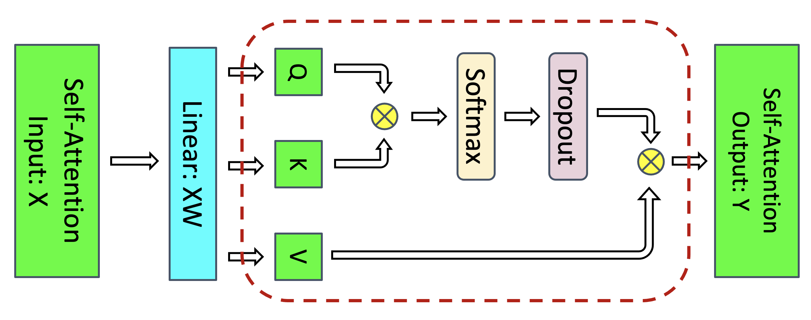
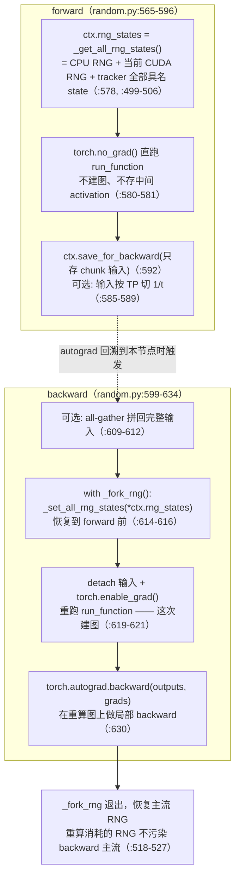
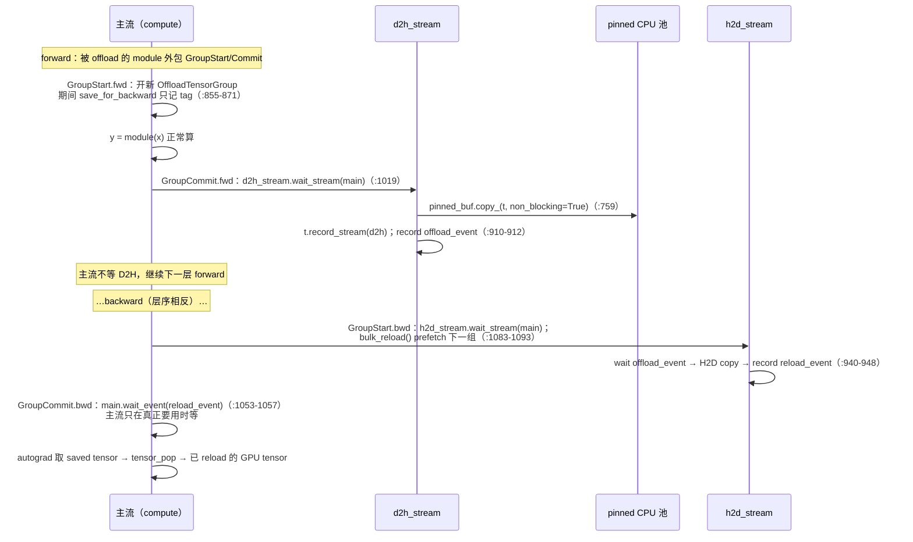

# 06 · Activation 的 Recompute 与 CPU Offloading

上一篇讲的是梯度与参数侧的常驻显存，本篇转向另一大类——activation。activation 是随每个 micro-batch 生灭的流动显存，本篇讲的全部技巧都作用在这一项上：先解释 activation 显存为什么大（§1，$s^2$ 项），然后讲 recompute 路线——full（§2）、底层 `CheckpointFunction` 与 RNG 正确性（§3，本篇的核心难点）、selective（§4）、三种策略的总账（§5-§6），再讲 CPU offloading 路线——Megatron 特有的 fine-grained offload（§7）与 TE 的 layer 级 offload（§8），最后给选择建议（§9）与易错点（§10）。activation 显存的总账公式（与 param/grad/optimizer 合并的系统模型）在 [`07`](./07_memory_model.md)，本篇只讲机制与开销收益比。

阅读本篇需要的前置知识：

- autograd 的 saved tensors 概念：forward 里 `save_for_backward` 或框架自动保存的张量会一直活到对应节点的 backward 结束（[03 · autograd：引擎、自定义 Function、hooks、checkpoint](../torch/03_autograd.md)）；
- [`01`](./01_training_loop.md) §8 的「常驻 vs 流动」分类；
- TP/SP/PP 的切分直觉（用到时给出最小定义，深入见 [大规模训练的并行策略总览](../parallel/README.md)）。

代码：[[megatron-lm:megatron/core/recompute.py]]、[[megatron-lm:megatron/core/tensor_parallel/random.py]]、[[megatron-lm:megatron/core/pipeline_parallel/fine_grained_activation_offload.py]]（Megatron-LM，commit `e03878b5f`）。

---

## 1. activation 显存的来源与量级

### 1.1 saved tensors：流动显存的来源

backward 计算某个算子的梯度，需要它 forward 时的输入或输出。autograd 把这些张量挂在计算图节点上（`ctx.save_for_backward` 或框架默认规则），从 forward 产生那一刻起一直存活到该节点 backward 结束。落到一个具体算子上：$y = xW$ 的 Linear，backward 算 $dW = x^{\top} dy$ 需要 `x`，算 $dx = dy\, W^{\top}$ 需要 `W`——所以 forward 必须把 `x` 保存下来（`W` 是常驻参数，不算在 activation 账上，见 [`01`](./01_training_loop.md) §8）。activation 显存的主角就是各算子保存的输入与中间输出。

一个 micro-batch 的 forward 跑完 $L$ 层，图里就压着 $L$ 层全部的 saved tensors；PP 下首 stage 还要同时压着多个 in-flight micro-batch 的图（见 [`01`](./01_training_loop.md) §4）。这就是 activation 显存的物理来源：它不是「计算产生的中间结果多」，而是「为 backward 特意保留的」。

### 1.2 Korthikanti 公式

先明确全篇通用的符号：$s$=seq length，$b$=micro-batch size，$h$=hidden size，$a$=attention head 数，$L$=层数，$t$=TP size。activation 按 16-bit（2 bytes/elem）存储，dropout mask 1 byte/elem。

Korthikanti et al. 2022（arXiv:2205.05198，Megatron 作者自己的论文）在 Table 1 里逐项统计过一个 transformer layer 的 saved tensors。无 recompute 时，每层每 micro-batch 的开销为（eq.(1)，按 16-bit activation 计）：

$$
\text{activation\_bytes/layer} = sbh\left(34 + \frac{5as}{h}\right)
$$

带 TP 的总量为（eq.(5)，TP 把大部分项切到 $1/t$）：

$$
\text{activation\_bytes} = \frac{sbhL}{t}\left(34 + \frac{5as}{h}\right)
$$

逐项 breakdown（论文 Table 1，MLP 项按 $\mathrm{ffn}=4h$ 计）：

| 部分 | bytes | 里面是什么 |
|---|---|---|
| attention 线性部分 | $11sbh$ | QKV proj / out proj 的输入、softmax 输入等 |
| attention $s^2$ 部分 | $5as^2b$ | softmax 输出 $2as^2b$ + dropout mask $as^2b$（1B）+ dropout 输出（留给 attention-over-V 的 backward）$2as^2b$ |
| MLP | $19sbh$ | fc1 输入 2 + activation（GeLU）输入 8 + fc2 输入 8 + dropout mask 1（按 $\mathrm{ffn}=4h$、16-bit 计） |
| 两个 LayerNorm | $4sbh$ | 各存输入 $2sbh$ |
| **合计** | $sbh(34 + 5as/h)$ | $11+19+4=34$，$s^2$ 项折成 $5as/h$ |

### 1.3 s² 项与 recompute 的动机

$34$ 那部分与 $s$ 成线性，$5as/h$ 那部分来自 $[b, a, s, s]$ 的 attention score 矩阵，与 $s$ 成平方。7B 配置（$s=4096$）下 $s^2$ 项已占单层的 82%（演算见 §6）；$s$ 涨到 32k 时 $5as/h$ 项变为 1280，是线性项的 37 倍。更关键的是这部分的计算却相对便宜：$QK^{\top}$、softmax、dropout、attention-over-V 的 FLOPs 占比很小（GEMM 的大头在 QKV/out proj 和 MLP 的 $h\times\mathrm{ffn}$ 矩阵上）。

「占显存大、算起来便宜」正是 recompute 的理想应用场景：forward 不存它，backward 用到时现场重算一遍。论文 Fig 3 标出了 selective recompute 的作用范围：



> 图：self-attention block 内 selective recomputation 的作用范围——红虚线内的 QK^T / softmax / dropout / attention-over-V 大激活（s×s）不存、反向时重算，其余线性区激活照常保存（Korthikanti et al. 2022, Fig 3；[arXiv:2205.05198](https://arxiv.org/abs/2205.05198)）。

另一条路线不在 GPU 上省，而是把 saved tensors 搬到 CPU 内存（offloading），backward 之前再搬回来。两条路线分别对应 §2-§5 与 §7-§8。

## 2. full recompute：整层重算

### 2.1 入口条件

本 commit 中 checkpoint 逻辑已从 `transformer_block.py` 抽成独立模块 [[megatron-lm:megatron/core/recompute.py]]（`checkpointed_forward`，[[megatron-lm:megatron/core/recompute.py#L21]]；block 侧在 [[megatron-lm:megatron/core/transformer/transformer_block.py#L23]] import）。入口条件（[[megatron-lm:megatron/core/transformer/transformer_block.py#L621-L635]]）：

```python
if self.config.recompute_granularity == 'full' and self.training:   # transformer_block.py:621
    checkpointed_result = checkpointed_forward(self, hidden_states=..., ...)  # 622-635
else:
    for l_no, layer in enumerate(self.layers): ...                  # 正常逐层 forward
```

`self.training` 这个条件必须显式记住：eval（`model.eval()`）时即使配置开着 full recompute 也不重算——eval 没有 backward，根本不需要省 activation。这与 [`01`](./01_training_loop.md) §9 的 `evaluate()` 走 `forward_only=True` 调度是自洽的。

> legacy flag 迁移（[[megatron-lm:megatron/training/arguments.py#L599-L607]]）：`--checkpoint-activations` 已删除、给了直接 exit（`:599-603`）；`--recompute-activations` 等价于 `recompute_granularity='selective'`（`:605-607`）。新配置一律使用 `--recompute-granularity {full,selective}` 系列。

### 2.2 uniform 与 block 两种 method

`checkpointed_forward` 的核心是两个闭包：`custom(start, end)`（[[megatron-lm:megatron/core/recompute.py#L53-L106]]）顺序执行 `self.layers[start:end]`，就是一个 chunk 的 forward；`chunk_runner(start, end, use_checkpoint)`（[[megatron-lm:megatron/core/recompute.py#L108-L137]]）决定这一段是 checkpoint 还是直跑。两种 method 的切法如下（同构伪代码，对齐 [[megatron-lm:megatron/core/recompute.py#L139-L163]]）：

```python
if config.recompute_method == 'uniform':               # recompute.py:139-148
    layer_idx = 0
    while layer_idx < num_layers_per_pipeline_rank:    # 本 PP stage 的全部层
        chunk_end = min(layer_idx + config.recompute_num_layers,   # 144-146 尾部 min() 截断
                        num_layers_per_pipeline_rank)              #   → 不要求整除！
        chunk_runner(layer_idx, chunk_end, use_checkpoint=True)    # 每个 chunk 只存输入
        layer_idx += config.recompute_num_layers
elif config.recompute_method == 'block':               # recompute.py:149-163
    recompute_skip_num_layers = 0
    for layer_idx in range(num_layers_per_pipeline_rank):
        if (config.fp8 or config.fp4) and not hidden_states.requires_grad:
            recompute_skip_num_layers += 1             # 153-158 FP8/FP4 窗口后移（见下）
        use_checkpoint = (layer_idx >= recompute_skip_num_layers
                          and layer_idx < config.recompute_num_layers + recompute_skip_num_layers)
        chunk_runner(layer_idx, layer_idx + 1, use_checkpoint)     # 逐层：前 N 层 checkpoint
```

| | **uniform** | **block** |
|---|---|---|
| `recompute_num_layers` 语义 | **每个 recompute 单元的层数**（chunk 大小） | **每个 PP stage 被重算的层数**（前 N 层） |
| 重算范围 | 本 stage **全部层**（按 chunk 分组，每组只存 chunk 输入） | 只重算前 N 层，其余层**照常存全部 activation**（partial recompute） |
| 整除要求 | 无，尾部 `min()` 截断（[[megatron-lm:megatron/core/recompute.py#L144-L146]]） | 无（N ≤ 本 stage 层数即可） |
| 反向重算次数 | 每层 1 次 | 被重算层 1 次 |

这个二义性直接写在字段 docstring 里（[[megatron-lm:megatron/core/transformer/transformer_config.py#L496-L500]]）：「uniform 下是每个 recompute 单元的层数；block 下是每个 stage 重算的层数；selective 下必须为 None」。block 的 FP8/FP4 窗口后移（[[megatron-lm:megatron/core/recompute.py#L153-L158]]，注释在 151-154）是因为 re-entrant autograd 要求 checkpoint 段至少有一个 `requires_grad` 的输入——FP8 下某些段的输入不带 grad，这些槽位不计数，重算窗口随之向后移。

举一个具体例子（本 stage 16 层）：uniform 加 `recompute_num_layers=5` 时，chunk 划分为 `[0:5] [5:10] [10:15] [15:16]`，最后一个 chunk 只有 1 层（`min()` 截断），4 个 chunk 各存一份输入，全部 16 层都重算；block 加 `recompute_num_layers=5` 时，只有前 5 层逐层各存一份输入并重算，后 11 层的全部 activation 照常留在图里。显存收益：uniform 约等于只存 ⌈16/5⌉=4 份 chunk 输入（每份 $2sbh$），block 则是 5 份层输入加 11 层全量 activation——block 是「无 recompute」与「full uniform」之间的连续调节手段。

### 2.3 按精度分路

`chunk_runner` 按精度分路（[[megatron-lm:megatron/core/recompute.py#L112-L126]]）：

- BF16/FP16/FP32 走 `tensor_parallel.checkpoint(cf, distribute_saved_activations, *args)`（[[megatron-lm:megatron/core/recompute.py#L124-L126]]），即 §3 的 `CheckpointFunction`；
- FP8/FP4 走 `te_checkpoint(cf, distribute_saved_activations, get_cuda_rng_tracker, tp_group, *args)`（[[megatron-lm:megatron/core/recompute.py#L115-L122]]），是 TE `transformer_engine.pytorch.distributed.checkpoint` 的封装（[[megatron-lm:megatron/core/extensions/transformer_engine.py#L3073-L3097]]），额外传入 RNG tracker 与 TP group——因为 FP8 的量化 scale/amax 状态需要 TE 自己管理重算上下文。

### 2.4 `distribute_saved_activations`

full recompute 每个 chunk 只存输入 hidden_states，但这个输入本身也是 $sbh$ 的大张量。`distribute_saved_activations=True` 时（`CheckpointFunction.forward`，[[megatron-lm:megatron/core/tensor_parallel/random.py#L585-L589]]），`args[0]` 按 TP group 切成一维等分，每个 rank 只留 $1/t$ 的 shard；backward 时先 all-gather 拼回完整输入再重算（[[megatron-lm:megatron/core/tensor_parallel/random.py#L609-L612]]）。性质标注：

- 通信代价：backward 重算前多一次 TP 组 all-gather（通信量 $sbh$），换取存储降为 $1/t$；
- 与 sequence parallel 互斥（[[megatron-lm:megatron/core/transformer/transformer_config.py#L1584-L1588]]）——SP 下 hidden_states 本来就按序列切到 $1/t$，再切一次没有意义；
- 配置校验要求 TP>1、full granularity、method 非 None、torch≥1.10（[[megatron-lm:megatron/training/arguments.py#L1355-L1368]]）。

## 3. `CheckpointFunction` 与 RNG 正确性

### 3.1 问题：复现 dropout

checkpoint 段里有 dropout：forward 时随机丢掉一批元素。backward 重算这一段时，必须使用同一个 dropout mask——否则重算出的中间激活与 forward 实际使用的不一致，梯度就是错的。难点在于 RNG 是全局流：重算发生在 backward 中途，此时全局 RNG 早已走了很远。所以 checkpoint 必须在 forward 时把 RNG 状态整个保存下来，重算前精确恢复，重算完再不留痕迹地退出。

### 3.2 机制

`CheckpointFunction`（[[megatron-lm:megatron/core/tensor_parallel/random.py#L555-L634]]）是 Megatron 版 checkpoint 的核心：



同构伪代码（改写自 [[megatron-lm:megatron/core/tensor_parallel/random.py#L555-L634]]）：

```python
class CheckpointFunction(torch.autograd.Function):
    @staticmethod
    def forward(ctx, run_function, distribute_saved_activations, *args):
        _set_checkpointing()                                  # :572 全局 flag（供其他模块探测）
        ctx.rng_states = (cpu_rng, cuda_rng, tracker.get_states())  # :578 存「三套」
        with torch.no_grad():
            outputs = run_function(*args)                     # :580-581 直跑，不建图
        if distribute_saved_activations:
            args[0] = split_across_tp(args[0])                # :585-589 只留本 rank 1/t
        ctx.save_for_backward(*args)                          # :592 只存 chunk 输入
        return outputs                                        # 输出是「无 grad_fn 历史」的普通张量

    @staticmethod
    def backward(ctx, *grads):
        assert torch.autograd._is_checkpoint_valid()          # :601-605 不支持 .grad()，只支持 .backward()
        inputs = ctx.saved_tensors
        if ctx.distribute_saved_activations:
            inputs[0] = all_gather_tp(inputs[0])              # :609-612 拼回完整输入
        with _fork_rng():                                     # :614 记住当前 RNG，退出时恢复
            _set_all_rng_states(*ctx.rng_states)              # :616 回到 forward 前 → dropout 复现
            with torch.enable_grad():
                outputs = ctx.run_function(*detach(inputs))   # :619-621 重算，建图
        torch.autograd.backward(outputs, grads)               # :630 在重算图上局部 backward
        return (None, None) + input_grads                     # :631-634 只回传输入梯度
```

逐条性质标注（这一类正是框架 bug 的高发区）：

- 是否拷贝：forward 对输入不做数值拷贝（`save_for_backward` 只挂引用）；`distribute_saved_activations` 的切分用 `new_buffer=True`，会拷一份 shard（[[megatron-lm:megatron/core/tensor_parallel/random.py#L588]]）。
- 是否建图：forward 在 `torch.no_grad()` 下执行（`:580`），中间 activation 一个都不留——省显存的来源正在于此；建图推迟到 backward 的重算（`:620-621`）。
- 是否 sync：纯本地操作，无集合通信（除可选的 all-gather）。
- 全局 flag：`IS_CHECKPOINTING`（[[megatron-lm:megatron/core/tensor_parallel/random.py#L530-L548]]）在 checkpoint 的 forward/backward 期间置位，供其他模块探测「正处于 checkpoint 上下文」（例如 FP8 的 amax 更新、cuda graph 管理需要区分这个状态）。
- RNG 正确性：保存的是「CPU RNG + 当前 CUDA RNG + tracker 内全部具名 state」三者（`_get_all_rng_states`，[[megatron-lm:megatron/core/tensor_parallel/random.py#L499-L506]]）；只恢复 `torch.cuda` 默认 RNG 是不够的，见 §3.3。
- 限制：不支持 `torch.autograd.grad()`，只支持 `.backward()`（[[megatron-lm:megatron/core/tensor_parallel/random.py#L601-L605]] 直接 raise）；cuda graph warmup/capture 期间 `checkpoint()` 静默退化为直跑（[[megatron-lm:megatron/core/tensor_parallel/random.py#L644-L648]]，graph 会把所有 op 直接录进去，重算无法发生在已录好的图里）。

### 3.3 三套 seed

`CudaRNGStatesTracker`（[[megatron-lm:megatron/core/tensor_parallel/random.py#L216-L333]]）维护 name 到 RNG state 的字典，`fork(name)`（[[megatron-lm:megatron/core/tensor_parallel/random.py#L297-L333]]）切入具名 state、退出时恢复。初始化（`model_parallel_cuda_manual_seed`，[[megatron-lm:megatron/core/tensor_parallel/random.py#L433-L484]]）建立三套：

| tracker | seed | 语义 |
|---|---|---|
| default / `data-parallel-rng` | `seed`（原样，`:470`） | **TP 组内相同**：用于非 TP 区 dropout（如 residual 上的 dropout）——各 TP rank 对同一份完整数据必须丢同样的元素 |
| `model-parallel-rng` | `seed + 2718 + tp_rank`（`:466-468`） | **每个 TP rank 不同**：用于 TP 区 dropout——各 rank 持有不同的列/行 shard，若 seed 相同，各 rank 会对自己的 shard 丢掉「相同相对位置」的元素，等效于系统性多丢 |
| `expert-parallel-rng` | `seed + 1024 + 100·ep_rank + etp_rank`（`:483-484`） | MoE expert 层专用，expert-TP/EP 组内各异、expert-DP 组内相同 |

所以重算恢复 RNG 时必须把 tracker 的整个 states 字典一起恢复（[[megatron-lm:megatron/core/tensor_parallel/random.py#L578]]），少任何一套都会让对应区域的 dropout mask 失真。`_fork_rng`（[[megatron-lm:megatron/core/tensor_parallel/random.py#L518-L527]]）的第二个作用是：重算消耗的 RNG 在退出时被弹掉，不污染 backward 主流的随机序列（否则同一个 iteration 里不同 micro-batch 的 dropout 序列会因是否重算而不同）。SP 下整个 block forward 还额外包了一层 `get_cuda_rng_tracker().fork()`（[[megatron-lm:megatron/core/transformer/transformer_block.py#L592-L595]]）。

### 3.4 与 `torch.utils.checkpoint` 的两处差异

docstring 自己写明了两点（[[megatron-lm:megatron/core/tensor_parallel/random.py#L558-L561]]）：第一，`torch.cuda.set_rng_state` 换成 `_set_cuda_rng_state`，不 clone 输入 state，因为 clone 在超过 4 卡时有严重性能问题（[[megatron-lm:megatron/core/tensor_parallel/random.py#L127-L166]] 注释：「the input state is not cloned. Cloning caused major performance issues for +4 GPU cases」）；第二，额外 save/restore model-parallel tracker 里的全部具名 RNG state（§3.3）。其余结构与 PyTorch 原版同构。

### 3.5 `CheckpointWithoutOutput`

普通 checkpoint 存输入、丢中间结果，但输出还得留着（下游模块可能把它 save 给各自的 backward）。`CheckpointWithoutOutput`（[[megatron-lm:megatron/core/tensor_parallel/random.py#L699-L829]]）更进一步，把输出也丢掉：

1. forward：`CheckpointWithoutOutputFunction` 在 `no_grad` 下直跑（[[megatron-lm:megatron/core/tensor_parallel/random.py#L676-L677]]），`save_for_backward` 只存输入（`:678`）；
2. `discard_output_and_register_recompute(hook_tensor)`（`:806-829`）：对输出立即 `untyped_storage().resize_(0)`（`:822`），即 in-place 释放 storage、只保留 tensor 元数据；同时把 `_recompute` 注册为 `hook_tensor` 的 grad hook（`:828-829`）；
3. backward：`hook_tensor` 的梯度一到，hook 触发，在 `_fork_rng` 内恢复 RNG 重算（`:758-782`），再用 C++ 扩展 `share_storage`（`:37-75`）把重算输出的 storage 零拷贝接到原输出 tensor 上（`:795-797`）。

`share_storage` 的零拷贝语义值得展开（源码注释 `:790-794`）：它操作在 UntypedStorage 层（TensorImpl 之下），所以所有指向原输出 storage 的 view 和 reshape 都能直接看到重算数据（例如 TE GroupedLinear 存下的 `inp.reshape()` 与 `torch.split()`），且不 bump version counter，不会触发 autograd 的 in-place 检查报警。`CheckpointWithoutOutputFunction.backward` 直接使用重算时缓存的 `ctx.inputs/outputs`（`:685-696`），注释明确说这是为 CPU offloading 场景避免二次 reload（`:687-689`）——这就是 §7.6「offload 与 recompute 叠加」能成立的关键一环。使用约束写在 docstring（`:707-712`）：调用者必须保证被丢掉的输出确实被下游直接 save，且 `hook_tensor` 的梯度先于重算结果的使用被算到。

## 4. selective recompute

### 4.1 论文数字

full recompute 把整层都重算，代价是 30-40% 的 step time（论文：22B 单层 39%，530B/1T 36%）。Korthikanti et al. 的观察是：$s^2$ 项（$5as^2b$）只占 FLOPs 的小头，却是显存大头——所以只重算 core attention 段（$QK^{\top}$、softmax、softmax dropout、attention-over-V），其余照常保存：

$$
\begin{aligned}
\text{no recompute:}\quad & \frac{sbhL}{t}\left(34 + \frac{5as}{h}\right) && \text{eq.(5)}\\
\text{selective:}\quad & \frac{34\, sbhL}{t} && \text{eq.(6), } s^2 \text{ term gone}
\end{aligned}
$$

开销：额外 FLOPs 仅 2.7%（GPT-3）与 1.6%（MT-NLG）；实测 step time 开销 22B 为 7%，530B/1T 仅 2%（对比 full 的 36%）。配合 sequence parallelism，论文 abstract 报告 activation memory 降低 5 倍。

### 4.2 `recompute_modules`

总开关：`recompute_granularity == 'selective'` 且模块名在 `recompute_modules` 中。默认 `["core_attn"]`（[[megatron-lm:megatron/core/transformer/transformer_config.py#L1590-L1591]]），合法集合共 8 项（校验在 `:1595-1604`，语义表在 docstring `:505-520`）：

| 模块 | 重算什么 | 实现方式 | 代码 |
|---|---|---|---|
| `core_attn` | 整个 core attention 模块 | 普通 checkpointing | [[megatron-lm:megatron/core/transformer/attention.py#L1268-L1277]] → `426-464` |
| `mlp` | dense MLP（MoE 层排除） | 普通 checkpointing | [[megatron-lm:megatron/core/transformer/transformer_layer.py#L501-L503,L824]] |
| `moe` | 整个 MoE layer | 普通 checkpointing（FP8 走 te_checkpoint） | [[megatron-lm:megatron/core/transformer/moe/moe_layer.py#L246-L250,L687-697]] |
| `shared_experts` | MoE 的 shared experts | 普通 checkpointing | [[megatron-lm:megatron/core/transformer/moe/moe_layer.py#L251-L254,L510-520]] |
| `moe_act` | expert 的 activation 函数段（bias+act） | **CheckpointWithoutOutput** | [[megatron-lm:megatron/core/transformer/moe/experts.py#L253-L256,L769-780]] |
| `layernorm` | input_layernorm 与 pre_mlp_layernorm | **CheckpointWithoutOutput** | [[megatron-lm:megatron/core/transformer/transformer_layer.py#L434-L503,L617-622,L753-758]] |
| `mla_up_proj` | MLA up projection + RoPE | **CheckpointWithoutOutput** | [[megatron-lm:megatron/core/transformer/multi_latent_attention.py#L171-L174,L453-456]] |
| `gdn_norm_out` | GatedDeltaNet 输出 norm + HP-to-CP all-to-all | **CheckpointWithoutOutput** | [[megatron-lm:megatron/core/ssm/gated_delta_net.py#L225-L228,L515-L527]] |

两类实现的分界写在 [[megatron-lm:megatron/core/transformer/transformer_config.py#L518-L519]]：「moe_act / layernorm / mla_up_proj / gdn_norm_out 用 output-discarding checkpointing，core_attn / mlp / moe / shared_experts 用 normal checkpointing」。用 `CheckpointWithoutOutput` 的四个都是「输出紧接着被下游单独 save」的算子（norm 输出、act 输出），正好把输出也丢掉（§3.5）。各自的额外约束：`moe_act` 要求 `moe_grouped_gemm`（`:1611-1614`），且 FP8 需要 TE≥2.6 并禁用 delayed scaling（`:1648-1660`，并对 `linear_fc2` 调 `set_save_original_input`，[[megatron-lm:megatron/core/transformer/moe/experts.py#L257-L260]]）；`mla_up_proj` 要求 MLA（`:1616-1620`）；`gdn_norm_out` 要求 `experimental_attention_variant='gated_delta_net'`（`:1622-1629`）。旧 flag `--moe-layer-recompute` 已 deprecated，自动映射为 selective 加 `moe`（`:1662-1673`）。

### 4.3 core_attn 的边界与 flash attention 的关系

`core_attn` 的 checkpoint 边界是整个 `core_attention` 模块：q, k, v 进、attention out 出（[[megatron-lm:megatron/core/transformer/attention.py#L460-L462]] 的 `tensor_parallel.checkpoint(custom_forward, False, query, key, value, attention_mask, rotary_pos_emb, attn_mask_type)`；开关在 `:373-376`，training 时改走 `_checkpointed_attention_forward`，`:1268-1277`）。QKV projection、RoPE、out proj、MLP 都在边界之外、不重算；softmax dropout 在边界之内，靠 §3 的 RNG 恢复保证重算一致。

但要注意 config 里的一条 warning（[[megatron-lm:megatron/core/transformer/transformer_config.py#L1631-L1637]]）：用 TE fused/flash attention 时，$s\times s$ 矩阵本来就不落地（flash kernel 的 online softmax 不存完整 score 矩阵，backward 本来就在 kernel 内重算），config 直接 warn「可能无需设 core_attn recompute」。也就是说，论文里 selective recompute 省下的那 $5as^2b$，在 flash 后端已被 kernel 本身拿走了大头，再开 `core_attn` recompute 收益很小、却要多付约 2% 的计算。这是「论文结论与后端实现演进」错位的一个典型例子：引用老结论时要想清楚它假设的 kernel 形态。

### 4.4 与 cuda graph 的相互约束

recompute 与 cuda graph 叠用时有两条硬约束（`transformer_config.py` 校验）：full recompute 只支持 `full_iteration` CUDA graph（`:2314-2318`），因为 per-layer graph 录不下「backward 中途重算」这种动态控制流；selective 下被 graph 捕获的 recompute 模块不能消耗随机数（`:2338-2365`），即 `attention_dropout≠0` 时 `core_attn` recompute 不能落在 graph scope 内，`hidden_dropout` 与 `moe_input_jitter` 同理。原因正是 §3 所讲的：重算要恢复并消耗 RNG state，而 graph capture 把 RNG 操作固化成静态序列，二者冲突。cuda graph warmup/capture 期间 `checkpoint()` 会静默退化为直跑（[[megatron-lm:megatron/core/tensor_parallel/random.py#L644-L648]]）。

## 5. 三种策略的开销/收益总表

| | 无 recompute | selective（core_attn） | full |
|---|---|---|---|
| 每层 activation | $sbh(34 + 5as/h)$ | $34sbh$（$s^2$ 项消失） | 只存层输入 $2sbh$ |
| 额外计算 | 0 | 重算 core attention：FLOPs +2.7%/1.6%，实测 step +2%（530B/1T） | 重算整层：step +30-40%（530B/1T 36%） |
| 实现 | — | `recompute_modules`（§4.2） | uniform / block（§2.2） |
| 适用场景 | 显存够 / s 小 | 默认起手：flash 下亦可省（但见 §4.3） | 显存极限紧张、计算有余量 |

更早的理论源头是 Chen et al. 2016（arXiv:1604.06174）：把 $n$ 层网络按 $\sqrt{n}$ 分段 checkpoint，用 $O(\sqrt{n})$ 的 memory、每个 mini-batch 只多一次 forward（其 §5.4 实测约 30% 额外 runtime）。Megatron 的 uniform 就是它的「每段 1 层输入」形态，block 则对应「只重算一部分层」的折中。三行策略的共同前提是：重算产生的梯度与全存 activation 的梯度数值完全一致（§3 的 RNG 恢复保证了这一点），recompute 只改变显存与时间的配比，不改变训练语义。

## 6. 7B 配置演算

用全章统一配置（[`README`](./README.md) §3）：$s=4096$，$b=2$，$h=4096$，$a=32$，$L=32$，$\mathrm{ffn}=14336$（$=3.5h$，SwiGLU），TP=2（SP on），PP=2，即每 stage 16 层。$sbh = 4096\cdot 2\cdot 4096 = 2^{25}$。

无 recompute（§1.2 公式，eq.(5) 除以 $t=2$）：

```
5as/h = 5·32·4096/4096 = 160  →  系数 34+160 = 194
每层每 micro-batch = 194·sbh/t = 194·2²⁵/2 ≈ 3.03 GiB
  其中 s² 项 5as²b = 5.0 GiB（未除 TP），占单层 82.5%
16 层/stage      ≈ 48.5 GiB / micro-batch
```

selective + SP：Megatron 自己的估算脚本（[[megatron-lm:megatron/training/theoretical_memory_usage.py#L288-L291]]，注释声明用 2205.05198 Table 2）把 selective 后的线性项一般化为 $sbh(18 + 4\cdot\mathrm{ffn}/h)$ bytes/层——$\mathrm{ffn}=4h$ 时即论文的 34；本配置 $\mathrm{ffn}=3.5h$，系数为 $18+14=32$：

```
每层每 micro-batch = 32·sbh/t = 32·2²⁵/2 = 0.5 GiB
16 层/stage      = 8 GiB / micro-batch      （vs 无 recompute 48.5 GiB，≈ 6×）
```

full recompute：每层只存输入 hidden_states（bf16，SP 下按序列切到 $1/t$）：

```
每层每 micro-batch = 2·sbh/t = 2·2²⁵/2 = 32 MiB
16 层/stage      = 512 MiB / micro-batch    （vs selective 8 GiB，再省 16×）
```

三档对照下来，activation 从 48.5 GiB 降到 8 GiB 再降到 0.5 GiB，代价分别是 0、约 2%、约 36% 的 step time。注意这些都是单个 in-flight micro-batch 的量；1F1B 首 stage 同时压着 `num_warmup` 个 micro-batch 的 activation（[`01`](./01_training_loop.md) §4、[03 · 显存、通信 overlap 与并行协同](../parallel/03_pp/03_overlap_and_memory.md)），总账（含 embedding、logits/CE、schedule 折扣系数，见 [[megatron-lm:megatron/training/theoretical_memory_usage.py#L301-L348]]）由 [`07`](./07_memory_model.md) 收拢。

## 7. fine-grained activation offloading

recompute 用 GPU 时间换显存；offloading 用 D2H/H2D 带宽换显存——GPU 上的 saved tensor 搬到 CPU 内存，backward 用之前再搬回来。Megatron 特有的实现是 [[megatron-lm:megatron/core/pipeline_parallel/fine_grained_activation_offload.py]]，粒度是 module 级（不是整层），且全自动流水。配置：`fine_grained_activation_offloading=True` 加 `offload_modules=[...]`（[[megatron-lm:megatron/core/transformer/transformer_config.py#L1127-L1143]]）。

### 7.1 saved-tensor default hooks

整个机制建立在 PyTorch 一个少有人用的 API 上：saved-tensor default hooks。`PipelineOffloadManager.__enter__` 时（[[megatron-lm:megatron/core/pipeline_parallel/fine_grained_activation_offload.py#L690-L705]]）：

```python
torch._C._autograd._push_saved_tensors_default_hooks(   # :703-705
    self.on_save_for_backward, self.on_get_saved_tensor)
```

此后 context 内任何 `save_for_backward(t)`（包括 TE 模块内部的）都不再把 `t` 留在 autograd 图里，而是走 `on_save_for_backward`（`:721-728`）到 `tensor_push`（`:855-871`）：给 `t` 打上 `(group_idx, idx)` tag、暂存进当前 `OffloadTensorGroup`，图里只留 tag。backward 时 autograd 取 saved tensor 触发 `on_get_saved_tensor`，再到 `tensor_pop`（`:730-736,873-882`）：若该 tensor 已 offload（存的是 tuple state），返回 reload 后的 GPU tensor。性质标注：save 时不拷贝、不改图结构（打包/解包 hook 对 autograd 透明）；tensor 的 GPU 显存在 commit 阶段异步 D2H 之后才算「可复用」（见 §7.2 的 record_stream）。

### 7.2 组件

- **单例 `PipelineOffloadManager`**（`:383`，`get_instance` 在 `:393-394`）：持有 `_d2h_stream` 与 `_h2d_stream` 两条专用 stream（`:412-413`）、共享 pinned CPU 池 `GPUTensorPool(device="cpu", pin_memory=True)`（`:415`；池实现 `:98-329`，按 `(shape, dtype)` 分池复用，`:142-153`）。`expert_fc1` 与 `moe_act` 两组 shape 事先未知（且为兼容 cuda graph），不使用 CPU 池（`:345-351`）。
- D2H：`ChunkOffloadHandler.offload`（`:745-761`）执行 `cpu_backup.copy_(src, non_blocking=pin_memory)`（`:759`），pinned 加 non_blocking 才是真正的异步；`bulk_offload_group`（`:896-922`）在 `d2h_stream` 上整组拷贝，每个 tensor 调 `record_stream(d2h_stream)`（`:910`，防止 caching allocator 在 D2H 完成前把显存复用给别的 tensor），结束 `record_offload_event`（`:912`）。`forced_released_tensors` 在 offload 后 `untyped_storage().resize_(0)` 强制释放（`:986-999`），用于 torch GC 不会自动释放的张量（如 attention 的 q/k/v，它们的 storage 被多个 view 共享）。
- reload：`bulk_reload_group`（`:932-952`）在 `h2d_stream` 上先 `wait_offload_event`（`:940-941`，等 D2H 完成）再逐张量 H2D，最后 `record_reload_event`（`:948`）。
- 尺寸阈值：`tensor_need_offloading_checker`（`:884-894`）跳过 `numel < min_offloaded_tensor_size` 的张量——默认 1024×1024（[[megatron-lm:megatron/core/transformer/transformer_config.py#L1144-L1145]]）。注意比较的是元素数（`:889`，docstring `:623` 写明 "in elements"），即默认 1M 元素（bf16 下约 2MiB）以下不搬。

### 7.3 流编排

offload/reload 的时机不能靠「层结束」这种模糊事件，必须精确插在 autograd 图里——实现上用两个 identity autograd.Function（forward 原样返回输入，只为在图的确定位置挂钩子）：

| Function | forward 做什么 | backward 做什么 |
|---|---|---|
| `FineGrainedOffloadingGroupStartFunction`（`:1188-1210`） | `on_group_start_forward`：开新 `OffloadTensorGroup`（`:1061-1081`） | `on_group_start_backward`：`h2d_stream.wait_stream(main)` 后 `bulk_reload()` **prefetch 下一组**（`:1083-1093`） |
| `FineGrainedOffloadingGroupCommitFunction`（`:1108-1136`） | `on_group_commit_forward`：`d2h_stream.wait_stream(main)` 后 bulk offload（`:1013-1020`）；或 `delay_offload` 延迟入队（`:1119-1122`） | `on_group_commit_backward`：切到当前 backward chunk，主流 `wait_reload_event`（`:1039-1059`） |



同构伪代码（改写自 [[megatron-lm:megatron/core/pipeline_parallel/fine_grained_activation_offload.py#L690-L1093]]）：

```python
# ---- forward：每个被 offload 的 module 外包一层 ----
with OffloadInterface(enable, x, name="core_attn") as x:   # = group_start + push saved-tensor hooks
    # group_start.fwd：新开 OffloadTensorGroup(name)
    # 期间所有 save_for_backward(t) → 只记 tag，t 暂存 group（不拷、不离图就没法省，故下一步）
    y = module(x)                                            # 正常算，主流
# group_commit.fwd（identity op 的 forward）:
d2h_stream.wait_stream(main_stream)                          # :1019 等本组计算完
with torch.cuda.stream(d2h_stream):
    for t in group.tensors:                                  # 过滤 <1M 元素 / 标记不可 offload 者
        cpu_buf = pinned_pool.alloc(t.shape, t.dtype)        # pinned，池化复用
        cpu_buf.copy_(t, non_blocking=True)                  # :759 异步 D2H
        t.record_stream(d2h_stream)                          # :910 防 allocator 提前复用
    group.offload_event.record(d2h_stream)                   # :912
for t in forced_released_tensors: t.untyped_storage().resize_(0)   # :993-999 强释放 q/k/v 等

# ---- backward：由同一对 identity op 的 backward 对称驱动 ----
# group_start.bwd（该组 backward 开始时）:
h2d_stream.wait_stream(main_stream)
bulk_reload():                                               # :1022-1037 prefetch 下一组
    with torch.cuda.stream(h2d_stream):
        h2d_stream.wait_event(next_group.offload_event)      # :940-941 等它 D2H 完
        for tag, state in next_group: gpu_t.copy_(cpu_buf, non_blocking=True)
        next_group.reload_event.record(h2d_stream)           # :948
#   若本 chunk 已无组可 reload：对下一个 backward chunk 的最后一层 pre_reload（:1030-1037, :954-960）
# group_commit.bwd（该组 backward 消费前）:
main_stream.wait_event(this_group.reload_event)              # :1053-1057 主流只在真正要用时等
# autograd 取 saved tensor → tensor_pop(tag) → 返回已 reload 的 gpu_t
```

要点：主流与 D2H/H2D 全程异步，唯一的同步点是 group_commit.bwd 的 `wait_reload_event`。只要 prefetch 排得足够靠前，主流等到的时候 H2D 早已完成，offload 的开销就接近于零；排不好就退化成逐组阻塞。

### 7.4 warmup 与 offload 决策

首个 iteration 是 warmup：逐 vp_stage 缓存 chunk handler（`init_model_chunk_offload_handler`，`:610-659`），跑完后 `post_warmup_callback`（`:523-574`）统计每组 offload 字节数、打印全 rank 汇总表（`:27-93`），并把 backward 队列里最后被 offload 的若干同名组标记 `offload=False`（`_offload_margin`，`:537-554`）。原因是：1F1B 稳态里第一个 backward 紧挨着 warmup 段最后一个 forward，那几组的 activation 若被 offload，backward 一开始就得空等 reload——强制把它们留在 GPU 上，保证第一个 backward 不被阻塞。`should_bulk_offload`（`:962-984`）还会跳过「马上要被本 chunk backward 消费」的最后一组。所以 offload 决策在首 iteration 结束后才最终确定，只看首 iteration 的显存或日志下结论会被误导。

### 7.5 7 个 offload 调用点

`offload_modules` 合法值共 7 项（[[megatron-lm:megatron/core/transformer/transformer_config.py#L1680-L1688]]），调用点全部是「`off_interface` context 包住 module，之后 `group_commit`」：

| 模块 | context（group_start） | commit | forced_released |
|---|---|---|---|
| `attn_norm` | `transformer_layer.py:619/624`（包 input_layernorm） | [[megatron-lm:megatron/core/transformer/transformer_layer.py#L690-L693]]（**延迟到 self_attn_bda 之后**，residual 还要用） | `[residual]` |
| `qkv_linear` | [[megatron-lm:megatron/core/transformer/attention.py#L1115]] | [[megatron-lm:megatron/core/transformer/attention.py#L1122-L1126]] | `[]` |
| `core_attn` | [[megatron-lm:megatron/core/transformer/attention.py#L1281-L1283]] | [[megatron-lm:megatron/core/transformer/attention.py#L1319-L1322]] | `[query, key, value]` |
| `attn_proj` | [[megatron-lm:megatron/core/transformer/attention.py#L1341]] | [[megatron-lm:megatron/core/transformer/attention.py#L1343-L1346]] | `[core_attn_out]` |
| `mlp_norm` | `transformer_layer.py:755/760` | [[megatron-lm:megatron/core/transformer/transformer_layer.py#L938-L941]]（延迟到 mlp_bda 之后） | `[residual]` |
| `expert_fc1` | [[megatron-lm:megatron/core/transformer/moe/experts.py#L681-L683]] | [[megatron-lm:megatron/core/transformer/moe/experts.py#L687-L692]] | `[permuted_local_hidden_states]` |
| `moe_act` | `experts.py:771/776` | [[megatron-lm:megatron/core/transformer/moe/experts.py#L784-L787]]（**延迟到 linear_fc2 之后**，见 §7.6） | `[fc1_output]` |

约束：`attn_proj` 不能单独开——它的输入是 `core_attn` 的输出，而 `core_attn.backward()` 要用到它（[[megatron-lm:megatron/core/transformer/transformer_config.py#L1694-L1698]]）。入口在 `GPTModel.forward` 开头的 `preprocess_for_fine_grained_offloading()`（[[megatron-lm:megatron/core/models/gpt/gpt_model.py#L474-L491,L535]]：init chunk handler、模型参数标记为不可 offload）；每个 schedule 结束调 `off_interface.reset()`（[[megatron-lm:megatron/core/pipeline_parallel/schedules.py#L801,L2042,L2451]]）；VPP 下 chunk 按 vp_stage 暂存，到最后一个 vp stage 时 `flush()` 逆序压入 backward 队列（[[megatron-lm:megatron/core/pipeline_parallel/fine_grained_activation_offload.py#L494-L507]]）。与 TE 的协同：`__enter__` 置 TE 的 `cpu_offload.CPUOffloadEnabled = True`（`:695-700`，import 自 `cpu_offload_v1`，[[megatron-lm:megatron/core/extensions/transformer_engine.py#L3375]]），使 TE 模块内部的 saved tensor 也走 hooks。

### 7.6 与 recompute 叠加

offload 与 recompute 可以叠加，但叠加处要显式编排顺序。`moe_act` 同时开 recompute（`CheckpointWithoutOutput` 包 act 段）和 offload 时，commit 被刻意推迟到 `linear_fc2` 之后（[[megatron-lm:megatron/core/transformer/moe/experts.py#L782-L787]]，注释：「Delay the offload of the moe act until after the linear_fc2 has been computed to make sure the fc1_output is reloaded to GPU before recomputing moe_act」）——否则 backward 重算 act 段时，重算输入 `fc1_output` 还在 CPU 上。对称地，`CheckpointWithoutOutputFunction.backward` 特意复用重算时缓存的 `ctx.inputs/outputs` 而不是重新取 saved tensors，注释写明「避免 CPU offloading 场景二次 reload」（[[megatron-lm:megatron/core/tensor_parallel/random.py#L687-L689]]）。这两个细节是同一条原则：重算发生前，它的输入必须已经在 GPU 上。

### 7.7 约束

- 与 TE `cpu_offloading`（§8）互斥（[[megatron-lm:megatron/core/transformer/transformer_config.py#L1675-L1678]]）；
- 要求 `transformer_impl == 'transformer_engine'`（[[megatron-lm:megatron/training/arguments.py#L1722-L1724]]）；TE≥2.10 还要求环境变量 `NVTE_CPU_OFFLOAD_V1=1`（[[megatron-lm:megatron/training/arguments.py#L1725-L1727]]，否则 TE 会把权重也 offload）；
- cuda graph 仅支持 TE impl 或 `full_iteration` scope，且 `cuda_graph_warmup_steps > 0`（[[megatron-lm:megatron/core/transformer/transformer_config.py#L2368-L2379]]）；
- `fine_grained_offloading_max_inflight_offloads`（[[megatron-lm:megatron/core/transformer/transformer_config.py#L1165-L1171]]）：按组名限制未 join 的 inflight D2H 数，超 cap 时主流 wait 最老 event（`:916-922,1001-1011`），为 full-iteration cuda graph 设计。

## 8. TE 层级 `cpu_offloading`

不要与 §7 混淆：这是更早的一套机制，粒度是整个 transformer layer，offload 本体在 TE 内部（`transformer_engine.pytorch.cpu_offload`），Megatron 只做配置与封装。

- flag 在 `ModelParallelConfig`：`cpu_offloading`、`cpu_offloading_num_layers`、`cpu_offloading_activations`、`cpu_offloading_weights`、`cpu_offloading_double_buffering`、`cpu_offloading_retain_pinned_cpu_buffers`（[[megatron-lm:megatron/core/model_parallel_config.py#L377-L402]]）；`cpu_offloading_num_layers > 0` 时自动置 `cpu_offloading=True`（[[megatron-lm:megatron/training/arguments.py#L1737-L1738]]）。
- 传递：`TransformerBlock.__init__` 调 `get_cpu_offload_context(...)` 拿到 `(offload_context, group_prefetch_offload_commit_async)`（[[megatron-lm:megatron/core/transformer/transformer_block.py#L297-L317]]；封装在 [[megatron-lm:megatron/core/extensions/transformer_engine.py#L3109-L3156]]，按 TE 版本适配签名：2.10 加 `retain_pinned_cpu_buffers`、2.5 加 `double_buffering`、1.10 加 `model_layers`）。无 TE 时开 `cpu_offloading` 直接 assert（[[megatron-lm:megatron/core/transformer/transformer_block.py#L313-L315]]）。
- 作用点：forward 中每层包 `with self.offload_context`（[[megatron-lm:megatron/core/transformer/transformer_block.py#L660]]），每层结束调 `group_prefetch_offload_commit_async(hidden_states)`（`:676-682`）。
- 约束（`transformer_config.py`）：`cpu_offloading_num_layers` 必须 `< num_layers`（`:1534-1539`）；与 PP 互斥（`:1541-1544`）；与任何 recompute 互斥（`:1546-1549`）；与 fine-grained offload 互斥（`:1675-1678`）；cuda graph 仅 `full_iteration`（`:2260-2261`）。

两套 offload 的对比：

| | fine-grained（§7，Megatron 特有） | TE layer 级（§8） |
|---|---|---|
| 粒度 | module 级（7 个调用点，可组合） | 整个 transformer layer，前 N 层 |
| 实现位置 | Megatron（saved-tensor hooks + 双 stream） | TE 内部，Megatron 只包 context |
| 与 PP | 兼容（为 1F1B/VPP 编排，§7.4） | **互斥** |
| 与 recompute | 可叠加（需 §7.6 的显式编排） | **与任何 recompute 互斥** |
| offload 对象 | 各 module 的 saved tensors（≥1M 元素） | 层内全部 activation（可选连权重） |

## 9. 选择指南

三个旋钮对应三种资源，按缺口选择：

1. **先看显存缺口多大**。§6 的三档数字：selective 砍到约 1/6（代价约 2% step），full 砍到约 1/97（代价约 36% step）。缺口在 5 倍以内先试 selective（注意 §4.3：flash 后端下 core_attn 的收益已被 kernel 拿走，selective 对 $s^2$ 项省得有限，要靠 `layernorm`、`mlp` 等模块补足）；缺口再大才上 full，并用 block method 的「只重算前 N 层」在两者之间连续调节。
2. 计算余量与 PCIe/NVLink 带宽的权衡。recompute 的开销是 GPU 计算时间（体现为 MFU 的损失）；offload 的开销是 D2H/H2D 带宽。量级估算（沿用 §6）：若把 selective 后剩下的 8 GiB/micro-batch/stage 全部 offload，每 micro-batch 搬运量为 8 GiB（D2H）加 8 GiB（H2D）约 16 GiB，PCIe gen5 x16 有效带宽约 50 GB/s，纯传输约 0.34 s——与一个 micro-batch fwd+bwd 的计算时间同量级，能否被流水遮住全看编排（§7.3 的 prefetch、§7.4 的 warmup margin）。流水排得好时 offload 近乎没有开销，但它要求 pinned 内存池、双 stream、warmup 定案，调试成本高于 recompute。经验法则：GPU 打不满（通信或 bubble 受限）时 recompute 更划算；GPU 已打满而 host 带宽闲置时 offload 更划算。另外 offload 把显存压力转移到了 host 内存，pinned 池的总量要纳入容量规划。
3. 叠加注意点。fine-grained offload 与 selective recompute 可叠加，但要保证「重算输入先于重算发生前 reload」（§7.6）；TE layer 级 offload 与任何 recompute、与 PP 互斥（§8），基本是单卡或纯 DP 场景的选项。`distribute_saved_activations` 与 SP 互斥（§2.4）。

## 10. 易错点速查

1. **selective 的 `core_attn` 边界是整个 `core_attention` 模块**（q,k,v 进、attention out 出，[[megatron-lm:megatron/core/transformer/attention.py#L460-L462]]），不是「只重算 softmax dropout」；flash/fused attention 下 $s\times s$ 本就不落地，config 直接 warn 可能无需开（[[megatron-lm:megatron/core/transformer/transformer_config.py#L1631-L1637]]）——论文的收益在 flash 后端已被 kernel 拿走大头。
2. **RNG 正确性靠「三套状态」全量保存**：CPU RNG + 当前 CUDA RNG + tracker 全部具名 state（[[megatron-lm:megatron/core/tensor_parallel/random.py#L578,L499-506]]），backward 在 `_fork_rng` 内恢复（`:614-616`）。只恢复默认 CUDA RNG 会让 TP 区 dropout（seed 含 `tp_rank`，`:466-468`）失真；`_fork_rng` 还保证重算消耗的 RNG 不污染 backward 主流（`:518-527`）。
3. **offload 与 recompute 叠加要显式编排**：`moe_act` 的 commit 推迟到 `linear_fc2` 之后（[[megatron-lm:megatron/core/transformer/moe/experts.py#L782-L787]]）；`CheckpointWithoutOutputFunction.backward` 复用重算缓存避免二次 reload（[[megatron-lm:megatron/core/tensor_parallel/random.py#L687-L689]]）。但 TE `cpu_offloading` 与任何 recompute 互斥、与 fine-grained offload 互斥（[[megatron-lm:megatron/core/transformer/transformer_config.py#L1546-L1549,L1675-1678]]）。
4. **uniform/block 语义与整除**：uniform 的 `recompute_num_layers` 是 chunk 大小、全部层重算、尾部 `min()` 截断、无需整除（[[megatron-lm:megatron/core/recompute.py#L139-L148]]）；block 是「每 stage 只重算前 N 层」的 partial recompute（`:149-163`）。两者仅在 full 下合法；selective 下 `recompute_num_layers` 与 `recompute_method` 必须为 None（[[megatron-lm:megatron/core/transformer/transformer_config.py#L496-L500,L1568-1582]]；[[megatron-lm:megatron/training/arguments.py#L1370-L1373]]）。FP8/FP4 加 block 有窗口后移（[[megatron-lm:megatron/core/recompute.py#L153-L158]]）。
5. **full recompute 只在 training**（[[megatron-lm:megatron/core/transformer/transformer_block.py#L621]]）；cuda graph warmup/capture 期间 `checkpoint()` 静默退化为直跑（[[megatron-lm:megatron/core/tensor_parallel/random.py#L644-L648]]）——graph 里看不到重算，显存也不会省。
6. **fine-grained offload 首 iteration 是 warmup**：offload 决策（哪些组不 offload、margin）在首 iteration 结束后才确定，最后 offload 的组被强制留在 GPU，防 1F1B 第一个 backward 被 reload 阻塞（[[megatron-lm:megatron/core/pipeline_parallel/fine_grained_activation_offload.py#L523-L554]]）；`numel < 2²⁰`（默认阈值，按元素数比）的 saved tensor 不 offload（`:884-894`）。
7. `distribute_saved_activations` 省的是 checkpoint 输入的存储（按 TP 切、backward all-gather，[[megatron-lm:megatron/core/tensor_parallel/random.py#L585-L589,L609-612]]），代价是 backward 多一次 TP 通信，且与 SP 互斥（[[megatron-lm:megatron/core/transformer/transformer_config.py#L1584-L1588]]——SP 已切过）。
8. `CheckpointFunction` 不支持 `.grad()`，只支持 `.backward()`（[[megatron-lm:megatron/core/tensor_parallel/random.py#L601-L605]]）；`CheckpointWithoutOutput` 的输出释放是 in-place `resize_(0)`，接回是 storage 级零拷贝（不 bump version counter，`:790-797`）——下游若私下缓存了输出的 data_ptr 会看到空 storage。

---

## 参考

- Korthikanti et al., *Reducing Activation Recomputation in Large Transformer Models*, 2022. [arXiv:2205.05198](https://arxiv.org/abs/2205.05198) —— §1/§4 的公式与数字来源（Megatron 官方估算脚本 [[megatron-lm:megatron/training/theoretical_memory_usage.py#L281]] 注释同样指向它）。
- Chen et al., *Training Deep Nets with Sublinear Memory Cost*, 2016. [arXiv:1604.06174](https://arxiv.org/abs/1604.06174) —— $O(\sqrt{n})$ checkpoint 的源头。
- Megatron `recompute.py`、[[megatron-lm:megatron/core/tensor_parallel/random.py]]、[[megatron-lm:megatron/core/pipeline_parallel/fine_grained_activation_offload.py]]（commit `e03878b5f`）。
- 区分一条容易混淆的线：ZeRO-Offload（[arXiv:2101.06840](https://arxiv.org/abs/2101.06840)）与 ZeRO-Infinity（[arXiv:2104.07857](https://arxiv.org/abs/2104.07857)）offload 的是 model states（fp32 master / optimizer state / fp16 梯度），不是本篇的 activation——那条线在 [`02`](./02_optimizer.md) 的 optimizer CPU offload 一节展开。

下一篇：[07 · 显存模型：总账、并行切分与配置演算](./07_memory_model.md) —— 把本篇的 activation 单项放回总显存公式：param/grad/optimizer/activation 四大组成、每种并行维切哪一块、一套可手算的估算与配置演算。
