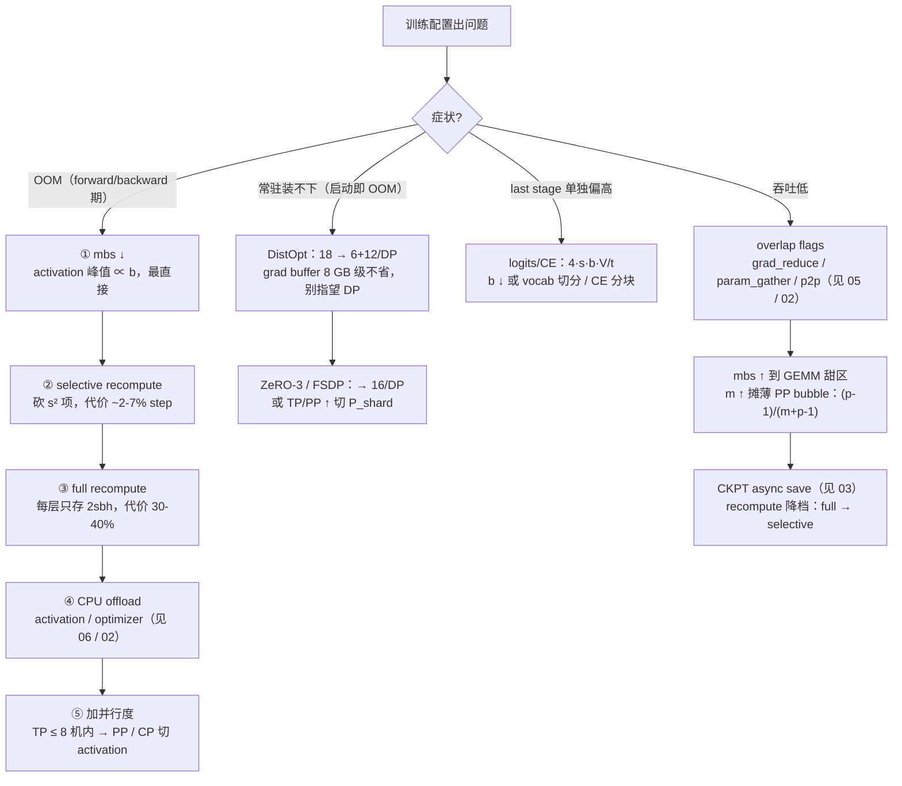

# 07 · 显存模型：总账、并行切分与配置演算

本篇是全章的总账篇：把单 rank 显存分成四大组成，每项给出可手算的公式（先定义每个符号），说清每种并行维切哪一块、batch 三个量各自动什么，最后在一组完整配置上演算到「离 80GB 还差多少」。机制细节一律不重复：recompute/offload 怎么做见 [`06`](./06_activation_recompute_offload.md)，grad/param buffer 的结构见 [`05`](./05_grad_param_buffer.md)，ZeRO 账本的推导见 [Data Parallelism（DP）、ZeRO 与 FSDP](../parallel/01_dp/README.md)，PP in-flight 的调度分析见 [03 · 显存、通信 overlap 与并行协同](../parallel/03_pp/03_overlap_and_memory.md)——本篇只算账。

阅读本篇需要的前置知识：

- [01 · 训练主循环](./01_training_loop.md) 全篇，尤其 §3 的 batch 三量（`mbs` / `num_microbatches` / GBS）与 §8 的「常驻 vs 流动」引子（本篇是它的完整展开）；
- 四种并行维的切分直觉：TP 切层内矩阵、PP 切层、DP 切数据、CP 切序列（深入见 [大规模训练的并行策略总览](../parallel/README.md)）。

代码锚点：[[megatron-lm:megatron/training/theoretical_memory_usage.py]]（commit `e03878b5f`），即训练日志里 `report_theoretical_memory` 打印「theoretical memory footprints」的公式来源（[[megatron-lm:megatron/training/training.py#L2698]]）。单位约定：全篇 `GB = 10⁹ B`；H100 标称 80GB = 80 GiB ≈ 85.9 GB，做预算时按 80 GB 保守估。注意源码打印的 "MB" 是 MiB（[[megatron-lm:megatron/training/theoretical_memory_usage.py#L9]]）。

---

## 1. 显存的四大组成

单 rank 视角，先给出定义：

| 组成 | 内容 | 生灭节奏 |
|---|---|---|
| **weights** | 参与 forward/backward 计算的参数本体。bf16 训练下是 param buffer 里的 bf16 副本（DistOpt 时 `param.data` 被 remap 成 buffer 视图） | **常驻**，跨 iteration 存活 |
| **gradients** | 连续 grad buffer（`param.main_grad` 所在），bf16 模型默认 fp32 累加（`grad_reduce_in_fp32`） | **常驻**，每个 iteration 开头只清零不释放 |
| **optimizer states** | fp32 master weights + Adam `m`/`v`（DistOpt 下只持有 $1/\mathrm{DP}$ 的 shard） | **常驻** |
| **activations** | forward 存给 backward 用的全部中间张量（含 dropout mask），峰值 = 单 micro-batch 量 × in-flight 份数 | **流动**，随每个 micro-batch 生灭 |
| **其他** | logits & CE 中间量、通信 workspace（NCCL buffer / user buffer / RS-AG 暂存）、CUDA graph 内存池、对齐 padding、allocator 碎片 | 混合 |

前四类是「账面上的」，第五类是「实测总比公式多出来的那部分」（§8 专讲）。把 [`01`](./01_training_loop.md) §8 那张「常驻 vs 流动」的图按四大组成重画一遍：

```
常驻（跨 iteration 存活，只清零不释放）——§2 的账
├── weights      param buffer（bf16）        2 B/param × P_shard
├── gradients    grad buffer（fp32 累加）     4 B/param × P_shard  ← 全量，不随 DP 缩
└── optimizer    fp32 master + m/v           12 B/param（DDP）或 12/DP（DistOpt）

流动（随每个 micro-batch 生灭）——§3 的账
├── activations  每层存给 backward 的张量      峰值 = 单层量 × 层数 × in-flight 份数
├── logits / CE  last stage 的 [b, s, V] 大图  ≈ 4·s·b·V/t（fp32），大 vocab 的刺客
└── 临时         param.grad 中转、通信 workspace、cuda graph 池、padding、碎片
```

省显存的所有手段，本质上都是在这张表的某一格上做文章：ZeRO 砍常驻的 optimizer 格，recompute/offload 砍流动的 activation 格，调小 `mbs` 线性缩 activation 格，TP/PP 把 $P_{\text{shard}}$ 本身切小。

先看结论——§6 完整演算的结果（7B 级模型，TP=2/PP=2/DP=64，SP + selective recompute + DistOpt，first stage）：

```
first stage 单 rank 峰值 ≈ 30 GB / 80 GB 预算
weights    (bf16 param buffer)    4.02 GB  ██
gradients  (fp32 grad buffer)     8.03 GB  ████
optimizer  (12 B/param ÷ DP=64)   0.38 GB  ▏
activations(SP + selective)      17.21 GB  ████████▌
其他 + 余量                      ~50 GB    ← fragment / workspace / 临时峰值都在这
```

每一条怎么算出来是 §2–§3 的内容；什么症状砍哪一条是 §4–§7 的内容。

## 2. 参数侧

### 2.1 每参数字节

定义：$P_{\text{shard}}$ = 本 rank 持有的参数 element 数；$\mathrm{DP}$ = data parallel size。单位：字节/参数。先把非 DistOpt 的 18 逐字节拆开（[[megatron-lm:megatron/training/theoretical_memory_usage.py#L265-L268]]，源码注释明确假设「bf16 model params + fp32 main gradients + fp32 main params + fp32 Adam states」）：

$$
\text{bytes/param} = 2\ (\text{bf16 param}) + 4\ (\text{fp32 main grad}) + 4\ (\text{fp32 master}) + (4 + 4)\ (\text{Adam } m/v) = 18
$$

三种方案的账：

| 方案 | param (bf16) | grad (fp32 main grad) | fp32 master + m/v | 每参数字节 |
|---|---|---|---|---|
| 非 DistOpt（DDP / `Float16OptimizerWithFloat16Params`） | 2 | 4 | 4 + 8 | **18** |
| DistOpt（ZeRO-1，`use_distributed_optimizer`） | 2 | 4 | $12/\mathrm{DP}$ | **$6 + 12/\mathrm{DP}$** |
| ZeRO-3 / FSDP（`use_megatron_fsdp` / torch FSDP） | $2/\mathrm{DP}$ | $4/\mathrm{DP}$ | $12/\mathrm{DP}$ | **$18/\mathrm{DP}$**（grad 若按 bf16 存则 $16/\mathrm{DP}$，即论文 $K=12$ 口径） |

两条必须记住的事：

1. **DistOpt 的 grad buffer 全量常驻、不随 DP 缩**。`grad_data` 无条件按全量 $P_{\text{shard}}$ 分配（[[megatron-lm:megatron/core/distributed/param_and_grad_buffer.py#L1122-L1127]]），`param_data` 在 DistOpt 下也是全量（:1113-1121）；reduce-scatter 只是把结果写回本 rank 的 $1/\mathrm{DP}$ 切片，buffer 本身一个字节没省。ZeRO-1 省的只有 optimizer 那 $12\ \mathrm{B/param}$（shard 区间甚至不尊重 param 边界，见 [`05`](./05_grad_param_buffer.md)）。所以 DistOpt 下参数侧仍是「$6\ \mathrm{B/param}$ 全量 $+\ 12/\mathrm{DP}$」，不是「$18/\mathrm{DP}$」。
2. 18 的口径可变：`grad_reduce_in_fp32=False` 时 grad buffer 变 bf16，每参数 $2\ \mathrm{B}$，非 DistOpt 就是 16 而非 18。fp16 训练另有 loss scale，但不改字节账。

ZeRO 频谱的完整推导与通信量守恒分析在 [Data Parallelism（DP）、ZeRO 与 FSDP](../parallel/01_dp/README.md)，这里只取结论图：


> 图：ZeRO 论文的显存账本图（`Ψ`=参数量、`K`=optimizer state 系数，Adam 混精 `K=12`、`N_d`=DP 度）。`P_os`（ZeRO-1，切 optimizer states）→ `P_os+g`（ZeRO-2，再切 gradients）→ `P_os+g+p`（ZeRO-3/FSDP，再切 parameters），每卡从 `16Ψ` 降到 `16Ψ/N_d`。注意 Megatron DistOpt 对应 `P_os` 但工程上 grad buffer 仍全量常驻（上表第 2 行），这是实现选择与论文理想账的差异。（Rajbhandari et al. 2019, Fig 1；[arXiv:1910.02054](https://arxiv.org/abs/1910.02054)）

### 2.2 参数量估算

dense GPT 风格模型（GQA、SwiGLU、RMSNorm、embedding 与 output 共享权重），符号：$h$=hidden size，$L$=层数，$a$=attention head 数，$g$=GQA 的 kv head 数（`num_query_groups`），$d$=head dim（`kv_channels`），$q = ad$=query projection size，$\mathit{ffn}$=MLP intermediate size，$V$=padded vocab size：

```
P ≈ L · [ 2·h·q·(1 + g/a)  +  3·h·ffn  +  2·h ]  +  V·h
           └ attention ┘      └ SwiGLU ┘   └ 2 LN ┘   └ embedding(tied) ┘
```

- attention 项：$W_q: h \times q$，$W_k = W_v: h \times (gd)$，$W_o: q \times h$。MHA 特例（$g=a$、$q=h$）退化成 $4h^2$；GQA 时按 $g/a$ 修正。对应源码 `self_attn_term`，即 $2h^2(1 + g/a)(q/h)$（[[megatron-lm:megatron/training/theoretical_memory_usage.py#L82-L93]]；$q/h$ 即 `query_projection_to_hidden_size_ratio`，:14-15；非 GQA 时 `num_query_groups` 置为 $a$，:17-18）。MLA 有单独分支（:62-80）。
- MLP 项：SwiGLU 三个矩阵（w1/w3 升维、w2 降维）对应 $3h\,\mathit{ffn}$，源码写作 $2h\,\mathit{ffn}\times$ `gated_linear_multiplier`，`swiglu` 时 multiplier = $3/2$（:21, :103）；非 gated MLP 是 $2h\,\mathit{ffn}$。
- LN 项：每层两个 LN；RMSNorm 无 bias，`norm_size=1`，即 $2h$（:60, :113）。另有 block 末尾的 final LN（:96, :147）。
- embedding 项：$Vh$；`untie_embeddings_and_output_weights` 时乘 2（:97-100）。注意公式用的是 padded vocab size（:95）。
- MoE：按 `moe_layer_freq` 把层拆成 dense/moe 两类（:29-50），moe 层的 MLP 项换成 $2h \cdot \mathit{moe\_ffn} \cdot E \cdot \mathrm{multiplier}$（$E$ = expert 数，:105-107），再加 router $hE$（:114-118）与 shared expert（:104）。源码还算了 `num_active_parameters`（只计 top-k 个 routed expert，:108-112, :136-143）——算 FLOPs 用 active、算显存用全量，两者不要混。

每 rank 的 $P_{\text{shard}}$：源码按「最重 shard」估——首个 PP stage 持有 $1/\mathrm{PP}$ 的层 + embedding（+ MTP block），TP 切分的部分除 $\mathrm{TP}$，expert 部分除 $\mathrm{ETP}\cdot\mathrm{EP}$，LayerNorm/router 等复制参数不除（:219-244）：

```
P_shard(most loaded) = (TP切分参数/PP + embedding) / TP + 复制参数/PP + expert参数/(PP·ETP·EP)
```

这也是为什么首尾 stage 的参数侧显存比中间 stage 多一块 embedding——PP 各 stage 的 weights/grads/optimizer 并不均分。

## 3. activation

### 3.1 符号与基线公式

符号（与前节一致，新增）：$s$=seq length，$b$=micro-batch size，$t$=TP size，$p$=PP size，$v$=VPP size，$m$=num_microbatches。activation 以 16-bit 存储（$2\ \mathrm{B/elem}$），dropout mask $1\ \mathrm{B/elem}$（论文 §4 的假设）。无任何并行时，每层要存的 activation（[arXiv:2205.05198](https://arxiv.org/abs/2205.05198) eq.1）：

$$
M_{\mathrm{layer}} = sbh\left(34 + \frac{5as}{h}\right)\quad [\mathrm{bytes}]
$$

逐项 breakdown（论文 §4.1，「存什么」取决于 backward 算梯度需要的输入）：

| 部分 | 存的张量 | 字节 |
|---|---|---|
| attention | QKV 投影的输入 $2sbh$；$QK^{\top}$ 的 Q、K $4sbh$；softmax 输出 $2as^2b$；softmax dropout mask $as^2b$；attention-over-V 的 dropout 输出 $2as^2b$ 与 V $2sbh$；output 投影输入 $2sbh$；attention dropout mask $sbh$ | $11sbh + 5as^2b$ |
| MLP | fc1 输入 $2sbh$；GeLU 输入 $8sbh$；fc2 输入 $8sbh$；dropout mask $sbh$（intermediate = $4h$） | $19sbh$ |
| LayerNorm ×2 | 各存输入 $2sbh$ | $4sbh$ |
| **合计** | | **$sbh(34 + 5as/h)$** |

关键观察：$5as/h$ 这项随 $s$ 线性增长，$s$ 一长就远超 34。本配置（$a=32, s=4096, h=4096$）下 $5as/h = 160$，$s^2$ 项是线性项的近 5 倍。这就是 selective recompute 的全部动机（§3.3）。

### 3.2 TP 与 SP 各切哪一部分

- 只有 TP：块内的矩阵乘法 activation 被切，但两个 LN、两处 dropout、两个块的输入在 TP 组内复制（它们不在 TP 的切分路径上）。每层（eq.2）为 $M_{\mathrm{layer}}(\mathrm{TP}) = sbh\left(10 + \frac{24}{t} + \frac{5as}{ht}\right)$。不除 $t$ 的「10」= LN 输入 4 + 两个 dropout mask 2 + QKV/fc1 两个块输入各 2——TP 切不掉的部分。
- TP + SP：sequence parallelism 把 LN/dropout 区域沿 seq 维切开，于是所有项都能除 $t$，每层（eq.4）为 $M_{\mathrm{layer}}(\mathrm{TP+SP}) = \frac{sbh}{t}\left(34 + \frac{5as}{h}\right)$。

  SP 不增加通信量（ring all-reduce = reduce-scatter + all-gather，与 TP 的 all-reduce 同带宽），机制见 [Tensor Parallelism（TP）与 Sequence Parallelism（SP）](../parallel/02_tp_sp/README.md)。

### 3.3 recompute 三档

| 档位 | 每层存储 | 总量（first stage，TP+SP） | 计算代价 |
|---|---|---|---|
| 不 recompute | $sbh(34+5as/h)/t$ | eq.5：$(sbhL/t)(34+5as/h)$ | 0 |
| **selective** | 砍掉 $5as^2b$（$QK^{\top}$/softmax/dropout/attn-over-V 反向重算），保留全部线性项 | eq.6：**$34sbhL/t$** | FLOPs +2.7%（GPT-3）/ +1.6%（MT-NLG）；实测 530B/1T 仅 ~2% step |
| **full** | 只存每层输入 $2sbh$ | **$2sbhL$**（可再除 $t$ 但要多一次 all-gather，论文不取） | +30–40% step time |

论文 Table 4（22B 单层实测）：selective 的 fwd+bwd 开销 7%，full 是 39%；selective + SP 组合只剩 4%。机制（重算什么、RNG 怎么保证正确）见 [`06`](./06_activation_recompute_offload.md)。

### 3.4 Megatron 的 `compute_activation_memory`

[[megatron-lm:megatron/training/theoretical_memory_usage.py#L280-L351]] 把上面几步拼成「first stage 峰值」的完整公式（SP + selective 分支）。先给总定义式，再逐步对行号：

```
M_first_stage = [ s·b·h·(18 + 4·ffn/h)·L + 8·s·b·p + s·b·h·p ] · penalty · discount / t
                └──────── 层 ────────┘   └ embedding 两项 ┘
penalty  = 1 + (p-1)/(p·v)   （仅 VPP；:314-327）
discount = min(1, m/p)       （仅非 interleaved 且 m < p；:331-336）
p == 1 时再加 output 项 4·s·b·h·(1 + V/h)（:340-348，加在 ÷t 之前）
```

逐步对应：

```
① 每层每 micro-batch：  s·b·h·(18 + 4·ffn/h)                :289-291
② × L（= L/p 层 × p 个 in-flight micro-batch）              :297
③ + embedding 输入 8·s·b·p（token id，int64 8 B）           :302-304
  + embedding dropout mask s·b·h·p（1 B/elem）               :306-311
④ × VPP 惩罚 1 + (p-1)/(p·v)              （有 VPP 时）      :314-327
⑤ × min(1, m/p)      （非 interleaved 且 m < p 时打折）      :331-336
⑥ + output layer/CE 4·s·b·h·(1 + V/h)   （仅 p == 1）        :340-348
⑦ ÷ t                                                   :350-351
```

几处值得停顿：

- ① 与论文的对应：$18 + 4\,\mathit{ffn}/h$ 就是 eq.6 的 34 把 MLP 的 $4h$ 推广成任意 $\mathit{ffn}$——$19sbh$（MLP，$\mathit{ffn}=4h$）$= sbh(3 + 4\,\mathit{ffn}/h)$，加 attention 线性部分 11、LN 4，得 $18 + 4\,\mathit{ffn}/h$。$\mathit{ffn}=4h$ 时精确等于 34。$s^2$ 项消失就是 selective recompute 的效果（源码注释即声明用论文 Table 2，:281）。
- ② 为什么不除 $p$：1F1B 下 first stage 必须在途 $p$ 个 micro-batch 才能压住流水线（warmup 公式 $\mathrm{num\_warmup} = \min(p - \mathrm{rank} - 1, m)$，[[megatron-lm:megatron/core/pipeline_parallel/schedules.py#L2227]]；steady 段栈深 = warmup + 1，因此 first stage 峰值 $p$ 份）。$p$ 份乘 $L/p$ 层等于 $L$ 层的量——PP 对 first stage 的 activation 没有减免（论文 §4.2.3 的原话结论），PP 省的是 weights/optimizer。in-flight 的完整分析见 [03 · 显存、通信 overlap 与并行协同](../parallel/03_pp/03_overlap_and_memory.md)。
- ③ 的两项为什么乘 $p$ 不乘 $L$：embedding 只在 first stage 出现一次，但它的输入与 dropout mask 要为每个在途 micro-batch 各存一份，所以按 $p$ 份计。
- ④ VPP 惩罚：interleaved 调度每 rank 持有 $v$ 个不连续 chunk，在途 micro-batch 变多，activation 乘 $1 + (p-1)/(pv)$（:314-327，即论文 eq.5 后那段「interleaving 要乘 $(1+(p-1)/(pm))$」；注意论文符号 $m$ 是 interleaving 的 stage 数，即本篇的 $v$，与本篇符号表的 $m$=num_microbatches 不是一回事）。VPP 用显存换 bubble，代价就写在这里。
- ⑤ $m < p$ 打折：非 interleaved 且 $m < p$ 时，在途只有 $m$ 份，乘 $\min(1, m/p)$（:331-336）。省显存是真，但此时流水线根本压不满，bubble 爆炸，正常配置不该落进这个分支。


> 图：1F1B 各 PP stage 的峰值 activation——first stage 要存 `p` 个在途 micro-batch，逐级递减到 last stage 的 1 个。这解释了为什么 first stage 最容易 OOM，也是本篇 §6 演算对 first stage 单独汇总的原因。（Korthikanti et al. 2022, Fig 9；[arXiv:2205.05198](https://arxiv.org/abs/2205.05198)）

### 3.5 logits 与 CE

⑥ 的 $4sbh(1 + V/h)$ 只在 $p = 1$ 时计入（:340-348）——因为整个函数估的是 first stage（:282-283 注释），而 logits/CE 物理上发生在 last stage（loss 只在 last stage 算，[[megatron-lm:megatron/training/training.py#L2327]]）。所以 PP > 1 时这套公式对 last stage 少报了一块，演算时要自己补上。

这项的构成（论文 §4.3，与源码同口径）：final LN 输入 $2sbh$ + output 投影输入 $2sbh$ + fp32 logits $4sbV$，合计 $4sbh(1 + V/h)$。源码把它加在全局 $\div t$ 之前（:350-351），即实际按 $4sbh(1+V/h)/t$ 计——对应 vocab 维被 TP 切开、CE 前 fp32 upcast 的实现。

为什么这项需要单独警惕：它约等于 $4sbV/t$，与 $V$ 成正比且与层数无关——$V$=128k 时单 micro-batch 就是 GB 级（§6 算出 2.1 GB），$V$ 再大或 $b$ 一涨它先爆；而它只落在 last stage 一张卡上，监控里表现为「last stage 莫名比 middle stage 高几 GB」。大 vocab 模型（$V$ ≥ 128k）务必把它单列进账。

### 3.6 `compute_activation_memory_without_sp`

`report_theoretical_memory` 只在 `sequence_parallel and recompute_granularity == 'selective'` 时走上面的 SP 公式，否则走 `compute_activation_memory_without_sp`（分支选择 :438-449）：

- 每层 $sbh(10 + 24/t)$（:358）——正是 eq.2 去掉 $s^2$ 项（隐含假设 fused/flash attention 不落地 $s \times s$ 矩阵），且不显式建模 recompute；
- embedding 两项、VPP 惩罚、$m<p$ 打折与 SP 版相同（:371-407）；
- $p = 1$ 时 output 项是 $2(sbV/t + sbh)$（:410-419，注意系数是 2 不是 4——只按 bf16 logits 计，与 SP 版口径不同）；
- 末尾统一乘 1.05，给 optimizer/临时量留 overhead（:421-423）。

看训练日志里的 theoretical memory 数字前，先确认走的是哪个分支——两个公式的口径差异（$s^2$ 项、output 系数、1.05）会让数字差出一大截。

## 4. 每种并行维切哪一块

| 并行维 | weights | grads | optimizer | activations | 主通信 | 备注 |
|---|---|---|---|---|---|---|
| **TP**（层内切矩阵） | 切：attention/MLP 矩阵 $\div t$（§2.2 的 attention/MLP 项） | 同 weights 切 | 同 | 块内切、LN/dropout 复制（eq.2 的「10」切不掉） | 每层 4× all-reduce（fwd 2 + bwd 2，attention/MLP 各一） | 通信量大，限机内 NVLink |
| **SP**（TP 的补充） | 不切 | 不切 | 不切 | LN/dropout 区沿 seq 维 $\div t$ → 全部 $\div t$（eq.4） | RS + AG 对（带宽与 all-reduce 相同） | 必须与 TP 同开；selective 公式的前提 |
| **PP**（切层） | 切：$\div p$（按层分 stage） | 同 | 同 | 层 $\div p$ 但 first stage 在途 $\times p$ → **净不省**（§3.4②） | stage 间 P2P send/recv（小包低频） | 显存不均：first > last；VPP 另加惩罚 |
| **DP**（切数据） | 复制 | 复制（grad buffer 全量） | 复制 | 不切（各 rank 吃不同数据） | grad all-reduce $\approx 2P$ | 朴素 DDP 的 $18\ \mathrm{B/param}$ 全复制 |
| **ZeRO-1 / DistOpt** | 复制（param buffer 全量） | **复制（buffer 不省，§2.1）** | **切 $\div\mathrm{DP}$** | 不切 | RS(grad) + AG(param) $= 2P$，与 DDP 同量 | 「免费午餐」，几乎总该开 |
| **ZeRO-3 / FSDP** | 切 $\div\mathrm{DP}$ | 切 $\div\mathrm{DP}$ | 切 $\div\mathrm{DP}$ | 不切 | $3P$（fwd/bwd 各 AG 一次 param + RS grad） | +50% 通信换 $16/\mathrm{DP}$；`reshard_after_forward` 权衡 |
| **CP**（切序列） | 不切 | 不切 | 不切 | **只切 seq 维 $\div\mathrm{CP}$**（含 $s^2$ 项，对长序列最关键） | ring attention 的 P2P 或 all-to-all | 梯度规约并入 DP+CP 组，见 [Context Parallelism (CP)](../parallel/04_cp/README.md) |
| **EP**（切 expert） | 只切 expert 权重 $\div(\mathrm{ETP}\cdot\mathrm{EP})$（:228-231） | 同 | 同（expert DP $= \mathrm{world}/(\mathrm{ETP}\cdot\mathrm{EP}\cdot\mathrm{PP})$，:191-196） | 不切（dispatch 后 token 重排，量不变） | MoE 每层 2× all-to-all（dispatch/combine） | 见 [Expert Parallelism (EP)](../parallel/05_ep/README.md) |

读表方式：先看你的显存压力在哪一格，再找哪一维能切它。几个非直觉的格子，解释如下：

- weights/grads/optimizer 三格总是同切同复制——它们都是「参数侧」的派生物（grad 与 master/m/v 的 shape 跟随 param），能切它们的只有 TP/PP/EP/ZeRO-3。
- PP 的 activation 格写「净不省」：切层确实让每 stage 只算 $L/p$ 层，但 1F1B 的在途要求 first stage 同时压住 $p$ 份，两个因子精确抵消（§3.4②）。想让 PP 真正省 activation，得靠 recompute 或减少在途，都另付代价。
- CP 只切 activation 的 seq 维：CP 的每个 rank 拿同一份参数、算同一段 attention 的不同 seq 分片，所以它本质是「activation 的并行」，对参数侧零贡献——长序列训练的 $s^2$ 项靠它除。
- EP 的 optimizer 格切法与 DP 域不同：expert 参数不参与普通 DP 组，而是 $\mathrm{world}/(\mathrm{ETP}\cdot\mathrm{EP}\cdot\mathrm{PP})$ 的 expert-DP 组（:191-196），所以 MoE 模型里 dense 与 expert 参数的 optimizer 分片度不一样。
- ZeRO-1 通信量与 DDP 相同（$2P$），因为 ring all-reduce 本来就等于 RS+AG 两步，只是把「规约梯度」和「广播新参数」显式拆开了。这也是它被称为免费午餐的原因（推导在 [Data Parallelism（DP）、ZeRO 与 FSDP](../parallel/01_dp/README.md) §2-3）。

## 5. mbs、num_microbatches 与 GBS 的作用

三个量的定义与整除约束见 [`01`](./01_training_loop.md) §3（$m = \mathrm{GBS}/(b\cdot\mathrm{DP})$，不整除直接 assert）。这里只记它们各自作用在显存、吞吐、收敛的哪一环：

| 量 | 角色 | 动它的效果 |
|---|---|---|
| `micro_batch_size`（$b$） | **单卡 activation 峰值的线性因子**：上面所有 activation 公式里的 $b$ | $b\downarrow$ → activation 峰值线性降；但 $b$ 太小 GEMM 效率掉、kernel launch 占比升 |
| `num_microbatches`（$m$） | **单步时长与 overlap 配比**：grad accumulation 串行跑 $m$ 个；PP bubble 占比 $\approx (p-1)/(m+p-1)$ | $m\uparrow$ → bubble 摊薄、grad bucket 的 overlap 窗口更整齐；代价是单步变长（GBS 不变时靠 $b\downarrow$ 或 $\mathrm{DP}\downarrow$ 换） |
| `global_batch_size`（GBS） | **算法侧的量**：一个 optimizer step 的总样本数，影响收敛 | 纯算法决策；sys 侧用 $m$（或 DP）去吸收它，与显存无直接耦合 |

与 PP 的耦合要单独记：first stage 的 in-flight 份数 = $\min(p, m)$（非 interleaved，:331-336）。两个数值例：

- 本配置 $p=2, m=8$：in-flight $= 2$，activation 峰值 = 16 层 $\times$ 2 份；$m$ 再涨到 16 峰值不变——$m$ 不是显存旋钮。
- 若 $p=8, m=8$：first stage in-flight $= 8$，同样每卡 4 层（$L/p = 32/8$），activation 峰值 = 4 层 $\times$ 8 份 = 32 层量——与 $p=2$ 时一模一样（$L$ 层量），这就是「PP 不省 first stage activation」的数值表现。

决策矩阵：

| 症状 | 先动 | 再动 | 别动 |
|---|---|---|---|
| forward/backward OOM | `b` ↓ | selective → full recompute → offload（[`06`](./06_activation_recompute_offload.md)） | GBS（与显存无关） |
| 常驻装不下（$18\ \mathrm{B/param}$ 超预算） | DistOpt（$18 \to 6 + 12/\mathrm{DP}$） | ZeRO-3/FSDP（$\to 16/\mathrm{DP}$）；TP/PP 加大切 $P_{\text{shard}}$ | m |
| bubble 占比高 | $m\uparrow$（GBS 不变则 $b\downarrow$） | VPP（注意 §3.4④ 的显存惩罚） | $b\uparrow$ |
| GEMM 效率低 / kernel 太碎 | $b\uparrow$（显存余量内） | — | — |
| 收敛要更大 batch | GBS $\uparrow$ | 用 $m\uparrow$ 吸收 | 为显存去压 GBS |

## 6. 完整演算

用 README §3 的贯穿配置（与全章其他篇同一组数字），模型为 7B 级、集群为 256 张 H100：

```
h=4096, L=32, a=32 (GQA g=8, d=128 → q=a·d=4096), ffn=14336 (SwiGLU), V=128256, s=4096
RMSNorm, embedding 与 output 共享权重（tied）
TP=2(SP on), PP=2, CP=1, DP=64 (world=256);  b=2, GBS=1024 → m = 1024/(2×64) = 8
bf16 + DistOpt + selective recompute;  H100 80GB(≈80 GiB)
```

（$V=128256$ 已是 128 的倍数，padded vocab 不再膨胀；PP bubble 占比 $\approx (2-1)/(8+2-1) \approx 11\%$，供 §5 的 $m$ 讨论对照。）

### 6.1 参数量逐段精算

按 §2.2 的公式（即 [[megatron-lm:megatron/training/theoretical_memory_usage.py#L12-L162]] 的结构）：

```
attention/层 = 2·h·q·(1+g/a) = 2×4096×4096×(1+8/32) = 41,943,040
             （Wq 16,777,216 + Wk 4,194,304 + Wv 4,194,304 + Wo 16,777,216）
MLP/层       = 3·h·ffn       = 3×4096×14336          = 176,160,768
LN/层        = 2h                                       = 8,192
每层合计                                        218,112,000  (≈2.181e8)
× L=32 + final LN 4096                    →  block = 6,979,588,096
embedding(tied) = V·h = 128256×4096       →        525,336,576
P_total                                       = 7,504,924,672  (≈7.50e9)
```

> 注意：粗估口诀（attention 按 $4h^2$ 记、未计 embedding 与 GQA 修正）会把 $P$ 低估到 $6.7\times 10^9$ 量级；逐段精算是 $7.50\times 10^9$。演算以精算为准——这正是不背口诀、逐段算账的意义。

每 rank $P_{\text{shard}}$（:219-244 的「最重 shard」，即 first stage）：

```
TP 切分部分:  block 中 attention+MLP = 6,979,321,856 → ÷PP=2 ÷TP=2 = 1,744,830,464
embedding:    525,336,576 ÷ TP=2                     =   262,668,288
复制参数:     (LN 8192×32 + final 4096) ÷ PP=2       =       133,120
P_shard(first/last stage)                            ≈ 2.008e9
P_shard(middle stage，本配置 PP=2 无 middle)          ≈ 1.745e9
```

embedding 让首尾 stage 各多背 $0.26\times 10^9$ 参数（tied 时 first 持输入 embedding、last 持 output 头，grad 跨 embd_group 同步，见 [`01`](./01_training_loop.md) §6.3）。

### 6.2 参数侧

DistOpt，每参数 $6 + 12/64 = 6.1875\ \mathrm{B}$（:265-268）：

| 项 | 算式 | 字节 |
|---|---|---|
| param buffer（bf16） | $2 \times 2.008\times 10^9$ | **$4.02\ \mathrm{GB}$** |
| grad buffer（fp32，全量不随 DP 缩） | $4 \times 2.008\times 10^9$ | **$8.03\ \mathrm{GB}$** |
| optimizer shard（master+m/v $\div\mathrm{DP}$） | $12 \times 2.008\times 10^9 / 64$ | **$0.38\ \mathrm{GB}$** |
| **常驻小计** | $6.1875 \times 2.008\times 10^9$ | **$12.42\ \mathrm{GB}$** |

对照：不开 DistOpt 是 $18 \times 2.008\times 10^9 = 36.14\ \mathrm{GB}$——DistOpt 一项省下 $23.7\ \mathrm{GB}$。

### 6.3 activation

走 §3.4 的 SP + selective 公式，逐步代入：

```
① 每层每 micro-batch = s·b·h·(18 + 4·ffn/h) = 4096×2×4096×(18+14) = 1,073,741,824 B
② × L=32                                            = 34,359,738,368 B
③ + embedding 输入 8·s·b·p = 131,072 + dropout s·b·h·p = 67,108,864
                                                    = 34,426,978,304 B
④ 无 VPP，不乘；⑤ m=8 ≥ p=2，min(1, 8/2)=1，不打折
⑥ p=2 > 1，公式不计 logits/CE
⑦ ÷ t=2                                             = 17,213,489,152 B ≈ 17.21 GB
```

换成 in-flight 视角验证：每层每 micro-batch $\div t$ 后 $0.537\ \mathrm{GB}$，first stage $=$ 16 层 $\times$ 2 个在途 $= 17.18\ \mathrm{GB}$ + embedding 零头 $\approx 17.21\ \mathrm{GB}$ ✓。

last stage：16 层 $\times$ 1 个在途 $\approx 8.59\ \mathrm{GB}$，再补公式外的 logits/CE（§3.5）：

```
4·s·b·h·(1 + V/h)/t = 4×4096×2×4096×(1+31.3)/2 ≈ 2.17 GB
  其中 fp32 logits 4·s·b·V/t ≈ 2.10 GB ← 绝对大头
```

### 6.4 汇总

| first stage（最重） | GB | last stage | GB |
|---|---|---|---|
| param buffer | 4.02 | param buffer | 4.02 |
| grad buffer | 8.03 | grad buffer | 8.03 |
| optimizer shard | 0.38 | optimizer shard | 0.38 |
| activation 峰值 | 17.21 | activation 峰值 | 8.59 |
| —（logits 不在此 stage） | | logits / CE | 2.17 |
| **合计** | **29.6** | **合计** | **23.2** |

离 80 GB 预算还剩约 50 GB，全留给 §8 那些「不占账面」的东西：allocator 碎片、通信 workspace、临时峰值。7B 级在 256 卡上本来就宽裕，这组数字的价值在于方法可搬：把 $h/L/s/V$ 换成你的模型，同一套公式算出你自己的四条账。

### 6.5 敏感性分析

以下逐条换掉 baseline 的每个假设（first stage）：

| 配置变化 | 常驻 | activation | 合计 | 代价/说明 |
|---|---|---|---|---|
| baseline（上表） | 12.42 | 17.21 | **29.6** | — |
| 无 DistOpt | 36.14 | 17.21 | 53.3 | optimizer $12\ \mathrm{B/param}$ 全量复制 |
| 无 SP（仅 TP） | 12.42 | 24.87 | 37.3 | without_sp 公式：$sbh(10+24/t)$/层 $\times 1.05$（:358,:421-423） |
| 无 selective（公式层面） | 12.42 | ~104.2 | **~116.6 OOM** | $5as/h=160$：$s^2$ 项是线性项的 4.7 倍；实际开 flash attention 时 $s^2$ 本不落地，收益部分被 kernel 预支（见 [`06`](./06_activation_recompute_offload.md)） |
| full recompute 替代 selective | 12.42 | 1.11 | 13.5 | +30–40% step time，显存换时间（SP 下层输入已按 seq 切，$2sbh/t$/层） |
| TP=1（DP=128，SP 随之关闭） | 24.47 | 38.4 | 62.9 | $P_{\text{shard}}$ 翻倍 + activation 走 without_sp 口径（$sbh(10+24/t)$/层 $\times 1.05$）；余量骤减 |
| ZeRO-3/FSDP 替代 DistOpt | 0.56 | 17.21 | 17.8 | $18/\mathrm{DP}$；DP 通信 $2P \to 3P$（+50%），每层 AG 参数 |

读法：常驻 $12.42\ \mathrm{GB}$ 里 grad buffer 独占 $8\ \mathrm{GB}$（全量 fp32，DP 再大也不省）；activation $17.21\ \mathrm{GB}$ 里 selective 已经砍掉了约 $87\ \mathrm{GB}$ 的 $s^2$ 项。真要再压，下一刀落在 full recompute（省 $16\ \mathrm{GB}$，加 35% 时间）或 TP/PP 加大（切 $P_{\text{shard}}$ 与每层量），而不是去动 GBS。

## 7. 配置决策流程



## 8. 公式之外的显存开销

1. **allocator 碎片**：`reserved ≫ allocated` 是常态；activation 大小随 in-flight 数周期性大起大落，容易碎。常用 `PYTORCH_CUDA_ALLOC_CONF=expandable_segments:True` 缓解；但注意它与 TE CUDA graph 同开时需要 `NCCL_GRAPH_REGISTER=0`，否则 illegal memory access（[[megatron-lm:megatron/training/arguments.py#L1748-L1755]] 的 assert 就是查这个组合）。
2. **通信 workspace**：NCCL 自身 buffer、TP overlap 的 user buffer、DistOpt 的 RS/AG 暂存，都不在公式里。一个旁证：async save checkpoint 前 Megatron 专门 `free_overlap_buffers()` + `torch.cuda.empty_cache()`，给 D2H 传输腾地方（[[megatron-lm:megatron/training/training.py#L2801-L2807]]）——说明这些 buffer 大到值得专门释放。
3. **CUDA graph 内存池**：`cuda_graph_impl=full_iteration` 时 capture 锁住的 mempool 不参与普通分配复用（[[megatron-lm:megatron/training/training.py#L3293-L3298]]，`use_single_mempool` 控制是否多 graph 共池）。
4. **对齐 padding**：DistOpt 下 grad buffer 的 $P$ 会 pad 到 $\mathrm{lcm}(\mathrm{DP}, 128)$ 的倍数（见 [`05`](./05_grad_param_buffer.md)）；embedding 用的是 padded vocab size（:95）。单项不大，但「实测比公式多几百 MB」常来自这里。
5. **启动/load 的临时峰值**：`broadcast_params`（[[megatron-lm:megatron/training/training.py#L1820-L1822]]）、checkpoint load 时 CPU→GPU 的暂存与 DistOpt resharding，峰值可能高于稳态——「稳态算得开、启动却 OOM」多由此起。
6. **`empty_cache` 的时机**：`--empty-unused-memory-level` ≥1 在每个 train_step 的 forward/backward 后调（[[megatron-lm:megatron/training/training.py#L2276-L2277]]），≥2 在 optimizer step 后再调（:2324-2325），eval 路径也有（:3916-3917）。它能救碎片，但会破坏 caching allocator 的复用、引入分配 stall——是旋钮不是默认。
7. **eval 也占显存**：`evaluate()` 是 `forward_only` 调度，activation 不存 backward 用的那一份，但 logits/CE 的 $4sbV/t$ 照样在 last stage 出现，且用独立的 eval batch 配置——train 不爆 eval 爆的情况存在。

## 9. 易错点清单

1. **DistOpt 的 grad buffer 全量常驻**，不随 DP 缩（[[megatron-lm:megatron/core/distributed/param_and_grad_buffer.py#L1122-L1127]]）；ZeRO-1 只切 optimizer 的 $12\ \mathrm{B/param}$。
2. **理论公式在 PP>1 时不计 logits/CE**（:340-348 仅 `p==1` 分支），last stage 实际多背 $4sbh(1+V/h)/t$，大 vocab 下是 GB 级。
3. **PP 不省 first stage 的 activation**：层 $\div p$ 但在途 $\times p$，净效果为零（eq.5）——PP 省的是参数侧。
4. **VPP 有显存惩罚** $1+(p-1)/(pv)$（:314-327）；$m<p$ 时 activation 打折（:331-336）但 bubble 爆炸，不是正常省显存手段。
5. **$18\ \mathrm{B/param}$ 的口径**：bf16 param + fp32 main grad；`grad_reduce_in_fp32=False` 时是 16。
6. 两套 activation 公式口径不同：SP 版 output 项系数 4、无 1.05；without_sp 版系数 2、有 1.05、不含 $s^2$ 项也不建模 recompute（:354-425）。日志数字先对分支（:438-449）。
7. 参数量估算别忘 GQA 修正（$g/a$）与 SwiGLU 的 3/2（:21, :82-93, :103）；`untie` 时 embedding 乘 2（:97-100）；MoE 按 `moe_layer_freq` 拆层（:29-50）。
8. **embedding 让首尾 stage 参数侧更重**（最重 shard 算法 :219-244）；tied 时 first/last 各持一份并同步 grad。
9. $m \ge p$ 时 first stage 的 in-flight 恒为 $p$ 份，num_microbatches 再涨也不涨 activation——别把 m 当显存旋钮。
10. valid/eval 用独立 batch 配置且同样有 logits 峰值；训练日志的 theoretical memory 是 MiB 口径（:9）。

---

下一篇：[08 · 训练可靠性、可观测性与 full-iteration CUDA graph](./08_other_components.md) —— 训练可靠性（rerun / fault tolerance）、可观测性（timers / logging / 理论显存）、full-iteration CUDA graph。
