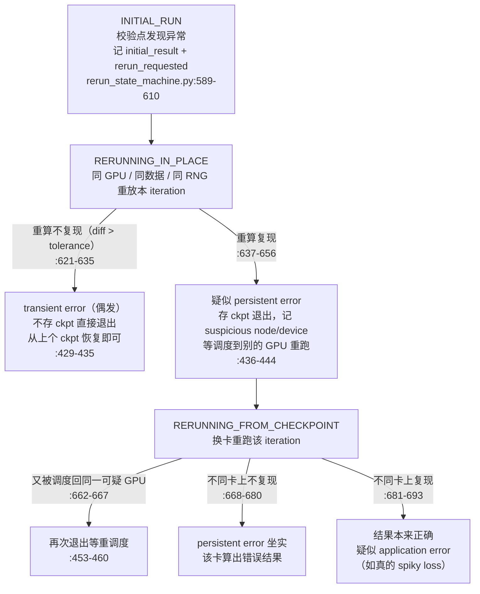
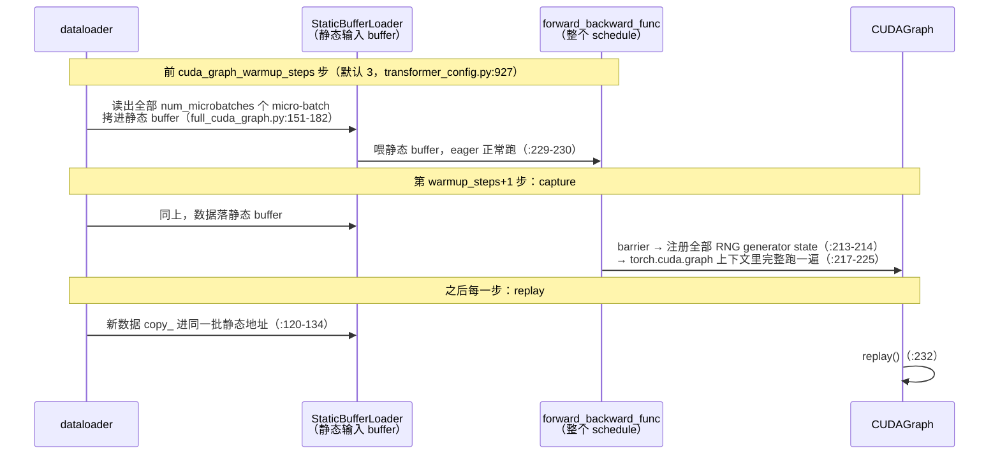

# 08 · 训练可靠性、可观测性与 full-iteration CUDA graph

本篇是全章收尾。前面 7 篇讲清了「一个 iteration 怎么算、怎么省显存、怎么落盘」，还剩三块放不进任何一篇的组件：一是训练可靠性在训练循环侧的集成——rerun state machine、fault tolerance、in-process restart、优雅退出（§1）；二是可观测性——training_log、timers、理论显存报告、activation 与 dgrad logging（§2）；三是 full-iteration CUDA graph——把整个 iteration 的 forward-backward 录成一张图（§3）。§4 是易错点速查，§5 列出本章没展开的主题指针，§6 收拢全章。

阅读本篇需要的前置知识：

- [`01`](./01_training_loop.md) 的 `train_step` 完整时序与 [`03`](./03_checkpoint.md) 的 save/load 及 async 流水；
- 涉及 recompute/offload 的约束时引用 [`06`](./06_activation_recompute_offload.md)，显存报告引用 [`07`](./07_memory_model.md)；
- CUDA graph 的基本原理（capture/replay/static buffer/graph pool）不在此重复，见 [07 · CUDA Graph：把一串 kernel 压成一次 replay](../torch/07_cuda_graph.md)。

代码：[[megatron-lm:megatron/core/rerun_state_machine.py]]、[[megatron-lm:megatron/training/ft_integration.py]]、[[megatron-lm:megatron/training/inprocess_restart.py]]、[[megatron-lm:megatron/core/timers.py]]、[[megatron-lm:megatron/core/full_cuda_graph.py]]、[[megatron-lm:megatron/core/optimizer/optimizer_cuda_graph.py]]、[[megatron-lm:megatron/training/training.py]]（commit `e03878b5f`）。

---

## 1. 训练可靠性

大规模可靠性的「为什么」——失效数学（job MTBF ≈ MTBF₁/N）、straggler、SDC（silent data corruption）——在 [05 · 大规模稳定性](../hpc/05_reliability_at_scale.md) 已经讲过，本篇不重复，只讲 Megatron 训练侧的「怎么做」。训练循环里集成了四层机制，按检测对象与恢复粒度区分：

| 机制 | 检测什么 | 恢复动作 | 代码 |
|---|---|---|---|
| `rerun_state_machine` | loss/grad 的 NaN/Inf/异常值，并归因 transient / persistent error | 重放当前 iteration，必要时存 ckpt 退出换卡重跑 | [[megatron-lm:megatron/core/rerun_state_machine.py]] |
| `ft_integration` | rank hang（section 超时） | 由外部 launcher 重启 job | [[megatron-lm:megatron/training/ft_integration.py]] |
| `inprocess_restart` | 进程级故障 | 同一进程内销毁全局状态、重拉训练 | [[megatron-lm:megatron/training/inprocess_restart.py]] |
| 优雅退出 | SIGTERM / 时长 / iteration 预算 | 先存 checkpoint 再退出 | [[megatron-lm:megatron/training/training.py#L2953]] |

### 1.1 rerun_state_machine

这是一个单例状态机（[[megatron-lm:megatron/core/rerun_state_machine.py#L128]]），把 `train_step` 的 forward-backward 包进一个可重放的外壳——也就是 [`01`](./01_training_loop.md) §1 里提到的那层 `while rerun_state_machine.should_run_forward_backward(data_iterator)`（[[megatron-lm:megatron/training/training.py#L2178]]；方法定义 [[megatron-lm:megatron/core/rerun_state_machine.py#L271]]）。它在每个 micro-batch 的计算路径上布置校验点 `validate_result`（[[megatron-lm:megatron/core/rerun_state_machine.py#L463]]），发现异常就用同样的数据、同样的 RNG 把这个 iteration 重跑一遍，通过「重算结果是否复现」来归因失效类型。

校验点目前挂在两处（用户侧 loss 函数与 grad buffer，都是 DP 通信前的本地值）：

- loss：[[megatron-lm:pretrain_gpt.py#L149-L178]]——NaN / Inf 检查（`--no-check-for-nan-in-loss-and-grad` 可关，默认开，[[megatron-lm:megatron/training/arguments.py#L2535-L2537]]）与 spiky loss 检查（`--check-for-spiky-loss`，`fatal=False` 只告警）。
- grad：[[megatron-lm:megatron/core/distributed/param_and_grad_buffer.py#L313-L349]] `check_grads`——逐 bucket 对 `grad_data` 求 L2 norm，查 NaN / Inf（`check_for_nan_in_grad`，[[megatron-lm:megatron/training/training.py#L1910]] 注入 DDP config），`--check-for-large-grads`（[[megatron-lm:megatron/training/arguments.py#L2538-L2540]]）时再查异常大梯度。注意这里 `tolerance=0.001`（`:328` 注释：给 FlashAttention backward 的非确定性留 0.1% 容差），而 loss 校验 `tolerance=0.0`（forward 计算是确定性的）。

归因流程写在 `validate_result` 的 docstring（[[megatron-lm:megatron/core/rerun_state_machine.py#L507-L514]]）与状态机分支里，对应 `RerunState` 的六个状态（`:81-110`）：



支撑重放的四个设计点：

- **数据重放**：`RerunDataIterator`（[[megatron-lm:megatron/core/rerun_state_machine.py#L1110-L1177]]）包装每个 dataloader iterator（包装点 [[megatron-lm:megatron/training/training.py#L4273-L4281]]），初次运行时把本 iteration 取过的 micro-batch 全部缓存进 `saved_microbatches`（`:1135-1148`）；重放时 `rewind()` 从头吐缓存（`:1150-1154`），不重放则 `advance()` 丢弃（`:1156-1160`）。从 checkpoint 重跑的那次，iterator 状态改为从 ckpt 里的 `data_iterator_checkpoints` 恢复（`:304-310`）——保证「换卡重跑」用的仍是同一批数据。
- RNG 重放：[[megatron-lm:megatron/training/initialize.py#L69-L74]] 注册的 `state_save_func` 把 CUDA RNG tracker 的全部具名 state 存进 rerun state（tracker 机制见 [`06`](./06_activation_recompute_offload.md) §3），重放前 `_restore_state()` 恢复——dropout 序列与初次运行一致。
- 前提假设（`:168-179` 写明）：iteration 的控制流必须确定（重放时 `validate_result` 的调用序列与初次一致），但计算不要求确定（重算结果允许在 tolerance 内浮动）。
- 留痕：每次校验事件按 `RerunValidationStatus`（`:113-121`）分级写入 `--result-rejected-tracker-filename` 指定的文件（[[megatron-lm:megatron/training/arguments.py#L2541-L2542]]；`_log_validation_error_to_file`，`:1022`），事后可据此重建「哪些 iteration 被拒过」。

异常处理的出口在 `optimizer.step()` 之前：`train_step` 在 `:2271-2273` 问 `should_checkpoint_and_exit()`（[[megatron-lm:megatron/core/rerun_state_machine.py#L399-L461]]），需要退出就直接返回，不执行 `:2287` 的参数更新——所以校验失败时参数仍是干净的，从上个 checkpoint 恢复不会吃到被污染的一步。train loop 侧收到 `should_checkpoint` 先补存再 `break`（[[megatron-lm:megatron/training/training.py#L3546-L3557]]）。rerun state 本身也随 checkpoint 持久化（[[megatron-lm:megatron/training/checkpointing.py#L562-L566]]），「存 ckpt 退出换卡重跑」才能跨 job 重启续上状态机。

模式开关 `--rerun-mode`（由 `RerunStateMachineConfig` 自动生成，[[megatron-lm:megatron/training/config/resilience_config.py#L21]]、[[megatron-lm:megatron/training/arguments.py#L2620-L2624]]）：

| 取值 | 语义 |
|---|---|
| `disabled` | 不重放；校验点退化为「发现 NaN/Inf 直接 raise」（`:516-536`，保持旧行为） |
| `validate_results`（**默认**） | 校验失败才重放，走上面的归因流程 |
| `report_determinism_stats` | 每个 iteration 主动重放一次，用 `QuickStats`（`:1179`）累计两次结果的相对差异分布并定期汇报（`:553-563`、`:995`）——用来度量计算的非确定性 |

> 此 commit 有个小不一致：config 侧第三个取值写作 `"report_stats"`（[[megatron-lm:megatron/training/config/resilience_config.py#L21]]），而 core 枚举值是 `"report_determinism_stats"`（[[megatron-lm:megatron/core/rerun_state_machine.py#L78]]），[[megatron-lm:megatron/training/initialize.py#L80]] 的 `RerunMode(args.rerun_mode)` 只认后者——传 `--rerun-mode=report_stats` 会在启动时直接报 `ValueError`。

另外 eval 期间 rerun 被临时禁用（[[megatron-lm:megatron/training/training.py#L3847-L3849]] 进 eval 前 `set_mode(DISABLED)`，`:3996` 恢复）。想演练这套归因流程，可以用 `RerunErrorInjector` 按速率注入假的 transient/persistent error（`--error-injection-rate` / `--error-injection-type`，[[megatron-lm:megatron/training/config/resilience_config.py#L12-L19]]；注入点在 `validate_result`，`:596`）。

### 1.2 ft_integration

`rerun_state_machine` 管「算出错」，`ft_integration` 管「算不动」（hang）。它对接 [nvidia-resiliency-ext](https://github.com/NVIDIA/nvidia-resiliency-ext) 的 fault tolerance 包（[[megatron-lm:megatron/training/ft_integration.py#L3-L11]]），核心概念是 section：给一段代码设超时，section 内没按时走完就判该 rank hang。job 必须用 FT 包提供的 `ft_launcher` 启动（`:25-33` 给了示例，如 `--ft-param-rank_section_timeouts=setup:600,step:180,checkpointing:420`）。三个 section（`:14-19`）：

- setup：`setup()` 时打开（`:116`），首个 train/eval iteration 前关闭；
- step：包住每个 train/eval step——但前 `--ft-num-warmup-iters`（默认 5，[[megatron-lm:megatron/training/arguments.py#L2287]]）个 warmup iteration 不进 section，因为初始几步偏慢，会把 step 超时撑大；这些不在任何 section 里的时间落入 "out-of-section" 区域，单独受 `--ft-param-rank_out_of_section_timeout` 约束（`:16-18, :31`）；
- checkpointing：包住所有 checkpoint 相关操作，含 async save 的 finalize。

挂载点全部在训练主路径上：`ft_integration.setup()` 在 `pretrain` 早期（[[megatron-lm:megatron/training/training.py#L1096]]）；`on_training_step_start/end`（`ft_integration.py:121/136`）在 `training.py:3522/3535` 夹住 `train_step`；eval 同理（`training.py:3900/3912`）；`on_checkpointing_start/end`（`:169/176`）在 `save_checkpoint`（[[megatron-lm:megatron/training/checkpointing.py#L525]]）与每步开头的 async finalize 处（[[megatron-lm:megatron/training/training.py#L3415-L3417]]，中间那行 `maybe_finalize_async_save(blocking=False)` 就是 [`03`](./03_checkpoint.md) 的 async 流水收尾）。`--calc-ft-timeouts`（[[megatron-lm:megatron/training/arguments.py#L2284]]）让 FT 按观测到的间隔自动更新超时（`:21-23`）。

未开 `--enable-ft-package`（[[megatron-lm:megatron/training/arguments.py#L2281]]）时，本模块所有公开调用都是 no-op（`:10-11`）——热路径上这些钩子零成本。

### 1.3 inprocess_restart

进程级故障（如某个 rank 进程挂了）通常要整个 job 重启；`inprocess_restart` 对接 nvidia-resiliency-ext 的 `inprocess` 模块（[[megatron-lm:megatron/training/inprocess_restart.py#L20-L24]]），把恢复粒度缩到进程内：开 `--inprocess-restart`（[[megatron-lm:megatron/training/arguments.py#L2204]]）后，入口 `pretrain` 被 `inprocess.Wrapper` 包装（[[megatron-lm:pretrain_gpt.py#L393]] → [[megatron-lm:megatron/training/inprocess_restart.py#L131-L150]] → `:103-126`）。故障后的链路：

1. abort：依次清理 TransformerEngine 状态、`torch.distributed`（destroy process group）、reset persistent async checkpoint worker（`AbortCheckpoint`，`:85-99`）；
2. finalize：`destroy_state()` 销毁 Megatron 全部全局状态（含 rerun state machine，`:27-30`），可选 `torch.cuda.empty_cache`（`:73-78`）；
3. 健康检查与重拉：`CudaHealthCheck`（`:112`）确认 GPU 可用后，在同一进程内重新进入 `train`，从最近 checkpoint 继续——省掉整 job 重启的进程拉起、NCCL 重建、初始化开销。

一组 heartbeat 与各类 timeout 旋钮在 `:115-124`（`--inprocess-*` 系列 flag）。恢复时的 rank 重排由 `rank_assignment.Tree`（`:50-67`）按 `--inprocess-granularity`（rank 或 node 粒度）决定。另有一个隐蔽的配套动作 `maybe_force_nccl_backend_init`（`:153-164`）：启动时先发一次全组 all_reduce 强制 NCCL backend 完成初始化——否则 inprocess 用 `destroy_process_group` 终止 NCCL 时，可能杀不掉未完全初始化的 backend 上仍在跑的 kernel（注释 `:157-160`）。

### 1.4 优雅退出

最后一层不是「故障恢复」而是「计划内退出」——SLURM 时间预算到期、收到 SIGTERM、跑到预定 iteration，都应该先存一个 checkpoint 再退，让下次 resume 零回滚。入口是 `checkpoint_and_decide_exit`（[[megatron-lm:megatron/training/training.py#L2953]]），train loop 每步调用（`:3759`），按优先级判断：

1. SIGTERM：`--exit-signal-handler`（[[megatron-lm:megatron/training/config/training_config.py#L80]]）时，`DistributedSignalHandler`（[[megatron-lm:megatron/training/dist_signal_handler.py#L50]]）收到信号，先 `save_checkpoint_and_time` 再退出（`:2970-2985`）；
2. 常规 save：`save_interval`（`:2988`）与 `non_persistent_save_interval`（`:3000`，local/in_memory 等不落全局存储的类型，见 [`03`](./03_checkpoint.md)）；
3. `--exit-duration-in-mins`（[[megatron-lm:megatron/training/config/training_config.py#L77]]）：各 rank 本地计时，用 `all_reduce(MAX)` 判定（`:3018-3024`）——任一 rank 到期则全体退出，退出前若本轮没存过就补存（`:3026-3035`）。跨 rank 取 MAX 是为了各 rank 退出决定一致；
4. `--exit-interval`（[[megatron-lm:megatron/training/config/training_config.py#L74]]）与 `--phase-transition-iterations`：到点存 ckpt 退出（`:3041-3060`；phase transition 的用途见 §5）。

整条优先级链用同构伪代码看更清楚（变量名对齐 [[megatron-lm:megatron/training/training.py#L2953-L3062]]）：

```python
def checkpoint_and_decide_exit(...):
    saved_checkpoint = False
    if args.exit_signal_handler and any(signal_handler.signals_received()):  # 2970 SIGTERM 最优先
        if args.save: save_checkpoint_and_time(...)                          # 2974 先存
        return True                                                          # 2985 再退
    if args.save and iteration % args.save_interval == 0:                    # 2988 常规 save
        save_checkpoint_and_time(...); saved_checkpoint = True
    elif args.save and iteration % args.non_persistent_save_interval == 0:   # 3000
        save_checkpoint_and_time(..., non_persistent_ckpt=True); saved_checkpoint = True
    if args.exit_duration_in_mins:                                           # 3018 时长预算
        done = all_reduce_MAX(train_time > args.exit_duration_in_mins)       # 3020-3024 任一 rank 到期即全体退
        if done:
            if args.save and not saved_checkpoint: save_checkpoint_and_time(...)  # 3026 补存
            return True
    if iteration % args.exit_interval == 0 or iteration in args.phase_transition_iterations:  # 3041
        if args.save and not saved_checkpoint: save_checkpoint_and_time(...)
        return True
    return False
```

`save_checkpoint_and_time`（[[megatron-lm:megatron/training/training.py#L2773]]）内部会先停 `interval-time` timer、`free_overlap_buffers` + `empty_cache` 给 async worker 腾显存再存（[`03`](./03_checkpoint.md) §async）。注意优雅退出只是「存完再走」，真正的故障恢复仍要靠 §1.1-§1.3 的机制与 [`03`](./03_checkpoint.md) 的 resume。

## 2. 可观测性

### 2.1 training_log

`training_log`（[[megatron-lm:megatron/training/training.py#L2361]]）是训练侧的主出口：每 `--log-interval` 步跑一次（首个 iteration 也跑一次以记录初始化开销，`:2386-2387`）。它维护三个计数器——advanced / skipped / nan iterations（`:2389-2413`）——并把各 loss 按 interval 内的 advanced 步数平均后输出（`:2659-2667`）。stdout 那行日志的字段（`:2627-2692`）：

| 字段 | 来源与说明 |
|---|---|
| `iteration` / `consumed samples` | `:2628-2629` |
| `elapsed time per iteration (ms)` | `timers('interval-time').elapsed(barrier=True)`（`:2605`），先跨 rank barrier 再取，含通信等待 |
| `throughput per GPU (TFLOP/s/GPU)` | `--log-throughput`（默认关，[[megatron-lm:megatron/training/config/training_config.py#L254]]）；FLOPs 由 `num_floating_point_operations`（[[megatron-lm:megatron/training/training.py#L411]]）按模型超参估算，`:2608-2615, 2637-2638` |
| `learning rate` / `global batch size` | `:2656-2658`；lr 先 `reduce_max_stat_across_model_parallel_group`（`:2460`，无参数 rank 上是 None） |
| 各 loss（interval 均值） | `:2659-2667`，skipped 步不计入均值 |
| `loss scale` / `grad norm` / `num zeros` / `params norm` | `:2670-2676`；num zeros 需 `--log-num-zeros-in-grad`（[`02`](./02_optimizer.md)） |
| `energy per GPU (J/iter/GPU)` / `power per GPU (W/GPU)` | `--log-energy` 时由 `energy_monitor.lap()` 折算（`:2644-2654`） |
| `number of skipped / nan iterations` | `:2677-2680`——fp16 found_inf 跳步与 NaN 步的累计，发现 loss 异常波动时先看这两个数 |

tensorboard 与 wandb 是成对写的（每个 `writer.add_scalar` 旁边必有一句 `wandb_writer.log`，如 `:2466-2469`），写入频率由独立的 `--tensorboard-log-interval`（默认 1，即每步都写，[[megatron-lm:megatron/training/config/training_config.py#L287]]；判定在 [[megatron-lm:megatron/training/training.py#L2462]]）控制，与 stdout 的 `log_interval` 解耦。写入的 key：`learning-rate`（`:2466`）、`batch-size`（`:2474`）、各 loss（`:2486`）、`loss-scale`（`:2491`，`--log-loss-scale-to-tensorboard` 默认开，[[megatron-lm:megatron/training/config/training_config.py#L298]]）、`world-size`（`:2496`，默认关）、`grad-norm`（`:2501`）、`num-zeros`（`:2506`）、`params-norm`（`:2513`）、`mem-reserved/allocated/max-allocated-bytes` 等四项（`:2522-2533`，需 `--log-memory-to-tensorboard`）、`max_attention_logit`（`:2535`）。多数 key 附带一份 `vs samples` 变体——横轴从 iteration 换成 `consumed_train_samples`（如 `:2467`），batch size ramp 时对照曲线更方便。MoE aux loss / MTP / DSA 的指标在 `:2538-2594` 单独汇入。

### 2.2 timers

[[megatron-lm:megatron/core/timers.py]] 提供两级 timer。单个 `Timer` 的起停（`:143-169`）每次都先 `torch.cuda.synchronize()` 再取 `time.time()`，测的是 wall time（含 CPU-GPU 间隙与通信等待），不是 kernel 时间；可选 `barrier=True` 先全 rank 对齐再计（`:150-151`）。`Timers` 单例按名取 timer（`:241-268`）：`--timing-log-level`（[[megatron-lm:megatron/training/config/training_config.py#L268]]，默认 0，最高 2）控制粒度，超阈值的名字返回 `DummyTimer`（`:261-264`），未启用的 timer 在热路径上零开销。level-1 timer 的 start 默认带 barrier（`barrier_with_L1_time` 默认开，[[megatron-lm:megatron/training/config/training_config.py#L331]]，用 `--no-barrier-with-level-1-timing` 关）——对齐后各 rank 的计时才可比，代价是把慢 rank 的等待也计了进来。

主要挂载点（与 `training_log` 的汇报清单 `:2416-2446` 对应）：

| timer | log_level | 挂载位置 |
|---|---|---|
| `forward-backward` | 1 | 各 schedule 整体：`schedules.py:690/813`（no_pipelining）、`:2199/2454`（1F1B）、`:1039/2048`（interleaved）；start 带 `barrier_with_L1_time` |
| `forward-compute` / `backward-compute` | 2 | 每个 micro-batch 的 `forward_step` / `backward_step`：[[megatron-lm:megatron/core/pipeline_parallel/schedules.py#L449-L450]] / `:506-507` |
| `optimizer` 系列 | 1 | `optimizer`、`optimizer-copy-to-main-grad`、`optimizer-unscale-and-check-inf`、`optimizer-clip-main-grad`、`optimizer-inner-step`、`optimizer-copy-main-to-model-params`、`optimizer-count-zeros`（[[megatron-lm:megatron/training/training.py#L2286]] 起；清单 `:2424-2431`） |
| `batch-generator` / `forward-recv` / `*-send*` 等 p2p | 2 | 清单 `:2432-2446` |
| `interval-time` | — | 整步墙钟，`training_log:2605` 消费（见 §2.1） |

输出时的跨 rank 汇聚：`_get_elapsed_time_all_ranks`（`:270-316`）把各 rank 的 elapsed all-gather 成 `[world_size, names]` 张量，再按 `--timing-log-option ∈ {max, minmax, all}`（`:220-227`）报跨 rank 的 max 或 (min, max)（`:338-355`），写 tensorboard 与 stdout（[[megatron-lm:megatron/training/training.py#L2709-L2713]]），`normalizer=log_interval` 换算成每步均值。max 与 min 的 rank 间差距就是 straggler 的初级信号（[05 · 大规模稳定性](../hpc/05_reliability_at_scale.md) §3.1）。在此之上还有一个专门的 `StragglerDetector`（从 `megatron.core.utils` 引入，[[megatron-lm:megatron/training/training.py#L170]]）：单例 `stimer`（`:281`），`--log-straggler`（[[megatron-lm:megatron/training/config/resilience_config.py#L36]]）时在 train 开头 configure（`:3273-3285`）、每 `log_interval` report 最快/最慢 rank 的估算吞吐（`:2893-2895`）。

### 2.3 理论显存报告

首次 `training_log` 时，rank 0 调 `report_theoretical_memory`（[[megatron-lm:megatron/training/training.py#L2694-L2698]]；实现 [[megatron-lm:megatron/training/theoretical_memory_usage.py#L428]]），把「weight+optimizer 每参数字节数（非 DistOpt 18B、DistOpt `6+12/DP`）× 最重 PP stage 的参数量 + activation 公式」的估算打印出来，紧跟一条 `report_memory` 实测值（[[megatron-lm:megatron/training/utils/common_utils.py#L282]]）供对照。公式推导是 [`07`](./07_memory_model.md) 的全部内容；这里只需记住触发时机：`report_memory_flag` 在 train 开头置 True（[[megatron-lm:megatron/training/training.py#L3258]]），等 optimizer state 初始化后（第二个 iteration 起）再报一次实测（`:2699-2704`）——所以看日志开头两段就能拿到「理论与实测」的对照。想周期性盯实测显存，另有 `--log-memory-interval`（`:2705-2707`）。

### 2.4 activation / dgrad logging 与 one-logger

- [[megatron-lm:megatron/training/activation_logging.py]]：`ActivationLogger`（`:113`）用 forward hook 挂在所有 `LINEAR_TYPES` 模块上（`nn.Linear`/`nn.Embedding`/`ColumnParallelLinear`/`RowParallelLinear`/`Router` 加各 TE 类型，`:65-66`），把每个模块的 input/output/kwargs `detach().cpu()` 收集起来（`:141-161`），按 iteration 存盘（`:172-176`），用于逐层 activation 数值分析。另有一组轻量 tokens-per-expert hook：只挂 MoE 的 `linear_fc1`（`name_filter`，`:212-217`），逐 micro-batch 记录每 expert 分到的 token 数，按 rank 追加写 `{save_dir}/tokens_per_expert/rank{N}.jsonl`（`:224-256`）——这是分析 EP 负载均衡（[Expert Parallelism (EP)](../parallel/05_ep/README.md)）的一手数据。对外 API：`enable/disable_activation_logging`、`save_activations`、`enable/disable_tokens_per_expert_logging`、`save_tokens_per_expert`（`:275-298`）。
- [[megatron-lm:megatron/training/dgrad_logging.py]]：`DataGradLogger`（`:52`）对称地用 backward hook 收集各 linear 的 dgrad；注意注释写明的限制——只存每个 batch 最后一个 micro-batch，且只在 DP replica 0 上存（`:52-56`）。两个 logger 的落盘都复用 `checkpointing.save_grads`（[[megatron-lm:megatron/training/activation_logging.py#L21]]、[[megatron-lm:megatron/training/dgrad_logging.py#L13]]），与 `--save-grads` / `--save-wgrads`（[[megatron-lm:megatron/training/training.py#L2265-L2269]]）是同一个 helper。
- [[megatron-lm:megatron/training/one_logger_utils.py]]：对接 NVIDIA one-logger 的端到端指标上报（app tag、吞吐、checkpoint 耗时等），随 `training_log` 的例行汇报调用（`track_app_tag`，[[megatron-lm:megatron/training/training.py#L2455]]；`track_e2e_metrics`，`:2617`）。

## 3. full-iteration CUDA graph

CUDA graph 的原理与基本约束（静态输入地址、capture 期间禁止同步、graph pool）见 [07 · CUDA Graph：把一串 kernel 压成一次 replay](../torch/07_cuda_graph.md)，本篇不重复。torch 篇讲的是 local/per-layer 粒度；训练侧还有最激进的一档 `--cuda-graph-impl=full_iteration`（取值定义 [[megatron-lm:megatron/core/transformer/transformer_config.py#L934]]）：把整个 iteration 的 forward-backward——含全部 num_microbatches 个 micro-batch 的 grad accumulation 循环与梯度通信——录成一张图，把整步的 CPU launch overhead 压到一次 replay。

### 3.1 FullCudaGraphWrapper

`FullCudaGraphWrapper`（[[megatron-lm:megatron/core/full_cuda_graph.py#L138-L258]]）的接入点在 train 开头：把 `get_forward_backward_func()` 的结果包一层（[[megatron-lm:megatron/training/training.py#L3291-L3298]]）；`evaluate` 同样包（`:3857-3863`）。注意 `curr_iteration` / `cuda_graph` / `result` 是类属性（`:141-143`），按 `'training'` / `'validation'` 两个 key 分存——所以 train 与 eval 各自 new 一个 wrapper 实例也不会互相覆盖对方的图。工作流程：



三个值得记住的细节：

- 静态输入：graph 要求输入地址固定，所以 `StaticBufferLoader`（`:99-135`）为每个 micro-batch 维护一份 static 张量，首个 iteration 建 buffer、之后每步把 dataloader 输出 `copy_` 进同一批地址（`:120-134`）——这就是「capture 前先把整步数据读完」的原因。VPP 时每个 model chunk 各配一份 iterator（`data_read` 的多 chunk 分支，`:167-182`）。
- 共享 pool 与 stream：模块级单例 `_shared_graph_pool` 与 `_shared_capture_stream`（`:14-52`）让 full-iteration 图与 optimizer 图（下节）共用一条 capture stream 和（可选的）同一个 graph mempool——`cuda_graph_use_single_mempool` 默认 True（[[megatron-lm:megatron/core/transformer/transformer_config.py#L916-L920]]），注释说明这是为了避免 per-stream alloc 抬高 `memory_reserved`（`:14-16`）。
- capture 的防护：capture 前后各有一次全局 barrier、中间 `torch.cuda.synchronize`（`:210-227`），`capture_error_mode="thread_local"`（`:221`）把 capture 期间的非法操作错误限制在本线程。已 capture 的图可由 `reset_cuda_graph()`（`:244-258`）销毁并清零计数、下一步重新 warmup + capture——目前唯一的调用方是 `PagedStashRunner`：MoE capacity 溢出回退时，先删掉可能引用 stash 张量的图再释放显存（[[megatron-lm:megatron/core/transformer/moe/paged_stash.py#L1133-L1137]]，见 §5）。

### 3.2 OptimizerCudaGraphWrapper

`OptimizerCudaGraphWrapper`（[[megatron-lm:megatron/core/optimizer/optimizer_cuda_graph.py#L14-L68]]）用同一思路包 `optimizer.step`：第 `cuda_graph_warmup_steps` 次迭代时 capture（`:31-46`），之后 `replay()`（`:47-50`）。接入点 [[megatron-lm:megatron/training/training.py#L3309-L3313]]（`--optimizer-cuda-graph`，[[megatron-lm:megatron/core/optimizer/optimizer_config.py#L392-L393]]）。Adam 侧的配合是 `capturable=True`（构造时按 `config.optimizer_cuda_graph` 传入，[[megatron-lm:megatron/core/optimizer/__init__.py#L552]]）——它把 step 计数器等 state 放到 GPU 张量上，graph replay 时才能正确推进，否则 capture 到的永远是同一个 step 值。两个边界条件写在代码里：wrapper 断言 `optimizer.step()` 调用不带任何参数（`:27-28`，replay 没有改参数的机会）；capture 与 full-iteration 图共用同一条 capture stream，mempool 是否共享由 §3.1 的 `use_single_mempool` 决定（`:37-41`）。

### 3.3 与 recompute、offload 的交互

capture 要求被录代码静态、无 host 侧同步，`transformer_config.py` 的校验区把冲突组合提前挡下：

| 约束 | 位置 |
|---|---|
| `full_iteration` 时 `cuda_graph_modules` 必须为空——整步一张图，不再有 per-layer 粒度可选 | [[megatron-lm:megatron/core/transformer/transformer_config.py#L2255-L2256]] |
| full recompute 只允许 `full_iteration` scope（local/TE 的 per-layer graph 不支持） | [[megatron-lm:megatron/core/transformer/transformer_config.py#L2314-L2318]] |
| 进图的 recompute 模块不接受随机数：`attention_dropout≠0` 时 `core_attn` recompute 不能落在图内；`hidden_dropout`、`moe_input_jitter_eps` 同理（重算的 RNG 恢复与图回放不兼容） | `:2331-2366` |
| fine-grained activation offload 仅支持 TE 或 `full_iteration` 图，且要求 `cuda_graph_warmup_steps > 0`；`full_iteration` 时必须设置 `fine_grained_offloading_max_inflight_offloads`（限制未 join 的 inflight D2H 数，机制见 [`06`](./06_activation_recompute_offload.md) §7） | `:2368-2384` |
| TE 层级 `cpu_offloading`（[`06`](./06_activation_recompute_offload.md) §8 的另一套 offload）与 CUDA graph 仅兼容 `full_iteration` | `:2260-2261` |

## 4. 易错点速查

1. rerun 外壳在 `train_step` 最外层（[[megatron-lm:megatron/training/training.py#L2178]]），而出口判断在 `optimizer.step()` 之前（`:2271` vs `:2287`）——校验失败的那一步参数不会被污染。
2. `--rerun-mode` 默认 `validate_results`（[[megatron-lm:megatron/training/config/resilience_config.py#L21]]），即 loss/grad 的 NaN/Inf 校验默认就开；但 `report_stats` 取值与 core 枚举不一致，传了会在启动时报错（§1.1）。
3. loss 校验 `tolerance=0.0`、grad 校验 `tolerance=0.001`（[[megatron-lm:megatron/core/distributed/param_and_grad_buffer.py#L328]]）——前者认定 forward 确定性，后者给 FlashAttention backward 的非确定性留余量。
4. timers 测的是 wall time（每次 start/stop 都 `torch.cuda.synchronize`，`timers.py:152/165`），不是 kernel 时间；`--timing-log-level` 默认 0（[[megatron-lm:megatron/training/config/training_config.py#L268]]），默认一个 timer 都不汇报。
5. stdout 日志里的吞吐只在 `--log-throughput`（默认关）时打印；`learning rate` 在无参数的 PP rank 上是 None，靠 `reduce_max_stat_across_model_parallel_group` 汇聚（[[megatron-lm:megatron/training/training.py#L2460]]）。
6. ft 的 warmup iteration（默认 5 步）不进 step section（[[megatron-lm:megatron/training/ft_integration.py#L14-L19]]）——刚启动那几步慢不会误报 hang；未开 `--enable-ft-package` 时所有 ft 钩子是 no-op。
7. full-iteration 图在 warmup（默认 3 步）之后才 capture，且每步数据必须先全部读进静态 buffer——开 `full_iteration` 后 dataloader 的取数时机提前到 schedule 之外（[[megatron-lm:megatron/core/full_cuda_graph.py#L151-L182]]）。
8. Adam 不进图则已，进图必须 `capturable=True`（[[megatron-lm:megatron/core/optimizer/__init__.py#L552]]），否则 replay 不推进 step 计数。
9. full recompute 只能配 `full_iteration` 图；进图的 recompute 模块不能带 dropout / input jitter（[[megatron-lm:megatron/core/transformer/transformer_config.py#L2314-L2366]]）。
10. `--exit-duration-in-mins` 的到期判定走 `all_reduce(MAX)`（[[megatron-lm:megatron/training/training.py#L3023]]）——任一 rank 到期全体退出，不存在部分 rank 先走的情况。

## 5. 未展开主题的指针

以下机制在训练主路径上有明确接入点，但本章没有展开，这里列出指针供查阅：

- **Energon dataloader 的 state 存取**：内置 dataloader 靠 index 表 + `consumed_samples` 恢复（[`04`](./04_dataloader.md)），多模态的 Megatron Energon 走另一路——`save_checkpoint` 时若 iterator 带 `save_state` 方法，每个 DP rank 存一份 `train_dataloader_dprank{XXX}.pt`（调用 [[megatron-lm:megatron/training/checkpointing.py#L573-L574]]，实现 `:944-990`）；保存路径由外部集成注入（`getattr(args, "dataloader_save", None)`，`:574`）。
- **hybrid CP schedule**：变长序列下把 CP 组内负载摆平的 `BalancedCPScheduler`（[[megatron-lm:megatron/core/pipeline_parallel/hybrid_cp_schedule.py#L14]]）与对应的 forward-backward 调度（`:477`）；数据侧包装 `HybridCPDataLoaderWrapper`（[[megatron-lm:megatron/core/datasets/data_schedule.py#L12]]）。
- **combined-1F1B**：EP overlap 的调度变体（[[megatron-lm:megatron/core/pipeline_parallel/combined_1f1b.py]]），no_pipelining 与 interleaved 各有一个接入点（[[megatron-lm:megatron/core/pipeline_parallel/schedules.py#L706]]、`:1428`）；overlap 的语境见 [03 · 显存、通信 overlap 与并行协同](../parallel/03_pp/03_overlap_and_memory.md)。
- **PagedStashRunner**：MoE 开 `--moe-expert-rank-capacity-factor` 后，expert capacity 溢出时不丢 token，把溢出部分暂存（paged stash）再重跑（[[megatron-lm:megatron/core/transformer/moe/paged_stash.py#L968]]）；与 `FullCudaGraphWrapper` 同一位置包在 `forward_backward_func` 外层（[[megatron-lm:megatron/training/training.py#L3300-L3308]]）。
- **Megatron FSDP**：Megatron 自己的 FSDP 实现（[[megatron-lm:megatron/core/distributed/fsdp/]]，经 `mcore_fsdp_adapter.py` 接入 `get_model`），与 DistributedOptimizer 并列的 DP 包装选项；ZeRO-3/FSDP 的原理见 [03 · FSDP（ZeRO-3）：逐层 all-gather 与 reshard](../parallel/01_dp/03_fsdp.md)。
- **RL 的 optimizer 显存搬运**：`MegatronOptimizer.offload_to_cpu/restore_from_cpu`（[[megatron-lm:megatron/core/optimizer/optimizer.py#L372-L408]]）把 optimizer state 整体往返 CPU，给 RL 的 train/inference 角色切换腾显存（[`02`](./02_optimizer.md) §cpu offload）。
- **`--empty-unused-memory-level`**（[[megatron-lm:megatron/training/config/training_config.py#L49-L52]]）：每步 forward-backward 后（level≥1，[[megatron-lm:megatron/training/training.py#L2276]]）与 optimizer step 后（level≥2，`:2324`）`torch.cuda.empty_cache()`，缓解碎片，代价是反复 cudaMalloc。
- **phase-transition 换数据配比**：`--phase-transition-iterations`（[[megatron-lm:megatron/training/arguments.py#L2887-L2889]]）把训练切成若干 phase（要求固定 GBS），每个 phase 单独核算样本配额（[[megatron-lm:megatron/training/training.py#L4144-L4154]]、`:4194-4199`），到点自动存 ckpt 退出（`:3041-3047`）——外部以新数据配比重新拉起即完成切换；数据侧机制见 [`04`](./04_dataloader.md)。

## 6. 全章收尾

把 01-08 串回一条链路：setup 建好模型 / optimizer / scheduler 并从 checkpoint 恢复全部状态（[`01`](./01_training_loop.md)、[`03`](./03_checkpoint.md)）；每步开头 finalize 上一次 async save、探测 batch size 调度（[`03`](./03_checkpoint.md)、[`01`](./01_training_loop.md) §3.3）；`train_step` 在 rerun 外壳（§1.1）里清 grad buffer（[`05`](./05_grad_param_buffer.md)）；schedule 跑 num_microbatches 个 micro-batch 的 fwd/bwd，activation 按 [`06`](./06_activation_recompute_offload.md) 的策略省、grad 按 bucket 边算边规约；`finalize_model_grads` 收尾；`optimizer.step` 依次做 unscale、clip、更新、写回、param all-gather（[`02`](./02_optimizer.md)）；scheduler 按 samples 推进；loss 汇聚；`training_log` 例行汇报（§2）；周期性 eval / save（[`03`](./03_checkpoint.md)）；退出前最后一次 async save finalize。显存账（[`07`](./07_memory_model.md)）贯穿每一步；可靠性外壳（rerun / ft / 优雅退出）与 full-iteration CUDA graph 则包在这条链路的最外层（本篇）。

接下来读什么：训练之外可继续读 [推理服务](../serving/README.md) 与[后训练](../post_train/README.md)；[大规模训练的并行策略总览](../parallel/README.md)、[GPU 集群与网络](../hpc/README.md)、[PyTorch 操作 —— LLM Infra / 算法框架开发常用 API 总结](../torch/README.md) 与本章互为经纬（空间维 / 物理集群 / 框架底座），也值得回头对照。如果是顺着 [`README`](./README.md) 的建议顺序（01 建时序、07 建显存模型、02-06 按需深入、08 收尾）读下来的，现在两条主线——「常驻 vs 流动」与「一切皆可 overlap」——应该都已经落到了具体代码行上。

---

**全章完**。回到 [训练系统：一个 iteration 的完整生命周期](./README.md) 看全章地图与阅读顺序。
