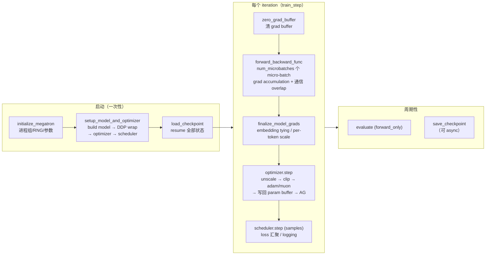

# 训练系统：一个 iteration 的完整生命周期

> [大规模训练的并行策略总览](../parallel/README.md) 那组文档讲的是空间维：模型和 batch 怎么切到成千上万张卡上。本章要讲的是时间维——一个训练 iteration 从取数据开始，到权重更新、落盘结束，中间要经过 data loader、forward/backward 调度、loss、grad buffer、optimizer、checkpoint 这些组件。我们会逐一说清每个组件各自做什么、落在哪一行代码里、彼此又是如何衔接的。全部内容逐段对齐 Megatron-LM（commit `e03878b5f`）源码。
>
> 读这一章之前，最好已经熟悉 transformer 的层结构（attention/MLP/LayerNorm）和 autograd 的基本语义（不熟悉可以先看 [03 · autograd：引擎、自定义 Function、hooks、checkpoint](../torch/03_autograd.md)）。并行维度（TP/SP/DP/PP/CP/EP）具体怎么切，正文用到的地方会给出最小够用的定义，想深入理解可以去读 [大规模训练的并行策略总览](../parallel/README.md) 对应的篇章。

如果你是第一次读这一章，请从 [00 · 训练全景：从数据到权重更新](./00_overview.md) 开始——它用纯概念讲清了整条流水线（数据 → loss → 梯度 → 权重更新）、loss 与各种 mask 的组织方式，以及 pretrain / SFT / RL 三种模式如何共享同一套底座；本章其余各篇都是那条概念流水线的实现对照。

参考代码：[[megatron-lm:]]：

- [[megatron-lm:megatron/training/training.py]] —— 训练主循环：`pretrain` / `train` / `train_step` / `training_log`
- [[megatron-lm:megatron/core/pipeline_parallel/schedules.py]] —— forward/backward 调度（no-pipelining / 1F1B / interleaved）
- [[megatron-lm:megatron/core/optimizer/]] —— optimizer 体系：`optimizer.py`（混合精度 wrapper）、`distrib_optimizer.py`、`muon.py`、`clip_grads.py`、`grad_scaler.py`、`cpu_offloading/`
- [[megatron-lm:megatron/core/distributed/]] —— `param_and_grad_buffer.py`（连续 grad/param buffer）、`distributed_data_parallel.py`、`finalize_model_grads.py`
- [[megatron-lm:megatron/training/checkpointing.py]] + [[megatron-lm:megatron/core/dist_checkpointing/]] —— legacy 与 `torch_dist` 两套 checkpoint
- [[megatron-lm:megatron/core/datasets/]] + [[megatron-lm:megatron/training/datasets/data_samplers.py]] —— indexed dataset / GPTDataset / blend / sampler
- [[megatron-lm:megatron/core/recompute.py]]、[[megatron-lm:megatron/core/tensor_parallel/random.py]]、[[megatron-lm:megatron/core/pipeline_parallel/fine_grained_activation_offload.py]] —— activation recompute 与 CPU offload
- [[megatron-lm:megatron/training/theoretical_memory_usage.py]] —— 显存理论估算

---

## 0. 这一章怎么读

八篇文章各自负责生命周期的一段，下面这张表给出每篇的内容与对应代码，方便按需查阅：

| 文件 | 内容 | 对应代码 |
|---|---|---|
| [00 · 训练全景：从数据到权重更新](./00_overview.md) | **概念总览**：一个 step 的概念流水线、labels shift / attention mask / loss mask 三要素、pretrain / SFT / RL 如何共享同一底座 | —（纯概念，不贴代码） |
| [01 · 训练主循环](./01_training_loop.md) | **实现总览**：setup → batch 体系 → forward/backward → loss → grad → optimizer step → 权重更新，一个 iteration 的完整时序，以及显存中常驻与流动部分的划分 | `training.py`, `schedules.py` |
| [02 · Optimizer：算法与 infra](./02_optimizer.md) | optimizer 的**算法**（SGD momentum / Adam / AdamW / Lion / Muon / MuonClip）与 **infra**（fp32 master weights、loss scaling、grad clipping、DistributedOptimizer step、Muon 的分布式实现、optimizer CPU offload）两个侧面 | `optimizer/`, `optimizer_param_scheduler.py` |
| [03 · Checkpoint：格式、async save 与换拓扑 resume](./03_checkpoint.md) | legacy 逐 rank 格式与 `torch_dist` sharded 格式、async save 的 D2H/写盘流水、换并行拓扑 resume（resharding）、RNG 与训练进度的恢复 | `checkpointing.py`, `dist_checkpointing/` |
| [04 · 数据链路：从 .bin/.idx 到 get_batch](./04_dataloader.md) | `.bin`/`.idx` mmap 格式、GPTDataset 的三张 index 表、多数据集 blend、sampler 与 resume、batch 如何跨 TP/CP 分发 | `datasets/`, `data_samplers.py`, `utils.py` |
| [05 · grad/param buffer：连续 buffer 的数据结构与读写回路](./05_grad_param_buffer.md) | Megatron 的 grad/weight **连续 buffer**：分组、倒序排布、bucket、`main_grad`、param buffer 的 RS/AG 回路 | `param_and_grad_buffer.py`, `distributed_data_parallel.py` |
| [06 · Activation 的 Recompute 与 CPU Offloading](./06_activation_recompute_offload.md) | activation 省显存的两条路线：full/selective **recompute**（含 RNG 正确性）与 fine-grained **CPU offloading**（stream 流水） | `recompute.py`, `random.py`, `fine_grained_activation_offload.py` |
| [07 · 显存模型：总账、并行切分与配置演算](./07_memory_model.md) | **系统视角**：显存四大组成、每种并行维切哪一块、batch 怎么摆、一套可手算的估算公式与配置演算 | `theoretical_memory_usage.py` |
| [08 · 训练可靠性、可观测性与 full-iteration CUDA graph](./08_other_components.md) | 前面几篇放不下的关键组件：训练可靠性（rerun / fault tolerance）、可观测性（timers / logging / 理论显存）、full-iteration CUDA graph | `ft_integration.py`, `inprocess_restart.py`, `training.py` |

如果不确定从哪里开始，建议的顺序是：先读 [00](./00_overview.md) 建立概念全景（流水线、mask、三种训练模式），再读 [01](./01_training_loop.md) 看它在 Megatron 里的实现对照、读 [07](./07_memory_model.md) 把显存那套账目建立起来（这两条主线是全章的骨架），之后 02/03/04/05/06 按自己需要的深度挑着看，最后用 08 收尾。

## 1. 一个 iteration 里发生了什么

在细看每个组件之前，先看一眼一个 iteration 从启动到落盘的整体形状：



这张图背后其实是两条贯穿全章的主线，也是与[并行策略](../parallel/README.md)那组文档的两条主线相呼应的：

1. **常驻与流动的显存**：param/grad/optimizer state 是常驻的（每步只清零不释放），activation 随每个 micro-batch 创建和释放——省显存的所有技巧（recompute、offload、ZeRO 分片）都在这两类的边界上展开。这条主线在 [`07`](./07_memory_model.md) 汇总。
2. **一切皆可 overlap**：grad 的 reduce-scatter 藏进 backward（[`05`](./05_grad_param_buffer.md)）、param 的 all-gather 藏进下一个 forward（[`02`](./02_optimizer.md)）、checkpoint 的 D2H 与写盘藏进后续 iteration（[`03`](./03_checkpoint.md)）、activation 的 D2H/H2D 藏进 fwd/bwd（[`06`](./06_activation_recompute_offload.md)）。训练的吞吐在很大程度上取决于这些异步流水编排得好不好。

## 2. 与并行策略的分工

并行各维「切什么、怎么通信」这件事，[大规模训练的并行策略总览](../parallel/README.md) 已经讲得很透了，本章不重复。这里只做一次生命周期视角的串联，把「空间上怎么切」和「时间上什么时候发生」对应起来：

| 主题 | parallel 侧（空间：怎么切） | 本章侧（时间：何时发生） |
|---|---|---|
| grad 的 DP 规约 | [01 · Megatron DDP：连续 buffer 与通信 overlap](../parallel/01_dp/01_ddp_and_overlap.md)：bucket + overlap 原理 | [`05`](./05_grad_param_buffer.md)：buffer 的数据结构与一整个 iteration 里的读写回路 |
| ZeRO / DistOpt | [02 · ZeRO 显存账本与 Megatron DistributedOptimizer](../parallel/01_dp/02_zero_and_distributed_optimizer.md)：显存账本推导 | [`02`](./02_optimizer.md)：step 的完整编排（unscale→clip→更新→AG）与 Muon 等新算法 |
| PP 调度 | [`03_pp`](../parallel/03_pp/README.md)：bubble、interleaved、DualPipe | [`01`](./01_training_loop.md)：1F1B 在 train_step 里的位置（loss/grad 从哪来往哪去） |
| PP 显存 | [03 · 显存、通信 overlap 与并行协同](../parallel/03_pp/03_overlap_and_memory.md)：in-flight micro-batch 数 | [`07`](./07_memory_model.md)：把 activation 放进总显存公式 |
| CP / EP / SP | [`04_cp`](../parallel/04_cp/README.md) / [`05_ep`](../parallel/05_ep/README.md) / [`02_tp_sp`](../parallel/02_tp_sp/README.md) | [`04`](./04_dataloader.md)（CP 切 batch）、[`07`](./07_memory_model.md)（各维显存切分） |

## 3. 一组贯穿全章的数字

为了让各篇的演算能对得上号，全章示例默认用同一组配置（7B 级 dense model，GPT 风格）：

```
hidden h = 4096,  layers L = 32,  heads a = 32 (GQA 8 kv-heads),  ffn = 14336 (SwiGLU)
vocab V = 128256, seq s = 4096,   params P ≈ 7.5e9（逐段精算见 07 §6）
并行: TP=2(SP on), PP=2, CP=1, DP=64 (256 卡)  →  num_microbatches m = GBS/(mbs·DP)
batch: micro_batch_size b = 2, global_batch_size GBS = 1024  →  m = 8
精度: bf16 参数/梯度(fp32 累加) + fp32 master + Adam  →  DistributedOptimizer (ZeRO-1)
```

后面每一篇都会在这组数字上演算自己关心的那一部分——显存账本、通信量、buffer 大小、ckpt 大小，等等。
